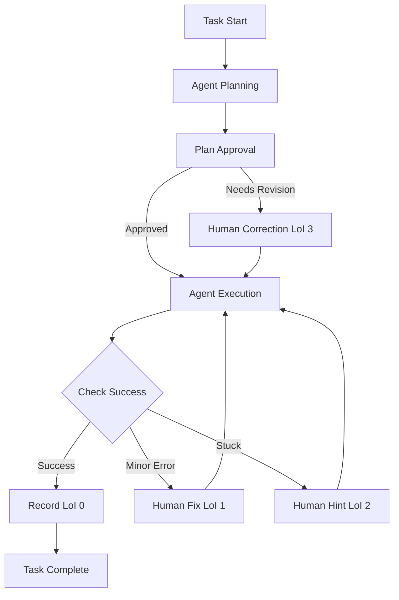

## 서론

최근 기업 환경에서 LLM(Large Language Model)을 활용한 '에이전트(Agent)'의 도입이 가속화되고 있습니다. 단순히 질문에 답하는 챗봇을 넘어, 코드를 작성하고, 웹을 검색하며, 툴을 호출하여 복잡한 작업을 수행하는 자율 시스템이 등장했기 때문입니다. 하지만 엔지니어들 사이에서는 "이 에이전트가 과연 마음 놓고 맡길 수 있는 수준인가?"라는 근본적인 물음이 끊이지 않습니다. 정답률이 높은 벤치마크 점수와 실제 운영 환경에서의 안정성은 별개의 문제일 수 있기 때문입니다.

Anthropic의 최신 연구인 "Measuring AI agent autonomy in practice"는 이러한 딜레마를 해결하기 위한 실무적인 접근법을 제시합니다. 핵심은 에이전트가 얼마나 정확하게 작업을 완료하느냐가 아니라, **'작업을 수행하는 과정에서 인간이 얼마나 개입(intervention)해야 했는가'**를 정량화하는 것입니다. 즉, 자율성(Autonomy)을 단순한 성능 지표가 아닌, 안전성과 효율성을 아우르는 운영 지표로 재정의하고 있습니다. 이 글에서는 인간의 개입 수준(LoI)을 기반으로 에이전트의 자율성을 측정하는 프레임워크의 기술적 원리와 실무 적용 방안을 심층적으로 분석합니다.

## 본론

### 자율성 측정의 새로운 패러다임: Level of Intervention (LoI)

기존의 AI 평가는 주로 정적 데이터셋에 대한 정답률(Accuracy)에 집중했습니다. 하지만 에이전트는 동적인 환경에서 행동하므로, 결과뿐만 아니라 과정(Process)을 평가해야 합니다. Anthropic이 제안하는 **Level of Intervention (LoI)**는 인간 감독자가 에이전트의 실행 과정에 개입한 정도를 0부터 4까지의 척도로 분류합니다.

- **LoI 0 (Full Autonomy)**: 인간의 개입 없이 에이전트가 작업을 성공적으로 완료함.

- **LoI 1 (Execution Correction)**: 에이전트가 계획은 세웠으나, 실행 단계의 사소한 오류를 인간이 수정해줌.

- **LoI 2 (Execution Assistance)**: 실행 중 막혀서 인간이 힌트나 정보를 제공함.

- **LoI 3 (Planning Correction)**: 에이전트의 초기 계획 자체가 잘못되어 인간이 계획을 수정함.

- **LoI 4 (Full Intervention)**: 에이전트가 실패하여 인간이 직접 작업을 수행함.

이 척도를 통해 우리는 "이 모델은 90%의 정확도를 가진다"라고 말하는 대신, "이 모델은 복잡한 작업의 80%에서 LoI 0~1 수준의 자율성을 보인다"라고 훨씬 더 구체적이고 운영적인 통찰을 얻을 수 있습니다.

### 에이전트 평가 루프 시각화

자율성 측정은 에이전트가 작업을 수행하는 루프 내에서 지속적으로 이루어집니다. 아래 다이어그램은 에이전트 실행과 인간 개입이 어떻게 상호작용하며 LoI가 기록되는지를 나타낸 간소화된 흐름도입니다.



이 프로세스는 단순한 성공/실패 이분법이 아니라, 실패의 '성격'을 분석하여 에이전트의 약점(계획 능력 부족 vs 실행 능력 부족)을 파악할 수 있게 해줍니다.

### 정적 벤치마크 vs 자율성 지표

자율성 측정 프레임워크가 기존 평가 방식과 어떻게 다른지 비교해 보겠습니다. 기존 방식은 모델의 지능(Intelligence)을 측정하는 데 집중했다면, LoI 기반 평가는 모델의 신뢰성(Reliability)과 운영 효율성을 측정합니다.

| 비교 항목 | 전통적 정적 벤치마크 (e.g., HumanEval) | LoI 기반 자율성 평가 |
| :--- | :--- | :--- |
| **평가 대상** | 모델의 지식 및 추론 능력 | 모델의 독립적 수행 능력 및 안정성 |
| **환경** | 고정된 질문-답변 쌍 (Static) | 동적인 툴 사용 및 환경 상호작용 (Dynamic) |
| **성공 기준** | 최종 출력이 정답과 일치하는지 여부 | 인간의 개입 빈도 및 강도 (LoI Score) |
| **주요 목적** | 모델 arch 선택 및 성능 비교 | 실제 서비스 배포 시 가드레일 설계 |
| **결과 해석** | "이 모델은 더 똑똑하다" | "이 모델은 인간 리소스를 덜 소모한다" |

### 실무적 구현: LoI 추적기 코드 예시

이 프레임워크를 실제 MLOps 파이프라인에 적용하기 위해서는 에이전트의 실행 로그를 체계적으로 수집하고 LoI를 계산하는 클래스를 구현해야 합니다. 아래는 Python을 사용하여 간단한 LoI 추적 시스템을 구현한 예시입니다.

```python
from enum import Enum, auto
from dataclasses import dataclass
from typing import List, Optional

class LevelOfIntervention(Enum):
    FULL_AUTONOMY = 0      # LoI 0
    EXEC_CORRECTION = 1    # LoI 1
    EXEC_ASSISTANCE = 2    # LoI 2
    PLAN_CORRECTION = 3    # LoI 3
    FULL_INTERVENTION = 4  # LoI 4

@dataclass
class TaskLog:
    task_id: str
    loi: LevelOfIntervention
    feedback: Optional[str] = None

class AutonomyEvaluator:
    def __init__(self):
        self.logs: List[TaskLog] = []

    def log_task(self, task_id: str, loi: LevelOfIntervention, feedback: str = None):
        """작업 수행 후 LoI를 기록합니다."""
        self.logs.append(TaskLog(task_id, loi, feedback))
        print(f"[Logged] Task: {task_id} | LoI: {loi.name} | Note: {feedback}")

    def calculate_autonomy_score(self) -> float:
        """
        전체 자율성 점수를 계산합니다.
        점수는 (LoI 0인 작업의 비율) - (LoI 4인 작업의 비율 * 가중치) 등으로
        다양하게 정의할 수 있습니다. 여기서는 평균 LoI를 기반으로 역수 취급 등
        단순화하여 계산합니다. (낮을수록 좋음)
        """
        if not self.logs:
            return 0.0
        
        total_loi = sum(log.loi.value for log in self.logs)
        avg_loi = total_loi / len(self.logs)
        
        # 자율성 점수: 평균 LoI가 0에 가까울수록 1.0에 수렴
        autonomy_score = max(0.0, 1.0 - (avg_loi / 4.0))
        return autonomy_score

# 사용 예시
evaluator = AutonomyEvaluator()

# 시나리오 1: 에이전트가 완벽하게 수행함
evaluator.log_task("TASK_001", LevelOfIntervention.FULL_AUTONOMY, "No issues")

# 시나리오 2: 실행 중 API 키가 만료되어 인간이 재입력해줌 (LoI 1)
evaluator.log_task("TASK_002", LevelOfIntervention.EXEC_CORRECTION, "API Key refresh required")

# 시나리오 3: 잘못된 접근법을 사용하여 계획을 수정해줌 (LoI 3)
evaluator.log_task("TASK_003", LevelOfIntervention.PLAN_CORRECTION, "Wrong library chosen")

# 결과 분석
score = evaluator.calculate_autonomy_score()
print(f"
>>> Final Autonomy Score: {score:.2f} (1.0 is Best)")
```

이 코드는 에이전트의 각 작업 단계에서 어떤 수준의 도움이 필요했는지 기록하고, 이를 종합하여 전체적인 자율성 점수를 산출합니다. 이러한 데이터는 향후 프롬프트 엔지니어링이나 모델 파인 튜닝의 우선순위를 결정하는 중요한 피드백 루프의 일부가 됩니다.

### 단계별 자율성 측정 가이드

자신의 프로젝트에 이 프레임워크를 도입하기 위한 단계별 가이드는 다음과 같습니다.

1.  **작업 정의 (Task Taxonomy)**     에이전트에게 수행시킬 작업의 범위를 명확히 정의합니다. 예를 들어, "버그 수정"이라는 큰 카테고리보다는 "로그 분석을 통한 버그 수정", "유닛 테스트 작성" 등 구체적인 하위 작업으로 나눕니다.

2.  **개입 유형 분류 (Intervention Schema)**     조직 내에서 인간 감독자가 개입할 수 있는 구체적인 상황을 LoI 0~4 수준에 매핑합니다. 예를 들어 '코드 실행 시 에러 발생 시 자동 재시도'는 LoI 0로 처리할지, LoI 1로 처리할지 기준을 마련해야 합니다.

3.  **데이터 수집 및 로깅 (Instrumentation)**     에이전트 실행 환경에 위 코드 예시와 같은 로깅 시스템을 통합합니다. LLM의 툴 사용(Tool Use) 로그와 함께, 해당 시점에 인간이 개입했는지 여부를 반드시 기록해야 합니다.

4.  **지표 분석 및 최적화 (Analysis & Iteration)**     수집된 LoI 데이터를 분석하여 에이전트가 주로 어디서 막히는지 식별합니다.     *   LoI 3이 높다면 -> 모델의 추론(Reasoning) 능력이 부족하거나 System Prompt가 불명확함.     *   LoI 1이 높다면 -> 툴 사용 인터페이스나 문서화가 부족함.

    이 분석을 바탕으로 시스템을 개선합니다.

## 결론

AI 에이전트의 자율성은 '인간의 개입을 얼마나 줄여주느냐'로 측정되어야 합니다. Anthropic이 제안한 **Level of Intervention (LoI)** 프레임워크는 블랙박스처럼 여겨지던 에이전트의 동작 과정을 개방형으로 정량화하여, 안전성과 효율성 사이의 균형점을 찾아주는 강력한 도구입니다.

전문가적인 관점에서 볼 때, 이 프레임워크의 진정한 가치는 단순한 평가를 넘어 **"안전한 자율성(Safe Autonomy)"**을 설계하는 데 있습니다. 무조건적인 자율성(LoI 0만 고집)은 치명적인 Hallucination이나 안전 사고로 이어질 수 있습니다. LoI 데이터를 축적함으로써, 우리는 에이전트가 스스로 해결할 수 있는 영역과 반드시 인간의 확인이 필요한 영역을 명확히 구분하는 '허용 오차(Tolerance)'를 설계할 수 있게 됩니다.

결국 고도화된 AI 시스템으로 나아가는 길은 인간이 개입하지 않아도 되는 영역을 점진적으로 확장해 나가는, LoI 분포를 최적화하는 여정과 같습니다.

### 참고자료

- [Anthropic Research: Measuring AI agent autonomy in practice](https://www.anthropic.com/research/measuring-agent-autonomy)
