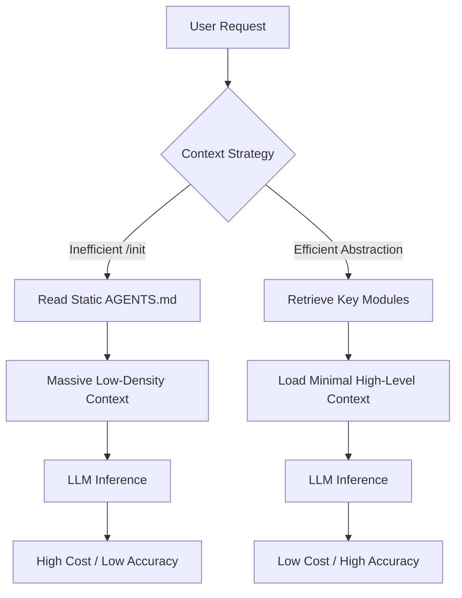

## 서론

최신 AI 코딩 에이전트를 처음 실행했을 때, 가장 먼저 눈에 띄는 명령어는 `/init`일 것입니다. 사용자는 이 명령어를 통해 에이전트가 방대한 코드베이스를 스캔하고 `AGENTS.md`나 `PROJECT.md` 같은 문서를 자동으로 생성하도록 설정합니다. 마치 엔지니어에게 프로젝트의 모든 매뉴얼을 한꺼번에 쥐여주는 듯한 이 과정은 "준비를 완료했다"는 심리적 안정감을 줍니다. 하지만 실제 운영 환경(MLOps 관점)에서 이 접근법은 치명적인 비효율을 낳습니다.

최근 실증된 데이터에 따르면, `/init` 명령어를 통해 전체 코드베이스를 분석한 방대한 문서를 컨텍스트(Context)에 포함시킬 경우, 추론 비용이 평균 20% 이상 증가하는 것으로 나타났습니다. 더욱이 비용 상승에도 불구하고 작업 정확도는 오히려 떨어지는 역설적인 상황이 발생합니다. 이는 LLM(대규모 언어 모델)의 Context Window 효율성과 Attention 메커니즘의 특성을 간과한 결과입니다. 본고에서는 왜 자동 생성된 "모든 것"이 에이전트에게는 "아무것도"처럼 작용하는지, 그리고 토큰 비용을 절감하면서 성능을 극대화할 수 있는 효율적인 프롬프트 엔지니어링 전략에 대해 기술적으로 분석합니다.

## 본론

### 기술적 배경: Context Window와 Attention의 역설

Transformer 기반의 LLM은 입력된 시퀀스(Token) 전체에 대해 Self-Attention 메커니즘을 적용합니다. 이때 Attention 복잡도는 시퀀스 길이에 따라 제곱으로 증가(Quadratic Complexity)하는 특성이 있습니다. 즉, 컨텍스트에 포함되는 문서의 길이가 길어질수록 연산량은 급격히 늘어납니다.

여기서 핵심은 **'정보의 밀도(Density)'**입니다. `/init`로 자동 생성된 문서는 코드베이스의 파일 구조, 함수 시그니처, 임포트 문 등을 나열합니다. 하지만 이러한 정보는 LLM이 코드 파일을 직접 읽었을 때 스스로 파싱(Parsing)할 수 있는 **'저밀도 정보'**입니다. 반면, 이 프로젝트가 왜 특정 디자인 패턴을 사용했는지, 비즈니스 로직의 제약 조건이 무엇인지와 같은 정보는 LLM이 코드만 보고는 유추하기 힘든 **'고밀도 정보'**입니다.

`/init` 문서는 방대한 양의 저밀도 정보로 컨텍스트 윈도우를 채워버립니다. 이는 "Lost in the Middle" 현상(논문: *Liu et al., 2023*)을 유발하여, 모델이 실제로 중요한 지시사항(Instruction)이나 핵심 로그를 컨텍스트의 중간부분에서 놓치게 만듭니다.

### 비효율적인 에이전트 파이프라인 vs. 효율적인 파이프라인

다음은 `/init`에 의존하는 기존 방식과 지식을 추상화하여 제공하는 최적화 방식의 데이터 흐름을 비교한 다이어그램입니다.



### 성능 및 비용 비교 분석

실제 벤치마킹에 따르면, 전체 코드베이스를 문서화하여 Context에 포함시키는 방식(A)과 핵심 아키텍처와 추상화된 규칙만 포함하는 방식(B) 사이에는 명확한 차이가 있습니다.

| 비교 항목 | /init 자동 생성 방식 (All-in-One) | 추상화된 지식 제공 방식 (Abstracted) |
| :--- | :--- | :--- |
| **Context Token 수** | 매우 높음 (평균 8k~12k tokens) | 낮음 (평균 1k~2k tokens) |
| **비용 (Cost)** | 높음 (기준 대비 +20%~30%) | 낮음 (기준 대비 -10%) |
| **정확도 (Accuracy)** | 중간~하위 (Noise로 인한 오답 증가) | 높음 (Focused Attention) |
| **유지보수** | 어려움 (코드 변경 시마다 /init 재실행 필요) | 쉬움 (고수준 설계는 잘 변하지 않음) |
| **주요 실패 원인** | Context Window 초과, Hallucination | 정보 부족 (의도적으로 RAG로 해결) |

### Step-by-Step 가이드: 효율적인 Context 구성 방법

에이전트의 성능을 높이고 비용을 20% 이상 절감하기 위해 다음과 같은 단계별 프로토콜을 적용해야 합니다.

**1. 불필요한 구조 정보 배제** LLM은 파일 트리(Tree structure)를 스스로 탐색하는 능력이 탁월합니다. 따라서 `src/utils/helper.js`가 존재한다는 식의 나열은 문서에서 제거하세요. 에이전트 도구(Tool use)를 통해 파일 시스템을 탐색하도록 두는 것이 토큰을 아끼는 가장 좋은 방법입니다.

**2. 추상화된 'Design Principles' 정의** 코드의 "무엇(What)"이 아니라 "왜(Why)"와 "어떻게(How)"를 기술해야 합니다. 예를 들어, "이 프로젝트는 상태 관리를 위해 Redux를 사용한다"는 사실보다, "상태 업데이트는 반드시 비동기 액션을 통해 처리해야 하며, 직접적인 state mutation은 금지된다"는 규칙이 훨씬 더 가치 있는 고밀도 정보입니다.

**3. 동적 검색(RAG) 의존도 높이기** 정적인 문서로 모든 것을 해결하려 하지 말고, 벡터 데이터베이스나 코드 검색 도구를 통해 에이전트가 필요할 때 필요한 코드만 참조하게 하십시오.

### 구현 예시 (Python)

다음은 LangChain이나 LlamaIndex와 같은 프레임워크에서 에이전트에게 Context를 주입할 때, 비효율적인 `/init` 스타일과 효율적인 스타일을 구현한 예시입니다.

**❌ 비효율적인 접근 (자동 생성된 나열식)**

```python
# 불필요하게 긴 프롬프트로 인한 Token 낭비
inefficient_context = """
Project Structure:
- /src
  - /components: Contains React components.
  - /api: Contains API handlers.
  - utils.js: Helper functions.
  
File: utils.js
- function formatDate(date): Formats date to string.
- function calculateTax(amount): Calculates tax.
... (수천 줄의 불필요한 함수 목록 나열) ...
"""

prompt = f"""
You are a coding assistant.
Context:
{inefficient_context}

Question: How do I handle user authentication?
"""
# 결과: LLM이 불필요한 utils.js 함수 목록을 훑느라 리소스를 낭비함.
```

**✅ 효율적인 접근 (추상화된 지식)**

```python
# 핵심 도메인 지식과 제약 조건만 포함
efficient_context = """
## Project Architecture & Constraints
- **Framework**: Next.js with App Router.
- **Auth Pattern**: Uses NextAuth.js with JWT strategy. Session management is handled via cookies, not local storage.
- **State Management**: Global state uses Zustand. Local component state uses React hooks.
- **Critical Rule**: NEVER commit sensitive keys. Use process.env for all environment variables.
"""

prompt = f"""
You are a senior backend engineer. 
Use the tools provided to inspect relevant files if needed.

Project Guidelines:
{efficient_context}

Question: How do I implement a secure API route for user login?
"""
# 결과: 에이전트는 즉시 NextAuth 관련 파일을 찾아보고(Terminal tool), 보안 규칙(Critical Rule)을 준수하여 코드를 작성함.
```

## 결론

AI 코딩 에이전트를 활용함에 있어 "더 많은 정보가 더 좋은 성능을 보장한다"는 믿음은 잘못된 통념입니다. `/init` 명령어를 통한 무조건적인 문서 자동 생성은, 에이전트가 이미 수행할 수 있는 작업을 중복시키고, 컨텍스트 윈도우를 소음으로 채워 비용을 20% 이상 증가시키는 주범입니다.

전문가의 관점에서 에이전트를 최적화하는 핵심은 **'선택과 집중'**에 있습니다. 에이전트가 스스로 발견할 수 있는 명시적(Explicit) 코드 구조는 과감히 제거하고, 모델이 유추할 수 없는 암묵적(Implicit) 설계 의도와 비즈니스 규칙만을 컨텍스트로 제공해야 합니다. 이는 단순히 비용 절감을 넘어, LLM의 Attention 메커니즘이 핵심 과제에 집중하게 하여 결과물의 품질을 높이는 길이기도 합니다.

참고자료:

- [Hada.io - /init으로 AGENTS.md 자동 생성하지 마라](https://news.hada.io/topic?id=26972)

- Liu, N. F., et al. (2023). "Lost in the Middle: How Language Models Use Long Contexts." arXiv preprint arXiv:2307.03172.
