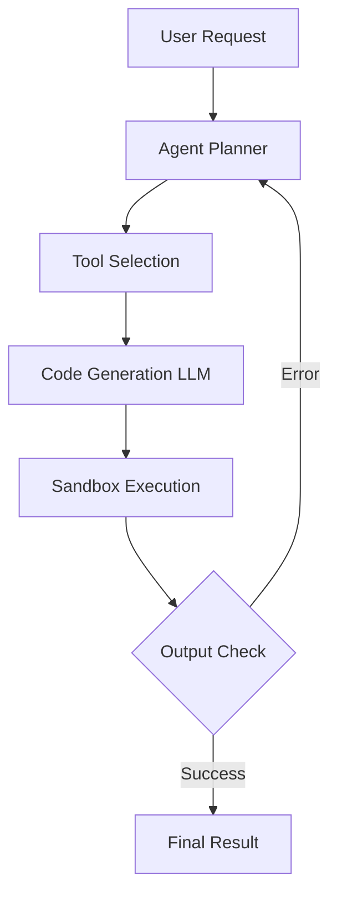

## 서론

수천 줄의 보일러플레이트 코드를 작성하고, 오타 한 자 때문에 컴파일 에러와 씨름하던 밤을 기억하는가? 혹은 복잡한 로직을 구현하다가 스택 오버플로우의 늪에 빠져 며칠을 허비했던 경험은 어떠한가. 실리콘밸리의 베테랑 엔지니어이자 구글, 아마존을 거쳐 현재 AI 스타트업의 자문을 맡고 있는 스티브 예지(Steve Yegge)는 이러한 고질적인 소프트웨어 개발의 방식이 곧 역사의 뒤안길로 사라질 것이라 단언한다. 그의 주장은 단순한 도구의 진화를 넘어선다. 우리는 지금 '손코딩(Hand-coding)'의 종말을 목격하고 있으며, 소프트웨어 엔지니어링의 정의 자체가 재편되는 패러다임 시프트의 중심에 서 있다.

이러한 변화의 핵심에는 거대 언어 모델(LLM)을 기반으로 한 **AI 에이전트(AI Agents)**가 있다. 단순히 코드를 자동 완성해주는 수준을 넘어, 에이전트는 개발자의 의도를 파악하고 스스로 계획을 세우며 도구를 사용해 문제를 해결하는 자율적인 시스템으로 진화했다. 이제 엔지니어는 문법(Syntax)을 쥐여짜는 '작성자'가 아닌, 거대한 두뇌를 어떻게 설계하고 오케스트레이션할 것인가를 고민하는 '설계자'로 거듭나야 한다. 이 글에서는 기술적 관점에서 AI 에이전트가 어떻게 코딩의 판도를 바꾸는지, 그리고 우리가 이 흐름 속에서 어떻게 생존하고 발전할 수 있는지를 심도 있게 다루고자 한다.

## 본론

### AI 에이전트의 작동 원리: 자율적 추론과 행동

AI 에이전트가 기존의 코드 생성 도구와 결정적으로 다른 점은 '정적'인 출력이 아니라 '동적'인 문제 해결 과정을 거친다는 데 있다. 최신 NLP 연구에서 주목받는 **ReAct(Reasoning + Acting)** 패턴은 에이전트가 추론(Reasoning)을 통해 행동(Acting)을 계획하고, 그 결과를 다시 추론에 반영하는 순환적인 구조를 말한다.

에이전트는 사용자의 프롬프트를 받아 목표를 설정하고, 필요한 정보를 검색하거나 코드를 작성하여 실행한 뒤, 발생한 에러를 스스로 디버깅하는 과정을 반복한다. 이는 인간 개발자가 문제를 해결하는 인지 과정과 매우 유사하며, Transformer 아키텍처의 강력한 컨텍스트 이해 능력에 기인한다. 특히 최근 연구들은 LLM이 단순한 언어 모델을 넘어, 도구(Tool) 사용을 학습함으로써 자신의 지능을 확장할 수 있음을 입증했다.

다음은 AI 에이전트가 개발 요청을 처리하는 표준적인 워크플로우를 심플하게 도식화한 것이다.



이 다이어그램은 에이전트가 단순히 답을 생성하는 것이 아니라, 실행 환경과 상호작용하며 피드백 루프를 형성함을 보여준다. 여기서 'Sandbox Execution'은 안전한 환경에서 에이전트가 작성한 코드를 테스트하는 단계로, 실무적 관점에서 매우 중요한 요소다.

### 실무 구현: Python으로 살펴보는 ReAct 에이전트

개념을 확실히 이해하기 위해, Python과 OpenAI API를 사용하여 간단한 ReAct 패턴의 코딩 에이전트를 구현해 보자. 이 코드는 에이전트가 Python 코드를 생성하고 실행 결과를 바탕으로 다시 생각하는 과정을 시뮬레이션한다.

```python
import openai
import subprocess

client = openai.OpenAI(api_key="YOUR_API_KEY")

def run_python_code(code):
    """에이전트가 생성한 코드를 샌드박스 환경에서 실행하는 함수"""
    try:
        result = subprocess.run(["python3", "-c", code], capture_output=True, text=True, timeout=10)
        return result.stdout if result.returncode == 0 else result.stderr
    except Exception as e:
        return str(e)

def agent_loop(task, max_iterations=5):
    messages = [
        {"role": "system", "content": "You are an expert Python programmer. Write code to solve the task and ensure it prints the final answer."},
        {"role": "user", "content": task}
    ]

    for _ in range(max_iterations):
        # 1. LLM이 코드 생성
        response = client.chat.completions.create(
            model="gpt-4",
            messages=messages,
            temperature=0
        )
        
        code_content = response.choices[0].message.content
        
        # 코드 블록 추출 (간소화된 로직)
        if "```python" in code_content:
            code = code_content.split("```python")[1].split("```")[0].strip()
        else:
            code = code_content

        print(f"--- Agent generated code ---
{code}
")
        
        # 2. 코드 실행 및 결과 관찰 (Observation)
        exec_output = run_python_code(code)
        print(f"--- Execution Output ---
{exec_output}
")
        
        # 결과가 만족스러우면 종료 (실제로는 LLM이 판단하거나 특정 키워드 확인)
        if "error" not in exec_output.lower() and exec_output.strip():
            print("Task Completed Successfully.")
            break

        # 3. 오류 발생 시 피드백을 통해 수정 요청 (Reflection)
        messages.append({"role": "assistant", "content": code})
        messages.append({"role": "user", "content": f"The code produced this error: {exec_output}. Please fix it."})

# 예시 실행
agent_loop("Calculate the factorial of 10 and print the result.")
```

위 코드는 AI 에이전트가 스스로 코드를 짜고, 틀리면 에러 메시지를 보고 수정하는 과정을 포함하고 있다. 실제 MLOps 환경에서는 이 과정을 컨테이너화된 Docker 환경에서 실행하여 보안을 강화하고, 다양한 테스트 케이스를 통해 유효성을 검증한다.

### 손코딩 vs 에이전트 기반 개발: 패러다임 비교

스티브 예지가 말하는 '손코딩의 종말'은 개발자가 더 이상 코드를 작성하지 않는다는 뜻이 아니다. 오히려, 저수준의 구현 세부사항(Implementation Details)에서 해방되어 고수준의 아키텍처와 비즈니스 로직에 집중한다는 의미다. 다음은 전통적인 방식과 AI 에이전트 기반 방식의 명확한 차이점을 비교한 표이다.

| 비교 항목 | 전통적인 손코딩 (Hand-Coding) | AI 에이전트 기반 개발 (Agent-Oriented) |
| :--- | :--- | :--- |
| **핵심 역량** | 문법, API 숙련도, 디버깅 능력 | 의도 명시화, 프롬프트 엔지니어링, 시스템 설계 |
| **생산성 병목** | 구현 속도, 오타, 사소한 버그 | 에이전트의 환각(Hallucination) 제어, 평가 지표 설정 |
| **코드 단위** | 함수, 클래스, 모듈 단위 직접 작성 | 기능 단위 요청 및 자동 생성 |
| **디버깅 방식** | 로그 및 스택 트레이스 수동 분석 | 자가 수정(Self-Healing) 및 테스트 자동화 |
| **미래의 요구사항** | 빠른 타이핑, 라이브러리 지식 | LLM 내부 메커니즘 이해, Agent Orchestration |

이러한 변화는 소프트웨어 엔지니어링의 '생산성'을 비약적으로 높이지만, 동시에 새로운 '복잡성'을 가져온다. 에이전트가 생성한 코드의 정확성을 어떻게 보장할 것인가? 에이전트의 행동 범위를 어떻게 제한할 것인가? 이제 우리는 코딩(Coding)보다는 시스템을 통제하는 'MLOps'와 'LLM Ops'에 더 깊은 관심을 가져야 한다.

### 에이전트 오케스트레이션: 단계별 적용 가이드

실제 프로젝트에서 AI 에이전트를 도입하기 위해 다음과 같은 단계별 접근이 필요하다.

1.  **의도 정의(Intent Definition)**     엔지니어는 에이전트에게 "어떻게(How)"가 아닌 "무엇을(What)" 원하는지 명확히 정의해야 한다. 모호한 요청은 에이전트의 잘못된 추론을 유도한다. 예를 들어, "데이터베이스 스키마를 최적화해"보다는 "쿼리 성능을 분석하고 인덱스를 추가하여 조회 시간을 50% 줄여"라고 구체적으로 명시해야 한다.

2.  **환경 구축(Sandboxing & Tooling)**     에이전트가 접근할 수 있는 도구(API, Database, File System)를 정의하고, 안전한 샌드박스 환경을 구축해야 한다. LangChain이나 AutoGPT와 같은 프레임워크를 활용하면 에이전트가 도구를 호출하는 표준 인터페이스를 쉽게 구축할 수 있다.

3.  **평가 및 피드백 루프(Evaluation)**     에이전트가 생성한 코드는 반드시 자동화된 테스트 스위트(Test Suite)를 통과해야 한다. 이를 위해 `Prompt engineering`을 통해 에이전트가 스스로 테스트 케이스를 생성하고 실행하도록 유도하는 'Self-Refine' 기법을 적용할 수 있다. 이는 최신 연구인 'Reflexion'이나 'Self-Check' 등의 메커니즘과 맥락을 같이 한다.

4.  **인간 개입(Human-in-the-loop)**     완전한 자동화는 현재 기술로는 위험하다. 중요한 아키텍처 변경이나 보안 관련 코드는 반드시 엔지니어의 리뷰(Review)를 거치도록 워크플로우를 설계해야 한다.

## 결론

스티브 예지가 예견한 AI 에이전트 시대는 도래했다. 손코딩의 종말은 소프트웨어 엔지니어의 직업의 종말이 아닌, 진화의 시작을 의미한다. 이제 우리는 키보드 위의 구현자가 아니라, AI라는 강력한 연산 자원을 활용하는 시스템 아키텍트로서의 면모를 갖춰야 한다.

이 패러다임 시프트에서 생존하기 위해서는 Transformer 구조와 Attention 메커니즘과 같은 LLM의 근본적인 원리를 이해하고, 이를 실제 제품에 통합하는 MLOps 역량을 키워야 한다. 코드 작성 능력(Code Writing)보다는 문제 정의 능력(Problem Definition)과 시스템 통합 능력(System Integration)이 핵심 경쟁력이 될 것이다. AI 에이전트를 단순한 코파일럿(Copilot)이 아닌, 우리를 대신해 복잡한 로직을 수행하는 인공지능 동료(AI Colleague)로 인정하고 그 잠재력을 극대화하는 방향으로 나아가야 할 때다.

### 참고자료

- Steve Yegge Interview with The Pragmatic Engineer

- ReAct: Synergizing Reasoning and Acting in Language Models (arXiv:2210.03629)

- Reflexion: Language Agents with Verbal Reinforcement Learning (arXiv:2303.11366)

- LangChain Documentation: Agents and Tools
