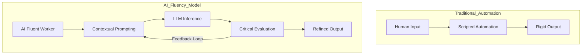

## 서론

2010년대 후반 딥러닝의 급격한 발전과 함께 "모든 것이 자동화될 것이다"라는 기대감이 전 세계적으로 확산되었습니다. 특히 생성형 AI(Generative AI)의 등장은 이러한 기대감을 정점으로 끌어올리며, 많은 기술 기업들이 백오피스 업무의 자동화를 통해 인력을 대폭 줄이는 방안을 모색했습니다. 그러나 현장에서는 기술적 한계가 명확히 드러나기 시작했습니다. 거대 언어 모델(LLM)이 창의적인 텍스트를 생성할 수는 있지만, 비즈니스의 맥락(Context), 정확성, 그리고 복잡한 의사결정 과정을 완전히 대체하기에는 '환각(Hallucination)' 현상과 추론 능력의 부재가 여전히 큰 장벽으로 남아 있기 때문입니다.

IBM이 최근 발표한 인력 구조 재편 계획은 이러한 기술적 냉철함(Technical Realism)을 반영한 대표적인 사례입니다. 단순히 AI가 인간을 대체하는 것이 아니라, AI를 도구로 다루는 'AI 활용 능력(AI Fluency)'을 갖춘 인재가 새로운 핵심 인력으로 부상하고 있습니다. IBM은 AI 자동화만으로는 해결할 수 없는 영역을 인정하고, 오히려 Z세대 인재 채용을 세 배로 확대하여 이들이 AI와 협업(Collaboration)하는 방식으로 업무 효율성을 극대화하려는 전략을 취했습니다. 이는 AI 시대의 노동 모델이 'Replacement(대체)'에서 'Augmentation(증강)'으로 전환되고 있음을 시사하며, 기술 리더들이 어떻게 조직을 재설계해야 하는지에 대한 중요한 통찰을 제공합니다.

## 본론

### AI 자동화의 기술적 경계와 역설

AI 자동화가 맞닥뜨린 가장 큰 기술적 한계는 '자율성'과 '신뢰성' 사이의 트레이드오프 관계입니다. 현재의 생성형 AI 모델, 특히 Transformer 기반의 LLM들은 방대한 데이터에서 패턴을 학습하여 유창한 문장을 생성하지만, 이것이 사실과 일치한다는 보장은 없습니다. 엔터프라이즈 환경에서는 하나의 잘못된 정보가 치명적인 리스크를 초래할 수 있으므로, 완전 자동화 대신 'Human-in-the-loop(HITL)' 시스템이 필수적입니다.

이러한 기술적 한계는 경제학적으로 '제본스의 역설(Jevons Paradox)'과 유사한 양상을 보입니다. 자원(AI 도구)의 효율이 좋아지면 그 자원을 활용하는 수요가 더욱 늘어난다는 것입니다. 즉, 단순 반복 업무가 AI로 대체됨에 따라, 남은 인력은 더 높은 수준의 복잡한 문제를 AI와 함께 해결해야 하는 상황에 처하게 됩니다. 이것이 바로 IBM이 주목하는 'AI Fluency'의 핵심입니다.

AI Fluency는 단순히 ChatGPT와 같은 도구를 사용하는 방법을 아는 것을 넘어섭니다. 이는 모델의 한계를 이해하고, 적절한 프롬프트를 설계하며, 모델의 출력물을 평가하고 수정하는 '메타 인지' 능력과 데이터 분석 역량을 결합한 고차원적인 기술적 소양입니다.

### 업무 프로세스의 재설계: 자동화에서 협업으로

기존의 인력 전략이 'Low-skill 작업의 자동화'에 집중했다면, 새로운 전략은 'AI-Augmented 작업의 설계'에 집중합니다. IBM은 초급 직무(Job Entry Level)를 단순히 없애는 것이 아니라, AI를 기반으로 재설계했습니다. 이 과정은 기술 리더에게 있어 새로운 시스템을 설계하는 것과 유사합니다.

다음은 기존의 자동화 중심 프로세스와 AI Fluency 기반의 협업 프로세스를 비교한 다이어그램입니다.



위 다이어그램에서 볼 수 있듯이, AI Fluency 모델은 단방향적인 입력과 출력이 아닌, 인간이 AI를 제어하고 평가하는 피드백 루프(Feedback Loop)가 핵심입니다. Z세대는 디지털 네이티브로서 이러한 피드백 루프를 구축하는 데 있어 태생적인 적응력을 가지고 있습니다. 그들은 AI를 '신비한 블랙박스'가 아니라 '함께 튜닝해야 하는 파트너'로 인식합니다.

### 기술적 구현: AI 평가 루프의 예시

AI Fluency를 갖춘 엔지니어나 데이터 분석가라면, AI가 생성한 결과물을 무비판적으로 수용하는 대신 정량적 지표로 검증하는 습관을 지녀야 합니다. 아래는 Python과 Hugging Face의 `transformers` 라이브러리를 사용하여, LLM이 생성한 요약문이 원문과 의미적으로 얼마나 유사한지를 측정하는 간단한 시나리오 코드입니다. 이는 AI를 활용한 업무 흐름에서 "검증" 단계가 얼마나 중요한지를 보여줍니다.

```python
from transformers import AutoTokenizer, AutoModelForSequenceClassification
import torch

# 의미 유사도(Semantic Textual Similarity) 측정을 위한 모델 로드
model_name = "sentence-transformers/all-MiniLM-L6-v2"
tokenizer = AutoTokenizer.from_pretrained(model_name)
model = AutoModelForSequenceClassification.from_pretrained(model_name)

def evaluate_ai_output(original_text, ai_summary):
    """
    AI가 생성한 결과물과 원문 간의 의미적 유사도를 계산하여
    AI 출력의 품질을 정량적으로 검증하는 함수.
    """
    inputs = tokenizer(original_text, ai_summary, return_tensors="pt", padding=True, truncation=True, max_length=512)
    
    with torch.no_grad():
        outputs = model(**inputs)
        logits = outputs.logits
        # 유사도 점수 추출 (모델 아키텍처에 따라 다를 수 있음)
        similarity_score = torch.nn.functional.softmax(logits, dim=1)[0][1].item()
        
    return similarity_score

# 시나리오: IBM의 초급 분석가가 AI를 사용해 보고서를 요약함
source_report = "IBM's shift towards AI fluency indicates that automation cannot replace critical thinking. The company plans to hire more Gen Z talent."
ai_generated_summary = "IBM is hiring more Gen Z because automation is enough." # 의도적으로 잘못된 요약

# 평가 실행
score = evaluate_ai_output(source_report, ai_generated_summary)

print(f"AI Output Similarity Score: {score:.4f}")
if score < 0.6:
    print("AI의 출력물이 원문의 의도를 벗어났습니다. 수동 수정이 필요합니다.")
else:
    print("AI의 출력물이 적절합니다.")
```

이 코드는 AI Fluency의 실무적 측면을 보여줍니다. 단순히 결과를 복사하는 것이 아니라, 모델이 내놓은 결과가 얼마나 신뢰할 수 있는지를 기술적으로 검증하는 능력이 바로 AI 시대의 새로운 역량이기 때문입니다.

### 직무 재설계(Job Redesign) 비교 분석

IBM의 전략적 전환은 구체적인 직무 기술서(Job Description)의 변화로 이어집니다. 아래 표는 기존의 자동화 시대의 초급 직무와 AI Fluency 중심의 재설계된 직무를 비교한 것입니다.

| 비교 항목 | 기존 자동화 시대 초급 직무 | AI Fluency 중심 재설계 직무 |
| :--- | :--- | :--- |
| 핵심 역량 | 반복적인 데이터 입력, 문서 포맷팅 | 프롬프트 엔지니어링, 데이터 리터러시 |
| 주요 업무 | 정해진 루틴(SOP) 수행 | AI 도구를 활용한 가설 검증 및 분석 |
| 평가 기준 | 처리 속도(Speed), 오타 여부 | 결과물의 창의성, AI 활용 효율성 |
| 요구되는 기술 | Excel, 기본 오피스 활용 능력 | Python/R 기초, LLM 한계 이해, 비판적 사고 |
| 성장 경로 | 시니어 매니저(관리직)로의 승진 | AI 시스템 설계자 혹은 도메인 전문가로의 확장 |

### 기업을 위한 AI Fluency 도입 가이드

IBM의 사례를 벤치마킹하여 조직 내에 AI Fluency 문화를 정착시키기 위한 단계별 전략은 다음과 같습니다.

1.  **역량 갭(Gap) 분석**: 현재 조직 내에서 AI 도구 사용이 금지되어 있거나, 사용법을 모르는 부서를 식별합니다. 기술적 장벽(모델 API 접근 등)을 낮추는 것이 우선입니다.
2.  **직무 재설정(Job Redesign)**: 단순 반복 업무에서 AI를 사용하여 '생산성'을 높이는 업무로 전환합니다. 예를 들어, 고객 응대 담당자가 답변을 작성하는 것이 아니라, AI가 생성한 답변을 '수정하고 검증(Review)'하는 업무로 변경합니다.
3.  **Z세대 채용 및 교육**: AI에 친숙한 Z세대 인재를 적극적으로 채용하되, 기존 직원들을 위한 'AI 활용 워크숍'을 진행합니다. 여기서는 기술 사용법뿐만 아니라 AI의 윤리적 사용과 환현 현상 방지법도 교육해야 합니다.
4.  **성과 지표(People Analytics) 재정립**: 단순 처리 건수가 아닌, AI를 활용하여 얼마나 많은 '부가가치'를 창출했는지를 측정하는 지표를 개발합니다.

## 결론

IBM의 인력 전략 변화는 AI 기술 발전의 역설을 정확히 짚어내고 있습니다. AI가 더 똑똑해질수록, 그것을 통제하고 활용할 수 있는 인간의 역량은 더욱 중요해집니다. 우리는 이제 'AI가 일자리를 뺏는다'는 공포보다는 'AI와 함께 일할 수 있는 능력(AI Fluency)을 갖춘 사람이 승리한다'는 사실에 주목해야 합니다.

이 전략의 핵심은 기술적 낙관주의에 기반한 무조건적인 감축이 아니라, 현실적인 기술의 한계를 인정한 인간과 기계의 '공진화(Coevolution)'입니다. Z세대 인재 채용 확대는 이러한 공진화를 위한 연료이며, 앞으로의 기업 성공은 이들이 가진 기술적 직관과 기업이 보유한 도메인 지식이 어떻게 시너지를 내느냐에 달려 있습니다.

연구자로서, 우리는 단순히 더 정확한 모델을 개발하는 것을 넘어, 이러한 모델이 사회 시스템 내에서 어떻게 통합되며 인간의 인지 능력을 어떻게 확장시킬 수 있는지에 대한 '인간-AI 상호작용(Human-AI Interaction)' 연구에 더 깊은 관심을 기울여야 할 때입니다.

### 참고자료

- IBM Newsroom: "IBM updates talent strategy to focus on AI and hybrid cloud"

- Brynjolfsson, E., et al. (2023). *Generative AI at Work*. NBER Working Paper.

- Hada.io 기사 요약: [AI 도입의 한계를 확인한 IBM, Z세대 초급 채용을 세 배로 확대](https://news.hada.io/topic?id=26705)
