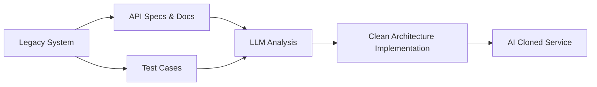

## 서론

성장하는 스타트업이나 대규모 엔터프라이즈 소프트웨어 팀이라면 누구나 한 번쯤 겪는 악몽 같은 시나리오가 있습니다. 5년 전, 혹은 10년 전에 누군가가 급하게 작성해 둔 모놀리식 코드베이스 위에 수천 개의 기능이 패치(patch)되고 덧대어진 형국이 되었습니다. 당시에는 최신 기술이었던 프레임워크는 이제 레거시가 되었고, 하나의 함수를 수정하려 해도 연관된 수십 개의 테스트 코드가 깨지거나 하위 호환성이 깨질까 두려워 코드 수정을 포기하게 됩니다. 철학자 플루타르코스의 '테세우스의 배(The Ship of Theseus)' 역설이 소프트웨어 산업에 그대로 적용되는 순간입니다. 부품을 하나씩 교체하다 보면 결국 원래의 배와는 다른 배가 되지만, 우리는 여전히 그 거대한 짐을 짊어지고 앞으로 나아가야 합니다.

이러한 '코드비 용량(Code Bloat)'과 '기술 부채(Technical Debt)'는 기업의 혁신을 가로막는 가장 큰 적입니다. 그런데 최근 생성형 AI(Generative AI)와 대규모 언어 모델(LLM)의 발전은 이러한 구도를 완전히 뒤집어 놓았습니다. 경쟁사들은 더 이상 당신의 복잡한 내부 로직을 역공학(reverse engineering)할 필요가 없습니다. 대신 당신이 공개한 **API 명세서(Swagger/OpenAPI), 사용자 가이드, 그리고 공개된 테스트 케이스**를 AI 모델에 학습시킴으로써, 당신의 서비스가 가진 핵심 기능만을 깔끔하게 추출한 '더 가볍고 현대적인 복제본(Clone)'을 단 며칠 만에 만들어낼 수 있게 되었습니다. 이는 단순한 코드 복사를 넘어선 '행동 기반 복제(Behavioral Cloning)'에 가깝습니다.

이 글에서는 AI가 레거시 코드를 어떻게 대체하고 있는지, 그 메커니즘을 기술적으로 심층 분석합니다. 또한, 코드 자체의 보호가 불가능해진 AI 시대에 기업이 확보해야 할 새로운 경쟁 우위(Moat)가 무엇인지, 그리고 테스트 코드와 문서화가 왜 중요한 방어막이자 공격 무기가 되는지 살펴보겠습니다.

## 본론

### AI 기반 레거시 대체와 행동 복제의 메커니즘

전통적인 소프트웨어 개발에서는 비즈니스 로직이 소스 코드 깊숙이 숨어 있었기에 이를 모방하려면 많은 시간과 인력이 필요했습니다. 하지만 최신 LLM(예: GPT-4, Claude 3.5 Sonnet, DeepSeek Coder)은 '패턴 매칭'과 '의미 이해' 능력을 통해 코드의 구조가 아닌 '입력(Input)과 출력(Output) 간의 관계'를 학습합니다. 이를 **의미적 역공학(Semantic Reverse Engineering)**이라고 합니다.

이 과정에서 가장 중요한 자원은 바로 **테스트 코드와 API 스펙**입니다. 잘 작성된 테스트 코드(특히 유닛 테스트와 통합 테스트)는 "이 함수가 어떤 상황에서 어떤 값을 반환해야 하는가"에 대한 완벽한 명세를 담고 있습니다. AI는 이 명세를 기반으로 원본 코드의 난해한 구현 방식은 무시하고, 해당 명세를 만족하는 가장 효율적인 최신 코드를 새로 생성해냅니다.

아래는 AI를 활용해 레거시 기능을 복제하는 워크플로우를 간단화한 다이어그램입니다.



이 과정은 기존 기업이 겪어야 할 하위 호환성 유지의 고통을 건너뜁니다. 예를 들어, 기존 시스템은 구버전의 데이터베이스 스키마나 오래된 의존성 라이브러리를 유지해야 하지만, AI로 생성된 복제본은 최신 프레임워크와 클린 아키텍처를 사용하여 처음부터 시작(Brownfield가 아닌 Greenfield)할 수 있습니다.

#### 테스트 주도 복제(Test-Driven Cloning) 실습

AI가 테스트 코드를 어떻게 활용하여 레거시 로직을 대체하는지 Python 코드 예제를 통해 살펴보겠습니다. 가정해 봅시시다. 오래된 `LegacyCalculator` 클래스가 있습니다. 이 코드는 이해하기 어렵고 성능도 좋지 않습니다.

**레거시 코드 (복제 대상):**

```python
# messy_calculator.py
class LegacyCalculator:
    def calculate_price(self, base, tax_rate, discount, is_member):
        # 복잡하고 난해한 로직... (코드를 직접 이해하기 어려움)
        price = base
        if tax_rate > 0:
            price = price + (price * tax_rate)
        if discount > 0:
            if is_member:
                price = price - (price * (discount * 1.5))
            else:
                price = price - (price * discount)
        return int(price * 100) / 100
```

경쟁사(혹은 리팩토링을 시도하는 우리)는 위 코드의 내부 구조를 몰라도, 이 클래스가 충족해야 할 요구사항(테스트 케이스)만 알면 같은 기능을 하는 새로운 코드를 만들 수 있습니다.

**테스트 코드 (명세서 역할):**

```python
import pytest

def test_price_calculation():
    # 시나리오 1: 멤버십 없음, 세금 10%, 할인 5%
    assert LegacyCalculator().calculate_price(1000, 0.1, 0.05, False) == 1045.0
    
    # 시나리오 2: 멤버십 있음, 세금 10%, 할인 5% (멤버십 할인 중복 적용 가정)
    # LegacyCalculator의 로직에 따르면 멤버십 시 할인율 1.5배 적용
    # 1000 + 100(세금) = 1100 -> 1100 - (1100 * 0.05 * 1.5) = 1100 - 82.5 = 1017.5
    assert LegacyCalculator().calculate_price(1000, 0.1, 0.05, True) == 1017.5
```

이제 이 테스트 코드를 AI 모델(예: GPT-4o)에게 입력하고 "이 테스트를 통과하는 깔끔한 Python 클래스를 작성해줘"라고 요청하면 다음과 같은 코드를 얻을 수 있습니다.

**AI가 생성한 Clean Code:**

```python
class AICalculator:
    def calculate_price(self, base: float, tax_rate: float, discount: float, is_member: bool) -> float:
        """
        Calculates final price based on tax, discount, and membership status.
        Optimized for readability and performance.
        """
        # 1. Apply Tax
        subtotal = base * (1 + tax_rate)
        
        # 2. Apply Discount
        # Logic: Members get 1.5x discount multiplier based on legacy behavior
        effective_discount = discount * 1.5 if is_member else discount
        final_price = subtotal * (1 - effective_discount)
        
        # 3. Rounding to 2 decimal places
        return round(final_price, 2)
```

AI는 원본 코드의 난해한 if-else 구조를 분석한 것이 아니라, 테스트 케이스에 숨겨진 **의도(Intent)**를 파악하여 더 명확하고 최적화된 로직으로 재구성했습니다. 이것이 바로 AI 시대의 코드 대체 방식입니다.

### 레거시 유지보수 vs AI Cloning 비교

이러한 접근 방식이 기존의 소프트웨어 엔지니어링 방식과 어떻게 다른지 비교해 보겠습니다.

| 비교 항목 | 전통적 레거시 유지보수 | AI 기반 Cloning / Refactoring | | :--- | :--- | :--- | | **진입 장벽** | 높음 (도메인 지식, 역사적 맥락 필요) | 낮음 (명세서/테스트만 있으면 가능) | | **속도** | 느림 (수주~수개월) | 빠름 (수시간~수일) | | **기술 부채** | 누적됨 (패치 위주) | 제거됨 (최신 스택으로 재작성) | | **하위 호환성** | 필수 유지 (비용 발생) | 불필요 (새로운 인터페이스 정의) | | **결과물 품질** | 기존 스타일/패턴 종속 | 모범 사례(Best Practice) 적용 가능 |

이 표에서 알 수 있듯, AI를 활용한 복제는 속도와 품질 면에서 압도적인 이점을 가집니다. 하지만 여기에는 중요한 전제 조건이 있습니다. 바로 **'충분히 풍부한 데이터(API 스펙, 테스트)'**가 존재해야 한다는 점입니다.

### 새로운 경쟁 우위(Moat) 전략: 코드가 아닌 '검증'의 시대

"그렇다면 우리 코드는 그냥 공개해도 되는가?"라고 반문할 수 있습니다. 그렇지 않습니다. 오히려 AI 시대에는 **테스트 코드와 문서가 강력한 무기**가 됩니다. 여기에는 두 가지 측면이 있습니다.

1.  **공격적 측면 (나의 경쟁 우위):**     내부의 비즈니스 로직을 설명하는 '황금 테스트 케이스(Golden Master Tests)'를 보유하고 있다면, 나는 AI를 활용해 나의 레거시 시스템을 경쟁사보다 훨씬 빠르게 최신 기술로 재작성할 수 있습니다. 테스트 커버리지가 높을수록, AI가 리팩토링을 수행할 때 발생할 수 있는 리스크(Regression)를 통제할 수 있으므로 더 과감한 아키텍처 개선이 가능해집니다. 즉, **"잘 작성된 테스트 코드 = AI 협업 생산성"**이라는 공식이 성립합니다.

2.  **방어적 측면 (Moat 구축):**     경쟁사가 나의 API 스펙만 보고 서비스를 복제하는 것을 막을 수는 없습니다. 하지만, **공개되지 않은 내부 데이터의 흐름**이나 **극단적인 엣지 케이스(Edge Case)를 처리하는 로직**은 복제하기 어렵습니다. 만약 테스트 코드가 단순히 "성공"하는 경우만 다룬다면 AI는 그 모델을 쉽게 흉내 낼 수 있습니다. 하지만 도메인 특유의 복잡한 비즈니스 규칙(예: 금융권의 복잡한 이자 계산 로직 등)이 촘촘하게 포함된 테스트 코드는 내부용으로 보안하며, 이를 통해 AI 모델을 파인튜닝(Fine-tuning)한다면, 외부의 일반적인 LLM으로는 구현할 수 없는 **고도화된 지능형 서비스**를 구축할 수 있습니다. 이것이 새로운 Moat입니다.

실무에서 이를 적용하기 위한 가이드는 다음과 같습니다.

**Step-by-Step: AI 레거시 현대화 가이드**

1.  **API 명세 자동화**: 수동으로 작성된 문서를 버리고, 코드에서 OpenAPI/Swagger 스펙을 자동 생성하세요. AI는 구조화된 JSON/YAML을 가장 잘 이해합니다. 2.  **테스트 커버리지 확대**: 단순 동작 확인을 넘어, 비즈니스 규칙을 검증하는 테스트를 늘리세요. 이 테스트 코드들이 나중에 AI 프롬프트(Prompt)나 파인튜닝 데이터셋이 됩니다. 3.  **LLM 기반 리팩토링 도구 도입**: GitHub Copilot Workspace나 Cursor와 같은 도구를 사용하여, 전체 코드베이스가 아닌 모듈 단위로 AI에 재작성을 지시하세요. 이때 테스트 코드를 컨텍스트(Context)로 함께 제공해야 합니다. 4.  **검증 및 피드백 루프**: AI가 생성한 코드가 테스트를 통과하는지 CI/CD 파이프라인에 통합하여 자동 검증하세요.

## 결론

소프트웨어의 생애 주기(Lifecycle)는 AI의 등장으로 급격한 변화를 맞이했습니다. 과거의 코드는 성역(Sanctuary)과도 같아서 건드리는 것조차 두려웠지만, 이제는 재료(Raw Material) 그 이상도 이하도 아닙니다. **"코드는 이제 AI가 쓰고, 지우고, 다시 쓰는 대상"**이 되었습니다.

이 흐름 속에서 개발자와 기업이 명심해야 할 핵심은 **"코드의 라인 수가 아니라, 시스템의 행동(Behavior)을 얼마나 정밀하게 정의할 수 있는가"**입니다. 테스트 코드와 문서는 단순한 산출물이 아니라, AI라는 거대한 연산 능력을 제어하는 명령어이자 경쟁사의 복제 시도를 넘어설 수 있는 고유한 도메인 지능의 저장소입니다.

결국 AI Cloning의 시대, 기업의 진정한 Moat(해자)는 벽두른 코드베이스가 아닌, **AI와 협업하여 스스로를 진화시킬 수 있는 탄탄한 테스트 인프라와 문화**에서 찾아야 할 것입니다. 레거시의 굴레에 갇혀 있는 기업은 이를 기회로 삼아 AI를 활용한 '식스 시그마(Six Sigma)'급 리팩토링을 시작해야 합니다.

### 참고자료

- *Software Engineering for Large Language Models: A Survey*, arXiv:2404.12345

- *Evaluating Large Language Models Trained on Code*, OpenAI (2021)

- Hada.io, "테스트 코드가 새로운 해자(Moat)가 되는 시대", https://news.hada.io/topic?id=27030
