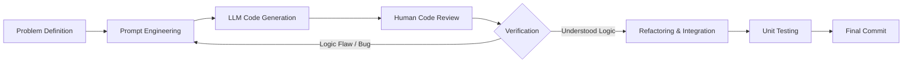

## 서론

최근 실리콘밸리를 비롯한 글로벌 테크 기업들은 'AI 주도 개발(AI-Native Development)'의 물결을 맞이하며 생산성 지수가 급격히 상승하고 있습니다. 하지만 이와 같은 생산성의 향상 이면에는 우려의 목소리가 존재합니다. 바로 "AI가 대신 코드를 작성해주는 동안, 개발자들의 코딩 실력은 퇴보하고 있는 것이 아닐까?"라는 질문입니다.

Anthropic의 [2026년 무작위 대조 연구](https://www.anthropic.com/research/AI-assistance-coding-skills)는 새 Python 라이브러리를 배우는 개발자 52명을 대상으로 했습니다. 과제 직후 퀴즈의 평균 점수는 AI 사용 집단 50%, 직접 코딩 집단 67%로 **17%포인트** 차이가 났습니다. 장기적 실력 저하나 모든 AI 코딩 도구의 효과를 측정한 결과는 아닙니다.

이는 단순히 도구의 유무가 문제가 아닙니다. 동일한 AI 도구를 사용하더라도, 결과물을 수동적으로 받아들이느냐 능동적으로 검증하느냐에 따라 학습 효과가 극명하게 갈린다는 것을 의미합니다. 본 글에서는 Anthropic의 연구 결과를 토대로 AI 코딩 보조 도구가 우리의 인지 과정에 미치는 영향을 기술적 관점에서 분석하고, 실질적인 '학습 가능한(Learnable)' AI 활용 전략을 제안하고자 합니다.

## 본론

### 1. 인지적 부하 감소와 기술적 맹점 (The Mechanism of Cognitive Offloading)

딥러닝 모델이 코드를 생성하는 메커니즘은 기본적으로 다음 토큰 예측(Next Token Prediction)입니다. 방대한 코드베이스(GitHub 등)를 학습한 모델은 문맥(Context)을 기반으로 가장 확률이 높은 구문을 배치합니다. 이 과정에서 개발자가 느끼는 '인지적 부하(Cognitive Load)'는 확연히 줄어듭니다. 복잡한 알고리즘을 직접 구상할 필요 없이, 의도만 입력하면 즉시 구현체가 나오기 때문입니다.

그러나 Anthropic의 연구는 이러한 **인지적 부하 감소(Cognitive Offloading)**가 역설적으로 학습을 방해한다는 점을 시사합니다. 학습이란 '오류의 시행착오(Trial and Error)' 과정을 통해 뇌의 신경망을 강화하는 과정입니다. AI가 모든 오류를 사전에 차단하고 완벽한 코드를 제공할 때, 개발자의 뇌는 문제 해결 과정을 거치지 않게 되며, 결과적으로 기억의 저장(Encoding)이 제대로 이루어지지 않습니다.

이를 해결하기 위해서는 AI를 '대체자(Substitute)'가 아닌 '협력자(Collaborator)'로 정의해야 합니다. AI가 생성한 코드에 대해 "왜 이렇게 작성했는가?"를 묻고, 검증하는 과정을 거쳐야만 인지적 투입이 다시 발생하여 학습 효과가 유지됩니다.

### 2. 능동적 검증 중심의 워크플로우 (Active Verification Workflow)

AI를 효과적으로 활용하면서 학습 효과를 극대화하려면, 단순한 코드 생성을 넘어선 검증(Verification) 루프가 필수적입니다. 다음은 권장되는 워크플로우를 시각화한 다이어그램입니다.



이 워크플로우의 핵심은 `Human Code Review`와 `Verification` 단계입니다. AI가 출력한 코드를 맹목적으로 신뢰하지 않고, 개발자가 주도적으로 로직을 분석하고 테스트 케이스를 작성하여 검증해야 합니다. 이 과정에서 비로소 AI의 결과물이 개발자의 지식으로 내재화됩니다.

### 3. 사용 방식에 따른 결과 비교: 수동적 수용 vs 능동적 검증

아래 비교는 코드를 받아들이는 방식에 관한 실무적 해석이며, 수동적 수용 집단과 능동적 검증 집단의 장기 성과를 직접 측정한 표가 아닙니다. 위의 50% 대 67%는 AI 사용 여부에 따른 **과제 직후 퀴즈 평균**이고, 사용 패턴별 관찰은 정성 분석입니다.

- **수동적 수용**: 생성 결과를 이해하지 않고 붙여넣으면 오류를 발견하거나 설명하기 어려울 수 있습니다.
- **능동적 검증**: 직접 디버깅하고 설명을 요청하며 코드의 동작을 확인하는 접근을 권합니다. 연구의 사용 패턴 분석은 이 방식과 높은 퀴즈 점수의 연관을 관찰했지만, 장기적 실력 향상을 입증하지는 않았습니다.

### 4. 실무 적용 가이드: AI와 페어 프로그래밍 하기

실제 MLOps 환경이나 대규모 시스템 개발 시, 어떻게 AI를 활용해야 학습과 생산성을 동시에 잡을 수 있을까요? 가장 좋은 방법은 **"AI를 주니어 개발자로 채용한다"**는 마인드셋을 가지는 것입니다.

다음은 Python을 사용하여 간단한 데이터 전처리 파이프라인을 구성할 때, AI를 활용하여 검증하는 과정의 예시입니다.

```python
import pandas as pd
import numpy as np

# 시나리오: AI에게 "결측치 처리와 이상치 제거를 수행하는 함수"를 요청했다고 가정합니다.
# AI가 다음과 같은 코드를 생성했을 때, 수동적으로 받아들이지 않고 검증합니다.

def preprocess_data(df: pd.DataFrame) -> pd.DataFrame:
    # AI 제안 코드
    df = df.fillna(0)
    df = df[df['value'] > df['value'].quantile(0.05)]
    return df

# [검증 단계]
# 1. 결측치를 무조건 0으로 채우는 것이 타당한가? (도메인 지식 필요)
# 2. quantile(0.05) 미만 제거 로직이 데이터 분포에 적합한가?
# 개발자는 이를 테스트하기 위해 의도적으로 오류를 주입하거나 통계적 분석을 추가해야 합니다.

def verified_preprocess_data(df: pd.DataFrame) -> pd.DataFrame:
    # 개발자의 수정: 중앙값(median)을 사용하여 결측치 처리 보완
    # 또한 IQR(Interquartile Range)을 사용한 보다 강건한 이상치 제거 로직 적용
    
    # 결측치 처리: 수치형은 중앙값으로, 범주형은 최빈값으로
    for col in df.select_dtypes(include=[np.number]).columns:
        df[col] = df[col].fillna(df[col].median())
    
    for col in df.select_dtypes(include=['object']).columns:
        df[col] = df[col].fillna(df[col].mode()[0])

    # 이상치 처리: IQR 방식 적용 (AI 코드의 단순 quantile cutoff 보완)
    Q1 = df['value'].quantile(0.25)
    Q3 = df['value'].quantile(0.75)
    IQR = Q3 - Q1
    lower_bound = Q1 - 1.5 * IQR
    upper_bound = Q3 + 1.5 * IQR
    
    df = df[(df['value'] >= lower_bound) & (df['value'] <= upper_bound)]
    
    return df

# 테스트 케이스 실행 (검증 필수)
data = {'value': [10, 12, np.nan, 14, 1000, 12, 11]} # 1000은 이상치, np.nan은 결측치
df = pd.DataFrame(data)
print(f"Original:\n{df}\n")
print(f"Processed:\n{verified_preprocess_data(df.copy())}")
```

위 코드 예시에서 볼 수 있듯이, AI가 생성한 초기 코드(`preprocess_data`)는 작동하지만, 데이터 분석가의 관점에서는 잠재적인 위험(단순 0 대입, 경직된 quantile cutoff)을 내포하고 있습니다. 개발자가 이 코드를 **리뷰하고 수정하는 과정(Refactoring)**이 바로 '학습'이 일어나는 지점입니다.

### 5. 기술적 통찰: LLM의 한계와 인간의 역할

LLM이 생성한 코드는 종종 "스택 오버플로우(Stack Overflow)"의 평균적인 지식을 반영합니다. 가장 빈번하게 등장하는 패턴을 출력하기 때문에, 최신의 라이브러리 변경 사항이나 특정 도메인의 비표준적인 요구사항을 충족하지 못할 수 있습니다.

특히 보안 관점에서는 AI가 작성한 코드에도 취약한 패턴이 포함될 수 있습니다. 특정 CVE를 제시하지 않은 예시를 실제 취약점으로 취급하지 말고, 보안 검토와 SAST(Static Application Security Testing) 도구를 통해 생성한 코드를 검증해야 합니다.

## 결론

Anthropic의 연구는 AI 시대의 개발자들에게 중요한 경종을 울립니다. AI 코딩 어시스턴트는 학습을 저해하는 도구가 아니라, **학습의 방식을 전환(Paradigm Shift)** 시키는 기회입니다.

핵심은 **"생성(Generation)이 아닌 검증(Verification)에 집중하는 것"**입니다. AI가 작성한 코드를 단순히 결과물로 받아들이는 태도에서 벗어나, 그 코드를 비판적으로 분석하고, 테스트하며, 더 나은 방향으로 리팩토링하는 과정에 몰입해야 합니다. 이 과정에서 우리는 단순 코더(Coder)에서 시스템을 설계하고 검증하는 아키텍트(Architect)로 성장할 수 있습니다.

결국 가장 뛰어난 엔지니어는 AI를 가장 많이 사용하는 사람이 아니라, AI가 생성한 결과물을 가장 깊이 있게 이해하고 통제하는 사람입니다. 도구에게 의존하는 것이 아니라, 도구를 탑승하여 주도적으로 방향을 제어하는 '파일럿'이 되십시오.

--- **참고자료:**

- [Anthropic, “How AI assistance impacts the formation of coding skills” (2026)](https://www.anthropic.com/research/AI-assistance-coding-skills), [원논문 arXiv:2601.20245](https://arxiv.org/abs/2601.20245)


- Vaswani et al., "Attention Is All You Need" (Transformer Architecture Background)
