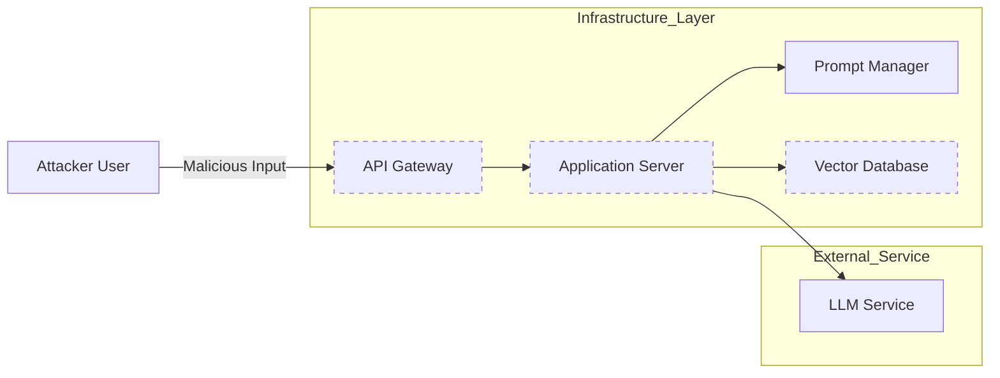

## 서론

최근 한 금융 기업이 자사의 고객 지원 시스템에 최신 오픈소스 LLM을 통합한 지 일주일 만에 심각한 보안 사고를 당했다고 가정해 봅시다. 공격자는 모델의 가중치(Weights)를 탈취하거나 모델 자체를 '탈옥(Jailbreaking)'하여 악의적인 답변을 유도하지 않았습니다. 대신, 모델과 외부 데이터베이스를 연결하는 API 엔드포인트의 취약한 인증 메커니즘을 악용하여, 수만 건의 고객 개인정보를 무단으로 탈취했습니다.

이 시나리오는 Cisco가 최근 경고한 "AI의 연결 조직(connective tissue)이 심각하게 불안전하다"는 지적을 정확히 보여줍니다. 현재 기업들은 LLM 도입 시 모델의 알고리즘적 편향성이나 환각(Hallucination) 현상에만 집중하며, 모델을 둘러싼 인프라 계층의 보안을 간과하는 경향이 큽니다. 모델 자체의 안전성이 아무리 뛰어나더라도, 데이터를 주고받는 파이프라인과 API 게이트웨이가 스위스 치즈처럼 구멍이 뚫려 있다면 전체 시스템은 무방비 상태가 됩니다.

생성형 AI가 기업의 핵심 워크로드로 자리 잡으면서, 우리의 관심은 '모델 성능'에서 '모델 통합 보안(Model Integration Security)'으로 이동해야 합니다. 이 글에서는 LLM 생태계의 인프라 취약점을 기술적 관점에서 분석하고, 실무적으로 적용 가능한 방어 전략을 제시합니다.

## 본론

### 1. AI 인프라의 공격 표면 확장: 연결 조직의 위험성

LLM 애플리케이션은 일반적인 웹 애플리케이션과 달리 복잡한 의존성을 가집니다. RAG(Retrieval-Augmented Generation) 파이프라인이나 에이전트(Agent) 기반 시스템은 벡터 데이터베이스, 외부 API, 프롬프트 템플릿 엔진 등 여러 컴포넌트를 유기적으로 연결합니다. Cisco의 보고서가 지적한 '연결 조직'은 바로 이 컴포넌트 간의 통신 계층을 의미합니다.

전통적인 보안 도구는 정형화된 SQL 쿼리나 HTTP 요청을 검사하지만, LLM이 생성하는 비정형적이고 예측 불가능한 토큰 흐름을 분석하지 못합니다. 예를 들어, 공격자는 사용자 입력을 통해 벡터 데이터베이스의 권한 상승을 유도하는 '간접 프롬프트 주입(Indirect Prompt Injection)'을 시도할 수 있습니다. 이는 모델의 연산 과정이 아닌, 모델이 데이터를 조회하는 과정에서 발생하는 인프라 수준의 취약점입니다.

다음은 전형적인 RAG 아키텍처에서 보안 위협이 발생할 수 있는 지점을 시각화한 다이어그램입니다.



위 다이어그램에서 점선으로 표시된 인프라 계층(API Gateway, App Server, Vector DB)이 공격의 주요 타겟이 됩니다. 특히 LLM 서비스와의 통신에서 발생하는 토큰 유출이나, 벡터 DB로의 비정상 쿼리 전송이 핵심 위협 요소입니다.

### 2. 기술적 원리와 취약점 분석

인프라 보안의 핵심 취약점은 크게 **API 부적절한 사용**, **데이터 파이프라인의 노출**, **공급망(Supply Chain) 보안** 세 가지로 나눌 수 있습니다.

첫째, **API 부적절한 사용**입니다. LLM 애플리케이션은 종종 원본 API 키를 클라이언트 사이드 코드에 하드코딩하거나, 불충분한 속도 제한(Rate Limiting) 정책을 적용합니다. 이는 공격자가 무료 할당량을 소진시키거나, 서비스 거부(DoS) 공격을 감행할 수 있는 틈을 제공합니다.

둘째, **데이터 파이프라인의 노출**입니다. RAG 시스템에서 문서 임베딩 과정은 민감한 메타데이터를 포함할 수 있습니다. 임베딩 벡터를 저장하는 데이터베이스가 적절히 격리되지 않으면, 공격자는 의미론적 검색을 통해 비공개 문서의 내용을 역추적할 수 있습니다.

셋째, **공급망 보안**입니다. 개발자들이 Hugging Face나 GitHub에서 다운로드하는 커스텀 모델, 랭체인(LangChain)과 같은 오픈소스 라이브러리에 악성 코드가 포함된 사례가 증가하고 있습니다.

다음 표는 모델 보안(Model Security)과 인프라 보안(Infrastructure Security)의 차이점을 명확히 보여줍니다.

| 비교 항목 | 모델 보안 (Model Security) | 인프라 보안 (Infrastructure Security) | | :--- | :--- | :--- | | **주요 관심사** | 가중치 보안, 편향성, 환각 방지 | API 인증, 데이터 전송 암호화, 접근 제어 | | **공격 유형** | Jailbreaking, Adversarial Examples | API Injection, Data Exfiltration, DoS | | **대응 도구** | RLHF, Red Teaming, Guardrails | WAF, Zero Trust Network, Observability | | **Cisco 보고서의 포인트** | 상대적으로 양호 | 매우 취약 (Connective Tissue) |

### 3. 실무적 보안 강화 가이드 및 구현

이러한 취약점을 완화하기 위해 MLOps 파이프라인에 보안을 'Shift Left'해야 합니다. 즉, 배포 후가 아닌 개발 단계부터 보안을 고려해야 합니다.

**Step 1: API 게이트웨이 및 인증 강화** 모든 LLM 관련 API 요청은 중앙 집중식 API 게이트웨이를 통해 이루어져야 합니다. 여기서 mTLS 상호 인증과 엄격한 Rate Limiting을 적용해야 합니다. 또한, OpenAI API Key 등을 직접 호출하는 대신, 임시 토큰을 발행하는 프록시 서버를 중간에 두는 것이 좋습니다.

**Step 2: 입력/출력 필터링 (Sanitization)** 사용자의 입력이 LLM으로 전달되기 전과 LLM의 응답이 사용자에게 전달되기 전, 양방향으로 필터링 계층을 둡니다. 이를 통해 프롬프트 주입 시도나 민감 정보(PII) 포함 여부를 사전에 차단합니다.

**Step 3: observability 및 로깅** 비정상적인 토큰 사용량이나 긴 응답 시간 등은 보안 위협의 신호일 수 있습니다. MLflow나 Weights & Biases와 같은 툴을 넘어, 시스템 레벨의 로그를 통합 분석하는 환경을 구축해야 합니다.

아래는 Python을 사용하여 안전하게 LLM API를 호출하는 간단한 예시 코드입니다. 이 코드는 직접적인 API 키 노출을 방지하기 위해 환경 변수를 사용하며, 요청 전에 입력을 검증하는 래퍼(Wrapper) 역할을 합니다.

```python
import os
import re
from typing import Optional
import requests
from pydantic import BaseModel, ValidationError

class LLMRequest(BaseModel):
    prompt: str
    max_tokens: int = 100

class SecureLLMClient:
    def __init__(self):
        self.api_key = os.getenv("LLM_API_KEY")
        self.endpoint = os.getenv("LLM_ENDPOINT")
        if not self.api_key or not self.endpoint:
            raise ValueError("API credentials are not set in environment variables.")
        
        # 간단한 입력 검증 정의 (예: SQL 인젝션 패턴 등)
        self.malicious_patterns = [r"SELECT.*FROM", r"DROP TABLE", r"<script>"]

    def validate_input(self, prompt: str) -> bool:
        for pattern in self.malicious_patterns:
            if re.search(pattern, prompt, re.IGNORECASE):
                print(f"Security Alert: Malicious pattern detected in prompt.")
                return False
        return True

    def call_llm(self, user_prompt: str) -> Optional[str]:
        try:
            # 입력 데이터 구조화 및 검증
            request_data = LLMRequest(prompt=user_prompt)
            
            # 보안 필터링 로직
            if not self.validate_input(request_data.prompt):
                return "Input rejected due to security policy."

            headers = {
                "Authorization": f"Bearer {self.api_key}",
                "Content-Type": "application/json"
            }
            payload = {
                "prompt": request_data.prompt,
                "max_tokens": request_data.max_tokens
            }

            # 실제 API 호출 (예시)
            response = requests.post(self.endpoint, json=payload, headers=headers)
            response.raise_for_status()
            
            return response.json().get("text")
            
        except ValidationError as e:
            print(f"Validation Error: {e}")
            return None
        except requests.exceptions.RequestException as e:
            print(f"API Request Error: {e}")
            return None


```

```python
# 사용 예시
if __name__ == "__main__":
    # 환경 변수 설정 필요
    client = SecureLLMClient()
    print(client.call_llm("What is the capital of France?"))
```

이 코드는 `pydantic`을 통해 입력 스키마를 강제하고, 정규표현식을 통해 기상천외한 프롬프트 주입 시도를 사전에 차단하는 기초적인 인프라 보안 패턴을 보여줍니다.

## 결론

LLLM 도입의 성공 여부는 모델의 지능 지수(IQ)뿐만 아니라 이를 지탱하는 인프라의 보안 지수(SQ)에 달려 있습니다. Cisco의 경고처럼, 모델과 데이터를 연결하는 '연결 조직'이 취약하다면, 아무리 뛰어난 LLM도 기업에 재앙을 불러올 트로이 목숨이 될 수 있습니다.

전문가들은 이제 단순히 모델의 성능 벤치마크에 집착하기보다, LLM 애플리케이션의 전체 스택(Stack)에 대한 포괄적인 위협 모델링(Threat Modeling)을 수행해야 합니다. API 게이트웨이의 강화, 엄격한 접근 제어, 그리고 지속적인 모니터링이 결합된 MLOps 보안 프로세스만이 생성형 AI의 기업 생태계 진입을 안전하게 보장할 것입니다.

**참고자료:**

- Cisco Annual Security Report regarding AI Infrastructure

- OWASP Top 10 for Large Language Model Applications

- "Not with a Bang but a Whimper: The Quiet Dangers of AI Infrastructure" - AI Security Research Papers
