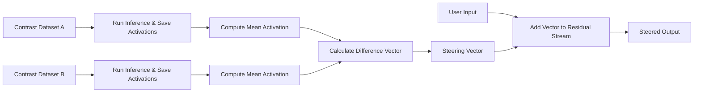

## 서론

최근 ChatGPT나 Claude와 같은 거대 언어 모델(LLM)이 비즈니스와 일상 전반에 깊숙이 들어오면서, "이 모델이 왜 이런 답변을 했을까?"라는 질문은 단순한 호기심을 넘어 보안의 핵심 과제가 되었습니다. 우리는 보통 프롬프트 엔지니어링(Prompt Engineering)을 통해 모델의 행동을 수정하려 노력해왔습니다. "너는 도움이 되는 어시스턴트야"라고 미리 주입하거나, "금지된 질문에는 답하지 마"라고 지시하는 식입니다.

하지만 만약 사용자의 입력을 변경하지 않고도, 모델의 내부 뇌회로에 직접 개입하여 출력을 제어할 수 있다면 어떨까요? 최근 연구진들은 **Activation Steering(활성화 조종)**이라는 기법을 통해 이것이 가능하다는 것을 입증했습니다. 이는 모델의 출력 결과물을 바꾸는 것이 아니라, 출력을 생성하기 위한 **내부 생각의 흐름(Residual Stream)** 자체를 미세하게 조작하는 기술입니다. 이 기술은 LLM의 안전성(Safety)을 강화하는 데 쓰일 수도 있지만, 반대로 모델의 방어 기제를 우회하는 보안 위협으로 작용할 수도 있어 AI 연구자들 사이에서 큰 주목을 받고 있습니다. 이 글에서는 Activation Steering의 원리와 구현 방법, 그리고 이가 야기할 수 있는 보안적 시사점을 기술적 관점에서 심도 있게 다루고자 합니다.

## 본론

### Residual Stream과 Representation Engineering

Activation Steering을 이해하려면 먼저 Transformer 아키텍처의 핵심인 **Residual Stream(잔차 스트림)**을 이해해야 합니다. Transformer의 각 레이어를 통과할 때, 정보는 $x_{l+1} = x_l + f(x_l)$의 형태로 업데이트됩니다. 여기서 $x_l$은 현재 레이어의 잔차 스트림을, $f(x_l)$은 Attention이나 MLP를 통한 계산 결과를 의미합니다. 이 잔차 스트림은 모델이 현재 처리하고 있는 문맥, 감정, 추론 과정 등을 담고 있는 고차원 벡터입니다.

**Representation Engineering**의 관점에서 볼 때, 특정 개념(예: "사랑", "증오", "거절", "승인")은 이 고차원 공간 내에서 특정 방향(Vectors)을 가집니다. 연구진들은 "거절을 원하는 데이터"와 "승인을 원하는 데이터" 간의 활성화 평균 차이를 계산함으로써, "안전성(Safety)"이나 "거절(Refusal)"을 의미하는 방향 벡터를 추출할 수 있음을 발견했습니다.

### Activation Steering 메커니즘

Activation Steering의 기본 아키텍처는 다음과 같이 요약할 수 있습니다. 먼저 두 가지 상반된 데이터셋을 준비하여 모델에 통과시킨 뒤, 특정 레이어의 활성화값을 캡처합니다. 이 두 활성화값의 차이(Difference Vector)를 계산하면, 이 벡터가 바로 모델의 행동을 좌우하는 "스티어링 벡터(Steering Vector)"가 됩니다. 추론(Inference) 단계에서 사용자의 프롬프트가 처리될 때, 이 벡터를 잔차 스트림에 더해주면 모델의 행동이 원하는 방향으로 기울게 됩니다.

다음은 이 과정을 시각화한 간단한 다이어그램입니다.



이 메커니즘은 수학적으로 매우 단순하지만 강력합니다. 예를 들어, "행복한 톤"의 데이터와 "슬픈 톤"의 데이터로부터 벡터를 추출하여 더해주면, 모델은 입력 프롬프트의 내용과 무관하게 긍정적이거나 부정적인 뉘앙스로 답변을 생성하게 됩니다.

### PyTorch를 활용한 실전 구현 가이드

개념을 명확히 하기 위해 Hugging Face Transformers와 PyTorch를 사용하여 간단한 Activation Steering을 구현하는 코드를 작성해 보겠습니다. 여기서는 특정 레이어의 활성화를 조작하여 모델의 출력을 변경하는 방법을 보여줍니다.

```python
import torch
from transformers import AutoModelForCausalLM, AutoTokenizer

model_name = "gpt2" # 예시를 위해 GPT-2 사용
tokenizer = AutoTokenizer.from_pretrained(model_name)
model = AutoModelForCausalLM.from_pretrained(model_name)

# 1. 스티어링 벡터 생성 (가상의 시나리오)
# 예: 'Love' 관련 문장과 'Hate' 관련 문장의 평균 활성화 차이
# 실제로는 수백 개의 문장에 대해 평균을 내야 합니다.
def get_activation(text, layer_idx=6):
    inputs = tokenizer(text, return_tensors="pt")
    with torch.no_grad():
        outputs = model(**inputs, output_hidden_states=True)
    # 특정 레이어의 [batch, seq_len, hidden_dim] 반환
    return outputs.hidden_states[layer_idx].mean(dim=1)

# 가상의 계산된 벡터라고 가정 (실제 구현 시는 두 데이터셋의 평균 차이)
# steering_vector = get_activation("I love you") - get_activation("I hate you")
steering_vector = torch.randn(1, 1, model.config.n_embd) * 0.5 # 랜덤 노이즈로 대체하여 효과 관찰용

# 2. 추론 시 개입 (Hook 활용)
def steering_hook(module, input, output):
    # output[0]은 히든 스테이트, 여기에 벡터를 더함
    modified_output = output[0] + steering_vector
    return (modified_output,) + output[1:]

# 특정 레이어에 후크(Hook) 등록
target_layer = model.transformer.h[5] # GPT-2의 6번째 레이어 예시
handle = target_layer.register_forward_hook(steering_hook)

# 3. 입력 및 출력 확인
input_prompt = "The future of AI is"
inputs = tokenizer(input_prompt, return_tensors="pt")
output_ids = model.generate(**inputs, max_length=20)
output_text = tokenizer.decode(output_ids[0], skip_special_tokens=True)

print(f"Input: {input_prompt}")
print(f"Steered Output: {output_text}")

# 후크 제거 (중요)
handle.remove()
```

위 코드는 `register_forward_hook`을 사용하여 모델의 순방향 전파 과정 중 특정 레이어를 통과할 때, 미리 준비한 `steering_vector`를 활성화값에 더해주는 방식입니다. 이 간단한 개입만으로도 모델의 확률 분포가 크게 변질되어 완전히 다른 맥락의 문장을 생성하게 됩니다.

### 프롬프트 엔지니어링 vs Activation Steering

이 기술이 기존의 방식과 어떻게 다른지 명확히 이해하기 위해 표로 비교해 보겠습니다.

| 비교 항목 | 프롬프트 엔지니어링 (Prompt Engineering) | Activation Steering (활성화 조종) |
| :--- | :--- | :--- |
| **개입 지점** | 입력 텍스트 (Input Sequence) | 모델 내부 잠재 공간 (Latent Space) |
| **작동 방식** | 자연어 지시를 통한 간접적 유도 | 수치적 벡터 덧셈을 통한 직접적 제어 |
| **일관성** | 상대적으로 낮음 (프롬프트 변화에 민감) | 상대적으로 높음 (벡터 수학에 의존) |
| **해석 가능성** | 텍스트 기반으로 직관적임 | 블랙박스 내부 조작으로 분석 필요 |
| **주요 용도** | 성능 향상, 포맷팅 | 모델 수정, 보안 연구, 해석 가능성 |

### 보안 취약점: 방어 기제 우회

Activation Steering의 가장 큰 파급력은 **AI Safety와 Red Teaming** 분야에서 나옵니다. Anthropic과 OpenAI 등의 연구에 따르면, "Refusal Direction(거절 방향)"을 역으로 사용하면 모델의 안전 장치를 뚫을 수 있습니다.

RLHF(Reinforcement Learning from Human Feedback) 과정을 거친 모델들은 유해한 질문을 받으면 내부적으로 "거절"을 의미하는 특정 방향으로 활성화값이 이동합니다. 공격자가 이 방향을 파악한 뒤, 추론 시에 반대 방향의 벡터(Negative Steering Vector)를 잔차 스트림에 주입하면, 모델은 입력 프롬프트가 유해하다는 신호를 무시하고 마치 안전한 질문을 받은 것처럼 행동하게 됩니다.

즉, 모델의 파라미터(가중치)를 수정하지 않고도, 실행 시점에 모델의 "도덕적 기준"을 잠시나마 꺼버릴 수 있는 것입니다. 이는传统的인 Jailbreak 프롬프트보다 훨씬 더 강력하고 우회하기 어려운 공격 벡터가 될 수 있습니다.

## 결론

Activation Steering은 LLM의 내부 작동 원리를 들여다보고 제어할 수 있는 강력한 렌즈를 제공합니다. 우리는 이제 막 모델이 특정 개념을 어떻게 표현하는지, 그리고 그 표현을 어떻게 수학적으로 조작할 수 있는지를 배우기 시작했습니다.

이 기술의 양면성을 명확히 인식해야 합니다. 한편으로는 모델의 환각(Hallucination)을 줄이거나, 편향된 출력을 수정하여 보다 유용하고 윤리적인 AI를 만드는 데 기여할 수 있습니다. 반면, 동일한 메커니즘이 악용될 경우 안전 가이드라인을 무력화하는 심각한 보안 위협이 될 수 있습니다.

전문가 관점에서 볼 때, 향후 AI 개발 단계에서는 단순히 출력 필터링을 넘어서 **Activation Shielding**과 같이 내부 활성화 흐름을 감시하고 비정상적인 조작이 감지되었을 때 이를 차단하는 계층적 방어 기제가 필수적으로 요구될 것입니다. 이것이야말로 단순한 성능 향상을 넘어, 진정으로 신뢰할 수 있는 AI 시스템을 구축하는 길이 될 것입니다.

### 참고자료

- **Turner, A. et al.** (2023). *Activation Steering: A Technique for Directly Controlling LLM Behavior*. Anthropic.

- **Zou, A. et al.** (2023). *Universal and Transferable Adversarial Attacks on Aligned Language Models*. arXiv.

- **Tech Xplore**: *A new method to steer AI output uncovers vulnerabilities and potential improvements* (Original Source)
