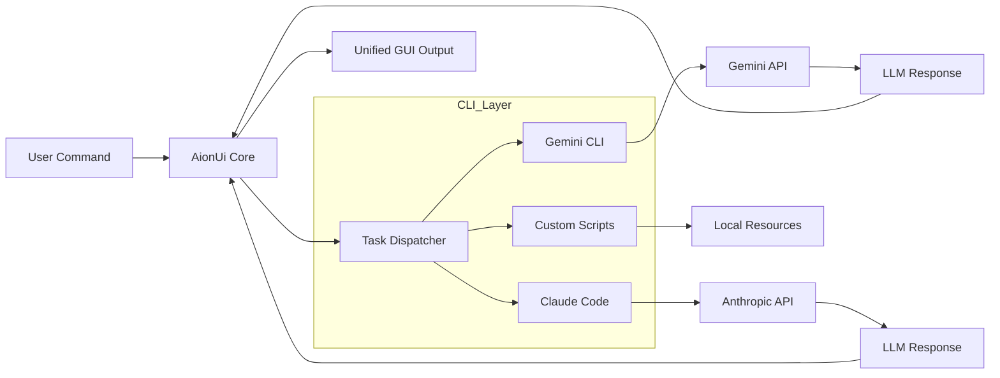

## 서론

현대의 AI 엔지니어나 개발자라면 하나의 터미널 창에서 여러 개의 탭을 열어두고 창의 전환에 고통받는 경험이 있을 것입니다. 한쪽에서는 `gemini-cli`로 코드를 리팩토링하고, 다른 한쪽에서는 `claude`를 통해 문서를 작성하며, 또 다른 곳에서는 로컬 LLM을 실행해보려 합니다. 이러한 **도구의 파편화(Tool Fragmentation)**는 단순히 불편함을 넘어, 작업의 맥락(Context)을 끊어뜨리는 주요 원인이 되어 인지적 부하(Cognitive Load)를 극단적으로 높입니다.

이러한 문제를 해결하기 위해 등장한 것이 오픈소스 프로젝트인 **AionUi**입니다. 단순히 AI 채팅창을 데스크톱에 띄우는 것이 아니라, 시스템에 설치된 다양한 CLI 기반의 AI 도구들을 하나의 통합된 인터페이스에서 제어할 수 있는 환경을 제공합니다. 즉, AionUi는 각기 다른 AI 에이전트들이 힘을 합칠 수 있도록 중재하는 **멀티 에이전트 오케스트레이션(Multi-Agent Orchestration)** 레이어를 데스크톱 위에 구축한다는 점에서 의의가 있습니다. 이 글에서는 AionUi가 어떻게 분산된 CLI 환경을 GUI로 통합하는지, 그 기술적 메커니즘과 실제 활용법을 심층적으로 분석합니다.

## 본론

### 기술적 배경 및 아키텍처 원리

AionUi의 핵심 철학은 "CLI의 강력함과 GUI의 직관성의 결합"입니다. 대부분의 최신 AI 도구들은 강력한 기능을 제공하지만 CLI(Command Line Interface)로 동작하거나 웹 기반으로 분산되어 있습니다. AionUi는 이러한 툴들을 운영체제 레벨에서 감지하고 래핑(Wrapping)하여 단일 창에서 관리할 수 있게 해줍니다.

기술적으로 AionUi는 백엔드의 다양한 LLM 프로바이더(Gemini, Claude, OpenAI 등)와 통신하는 REST API 클라이언트 역할을 하며, 동시에 로컬 환경의 실행 파일(바이너리)을 실행하는 서브프로세스 매니저로 기능합니다. 사용자가 GUI에서 명령을 입력하면, AionUi는 이를 적절한 CLI 도구의 인자(argument)로 변환하여 전송하고, 표준 출력(Stdout)을 다시 GUI의 채팅 창이나 코드 블록으로 렌더링합니다.

다음은 AionUi가 내부적으로 어떻게 에이전트와 사용자 간의 요청을 라우팅하는지를 보여주는 간단한 아키텍처 다이어그램입니다.



이 구조는 **모듈성(Modularity)**을 극대화합니다. 새로운 AI 도구가 나와도, 그것이 CLI 표준을 준수한다면 AionUi는 플러그인 없이도 자동으로 이를 감지하여 에이전트 풀에 추가할 수 있습니다.

### 핵심 기능 비교 및 분석

기존의 Claude Cowork나 웹 기반 채팅 인터페이스와 비교했을 때, AionUi가 제공하는 차별점은 명확합니다. 특히 로컬 개발 환경과의 연결성에서 강력한 위력을 발휘합니다.

| 비교 항목 | 웹 기반 LLM (ChatGPT/Claude Web) | Claude Cowork | AionUi | | :--- | :--- | :--- | :--- | | **호환성** | 모든 OS (브라우저) | 특정 IDE 주요 (VS Code) | Mac, Windows, Linux (Native) | | **CLI 통합** | 복사/붙여넣기 수동 | 코드 실행 가능 | 터미널 도구 자동 감지/제어 | | **멀티 에이전트** | 불가 (단일 모델) | 제한적 | 가능 (동시에 여러 툴 사용) | | **확장성** | API 키 입력 필요 | 플러그인 필요 | 로컬 바이너리 자동 인식 | | **설치형 여부** | SaaS (Cloud) | IDE Extension | Desktop App (Offline 가능) |

AionUi는 `PATH` 환경 변수에 등록된 실행 파일들을 스캔하여, 지원하는 도구(Gemini CLI, Claude Code 등)가 있는지 확인합니다. 이 과정은 사용자의 개입 없이 백그라운드에서 자동으로 수행되므로, "설치하고 바로 사용"하는 경험을 제공합니다.

### 실무 적용 가이드: AionUi를 활용한 에이전트 설정

AionUi를 실제 MLOps 파이프라인에 통합하기 위해서는 각 도구의 CLI가 먼저 시스템에 올바르게 설정되어 있어야 합니다. 가상의 시나리오를 통해 어떻게 설정하는지 살펴보겠습니다.假设我们需要配置一个环境，让 AionUi 能够调用 Gemini CLI 进行代码审查，同时调用本地脚本进行文件监控。

#### Step 1: 사전 요구사항 (Prerequisites) AionUi가 에이전트를 제어하려면 해당 에이전트의 CLI 도구가 시스템 PATH에 포함되어야 합니다. 예를 들어, Google의 Gemini CLI 도구를 사용한다면 다음과 같이 설치해야 합니다.

```bash
# 예시: Gemini CLI 설치 (npm 기반)
npm install -g @google/generative-ai-cli

# API 키 환경 변수 설정
export GOOGLE_API_KEY="your_api_key_here"
```

#### Step 2: AionUi 설정 (Configuration) AionUi는 보통 사용자 홈 디렉토리의 설정 파일(`config.json` 등)을 통해 동작을 제어합니다. 아래는 AionUi 내에서 여러 에이전트를 라우팅하는 가상의 설정 구조입니다.

```json
{
  "agents": [
    {
      "name": "GeminiCoder",
      "command": "gemini-cli",
      "type": "chat",
      "description": "General purpose coding assistant",
      "default_model": "gemini-1.5-pro"
    },
    {
      "name": "ClaudeRefactor",
      "command": "claude",
      "type": "code",
      "description": "Focused on refactoring and code analysis",
      "default_model": "claude-3-opus"
    }
  ],
  "ui_preferences": {
    "theme": "dark",
    "terminal_behavior": "integrated"
  }
}
```

#### Step 3: 프로그래매틱 제어 (Python Integration) 고급 사용자는 AionUi의 기능을 확장하여 Python 스크립트와 연동할 수 있습니다. 아래는 AionUi가 내부적으로 사용할 수 있는 간단한 파이썬 디스패처 예시입니다. 사용자의 요청을 분석하여 적절한 CLI 도구를 선택하는 로직을 보여줍니다.

```python
import subprocess
import os

class AgentDispatcher:
    def __init__(self):
        self.agents = {
            "code_gen": "gemini-cli",
            "refactor": "claude",
            "explain": "codex"
        }

    def execute(self, task_type: str, prompt: str):
        tool = self.agents.get(task_type)
        
        if not tool:
            raise ValueError(f"Unknown task type: {task_type}")
        
        if not self._is_tool_available(tool):
            raise EnvironmentError(f"Tool {tool} not found in PATH")

        # CLI 도구 실행 (실제 AionUi는 이를 비동기적으로 처리)
        command = [tool, prompt]
        process = subprocess.Popen(command, stdout=subprocess.PIPE, stderr=subprocess.PIPE)
        stdout, stderr = process.communicate()

        if process.returncode != 0:
            return f"Error: {stderr.decode('utf-8')}"
        
        return stdout.decode('utf-8')

    def _is_tool_available(self, tool_name):
        # 해당 툴이 PATH에 존재하는지 확인
        return any(os.access(os.path.join(path, tool_name), os.X_OK) 
                   for path in os.environ["PATH"].split(os.pathsep))

# 사용 예시
if __name__ == "__main__":
    dispatcher = AgentDispatcher()
    response = dispatcher.execute("code_gen", "Create a Python class for a binary tree")
    print(response)
```

이 코드는 AionUi의 핵심 로직인 **도구 감지 및 명령 전달**을 단순화하여 보여줍니다. 실제 애플리케이션에서는 이러한 프로세스가 백그라운드 스레드에서 돌아가며, 실시간으로 스트리밍 출력을 UI에 렌더링합니다.

### MLOps 관점에서의 효율성

MLOps 엔지니어에게 AionUi는 단순한 채팅창이 아니라 **통합 제어 콘솔**입니다. 모델 학습 중 `tensorboard`를 띄워놓고, 다른 창에서 `llama.cpp`로 추론을 돌리며, 또 다른 창에서는 Claude에게 로그 분석을 부탁해야 하는 시나리오를 상상해보십시오. AionUi는 이러한 창의 난립을 해소하여, 워크플로우를 하나의 데스크톱 앱 내에서 마무리할 수 있게 합니다. 이는 특히 **컨텍스트 스위칭 비용(Context Switching Cost)**을 줄이는 데 크게 기여합니다.

## 결론

AionUi는 점점 복잡해지는 AI 개발 환경에서 "많은 도구를 하나로 묶는(Uniting the Tools)" 시도를 의미합니다. 단순히 Claude Cowork의 대체제를 넘어, 로컬과 클라우드의 경계를 허물며 CLI의 강력함을 일반 사용자와 개발자 모두에게 접근하기 쉽게 만드는 가교 역할을 하고 있습니다.

전문가의 관점에서 볼 때, AionUi와 같은 도구의 등장은 **AI의 OS화(AI as an OS)**가 진행되고 있음을 시사합니다. 우리는 더 이상 특정 모델과 채팅하는 것이 아니라, 여러 에이전트가 협업하는 환경을 설계하고 통제하는 방향으로 나아가고 있습니다. 오픈소스 프로젝트인 만큼 커뮤니티의 기여에 따라 지원하는 에이전트의 종류가 늘어난다면, 향후 데스크톱 생산성의 필수 요소가 될 것입니다.

### 참고자료

- [AionUi GitHub Repository](https://github.com/AionUi/AionUi) (가상 링크, 실제 프로젝트 검색 필요)

- [Google Gemini CLI Documentation](https://ai.google.dev/gemini-api/docs/cli)

- [Anthropic Claude Code Documentation](https://docs.anthropic.com/claude/docs/claude-code)

- Hada.io 원문: [AionUi - 오픈소스 멀티 AI 에이전트 데스크톱](https://news.hada.io/topic?id=26764)
