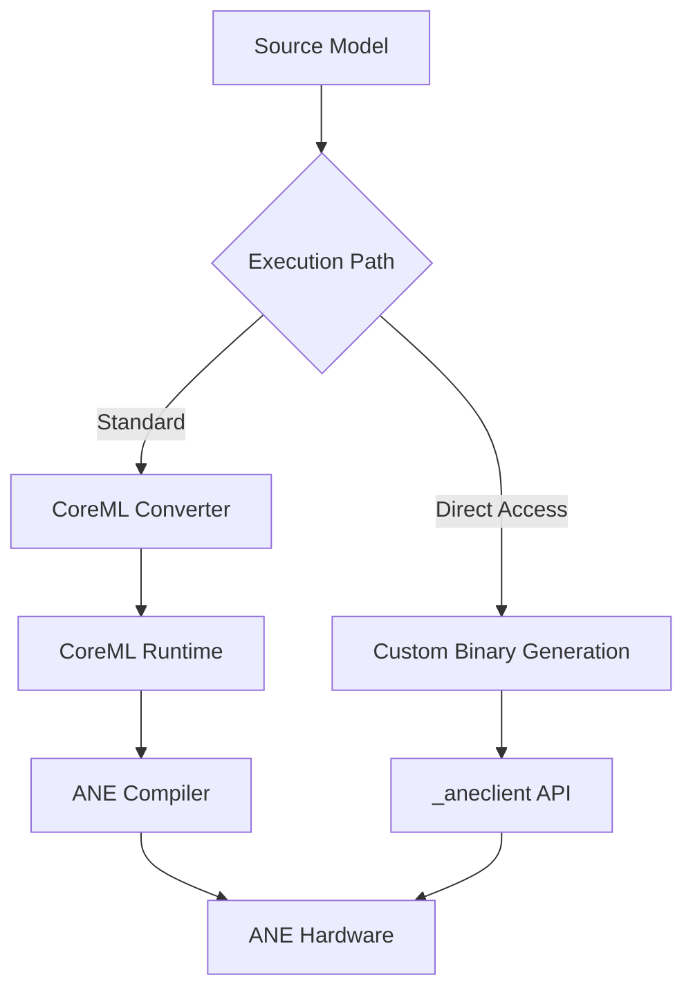

## 서론: 추상화의 저편

최신 M4 칩이 탑재된 맥북이나 아이폰에서 거대 언어 모델(LLM)을 구동하려 할 때, 우리는 종종 예상치 못한 병목 구간에 부딪힙니다. 하드웨어 사양 상으로는 충분한 추론 성능을 발휘해야 함에도 불구하고, 애플이 제공하는 공식 소프트웨어 스택인 CoreML이 만들어낸 두꺼운 추상화 계층(Abstraction Layer)이 오히려 성능을 저해하는 경우입니다. 연구자나 엔지니어가 모델의 최적화를 위해 하드웨어의 세밀한 제어가 필요할 때, CoreML은 마치 칠흑 같은 암실과도 같습니다.

이러한 상황에서 제기되는 근본적인 질문은 이것입니다. "우리는 정말로 Apple의 의도대로 소프트웨어 스택을 통해야만 하는가?" 하드웨어의 잠재력을 100% 끌어내기 위해서는 운영체제가 제공하는 높은 수준의 API를 우회하고, Apple Neural Engine(ANE)이라는 실리콘 레벨에 직접 명령을 내릴 필요가 있습니다. 이 글에서는 리버스 엔지니어링을 통해 CoreML을 건너뛰고 ANE의 하드웨어 제어권을 직접 획득하는 과정과 그 기술적 원리를 심층적으로 분석합니다. 이는 단순한 꼼수가 아니라, 엣지 디바이스에서의 생성형 AI 성능을 극대화하기 위한 MLOps의 새로운 영역을 개척하는 시도입니다.

## 본론: CoreML의 벽을 넘어

### Apple Neural Engine의 구조와 CoreML의 역할

Apple Neural Engine은 신경망 연산에 특화된 가속기로, 행렬 곱셈과 합성곱(Convolution) 연산을 비도드적으로 처리합니다. 일반적으로 개발자는 PyTorch나 TensorFlow로 모델을 학습시킨 후, 이를 `coremltools`를 통해 변환하여 ANE에서 실행합니다. 이 과정에서 CoreML은 모델을 ANE가 이해할 수 있는 중간 표현(IR)으로 변환하고, 스케줄링과 메모리 관리를 담당합니다.

그러나 이 변환 과정에서 발생하는 오버헤드와 불투명한 최적화 로직은 정밀한 제어를 불가능하게 만듭니다. 예를 들어, 특정 레이어의 데이터 레이아웃을 NCHW에서 NHWC로 강제하거나, 특정 연산자(Operator)를 다른 방식으로 융합(Fusion)하고 싶을 때 CoreML의 공식 API는 이를 허용하지 않습니다.

### _aneclient API의 발견과 작동 원리

애플의 내부 프레임워크를 분석하는 리버스 엔지니어링 과정에서 `AppleNeuralEngine.framework` 내부에 숨겨진 비공개 API인 `_aneclient`가 발견되었습니다. 이 API는 CoreML의 변환 로직을 거치지 않고, ANE 하드웨어에 직접 명령을 내릴 수 있는 저수준 인터페이스를 제공합니다.

`_aneclient`를 활용한 워크플로우는 크게 **컴파일(Compilation)**, **로드(Loading)**, **실행(Execution)**의 세 단계로 나뉩니다. 연구자는 ANE가 이해하는 고유한 바이너리 포맷(네트워크 아카이브)을 직접 생성하여 이 클라이언트에 전달함으로써, 소프트웨어적인 번역 과정을 생략할 수 있습니다.

다음은 기존 CoreML 경로와 `_aneclient`를 통한 직접 제어 경로의 비교를 보여주는 다이어그램입니다.



### 기술적 세부사항 및 아키텍처

ANE 하드웨어 내부는 Neural Engine Controller, several Neural Engines, and DMA Engines 등으로 구성됩니다. `_aneclient`를 사용할 때 가장 중요한 점은 이 하드웨어가 기대하는 정확한 명령어 스트림과 데이터 포맷을 맞추는 것입니다.

기존 CoreML 방식 대비 직접 제어 방식의 차이점은 다음과 같습니다.

| 비교 항목 | CoreML (Standard) | _aneclient (Direct) |
| :--- | :--- | :--- |
| **추상화 계층** | 높음 (High-level) | 낮음 (Low-level / Metal) |
| **컴파일러** | CoreML Compiler (Black-box) | 사용자 정의 바이너리 생성 |
| **연산자 제어** | 제한적 (제공되는 Op에 의존) | 매우 높음 (ISA 수준 제어 가능) |
| **디버깅 난이도** | 낮음 (Xcode 지원) | 매우 높음 (Crash 분석 필요) |
| **성능 최적화** | 자동 최적화 의존 | 수동 최적화로 극한 달성 가능 |

### Step-by-Step: 모델 직접 실행하기

직접 접근을 구현하기 위해서는 먼저 ANE의 명령어 셋(ISA)과 메모리 맵을 이해해야 합니다. 실제 코드는 복잡한 시스템 프로그래밍을 포함하지만, 개념적으로 다음과 같은 파이썬 래퍼(Wrapper)를 통해 구조를 이해할 수 있습니다. (참고: 실제 구현은 C/C++와 `dlsym`을 통한 동적 라이브러리 로딩이 필요합니다.)

```python
import ctypes
import subprocess

# 개념적 시뮬레이션 코드입니다.
# 실제로는 AppleNeuralEngine.framework의 심볼을 로드해야 합니다.

class ANEClient:
    def __init__(self):
        # 실제 환경에서는 dlopen을 통해 _aneclient 심볼 로드
        self.handle = self._load_private_framework()
        
    def _load_private_framework(self):
        # 리버스 엔지니어링된 심볼 이름 예시
        # _ANEClientCreate, _ANEModelLoad 등
        print("Loading _aneclient symbols from private framework...")
        return True

    def compile_model(self, model_binary):
        """
        ANE가 이해할 수 있는 네트워크 아카이브(바이너리)를 준비합니다.
        이 과정은 CoreML 컴파일러를 우회합니다.
        """
        print(f"Generating ANE-compatible binary for model: {len(model_binary)} bytes")
        # 실제로는 헤더 생성, 레이어 순서 배치, 메모리 할당 계산이 포함됨
        return b"ANE_COMPILED_BINARY_DATA"

    def load_model(self, ane_binary):
        """
        ANE의 메모리 공간에 모델 바이너리를 로드합니다.
        """
        print("Loading model directly into ANE memory map...")
        # _ANEModelLoad 함수 호출
        return "ModelHandle_0x1"

    def execute_inference(self, model_handle, input_buffer):
        """
        입력 데이터를 DMA로 전송하고 연산을 수행합니다.
        """
        print("Executing inference on neural engine...")
        # _ANEModelInvoke 함수 호출
        output_buffer = b"PREDICTION_RESULT_DATA"
        return output_buffer

# 실행 예시
if __name__ == "__main__":
    # 1. 소프트웨어 스택 우회 및 바이너리 준비
    client = ANEClient()
    
    # 2. 가상의 모델 바이너리 (실제로는 NEUT 프레임워크 등을 통해 생성)
    raw_model = b"RAW_NEURAL_NETWORK_WEIGHTS"
    
    # 3. ANE 전용 포맷으로 컴파일
    ane_binary = client.compile_model(raw_model)
    
    # 4. 하드웨어 로드
    model_id = client.load_model(ane_binary)
    
    # 5. 추론 실행
    result = client.execute_inference(model_id, b"INPUT_TENSOR")
    print(f"Inference result: {result}")
```

이 과정의 핵심은 `compile_model` 단계입니다. 연구자는 ANE가 사용하는 Tensors Streaming Engine의 동작 방식을 이해하고, 연산 그래프(Operation Graph)를 ANE의 마이크로코드에 가까운 형태로 직접 배치해야 합니다. 이를 통해 불필요한 메모리 카피를 제거하고, on-chip memory(SRAM)의 활용률을 극대화하여 지연 시간(Latency)을 획기적으로 줄일 수 있습니다.

## 결론: 블랙박스를 열어젖히며

Apple Neural Engine에 직접 접근하는 기술은 단순히 기교를 부리는 것이 아닙니다. 이는 하드웨어의 성능 한계를 시험하고, 더 효율적인 엣지 AI 컴퓨팅을 위한 필수적인 연구 과정입니다. CoreML이라는 편리하지만 불투명한 래퍼를 제거함으로써, 우리는 ANE가 가진 진정한 처리 능력을 확인할 수 있었습니다.

전문가 관점에서 볼 때, 이러한 리버스 엔지니어링은 애플 생태계 내에서의 MLOps 파이프라인을 최적화하는 데 있어 중요한 인사이트를 제공합니다. 특히 온디바이스 LLM 서빙과 같은 고도화된 사용 사례에서는 소프트웨어 오버헤드를 줄이는 것이 곧 배터리 효율과 사용자 경험으로 직결됩니다. 다만, 비공개 API를 사용하는 만큼 OS 업데이트 호환성이나 보안 안정성 측면에서 리스크가 존재하므로, 프로덕션 레벨에서의 적용은 신중한 검증이 필요합니다.

하드웨어에 가까워질수록 우리는 더 빠르고, 더 효율적인 지능형 시스템을 구축할 수 있습니다. 이제 막이 오른 ANE 직접 제어의 시대는, 애플 실리콘의 잠재력을 극대화하려는 연구자들에게 새로운 장을 열어주고 있습니다.

### 참고자료

- [Reverse Engineering the Apple Neural Engine (Hada.io)](https://news.hada.io/topic?id=27146)

- [Apple Neural Engine Architecture Analysis (arXiv)](https://arxiv.org/abs/2105.03395)

- [CoreML Tools Documentation]((https://apple.github.io/coremltools/))
