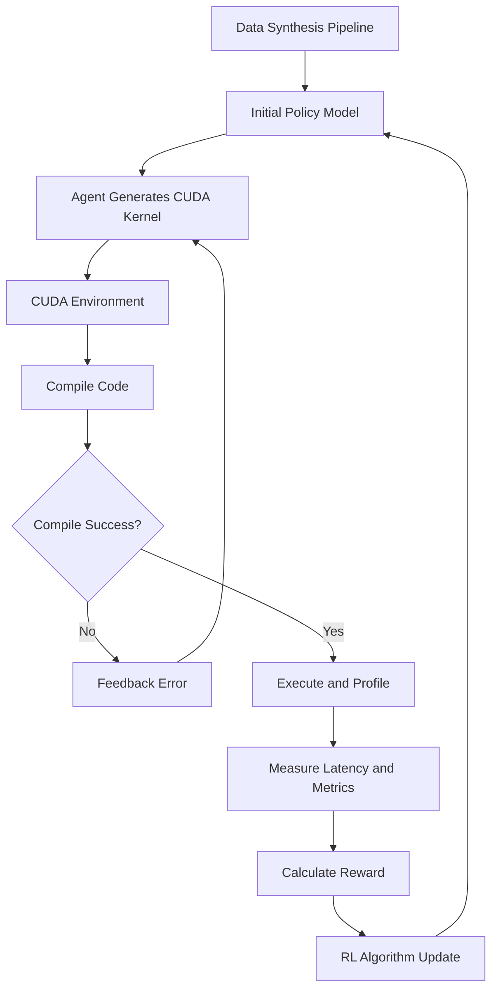

## 서론

최신 LLM(대규모 언어 모델)을 학습시키거나 추론하는 과정에서 연구자들이 마주하는 가장 큰 병목 현상 중 하나는 하드웨어 성능을 100% 활용하지 못한다는 점입니다. 수십억 달러 규모의 GPU 클러스터를 구축했음에도 불구하고, 불필요한 메모리 접근이나 비효율적인 워프 스케줄링으로 인해 실제 연산 속도는 이론상의 절반에도 미치지 못하는 경우가 허다합니다. 우리는 모델 아키텍처나 학습 알고리즘을 개선하는 데에는 막대한 노력을 쏟지만, 정작 연산을 수행하는 가장 낮은 단계인 **CUDA Kernel** 최적화에는 여전히 '전문가의 경험'에 의존하고 있습니다.

기존의 LLM들은 일반적인 코딩 능력에서는 놀라운 성과를 보였지만, CUDA와 같은 시스템 프로그래밍 분야에서는 `torch.compile`과 같은 전통적인 컴파일러 기반 최적화 도구에 비해 성능이 뒤처지는 것이 현실입니다. 이는 LLM이 텍스트 패턴을 학습할 뿐, GPU의 하드웨어적 특성(메모리 뱅크, 레지스터 사용량 등)을 내면화하지 못했기 때문입니다. 단순히 코드를 생성하게 하거나, 피드백을 몇 번 반복하는 것으로는 이 근본적인 한계를 극복할 수 없습니다.

이러한 문제를 해결하기 위해 강화 학습(Reinforcement Learning)과 에이전트 시스템을 결합한 새로운 접근법인 **CUDA Agent**가 제안되었습니다. 이 시스템은 LLM이 마치 숙련된 CUDA 엔지니어처럼 '경험'을 통해 학습할 수 있도록 설계되었으며, 단순한 코드 생성을 넘어 컴파일러조차 내지 못하는 최적화된 커널을 자율적으로 탐색해냅니다. 이 글에서는 CUDA Agent가 어떻게 하드웨어의 물리적 제약을 이해하고 초고성능 코드를 생성하는지 그 기술적 메커니즘을 심층적으로 분석합니다.

## 본론

### 기술적 배경 및 원리

CUDA Agent의 핵심 혁신은 LLM이 "CUDA 코드를 쓰는 것"에서 끝나는 것이 아니라, **"컴파일, 실행, 프로파일링을 통해 성능을 보상(Reward)으로 받고 정책을 업데이트하는 순환 과정"**을 거친다는 점입니다. 기존의 SFT(Supervised Fine-Tuning) 방식은 정답 코드(혹은 더 나은 코드)를 모방하게 하지만, 정답이 없는 최적화 문제에서는 한계가 명확합니다.

이 시스템은 크게 세 가지 컴포넌트로 구성됩니다.
1.  **대규모 데이터 합성 파이프라인**: 고품질의 CUDA 코드 쌍(Naive vs Optimized)을 자동으로 생성하여 학습의 기초를 다집니다.
2.  **스킬 증강형 CUDA 환경**: 모델이 작성한 코드를 실제로 컴파일하고, Nsight Compute와 같은 프로파일러를 통해 실행 시간과 메트릭을 측정하여 정확한 보상 신호를 제공합니다.
3.  **에이전트 RL 알고리즘**: 불안정한 학습을 안정화시키면서 모델이 스스로 최적화 전략을 발견하도록 유도합니다.

### 시스템 아키텍처

다음은 CUDA Agent가 작동하는 전체적인 흐름을 도식화한 것입니다. 이 다이어그램은 데이터 합성부터 강화 학습을 통한 모델 개선의 순환 구조를 보여줍니다.



이 아키텍처의 핵심은 **Environment**와 **RL Update** 단계입니다. 모델은 단순히 텍스트를 완성하는 것이 아니라, 자신의 행동(코드 생성)이 환경(GPU)에서 어떤 결과(속도 향상)를 가져오는지를 직접 경험하며 학습합니다.

### 상세 구현 및 코드 예시

이 시스템이 실제로 어떻게 작동하는지 이해하기 위해, Python 환경에서 CUDA 커널을 컴파일하고 실행 시간을 측정하여 보상 신호를 계산하는 과정을 간단하게 시뮬레이션한 코드를 살펴보겠습니다. 실제 연구에서는 이 과정이 PyTorch와 Nsight Compute API와 연동되어 대규모로 수행됩니다.

```python
import torch
import time

class CudaEnvironment:
    def __init__(self):
        # GPU 상태 확인 및 초기화
        self.device = torch.device('cuda')
        
    def compile_and_execute(self, kernel_source, input_size):
        """
        에이전트가 생성한 CUDA 소스를 컴파일(JIT)하고 실행하여 속도를 측정합니다.
        실제 환경에서는 torch.cuda.jit._compile 또는 NVRTC를 사용합니다.
        """
        try:
            # 예시를 위해 간단한 torch 연산으로 CUDA 커널 실행을 시뮬레이션합니다.
            # 실제 연구에서는 문자열로 된 kernel_source를 C++/CUDA 컴파일러로 전송합니다.
            x = torch.randn(input_size, device=self.device)
            
            # 워밍업
            for _ in range(10):
                _ = torch.matmul(x, x)
            
            # 실제 측정
            torch.cuda.synchronize()
            start = time.time()
            
            # 여기에 Agent가 생성한 최적화 커널이 실행됩니다.
            # 예: output = custom_optimized_matmul(x, x)
            output = torch.matmul(x, x) 
            
            torch.cuda.synchronize()
            elapsed_time = time.time() - start
            
            # 보상 계산 (기준 Baseline 대비 속도 향상률)
            baseline_time = 0.005 # 가상의 baseline 실행 시간
            reward = max(0, baseline_time - elapsed_time) / baseline_time
            
            return True, reward, elapsed_time
            
        except Exception as e:
            # 컴파일 에러 또는 런타임 에러 발생 시
            return False, -1.0, 0

# 시뮬레이션 실행
env = CudaEnvironment()

# 가상의 Agent가 생성한 "나쁜" 커널 (시뮬레이션)
# 실제로는 문자열로 된 CUDA C 코드가 들어갑니다.
print("Step 1: Naive Kernel Execution")
success, reward, exec_time = env.compile_and_execute("naive_kernel", 4096)
print(f"Success: {success}, Reward: {reward:.4f}, Time: {exec_time:.6f}s")

# 가상의 Agent가 학습 후 생성한 "좋은" 커널 (더 빠른 연산 가정)
print("
Step 2: Optimized Kernel Execution")
# 간단히 input_size를 줄여 속도 향상을 시뮬레이션 (실제로는 알고리즘 개선)
success, reward, exec_time = env.compile_and_execute("optimized_kernel", 2048) 
print(f"Success: {success}, Reward: {reward:.4f}, Time: {exec_time:.6f}s")
```

위 코드는 개념적인 예시이지만, CUDA Agent의 핵심인 **보상 신호(Reward)의 정의**를 보여줍니다. 성능이 느리면 보상이 0에 수렴하거나 음수가 되며, 성능이 빠를수록 양의 보상을 받아 모델의 파라미터가 그 방향으로 업데이트됩니다.

### 성능 비교 및 벤치마크 결과

CUDA Agent는 업계 표준 벤치마크인 **KernelBench**에서 기존 방법들을 압도했습니다. KernelBench는 난이도에 따라 Level 1(단순)부터 Level 3(매우 복잡)까지 구분되어 있습니다. 아래 표는 CUDA Agent와 기존의 주요 방법들의 Geomean Speedup(기준 대비 빨라진 배수)을 비교한 것입니다.

| 모델 / 방법 | KernelBench L1 | KernelBench L2 | KernelBench L3 | 특징 |
| :--- | :--- | :--- | :--- | :--- |
| **Torch.compile** (Baseline) | 1.0x | 1.0x | 1.0x | PyTorch 내장 컴파일러, 안정적이나 최적화 한계 존재 |
| **Claude Opus 4.5** | 낮음 | 중간 | 낮음 | 최상용 SOTA LLM, 일반 코딩에 강력하나 CUDA 최적화 약함 |
| **Gemini 3 Pro** | 낮음 | 중간 | 낮음 | 구글의 최신 모델, 코드 생성 능력은 우수하나 하드웨어 이해 부족 |
| **기존 LLM + Refinement** | 1.2x | 1.1x | 0.9x | 반복적인 피드백으로 수정하나, 성능 향상에 한계 |
| **CUDA Agent (Ours)** | **2.0x** | **2.0x** | **1.92x** | **RL 기반 자율 최적화, 전 수준에서 압도적 성능** |

- **Level 1 & 2**: `torch.compile` 대비 **100% 더 빠른** 성능을 보여주며, 컴파일러가 놓치는 휴리스틱을 찾아냈습니다.

- **Level 3**: 가장 어려운 설정에서도 `torch.compile` 대비 **92% 빠르며**, Claude Opus 3.5나 Gemini 3 Pro 같은 최신 상용 모델보다 **약 40%** 높은 속도를 기록했습니다.

### Step-by-Step: CUDA Agent 학습 가이드

연구자들이 이 접근 방식을 실제 프로젝트에 적용하기 위해 고려해야 할 단계는 다음과 같습니다.

1.  **정책 모델(Policy Model) 선정**: CUDA 문법에 대한 사전 지식이 있는 모델(예: CodeLlama, DeepSeek Coder)을 베이스로 선택합니다.
2.  **환경(Environment) 구축**:     *   NVIDIA Nsight Compute를 연동하여 FLOPs, Memory Bandwidth, L1/L2 Cache Hit Rate 등 하드웨어 카운터를 수집할 수 있는 래퍼를 만듭니다.     *   코드 수정마다 컴파일 시간이 소요되므로, 캐싱 전략을 수립합니다.
3.  **보상 함수 설계**:     *   단순히 실행 시간(Total Latency)만 줄이는 것이 아니라, `Latency + penalty_for_compilation_error + penalty_for_wrong_result` 형태로 설계하여 모델이 맹목으로 속도만 높이려다 결과를 틀리지 않도록 제약을 겁니다.
4.  **강화 학습(RL) 진행**:     *   PPO(Proximal Policy Optimization)나 REINFORCE 알고리즘을 사용하여, 높은 보상(빠른 커널)을 생성한 토큰 시퀀스의 확률을 높입니다.
5.  **평가 및 검증**:     *   학습된 모델이 생성한 커널의 정확성(NumPy/Torch 결과와의 일치 여부)을 100% 보장해야 합니다.

## 결론

CUDA Agent는 LLM이 단순한 텍스트 생성기를 넘어, 하드웨어의 물리적 한계를 이해하고 최적화 전략을 세우는 **'시스템 옵티마이저(System Optimizer)'**로 진화할 수 있음을 입증했습니다. 이 연구는 단순히 "더 빠른 코드"를 만드는 것을 넘어, 복잡한 하드웨어 특성을 모델이 내면화(Integrate)할 수 있는 **Agentic RL 프레임워크**의 가능성을 열었다는 점에서 의의가 큽니다.

전문가의 관점에서 볼 때, 이 기술은 향후 MLOps 파이프라인의 필수적인 요소가 될 가능성이 높습니다. 사용자가 복잡한 CUDA C++ 코드를 직접 작성하는 대신, Python 레벨의 의도만 선언하면 Agent가 실제 하드웨어에 맞춰 최적화된 커널을 실시간으로 생성해주는 'On-the-fly Kernel Optimization' 시대가 도래할 수 있습니다.

또한, 이 접근법은 CUDA에 국한되지 않습니다. Triton, Metal, 혹은 추후 등장할 가속기 하드웨어의 최적화 문제에도 동일하게 적용될 수 있습니다. LLM과 RL의 결합, 그리고 자동화된 검증 환경은 AI가 소프트웨어 2.0의 모든 스택을 제어하는 미래를 앞당기고 있습니다.

**참고자료:**

- [CUDA Agent: Large-Scale Agentic RL for High-Performance CUDA Kernel Generation (arXiv:2602.24286)](http://arxiv.org/abs/2602.24286v1)

- [KernelBench GitHub Repository](https://github.com/foundation-model-stack/kernelbench)
