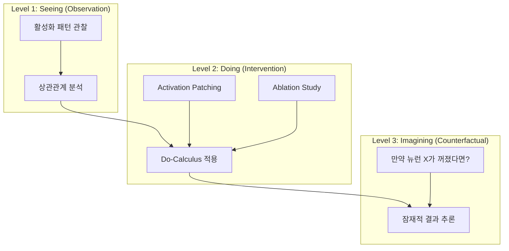

## 서론

최근 대규모 언어 모델(LLM)의 내부 작동 원리를 파악하려는 해석 가능성(Interpretability) 연구가 활발히 진행되고 있습니다. 연구자들은 특정 뉴런이 "감정"을 담당한다거나, 특정 회로가 "사실 추론"을 수행한다는 주장을 늘어놓습니다. 그러나 이러한 발견이 다른 데이터셋이나 모델로 넘어가면 금방 사라지는 경험을 한 적이 있으신가요?

이는 심각한 **'일반화의 위기'**입니다. 많은 해석 가능성 연구가 단순한 상관관계(Observation)에 기반하고 있기 때문입니다. "이 뉴런이 불타오를 때 발화한다"는 사실이 "이 뉴런이 불을 의미한다"는 것을 증명하지 않습니다. 이러한 관찰적 연관성은 모델의 행동을 예측하기보다 우연의 일치일 가능성이 높으며, 분포가 바뀌는 OOD(Out-of-Distribution) 상황에서는 무력해집니다.

진정한 해석 가능성을 위해서는 "보는 것(Observation)"에서 "하는 것(Intervention)"으로 나아가야 합니다. 이것이 최신 arXiv 논문 *"Causality is Key for Interpretability Claims to Generalise"*가 제기하는 핵심 메시지입니다. 우리는 인과 추론(Causal Inference)의 틀을 도입하여, 모델의 활성화(Activation)가 고차원의 구조적 원인과 어떻게 매핑되는지를 엄밀하게 정의해야 합니다. 이 글에서는 Pearl의 인과 계층 구조를 중심으로, LLM 해석 연구가 겪는 한계를 극복하고 일반화 가능한 통찰을 얻기 위한 구체적인 방법론을 살펴봅니다.

## 본론

### Pearl의 인과 계층 구조와 LLM 해석의 3단계

LLM 해석 연구에서 주장의 타당성을 검증하기 위해 Judea Pearl의 인과 계층 구조(Ladder of Causality)를 적용할 수 있습니다. 이 구조는 우리가 모델에서 무엇을 알 수 있는지, 그리고 어떤 증거가 필요한지를 명확히 구분해 줍니다.

다음은 LLM 해석에 적용된 인과 계층의 다이어그램입니다.



이 계층 구조는 단순한 관찰에서 시작해 인과적 개입을 거쳐 반사실적 추론으로 나아갑니다. 각 단계가 의미하는 것과 기술적 깊이는 다음과 같습니다.

#### 1단계: 연관성 (Association) - "보는 것" 대부분의 기존 연구는 이 단계에 머물러 있습니다. 특정 입력 프롬프트에서 모델 내부 특정 레이어의 활성화 값(Residual Stream, Attention Head 등)을 측정하고, 이를 출력 확률과 비교합니다.

- **기술적 한계**: $P(Y|X)$ 형태의 상관관계만을 보여줍니다. "X(활성화)가 있을 때 Y(출력)가 증가한다"는 사실은 X가 Y의 원인일 수도, 아니면 공통 원인(Z)의 결과일 수도 있습니다.

- **실무적 함의**: 데이터셋에 편향이 존재하면, 모델이 편향을 학습한 것이 아니라 뉴런이 단순히 스파이크(Spike)를 쳤을 수도 있습니다.

#### 2단계: 개입 (Intervention) - "하는 것" 이 단계가 인과적 해석의 핵심입니다. 모델의 내부 상태를 인위적으로 변경하고 그 결과를 관찰합니다.

- **기술적 메커니즘**: `do-calculus`를 적용하여, $P(Y | do(X))$를 추정합니다. Transformer에서는 **Activation Patching** 또는 **Ablation** 기법이 여기에 해당합니다. 예를 들어, "사랑(Love)"이라는 단어가 포함된 문맥에서 특정 뉴런의 활성화를 지우고, 이를 "미움(Hate)" 문맥에서 가져온 활성화로 교체(Patching)하여 모델의 예측이 바뀌는지 확인합니다.

- **일반화 가능성**: 개입을 통해 변하지 않는(Invariant) 관계를 발견하면, 그 관계는 단순한 상관관계가 아닌 인과적 메커니즘일 가능성이 높습니다.

#### 3단계: 반사실 (Counterfactual) - "상상하는 것" "만약 이 뉴런이 없었다면, 모델은 이전과 완전히 다른 답을 내놓았을까?"와 같은 질문입니다.

- **기술적 난이도**: LLM의 고차원 비선형성 때문에 가상의 개입(Virtual Intervention)을 통한 잠재적 결과를 추론하기 매우 어렵습니다. 완전한 통제 하에 supervision이 없다면 이를 검증하기 거의 불가능합니다.

### 기존 방식 vs 인과적 해석 방식 비교

단순한 관찰 기반 해석과 인과적 개입 기반 해석의 차이를 명확히 이해해야 합니다. 아래 표는 두 접근 방식의 특성을 대조합니다.

| 비교 항목 | 기존 관찰 기반 해석 (Observational) | 인과적 개입 해석 (Causal Intervention) |
| :--- | :--- | :--- |
| **핵심 질문** | 이 뉴런은 언제 활성화되는가? | 이 뉴런을 끄면 모델 성능이 어떻게 변하는가? |
| **적용 기법** | Correlation Analysis, Probing Classifiers | Activation Patching, Ablation, Intervention |
| **일반화 성능** | 낮음 (Dataset Bias에 취약) | 높음 (Invariant Structure 발견 가능) |
| **검증 난이도** | 쉬움 (Forward Pass만 가능) | 어려움 (Hooking 및 Gradient 계산 필요) |
| **Pearl의 계층** | Level 1 (Association) | Level 2 (Intervention) |

### Causal Representation Learning (CRL)을 통한 실무 적용

이론적인 인과 계층을 실제 모델에 적용하기 위해서는 **Causal Representation Learning (CRL)**을 활용해야 합니다. CRL은 모델의 관측 가능한 활성화(Observations)로부터 잠재적인 인과 구조(Latent Causal Variables)를 복원하는 것을 목표로 합니다.

이를 위해서는 **Step-by-step**으로 다음 프로세스를 수행해야 합니다.

1.  **Structural Causal Model (SCM) 정의**: 모델의 레이어들 간의 의존 구조를 가설로 설정합니다. (예: Attention Layer -> MLP Layer -> Residual Stream)
2.  **Intervention Target 선정**: 개입할 특정 노드(뉴런, 헤드, 레이어)를 선택합니다.
3.  **Invariant Mechanism 검증**: 다양한 입력 분포(Intervention Distribution)에 대해 개입을 수행했을 때, 특정 변수의 효과가 일관되게 나타나는지 확인합니다.

#### 코드 예시: PyTorch를 이용한 Activation Patching

아래 코드는 HuggingFace Transformers와 PyTorch를 사용하여, 소스 문맥(Context A)에서의 활성화를 타겟 문맥(Context B)으로 주입(Patching)하는 인과적 개입 실험의 예시입니다.

```python
import torch
from transformers import AutoModelForCausalLM, AutoTokenizer

model_name = "gpt2-medium"
tokenizer = AutoTokenizer.from_pretrained(model_name)
model = AutoModelForCausalLM.from_pretrained(model_name)
model.eval()

# Hook을 통해 특정 레이어의 활성화를 저장하고 수정하기 위한 변수
activations = {}
def get_activation(name):
    def hook(model, input, output):
        activations[name] = output[0].detach() # (batch, seq_len, hidden_dim)
    return hook

# 타겟 레이어에 Hook 등록 (예: transformer.h.5)
target_layer = model.transformer.h[5]
handle = target_layer.register_forward_hook(get_activation('layer5'))

# 1. 소스 문맥 (Context A) 실행 - 저장할 활성화 추출
prompt_src = "The capital of France is"
inputs_src = tokenizer(prompt_src, return_tensors="pt")
with torch.no_grad():
    _ = model(**inputs_src)
    # 소스에서의 residual stream activation 저장
    src_activation = activations['layer5'].clone()

# 2. 타겟 문맥 (Context B) 실행 - 개입 수행
prompt_tgt = "The capital of Korea is"
inputs_tgt = tokenizer(prompt_tgt, return_tensors="pt")

# 개입(Intervention) 함수 정의
def intervention_hook(module, input, output):
    # output[0]은 hidden_states 입니다.
    # 특정 시점의 residual stream을 소스 활성화로 교체(Patching)
    # 예: 마지막 토큰 위치에 대해 소스의 마지막 토큰 활성화를 주입
    output[0][:, -1, :] = src_activation[:, -1, :]
    return output

# Hook 교체 (기존 저장 Hook 제거 후, 개입 Hook 등록)
handle.remove()
patch_handle = target_layer.register_forward_hook(intervention_hook)

with torch.no_grad():
    outputs_tgt = model(**inputs_tgt)
    
# 결과 분석
predicted_token_id = torch.argmax(outputs_tgt.logits[:, -1, :]).item()
predicted_token = tokenizer.decode([predicted_token_id])

print(f"Target Prompt: {prompt_tgt}")
print(f"Predicted Token after Patching: {predicted_token}")
# 만약 "Paris"가 나온다면, 해당 레이어의 정보가 위치 결정에 인과적으로 작동함을 입증

patch_handle.remove()
```

이 코드는 소스 문맥(프랑스)의 정보를 타겟 문맥(한국)에 강제로 주입하여, 모델의 예측이 프랑스의 수도(Paris)로 바뀌는지 확인합니다. 이는 해당 레이어가 위치 정보를 인과적으로 제어하는지를 검증하는 강력한 방법입니다.

## 결론

LLM 해석 가능성 연구는 이제 단순히 "어떤 뉴런이 켜지는지"를 관찰하는 단계를 넘어섭니다. **인과 추론(Causal Inference)**은 우리의 연구 주장이 데이터나 모델의 특정 구성에 국한되지 않고 일반화될 수 있도록 보장하는 엄격한 틀을 제공합니다.

Pearl의 인과 계층 구조를 통해 우리는 **관찰(Observation)**으로부터 시작하여 **개입(Intervention)**을 거쳐 검증된 주장만을 유효한 인과적 지식으로 받아들여야 합니다. 특히 Activation Patching과 같은 개입 기법과 Causal Representation Learning(CRL)은 블랙박스 모델 속에서 불변하는 구조(Invariant Structure)를 발견하는 데 필수적인 도구입니다.

앞으로의 연구자들은 단순히 상관관계를 보여주는 그래프를 넘어, "내가 이 뉴런을 조작했을 때 모델의 행동이 왜, 그리고 어디까지 변하는가?"에 대한 인과적 다이어그램을 제시해야 합니다. 이것이야말로 LLM을 안전하고 효율적으로 제어할 수 있는 true MLOps의 길입니다.

### 참고자료

- **Pearl, J., & Mackenzie, D.** (2018). *The Book of Why: The New Science of Cause and Effect*.

- **Vig, J., & Belinkov, Y.** (2019). *Analyzing the Structure of Attention in a Transformer Language Model*. (ACL Workshop)

- **Original Paper**: [Causality is Key for Interpretability Claims to Generalise](http://arxiv.org/abs/2602.16698v1)
