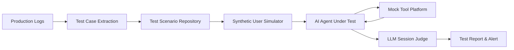

## 서론

대규모 언어 모델(LLM)을 기반으로 한 AI 에이전트를 실제 프로덕션 환경에 배포하는 과정을 생각해 봅시다. 은행 고객을 위한 자동 음성 비서가 있다고 가정했을 때, 사용자가 계좌 이체를 요청하면 에이전트는 본인 확인을 위해 이름, 생년월일, 전화번호를 순차적으로 질문해야 합니다. 그러나 프롬프트를 조금 수정하거나 모델을 업데이트한 후, 에이전트가 생년월일 확인을 건너뛰고 바로 이체 절차를 진행하는 치명적인 논리적 오류가 발생할 수 있습니다.

이러한 버그는 단일 턴(Single Turn)에서는 드러나지 않습니다. "주소를 확인하시겠습니까?"라는 질문 자체는 문법적으로도 올바르고 문맥상으로도 나쁘지 않아 보이기 때문입니다. 문제는 '본인 확인'이라는 **세션 레벨(Session-Level)의 흐름**이 깨졌다는 점입니다. 기존의 Langfuse나 LangSmith 같은 트레이싱(Tracing) 도구들은 각 턴의 개별 로그를 디버깅하는 데에는 탁월하지만, 이처럼 대화 전체의 맥락에서 발생하는 눈에 보이지 않는 논리적 결함을 포착하기에는 한계가 있습니다.

실제로 AI 에이전트 개발자들이 겪는 가장 큰 고통은 "변경 사항이 다른 부분을 망가뜨리지 않았음을 어떻게 보장할까?"입니다. 수동 QA는 확장성이 없고, 사용자의 불만 사항을 기다리는 것은 너무 늦습니다. 우리는 확률적(Stochastic)인 특성을 가진 LLM을 어떻게 하면 결정론적(Deterministic)인 소프트웨어처럼 테스트하고 모니터링할 수 있을까요? 이 글에서는 시뮬레이션 기반 테스팅과 세션 레벨 평가를 통해 이 문제를 해결하려는 접근 방식을 기술적으로 분석해 보고자 합니다.

## 본론

### 트레이싱의 한계와 세션 레벨 평가의 필요성

기존 MLOps 관점에서 LLM 애플리케이션을 모니터링할 때는 주로 단일 API 호출이나 프롬프트-응답 쌍에 집중했습니다. 하지만 에이전트(Agent)는 상태를 유지하고 도구(Tool)를 호출하며 복잡한 의사결정을 내리는 시스템입니다. 따라서 평가의 단위를 '턴'에서 '세션'으로 확장해야 합니다.

예를 들어, 사용자가 본인 확인에 실패했음에도 에이전트가 이를 무시하고 다음 단계로 진행하는 '할루시네이션' 유형의 버그를 살펴보겠습니다.

| 비교 항목 | 단일 턴 트레이싱 (기존 방식) | 세션 레벨 모니터링 (Cekura 방식) |
| :--- | :--- | :--- |
| **평가 단위** | 개별 질문 및 응답 (Prompt-Response) | 전체 대화 흐름 (Conversation Arc) |
| **오류 감지** | 개별 응답의 품질, 지연 시간, 토큰 사용량 | 흐름 논리, 단계 누락, 상태 일관성 |
| **위험 예시** | 적절한 질문인지 확인 (Address 확인 문장 OK) | 본인 확인 없이 진행했는지 확인 (Session Fail) |
| **주요 도구** | Langfuse, LangSmith, Arize Phoenix | Simulation-based Test Suites, Session Judges |

이러한 세션 레벨 평가를 가능하게 하기 위해서는 실제 사용자의 행동을 시뮬레이션할 수 있는 환경이 필수적입니다.

### 시뮬레이션 기반 테스트 아키텍처

Cekura와 같은 플랫폼은 **합성 사용자(Synthetic User)**를 생성하여 에이전트를 공격하고, 그 결과를 **LLM 기반의 판사(Judge)**가 평가하는 방식을 사용합니다. 이 과정에서 가장 중요한 기술적 난제는 외부 API 의존성을 제거하는 것입니다. 실제 결제 API나 데이터베이스를 호출하는 테스트는 느리고 불안정(Flaky)합니다. 따라서 'Mock Tool Platform'을 통해 도구의 스키마와 반환 값을 정의하여, 에이전트가 도구 선택 로직을 테스트받게 하는 것이 핵심입니다.

다음은 시뮬레이션 기반 테스트의 전체 흐름을 나타낸 간단한 아키텍처 다이어그램입니다.



이 시스템은 크게 두 가지 방식으로 테스트 케이스를 수집합니다. 하나는 개발자가 시나리오를 설명하면 이를 바탕으로 에이전트가 테스트 케이스를 부트스트래핑하는 것이고, 다른 하나는 실제 프로덕션 로그를 가져와서 자동으로 테스트 케이스로 변환하는 것입니다. 후자의 경우, 실제 사용자들이 발견한 예상치 못한 경로(Long-tail edge cases)를 테스트 커버리지에 포함시킬 수 있어 매우 강력합니다.

### 결정론적 테스트를 위한 구조적 조건부 액션 트리

LLM 테스팅의 가장 큰 적은 바 '비결정론성(Non-determinism)'입니다. 동일한 입력을 넣어도 출력이 바뀌기 때문에, CI/CD 파이프라인에서 테스트가 "대부분 통과"하는 것은 의미가 없습니다. 테스트는 언제나 동일한 결과를 내야 합니다.

이 문제를 해결하기 위해 자유 형식의 프롬프트 대신 **구조적 조건부 액션 트리(Structured Conditional Action Tree)**를 사용합니다. 이는 합성 사용자가 특정 조건에서 어떤 행동을 해야 할지 명확하게 정의한 상태 머신(State Machine)과 유사합니다.

아래는 Python으로 이 개념을 구현한 간단한 예시 코드입니다. 이를 통해 합성 사용자가 특정 키워드를 감지했을 때 다음 행동을 수행하도록 로직을 강제할 수 있습니다.

```python
from typing import List, Optional

class ConditionalActionNode:
    def __init__(self, condition: str, response: str, next_node: Optional['ConditionalActionNode'] = None):
        """
        조건부 액션 트리의 노드 정의
        :param condition: 에이전트의 응답에서 찾을 키워드나 패턴 (Regex 가능)
        :param response: 조건이 충족될 때 합성 사용자가 보낼 메시지
        :param next_node: 다음 단계의 행동 정의
        """
        self.condition = condition
        self.response = response
        self.next_node = next_node

    def evaluate(self, agent_message: str) -> Optional[str]:
        if self.condition in agent_message:
            return self.response
        return None

class DeterministicUserSimulator:
    def __init__(self, root_node: ConditionalActionNode):
        self.current_node = root_node

    def interact(self, agent_message: str) -> str:
        """
        에이전트의 메시지를 받아 조건을 확인하고 결정론적인 응답 반환
        """
        if self.current_node is None:
            return "[Session End]"
        
        action = self.current_node.evaluate(agent_message)
        
        if action:
            # 행동을 수행한 후 다음 노드로 이동
            response = self.current_node.response
            self.current_node = self.current_node.next_node
            return response
        
        # 조건에 맞지 않으면 실패 처리 (예상치 못한 응답)
        raise ValueError(f"Unexpected agent response: {agent_message}")

# 테스트 시나리오: 본인 확인 흐름 시뮬레이션
# 1. 에이전트가 이름을 물으면 "John" 답변
# 2. 에이전트가 생년월일을 물으면 "1990-01-01" 답변
# 3. 에이전트가 전화번호를 물으면 "123-456-7890" 답변
# 4. 그 외의 경우는 에러 발생
step3 = ConditionalActionNode("phone number", "123-456-7890", None)
step2 = ConditionalActionNode("date of birth", "1990-01-01", step3)
step1 = ConditionalActionNode("name", "John", step2)

simulator = DeterministicUserSimulator(step1)


```

```python
# 시뮬레이션 실행
try:
    print(f"User: {simulator.interact('Could you please tell me your name?')}")  # Agent asks name
    print(f"User: {simulator.interact('What is your date of birth?')}")       # Agent asks DOB
    print(f"User: {simulator.interact('And your phone number?')}")           # Agent asks Phone
    print("Test Passed: Verification flow completed correctly.")
except ValueError as e:
    print(f"Test Failed: {e}")
```

이 코드는 합성 사용자가 에이전트의 응답에서 특정 키워드를 찾지 못하면 즉시 실패로 간주합니다. 이를 통해 "대부분의 경우 잘 작동하는" 불안정한 테스트가 아닌, 논리적 흐름이 정확히 지켜지는지를 검증하는 견고한 회귀 테스트(Regression Test)를 구축할 수 있습니다.

### 단계별 구현 가이드

실제 프로젝트에서 이러한 시뮬레이션 기반 테스트를 도입하기 위한 단계별 가이드입니다.

1.  **프로덕션 로그 수집 및 추출 (Log Ingestion)**:     *   현재 운영 중인 에이전트의 대화 로그를 익명화하여 수집합니다.     *   자동화된 스크립트를 통해 성공적인 대화와 실패한 대화를 분류하여 테스트 케이스 후보군을 만듭니다.

2.  **Mock Tool 스키마 정의**:     *   에이전트가 사용하는 외부 API(예: 날씨 조회, 고객 DB 조회)의 스키마를 정의합니다.     *   테스트 시나리오별로 반환 값을 설정합니다. (예: `get_weather` 호출 시 항상 "Sunny" 반환).

3.  **세션 레벨 평가자(Judge) 설정**:     *   LLM을 사용하여 전체 대화 내용을 읽고 평가하는 프롬프트를 작성합니다.     *   예: *"이 대화에서 에이전트는 본인 확인 절차(이름, 생년월일, 전화번호)를 모두 완료했는가? 완료하지 않았다면 실패로 간주하고, 그 이유를 설명하라."*

4.  **CI/CD 파이프라인 통합**:     *   이 시뮬레이션 테스트를 배포 파이프라인의 필수 단계로 포함시킵니다.     *   새로운 프롬프트나 모델이 배포되기 전에 수백 가지의 시뮬레이션 시나리오를 자동으로 통과해야만 배포가 가능하도록 설정합니다.

## 결론

LLM 에이전트는 단순한 챗봇이 아닌, 복잡한 비즈니스 로직을 수행하는 소프트웨어 시스템으로 진화하고 있습니다. 따라서 테스팅 패러다임도 '단일 응답의 품질 측정'에서 '세션 전체의 행동 검증'으로 전환되어야 합니다.

Cekura가 제안하는 시뮬레이션 기반 접근 방식, 특히 Mock Tool을 활용한 격리 테스트와 구조적 조건부 액션 트리를 통한 결정론적 보장은 AI 에이전트의 안정성을 높이는 데 중요한 기술적 기여를 합니다. 연구자이자 엔지니어로서 우리는 이제 LLM의 창의성을 보장하면서도 소프트웨어적 신뢰성을 담보할 수 있는 새로운 형태의 MLOps 프레임워크를 채택해야 할 시점입니다. 이는 단순히 버그를 잡는 것을 넘어, 사용자에게 신뢰할 수 있는 AI 경험을 제공하기 위한 필수적인 과정입니다.

### 참고자료

- [Cekura Official Website](https://www.cekura.ai)

- [Launch HN: Cekura (YC F24) – Testing and monitoring for voice and chat AI agents](https://news.ycombinator.com/item?id=47232903)

- Arxiv Papers on "LLM Agents Evaluation" and "Simulation-based Testing"
