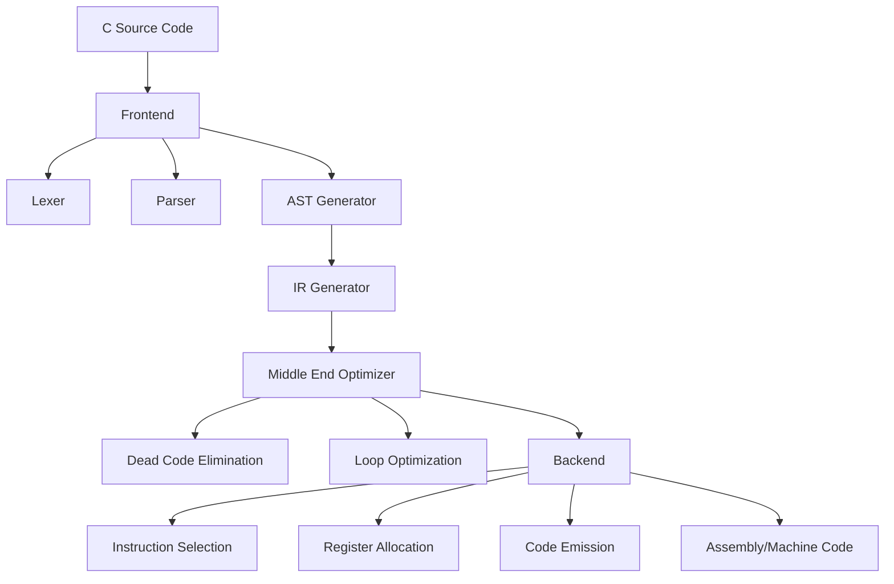

## 서론

소프트웨어 엔지니어링의 영역에서 "컴파일러(Compiler)"는 그야말로 성배와도 같습니다. 단순히 문법을 해석하는 것을 넘어, 복잡한 최적화 과정을 거쳐 고성능의 머신 코드로 변환하는 시스템은 수십 년간 축적된 인간의 지적 집약체라고 할 수 있습니다. 그렇기에 많은 개발자가 AI에게 "리눅스 커널을 짜라"거나 "새로운 컴파일러를 만들어라"고 요청할 때, 우리는 무의식적으로 기술적 한계를 상정합니다. 현재의 생성형 AI(Large Language Models, LLM)는 문맥을 망각하거나(Hallucination), 긴 파일의 끝부분과 시작부분의 일관성을 잃어버리는 경향이 있기 때문입니다. 대규모 시스템 엔지니어링에서 가장 치명적인 약점은 바로 이 '시스템 전체적 일관성(Global Consistency)'의 부재입니다.

하지만 Anthropic이 공개한 'Claude C Compiler(ccc)' 프로젝트는 이 통념을 완전히 뒤엎는 이정표가 되었습니다. 이 프로젝트는 단순히 C 코드를 생성하는 수준을 넘어, LLVM과 GCC라는 거대한 오픈소스 프로젝트가 수십 년간 다져온 컴파일러 엔지니어링의 '교과서적 지식'을 어떻게 학습하고 통합적인 아키텍처로 설계해내는지를 보여줍니다. 단순한 코드 스니펫 생성을 넘어, 프론트엔드(어휘/구문 분석), 미들엔드(중간 코드 최적화), 백엔드(코드 생성)라는 여러 서브시스템에 걸쳐 일관된 설계 원칙을 유지한다는 점에서 이는 매우 중요한 사건입니다. 이 글에서는 Claude C Compiler가 어떻게 대규모 시스템 설계의 난제를 해결했는지, 그 기술적 메커니즘과 함의를 분석해 보고자 합니다.

## 본론

### 1. 컴파일러 엔지니어링과 LLM의 도전 과제

컴파일러를 개발한다는 것은 단순히 코딩하는 것이 아닙니다. 수만 개의 파일과 수백만 줄의 코드가 서로 복잡하게 얽혀 있으며, 한 모듈의 변경이 파열 효과(Butterfly Effect)를 일으켜 전체 시스템의 성능이나 안정성을 무너뜨릴 수도 있습니다. 기존 LLM이 대규모 코드베이스를 다룰 때 겪는 주요 어려움은 '장기 의존성(Long-range Dependency)' 처리입니다. 예를 들어, 코드 최적화를 위해 중간 표현(IR)의 구조를 변경하면, 이를 사용하는 백엔드의 레지스터 할당기(Register Allocator) 로직까지 동조해야 합니다.

Claude C Compiler는 이러한 문제를 해결하기 위해 방대한 컨텍스트 윈도우(Context Window)와 고도화된 체인 오브 쏘트(Chain-of-Thought) 추론 능력을 활용했습니다. Anthropic의 Claude 모델은 특히 긴 문맥을 유지하는 데 강점이 있어, LLVM의 아키텍처 문서와 소스 코드를 동시에 참조하며 각 구성 요소가 수행해야 할 역할과 그 인터페이스를 정의하는 데 성공했습니다.

이 시스템의 핵심은 인간이 설계한 아키텍처를 모방하는 것을 넘어, "왜 이런 구조가 최적인지"에 대한 원리 Principle을 학습했다는 점입니다.

### 2. 아키텍처 설계: 일관성의 유지

Claude C Compiler의 성공은 수동으로 작성된 코드의 복잡성을 AI가 어떻게 관리하는지를 보여줍니다. 일반적인 코드 생성 모델은 파일 단위로 작업을 수행할 때, 전체적인 그림을 잃어버리기 쉽습니다. 반면, ccc는 컴파일러의 파이프라인 전체를 하나의 거대한 상태 머신(State Machine)으로 이해하고 각 단계를 정의했습니다.

다음은 Claude C Compiler가 목표로 하는 전형적인 컴파일 파이프라인의 추상화 과정입니다.



이 다이어그램에서 볼 수 있듯, 컴파일러는 선형적인 흐름이 아니라 각 단계마다 깊게 중첩된 서브루틴을 가집니다. AI가 여기서 수행한 역할은 각 노드(예: `Register Allocation`)를 구현하는 코드를 작성하는 것뿐만 아니라, `IR Generator`가 생성하는 데이터 구조가 `Optimizer`의 기대치와 정확히 일치하도록 인터페이스를 설계하는 것이었습니다.

### 3. 구현 상세: 코드 예시와 실제 동작

LLM이 생성한 코드는 종종 비효율적이거나 실행 불가능할 수 있습니다. 하지만 Anthropic의 연구에 따르면, Claude 모델은 적절한 프롬프트 엔지니어링과 인컨텍스트 러닝(In-Context Learning)을 통해 상당히 견고한 코드를 작성할 수 있었습니다.

아래는 LLM이 설계한 컴파일러의 최적화 단계에서, 간단한 상수 전파(Constant Propagation) 최적화를 수행하는 파이썬 스타일의 의사 코드 예시입니다.

```python
class ConstantPropagationOptimizer:
    def __init__(self, ir_module):
        self.ir_module = ir_module
        self.const_map = {}

    def visit_block(self, block):
        # 기본 블록을 순회하며 상수 값을 추적
        for instr in block.instructions:
            if instr.op == 'STORE' and self.is_constant(instr.value):
                self.const_map[instr.dest] = instr.value
            
            elif instr.op == 'LOAD':
                # 로드하려는 변수가 상수로 이미 알려져 있는지 확인
                if instr.src in self.const_map:
                    # 로드 명령을 상수로 직접 교체 (최적화 수행)
                    instr.replace_with('MOV', self.const_map[instr.src])
            
            elif instr.op == 'ADD':
                # 두 피연산자가 모두 상수인 경우 컴파일 타임에 계산
                if (instr.op1 in self.const_map) and (instr.op2 in self.const_map):
                    val1 = self.const_map[instr.op1]
                    val2 = self.const_map[instr.op2]
                    result = val1 + val2
                    instr.replace_with('MOV', result)
                    self.const_map[instr.dest] = result

    def optimize(self):
        for func in self.ir_module.functions:
            for block in func.basic_blocks:
                self.visit_block(block)
```

이 코드는 매우 간단해 보이지만, 중요한 점은 LLM이 `const_map`을 관리하여 상태를 유지(Stateful)해야 한다는 논리를 이해했다는 것입니다. 이는 단순히 다음 토큰을 예측하는 확률적 과정을 넘어, 프로그램의 정적 분석(Static Analysis) 논리를 구현했다는 의미입니다.

### 4. 기존 접근 방식 vs. AI 기반 접근 방식

Claude C Compiler의 접근 방식이 기존의 방식과 어떻게 다른지 비교해 보는 것은 이 기술의 잠재력을 이해하는 데 중요합니다. 아래 표는 전통적인 컴파일러 개발과 AI가 주도하는 개발의 차이점을 요약합니다.

| 비교 항목 | 전통적 인간 중심 개발 | Claude C Compiler (AI 기반) | | :--- | :--- | :--- | | **설계 철학** | 모듈화와 추상화에 대한 인간의 직관적 설계 | 거대 훈련 데이터(LLVM/GCC)에서의 패턴 추출 및 학습 | | **일관성 확보** | 엄격한 코드 리뷰와 강력한 타입 시스템 의존 | 거대 컨텍스트 윈도우를 통한 전체 시스템 문맥 유지 | | **지식 베이스** | 교과서, 논문, 수십 년간의 팀 내 노하우 | 오픈소스 저장소에 산재된 수천 개의 프로젝트 히스토리 | | **버그 패턴** | 논리적 오류나 경계 조건 실수 | Hallucination(환각)으로 인한 비현실적 코드 생성 가능성 | | **개발 속도** | 느림 (아키텍처 정의부터 구현까지 장기간 소요) | 빠름 (프롬프트를 통한 즉각적인 아키텍처 스케치 및 구현) |

### 5. 실무 적용을 위한 가이드

이러한 성과는 단순히 컴파일러에 국한되지 않습니다. 우리는 이 원리를 다른 대규모 시스템 설계에 적용할 수 있습니다. AI를 활용해 대규모 시스템을 설계하기 위한 단계별 접근법은 다음과 같습니다.

**Step 1: 도메인 특화 학습 (Domain Specific Learning)** 일반적인 LLM이 아닌, 해당 도메인(예: 데이터베이스, 브라우저 엔진)의 고품질 코드베이스로 파인튜닝된 모델이나 RAG(Retrieval-Augmented Generation) 시스템을 구축해야 합니다.

**Step 2: 아키텍처 먼저, 구현 나중 (Architecture First)** AI에게 바로 코드를 짜라고 하지 말고, 먼저 전체 시스템의 컴포넌트 다이어그램과 인터페이스 정의서(JSON/Protobuf 등)를 생성하도록 유도하세요. Claude ccc의 경우에도 먼저 IR의 타입 시스템을 정의한 후 구현으로 들어갔습니다.

**Step 3: 점진적 검증 (Iterative Verification)** 생성된 코드를 즉시 컴파일하고 테스트 케이스(Test Suite)를 돌려 피드백을 모델에 제공해야 합니다. 자동화된 테스트 파이프라인은 AI 컴파일러 개발의 필수적인 동반자입니다.

## 결론

Claude C Compiler(ccc)는 AI가 단순한 코딩 어시스턴트를 넘어 '시스템 설계자(System Architect)'로 진화하고 있음을 증명한 결정적인 사례입니다. LLVM과 GCC와 같은 복잡한 시스템의 구조와 원리를 학습하여, 여러 서브시스템 간의 일관성을 유지하며 기능을 구현해낸 것은 놀라운 성과입니다. 이는 향후 AI가 운영체제, 데이터베이스 관리 시스템, 고성능 서버와 같은 대규모 소프트웨어를 설계하고 구현하는 데 있어 핵심적인 역할을 할 것임을 시사합니다.

물론, 완벽하지는 않습니다. 여전히 생성된 코드의 정확성을 검증하는 엄격한 테스트 과정이 필요하며, AI의 환각 현상을 방지하기 위한 가드레일(Guardrail) 구축이 필수적입니다. 하지만 이 기술적 시범 사례는 우리가 소프트웨어 엔지니어링의 생산성 혁신을 위해 한 발짝 더 다가갔음을 의미합니다.

앞으로의 연구 방향은 AI가 단순히 기존 아키텍처를 모방하는 것을 넘어, 인간이 상상하지 못한 더 효율적인 컴파일러 알고리즘이나 새로운 하드웨어 아키텍처에 최적화된 시스템을 설계할 수 있도록 유도하는 것일 것입니다. 크리스 래트너(Chris Lattner)가 지적했듯, 이것은 소프트웨어 엔지니어링의 미래이며, 우리는 그 문턱에 서 있습니다.

### 참고자료

- Anthropic, "Claude C Compiler" Project Overview

- Chris Lattner's comments on AI-assisted System Design (Hada.io)

- LLVM Compiler Infrastructure Documentation

- "Attention Is All You Need" (Transformer Architecture Background)
