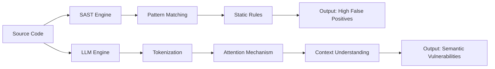

## 서론

소프트웨어 공급망 공급(Supply Chain Attack)의 증가와 제로데이 데이(Zero-day) 취약점의 파급력은 현대 개발자들이 직면한 가장 시급한 문제 중 하나입니다. 전통적인 정적 분석 도구(SAST, Static Application Security Testing)는 코드의 패턴을 매칭하여 잠재적 위협을 탐지하지만, '맥락(Context)'을 이해하지 못해 수많은 오탐(False Positive)을 생성하거나 비즈니스 로직 상의 미묘한 취약점을 놓치는 경우가 빈번합니다. 이러한 상황에서 최신 대규모 언어 모델(LLM)인 Claude Opus 4.6이 실제 코드베이스 감사에서 무려 500개 이상의 취약점을 발견했다는 보고는 업계에 적지 않은 파장을 일으켰습니다.

이는 단순한 성과 그 이상의 의미를 가집니다. 기존 도구들이 놓치던 '의미론적(Semantic)' 수준의 보안 결함을 AI가 식별해냈다는 것은, 보안 감사 패러다임이 규칙 기반(Rule-based)에서 추론 기반(Reasoning-based)으로 전환되고 있음을 시사합니다. 본 글에서는 Claude Opus 4.6이 어떤 메커니즘으로 기존 보안 도구의 한계를 극복했는지 기술적으로 분석하고, DevSecOps 파이프라인에 이를 통합하기 위한 실무적인 가이드를 제시합니다.

## LLM 기반 보안 감사의 기술적 원리

전통적인 SAST 도구가 정규표현식(Regex)이나 AST(Abstract Syntax Tree) 기반의 정의된 규칙을 사용하는 반면, Claude Opus 4.6과 같은 최신 LLM은 방대한 텍스트(코드) 데이터를 통해 학습된 '다중 헤드 어텐션(Multi-Head Attention)' 메커니즘을 활용합니다. 이는 변수의 선언부터 사용까지의 데이터 흐름(Data Flow)을 추적하고, 비즈니스 로직의 의도를 파악하여 권한 없는 사용자가 리소스에 접근할 수 있는 논리적 결함을 찾아낼 수 있게 합니다.

특히, Claude Opus 모델 계열이 가진 긴 컨텍스트 윈도우(Long Context Window)는 전체 파일 시스템의 구조를 한 번에 참조할 수 있게 하여, 함수 간의 호출 관계에서 발생하는 보안 위협을 포착하는 데 결정적인 역할을 합니다.

다음은 기존 SAST 방식과 LLM 기반 감사 방식의 처리 흐름을 비교한 다이어그램입니다.



## 취약점 발견 사례 및 비교 분석

Aikido Security의 실험에 따르면, Claude Opus 4.6은 단순한 SQL 인젝션이나 XSS 뿐만 아니라, 인증 우회(Authentication Bypass), 권한 상승(Privilege Escalation), 그리고 민감 정보 로깅(Sensitive Data Logging)과 같은 복잡한 취약점을 다수 발견했습니다.

기존 도구와 LLM의 성능 차이를 명확히 이해하기 위해 다음 표를 통해 주요 지표를 비교해 보겠습니다.

| 비교 항목 | 전통적 SAST 도구 (예: SonarQube, Checkmarx) | Claude Opus 4.6 (LLM 기반) |
| :--- | :--- | :--- |
| **분석 방식** | 패턴 매칭, taint analysis (정적 규칙) | 의미론적 이해, 추론 능력 |
| **맥락 이해도** | 낮음 (파일 단위 또는 함수 단위 제한적) | 높음 (프로젝트 전체 컨텍스트 참조 가능) |
| **오탐율 (False Positive)** | 높음 (규칙에 엄격하므로) | 중간~낮음 (의도를 파악하여 필터링) |
| **설정 난이도** | 복잡함 (수많은 룰셋 튜닝 필요) | 낮음 (프롬프트 엔지니어링 중심) |
| **주요 발견 유형** | 문법적 오류, 알려진 API 오용 | 비즈니스 로직 결함, 복잡한 인증 오류 |

## 실무 적용: LLM을 활용한 보안 스캐너 구현

연구자 및 엔지니어 관점에서 실제 프로젝트에 LLM 기반 보안 감사를 통합하는 방법을 살펴보겠습니다. 가장 효과적인 방법은 CI/CD 파이프라인 내에서 LLM을 호출하여 Diff(변경 사항)에 대해서만 집중적으로 감사하는 것입니다. 이는 비용 효율성과 속도를 모두 잡을 수 있는 접근법입니다.

다음은 Python을 사용하여 변경된 코드의 Diff를 추출하고, 이를 LLM API(가상의 Claude API 호출)에 전송하여 보안 리포트를 생성하는 간단한 예시 코드입니다.

```python
import difflib
import anthropic # 예시: anthropic 라이브러리 (실제 사용 시 설치 필요)

def get_security_diff(original_code, modified_code):
    """
    두 코드 간의 Diff를 생성하여 반환하는 함수
    """
    diff = difflib.unified_diff(
        original_code.splitlines(keepends=True),
        modified_code.splitlines(keepends=True),
        fromfile='original.py',
        tofile='modified.py'
    )
    return ''.join(diff)

def audit_code_with_llm(diff_content):
    """
    Claude Opus API를 호출하여 코드 변경 사항의 보안 취약점을 분석
    """
    client = anthropic.Anthropic(api_key="YOUR_API_KEY")
    
    prompt = f"""
    You are an expert security auditor. Analyze the following code diff for potential security vulnerabilities.
    Focus on: SQL Injection, XSS, Auth flaws, and Logic errors.
    If safe, respond with 'SAFE'. If vulnerable, explain the issue and suggest a fix.
    
    CODE DIFF:
    {diff_content}
    """
    
    message = client.messages.create(
        model="claude-3-opus-20240229", # 또는 최신 Opus 4.6 모델
        max_tokens=1024,
        messages=[
            {"role": "user", "content": prompt}
        ]
    )
    
    return message.content[0].text

# 실행 예시
original = """
def login(user, password):
    query = "SELECT * FROM users WHERE user='" + user + "'"
    # execute query
"""

modified = """
def login(user, password):
    # Added parameterization
    query = "SELECT * FROM users WHERE user=?"
    # execute query with binding
"""

diff = get_security_diff(original, modified)
report = audit_code_with_llm(diff)
print("Security Audit Report:
", report)
```

이 코드는 변경된 부분만을 선택적으로 분석하므로, 전체 코드베이스를 스캔할 때 발생하는 막대한 비용과 지연 시간을 최소화합니다.

## DevSecOps 파이프라인 통합 가이드

Claude Opus 4.6과 같은 LLM을 실제 운영 환경에 적용하기 위해서는 다음과 같은 단계적 접근이 필요합니다.

1.  **사전 필터링 (Pre-filtering)**: 먼저 가벼운 기존 Linter나 SAST 도구를 돌려 명백한 문법 오류를 제거합니다.
2.  **LLM 심층 분석 (Deep Analysis)**: SAST를 통과했으나 잠재적 위험이 있는 코드나 복잡한 로직 부분을 LLM에 전송하여 분석합니다.
3.  **인간 검증 (Human-in-the-loop)**: LLM이 제시한 결과를 개발자나 보안 담당자가 최종 검증합니다. 이때 LLM은 단순한 '탐지기'가 아니라 '설명자'로서 기능하며, 왜 이것이 취약점인지 이유를 제시하여 판단을 돕습니다.

이 과정을 통해 개발팀은 불필요한 경고 알림(Alert Fatigue)에서 벗어나, 실제로 중요한 보안 문제에 집중할 수 있습니다.

## 결론

Claude Opus 4.6이 500개 이상의 취약점을 발견한 사건은 AI 기반 보안이 '실험적 기술'에서 '실무적 필수 도구'로 진입하고 있음을 보여주는 결정적인 증거입니다. 단순히 코드의 형태를 보는 것이 아니라, 코드가 수행하려는 의도를 이해하는 '추론 능력'이 보안 분야에서 핵심 경쟁력이 되었습니다.

그러나 전문가로서의 관점에서 한 가지 유의해야 할 점은, LLM 역시 환각(Hallucination) 현상을 완전히 배제할 수 없다는 사실입니다. 따라서 현재 시점에서는 LLM을 보안 감사자를 대체하는 것이 아니라, 인간 감사자의 능력을 극대화하는 'Copilot'으로 활용하는 전략이 가장 합리적입니다.

향후 소프트웨어 보안은 도구의 성능 경쟁을 넘어, 어떻게 AI의 추론 능력을 개발 워크플로우에 가장 효율적으로 임베드(Embed)하느냐에 대한 MLOps적 고민이 중심이 될 것입니다.

### 참고자료

- [Aikido Security Blog - Claude Opus 4.6 Found 500 Vulnerabilities](https://aikido.dev)

- "Asleep at the Keyboard? Assessing the Security of GitHub Copilot's Generated Code" (IEEE S&P 2023)

- Anthropic, "Claude 3 Model Card"
