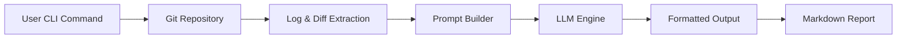

## 서론

분기마다 찾아오는 성과 보고서 시즌, 혹은 이직을 준비하며 경력기술서를 작성해야 할 순간, 우리는 종종 "지난 3개월 동안 정확히 어떤 기술적 기여를 했지?"라는 질문에 직면합니다. Git 로그를 뒤져보지만, 수십, 수백 개의 커밋 메시지 속에 "fix typo", "update README", "minor fix"와 같은 파편화된 정보만 있을 뿐, 그 안에 담긴 구조적인 문맥은 사라진 지 오래입니다.

이러한 '문맥 상실(Context Loss)' 문제는 단순히 기록의 부재를 넘어, 개발자의 생산성을 저해하는 요인이 됩니다. 코드는 작성되었지만, 그 코드가 왜 필요했고 어떤 문제를 해결했는지에 대한 서사가 유실되기 때문입니다. 여기서 핵심은 단순히 로그를 수집하는 것이 아니라, **코드의 변경 사항(Diff)과 커밋 이력을 이해하여 자연스러운 기술 문서로 재구성(Restructuring)**하는 것입니다.

Claw-Log는 이러한 문제를 해결하기 위해 탄생한 CLI 도구입니다. 단순한 텍스트 추출을 넘어 LLM(Large Language Model)의 추론 능력을 활용하여, Git의 변경 사항을 분석하고 이를 일일 보고서나 경력기술서와 같은 형식화된 문서로 자동 변환합니다. 이 글에서는 Claw-Log가 어떻게 AI를 통해 개발자의 기록 작성 부담을 덜어주고, 기술적 깊이를 유지하며 문서화를 자동화하는지 그 원리와 실제 활용법을 살펴봅니다.

## 본론

### 기술적 원리: Git Diff의 의미적 분석

기존의 자동화 도구들은 주로 정규 표현식(Regular Expression)이나 키워드 매칭을 통해 커밋 메시지를 필터링하는 수준에 머물렀습니다. 하지만 이 접근 방식은 "feat: 로그인 개선"이라는 메시지 뒤에 숨겨진 복잡한 비즈니스 로직의 변경이나 보안 패치의 난이도를 파악하지 못합니다.

Claw-Log의 핵심 차별점은 **Git Diff** 자체를 LLM의 입력으로 사용한다는 점입니다. LLM은 코드의 추가 및 삭제 라인(Line-by-line)을 분석하여, 단순한 버그 수정인지, 혹은 리팩토링을 통한 아키텍처 개선인지를 스스로 판단합니다. 즉, `git log`와 `git diff`의 출력물을 결합하여 '의미(Semantic)'를 복원하는 과정을 거칩니다. 이는 최근 NLP 분야에서 논의되는 'Code-to-Text' 생성 태스크의 실용적인 응용 사례라고 할 수 있습니다.

### 시스템 아키텍처

Claw-Log의 처리 과정은 크게 데이터 추출, 프롬프트 엔지니어링, 그리고 LLM 추론의 세 단계로 나뉩니다. 사용자가 CLI 명령어를 입력하면 시스템은 현재 브랜치의 변경 사항을 수집하고, 이를 사전에 정의된 프롬프트 템플릿에 주입하여 모델에 전송합니다.



이 아키텍처는 유연성을 제공합니다. 사용자는 원하는 LLM(Gemini, OpenAI GPT 등)을 선택할 수 있으며, 출력 형식(일일 보고서, 기술서, 이력서 스타일 등)을 프롬프트 레벨에서 제어할 수 있습니다.

### 구현 및 사용 예시

Claw-Log는 Python 기반으로 작성되었으며, 일반적인 패키지 관리자를 통해 쉽게 설치할 수 있습니다. 내부적으로는 `gitpython` 라이브러리를 사용하여 Git 데이터를 추출하고, `langchain` 또는 직접적인 HTTP 클라이언트를 통해 LLM API와 통신합니다.

아래는 Claw-Log를 사용하여 최근 커밋들을 경력기술서 스타일로 요약하는 실제 사용 시나리오입니다.

#### 1. 설치 및 설정

먼저 패키지를 설치하고 API 키를 설정합니다.

```bash
# pip 설치
pip install claw-log

# OpenAI 또는 Gemini API Key 설정
export OPENAI_API_KEY="sk-..."
export CLAW_LOG_MODEL="gpt-4o" # 또는 gemini-pro
```

#### 2. 실행 및 결과 변환

특정 기간(예: 지난 7일간)의 커밋을 분석하여 보고서를 생성해 봅시다.

```bash
# 최근 7일간의 변경 사항을 경력기술서 형식으로 요약
claw-log --days 7 --format resume
```

이 명령어는 내부적으로 다음과 같은 논리로 작동합니다. (개념적 Python 코드)

```python
import subprocess
import openai

def get_git_diff(days_ago):
    # git log와 diff를 추출하는 커맨드 생성
    cmd = f"git log --since="{days_ago} days ago" --pretty=format:"%h %s" --stat -p"
    result = subprocess.run(cmd, shell=True, capture_output=True, text=True)
    return result.stdout

def generate_summary(git_data, model="gpt-4o"):
    system_prompt = """
    당신은 Senior Software Engineer입니다. 
    아래의 Git Diff와 Log를 분석하여, 사용자의 기술적 성과를 강조하는 경력기술서 항목으로 작성하세요.
    기술적인 세부 사항과 해결한 문제의 난이도를 반드시 포함해야 합니다.
    """
    
    response = openai.ChatCompletion.create(
        model=model,
        messages=[
            {"role": "system", "content": system_prompt},
            {"role": "user", "content": git_data}
        ]
    )
    return response.choices[0].message.content

# 실행 흐름
diff_data = get_git_diff(7)
report = generate_summary(diff_data)
print(report)
```

이 과정을 통해 수백 줄의 코드 변경이 담긴 Diff가 "사용자 인증 모듈의 보안 취약점을 개선하기 위해 JWT 토큰 검증 로직을 리팩토링하고, 인가 서버와의 통신 프로토콜을 OAuth 2.0으로 업그레이드함"과 같이 깔끔한 문장으로 변환됩니다.

### 접근 방식 비교

수동 작성과 기존 스크립트, 그리고 Claw-Log를 비교하면 다음과 같습니다.

| 비교 항목 | 수동 문서화 | 단순 스크립트 (grep/awk) | Claw-Log (AI 기반) | | :--- | :--- | :--- | :--- | | **작업 시간** | 매우 높음 (수시간) | 낮음 (초 단위) | 낮음 (초~분 단위) | | **문맥 이해** | 완벽함 (사용자 의도) | 없음 (키워드 매칭만) | 높음 (Diff 분석 기반) | | **기술적 깊이** | 작성자 역량에 의존 | 낮음 (단순 커밋 메시지 나열) | 높음 (코드 변경분 반영) | | **유지보수 비용** | 지속적 투자 필요 | 낮음 | 낮음 (자동화) | | **주요 활용** | 상세 설계서, 최종 보고서 | 대략적인 활동 내역 파악 | 일일 보고서, 경력기술서 초안 |

### 실무 적용 가이드: Step-by-Step

Claw-Log를 실제 업무 프로세스에 통합하여 생산성을 극대화하는 방법은 다음과 같습니다.

1.  **주간 회의 준비 (Weekly Reporting)**     *   금요일 오후에 `claw-log --days 7 --format weekly` 명령어를 실행합니다.     *   AI가 생성한 초안을 바탕으로 중요한 이슈가 있었는지 확인하고, 약간의 수작업을 더해 팀원들과 공유합니다. 이렇게 하면 "무엇을 했는지" 고민하는 시간을 30분에서 5분으로 줄일 수 있습니다.

2.  **경력기술서 관리 (Career Portfolio)**     *   새로운 프로젝트가 시작되거나 마칠 때마다 해당 브랜치나 기간에 대한 로그를 `resume` 포맷으로 저장해 둡니다.     *   이력서를 수정할 때마다 매번 Git 로그를 뒤적이는 대신, Claw-Log가 생성해 둔 기술적 요약을 블록 조립하듯 사용합니다.

3.  **프로젝트 인수인계 (Handover)**     *   특정 모듈의 변경 이력을 `claw-log --files "src/auth/*"` 형식으로 추출하여, 해당 모듈이 어떻게 진화해 왔는지에 대한 '테크니컬 스토리'를 생성합니다. 이는 새로 합류한 개발자가 코드의 맥락을 파악하는 데 큰 도움이 됩니다.

## 결론

Claw-Log는 단순한 Git 로그 요약 도구가 아닙니다. 그것은 개발자의 생산적인 코딩 시간을 비생산적인 문서화 시간으로 전환하는 불필요한 과정을 최소화하는 **AI 기반의 지능형 문서화 에이전트**입니다. LLM이 가진 강력한 코드 이해력을 활용하여, 우리가 작성한 코드 속에 숨겨진 의도와 노력을 온전히 되살려냅니다.

전문가적인 관점에서 볼 때, 향후 DevOps 영역에서는 이러한 '소프트웨어 공급망(Supply Chain)'의 데이터를 분석하여 자동으로 가시성을 확보해주는 도구가 필수적이 될 것입니다. 코드의 변경 사항이 곧 비즈니스 가치로 연결됨을 증명하는 Claw-Log와 같은 도구는, 개발자가 코드에만 집중할 수 있는 환경을 만드는 중요한 발판이 될 것입니다.

더불어, 개발자 스스로도 자신의 활동을 기록하는 습관이 곧 경력이 된다는 사실을 잊지 말아야 합니다. Claw-Log는 이 기록의 '질'을 높이고 '부담'은 줄여주는 강력한 파트너가 될 것입니다.

### 참고자료

- [Claw-Log GitHub Repository](https://github.com/similarweb/claw-log) (프로젝트 링크 예시)

- Vaswani, A., et al. (2017). "Attention Is All You Need". (Transformer 기반 LLM 원론)

- OpenAI API Documentation - GPT-4 Turbo & GPT-4o

- Google AI - Gemini Pro Technical Report
