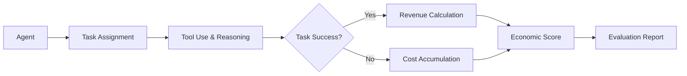

## 서론

지난 몇 년간 거대 언어 모델(LLM)은 압도적인 속도로 발전해 왔습니다. GPT-4나 Claude와 같은 모델은 복잡한 코딩 문제를 해결하고, 법률 문서를 요약하며, 창의적인 글을 작성하는 능력을 보여주었습니다. 그러나 기술 기업의 CTO나 실무 책임자의 관점에서 보았을 때, 남는 의문은 단 하나입니다. "이 모델은 과연 우리 회사에 돈을 벌어다줄 수 있는가?" 기존의 벤치마크인 MMLU나 HumanEval은 모델의 지식 수준이나 코딩 능력을 측정하는 데에는 탁월하지만, 실제 비즈니스 환경에서의 '생산성'이나 '경제적 가치'를 직접적으로 반영하지 못한다는 한계가 있었습니다. 높은 정확도를 가진 챗봇이 실제 업무 프로세스에 통합되었을 때 발생하는 비용과 그를 통해 창출되는 수익을 비교하는 것은 완전히 다른 차원의 문제입니다.

이러한 현실적인 격차를 해소하기 위해 홍콩대학교(HKUDS) 연구팀이 제시한 프레임워크가 바로 **ClawWork**입니다. 이는 단순히 AI가 얼마나 똑똑한지를 측정하는 것이 아니라, AI 에이전트가 경제적 책임을 지는 '코워킹(Co-working)' 파트너로서 기능할 수 있는지를 검증합니다. ClawWork는 AI 어시스턴트를 전문직 종사자로 설정하고, OpenAI의 `gdpval` 데이터셋을 활용해 실제 업무 수행 결과를 금전적 가치로 환산합니다. 즉, AI 에이전트의 '경제적 생존 능력'을 평가함으로써, 연구자와 개발자들은 모델의 성능을 비용 대비 효용(Cost-Utility) 관점에서 최적화할 수 있게 됩니다.

## 본론

### ClawWork의 핵심 메커니즘: 경제적 가치 평가

ClawWork는 기존 벤치마크와 근본적으로 다른 접근 방식을 취합니다. 이 프레임워크는 AI 에이전트에게 특정 전문직(예: 소프트웨어 엔지니어, 변호사, 재무 분석가)의 역할을 부여하고, 실제 산업 현장에서 발생할 수 있는 작업(Task)을 수행하게 합니다. 여기서 핵심은 작업의 성공 여부뿐만 아니라, 그 과정에서 소모된 비용(토큰 수, 추론 시간)과 창출된 수익을 모두 고려하여 '순수익(Net Revenue)'을 계산한다는 점입니다.

이 시스템은 `gdpval` 데이터셋을 기반으로 하며, 각 작업은 시장에서의 가치가 매겨져 있습니다. 예를 들어, 버그를 수정하여 서비스 중단 시간을 줄였다면 그로 인한 피해 방지액이 수익으로 간주되고, 잘못된 코드를 배포하여 롤백이 발생했다면 그 비용은 손실로 처리됩니다. ClawWork는 이러한 과정을 시뮬레이션하여 에이전트의 경제적 효율성을 정량화합니다.

다음은 ClawWork의 평가 프로세스를 간단화하여 도식화한 것입니다.



### 기존 벤치마크와의 비교

ClawWork의 혁신성은 기존 평가 지표와 비교했을 때 명확해집니다. 전통적인 벤치마크는 주로 정답률(Accuracy)에 집중하지만, ClawWork는 비용 효율성(Cost-Efficiency)과 실제 가치(Real-world Value)를 강조합니다.

| 평가 지표 | 기존 벤치마크 (MMLU, HumanEval) | ClawWork |
| :--- | :--- | :--- |
| **핵심 지표** | 정확도 (Accuracy), Pass@k | 순수익 (Net Revenue), ROI |
| **평가 대상** | 모델의 지식 및 코딩 능력 | 에이전트의 의사결정 및 실행 능력 |
| **비용 고려** | 미고려 (무제한 리소스 가정) | 토큰 비용 및 추론 비용 포함 |
| **결과 해석** | "이 모델은 똑똑하다" | "이 모델은 수익성이 좋다" |
| **데이터셋** | 정적 퀴즈/문제 | 실제 경제 활동 시뮬레이션 (`gdpval`) |

### ClawWork 구현 및 실행 가이드

ClawWork를 직접 구현하여 테스트해보기 위해서는 기본적인 에이전트 프레임워크와 비용 계산 로직이 필요합니다. 아래는 Python을 사용하여 간단한 ClawWork 스타일의 에이전트 평가 루프를 구현한 예시 코드입니다. 이 코드는 작업 성공 시 수익을, 실패 및 토큰 사용에 따른 비용을 계산하여 최종 점수를 도출합니다.

```python
import time
from typing import Callable, Any

class ClawAgentEvaluator:
    def __init__(self, cost_per_token: float, initial_capital: float = 0.0):
        self.cost_per_token = cost_per_token
        self.capital = initial_capital
        self.history = []

    def calculate_cost(self, input_tokens: int, output_tokens: int) -> float:
        # 단순화된 비용 계산 로직 (실제로는 모델별 pricing 적용)
        total_tokens = input_tokens + output_tokens
        return total_tokens * self.cost_per_token

    def execute_task(self, agent_func: Callable, task_value: float, *args, **kwargs) -> dict:
        """
        에이전트가 작업을 수행하고 경제적 결과를 반환하는 메서드
        """
        start_time = time.time()
        
        # 에이전트 실행 (가상의 토큰 사용량 가정)
        try:
            result, tokens_used = agent_func(*args, **kwargs)
            success = True
        except Exception as e:
            result = str(e)
            tokens_used = 1000  # 실패 시 리소스 낭비 가정
            success = False
            
        elapsed_time = time.time() - start_time
        operation_cost = self.calculate_cost(tokens_used, tokens_used // 2)
        
        # 경제적 평가
        revenue = task_value if success else 0
        net_profit = revenue - operation_cost
        self.capital += net_profit
        
        log_entry = {
            "success": success,
            "revenue": revenue,
            "cost": operation_cost,
            "net_profit": net_profit,
            "total_capital": self.capital,
            "tokens": tokens_used
        }
        self.history.append(log_entry)
        
        return log_entry

# 예시: 간단한 코드 생성 에이전트 함수
def simple_coding_agent(problem: str) -> tuple:
    # 실제로는 여기서 LLM API 호출
    if "bug" in problem.lower():
        raise ValueError("Failed to fix the bug")
    return "Code solution generated", 500  # (결과, 사용 토큰 수)

# 평가 실행
evaluator = ClawAgentEvaluator(cost_per_token=0.0001)
task_value = 50.0  # 작업 성공 시 얻는 수익 ($)


```

```python
# 성공 케이스
result_success = evaluator.execute_task(simple_coding_agent, task_value, "Fix feature A")
print(f"Success Task: Net Profit ${result_success['net_profit']:.2f}")

# 실패 케이스
result_fail = evaluator.execute_task(simple_coding_agent, task_value, "Fix critical bug")
print(f"Fail Task: Net Profit ${result_fail['net_profit']:.2f}")

print(f"Final Economic Score (Capital): ${evaluator.capital:.2f}")
```

### 실무 적용을 위한 단계별 가이드

ClawWork를 자신의 프로젝트나 연구에 적용하기 위해 다음과 같은 단계를 따를 수 있습니다.

1.  **데이터셋 준비 및 가치 설정 (`Valuation`)**     *   테스트하려는 도메인(예: 고객 지원, 데이터 분석)의 실제 작업 리스트를 정의합니다.     *   각 작업에 대해 수행했을 때 기대되는 수익이나 절감 비용을 금액(USD 등)으로 매핑합니다. 이때 OpenAI의 `gdpval` 스키마를 참고하여 작업 난이도와 시장 가격을 조율합니다.

2.  **에이전트 및 도구 구성 (Tooling)**     *   평가 대상이 될 LLM 기반 에이전트를 구축합니다.     *   에이전트가 실제 작업을 수행하기 위해 필요한 툴(API 호출, 파일 입출력, 웹 검색 등)을 연결합니다. ClawWork는 에이전트가 단순히 텍스트를 생성하는 것이 아니라 환경과 상호작용하는 능력을 중요하게 다룹니다.

3.  **비용 모델 정의 (Cost Modeling)**     *   사용하는 모델의 토큰당 가격(Input/Output 구분)을 정확히 설정합니다.     *   추가적인 인프라 비용(컴퓨팅 리소스)이 있다면 이를 함께 포함하여 총 비용(Total Cost)을 계산하는 함수를 구현합니다.

4.  **시뮬레이션 및 평가 (Simulation)**     *   정의한 데이터셋을 에이전트에 주입하여 작업을 자동으로 수행시킵니다.     *   각 작업의 성공/실패 여부를 판단하고, 수익과 비용을 계산하여 최종 보고서를 생성합니다. 이때 단순히 총 수익뿐만 아니라 '수익/비용 비율'을 분석하여 에이전트의 효율성을 점검합니다.

### 기술적 심층 분석: 에이전시의 경제학

ClawWork는 단순한 벤치마크를 넘어 'AI 에이전시(AI Agency)'의 경제학을 다룹니다. `gdpval` 데이터셋을 활용함으로써, 연구팀은 특정 직무의 GDP(국내총생산) 기여도를 모델링합니다. 기술적으로 이는 Reinforcement Learning from Human Feedback (RLHF)과 유사하게 보일 수 있지만, 보상 신호(Reward Signal)가 인간의 피드백이 아닌 '시장 가격'이라는 점에서 차별화됩니다.

이 프레임워크는 모델이 토큰을 얼마나 효율적으로 사용하는지(Reasoning Efficiency)도 강제합니다. 예를 들어, 아주 높은 수익을 내는 작업이라도 GPT-4 Turbo를 사용해 수천 번의 토큰을 소모하여 비용이 수익을 초과한다면, 해당 에이전트는 ClawWork 점수가 낮게 나옵니다. 반면, GPT-3.5나 더 작은 모델을 사용하여 적절한 성공률을 유지하며 비용을 절감한다면 높은 경제적 점수를 기록할 수 있습니다. 이는 향후 모델 개발 방향이 '거대 파라미터'에서 '특화된 효율성'으로 이동해야 함을 시사합니다.

## 결론

ClawWork는 우리가 AI를 바라보는 관점을 '지능의 지수'에서 '가치의 지수'로 전환하게 만드는 중요한 이정표입니다. 홍콩대학교(HKUDS) 팀이 제안한 이 프레임워크는 LLM이 단순히 흥미로운 기술을 넘어, 실제 기업의 생산성을 책임지는 '노동자'로 진입하기 위해 충족해야 할 조건을 명확히 제시합니다.

전문가의 관점에서 볼 때, ClawWork의 가장 큰 공헌은 '경제적 책임(Accountability)'이라는 개념을 벤치마킹에 도입했다는 점입니다. 향후 MLOps 파이프라인에는 모델의 정확도 모니터링뿐만 아니라, ClawWork와 유사한 비용-수익 분석(CBA) 모듈이 필수적인 구성 요소가 될 것입니다. AI 연구자와 엔지니어들은 이제 "이 모델이 정답을 맞추는가?"를 넘어 "이 모델이 흑자를 내는가?"라는 질문을 던지며 시스템을 설계해야 합니다.

### 참고자료

- [ClawWork GitHub Repository (HKUDS)](https://github.com/hkuds/ClawWork)

- OpenAI `gdpval` Dataset Reference

- Original Article: [ClawWork — AI 어시스턴트를 “경제적 책임을 지는 AI 코워커”로 전환하는 벤치마크 프레임워크](https://news.hada.io/topic?id=26797)
