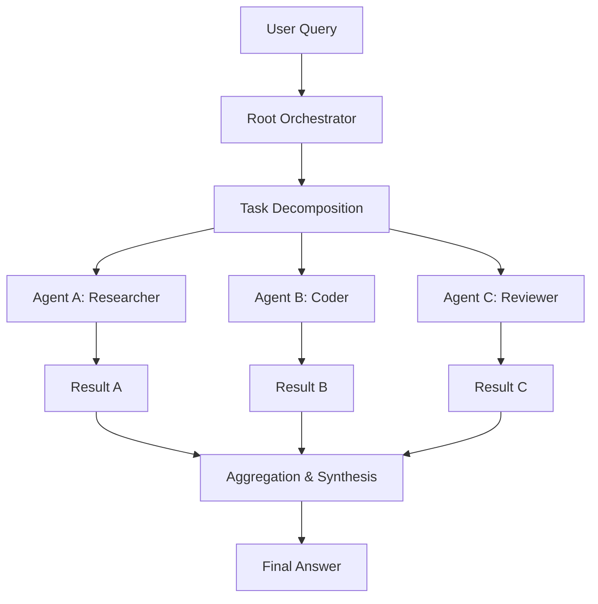

## 서론

최근 생성형 AI를 활용한 자동화 시스템을 구축하려는 시도가 급증하고 있지만, 여전히 복잡한 실무 작업을 하나의 거대한 LLM(Large Language Model)에만 의존하여 해결하려는 관행이 존재합니다. 단일 모델이 전체 문맥을 파악하고 코딩부터 테스트, 배포까지 일괄 처리하도록 요구할 때, 우리는 종종 맥락 창(Context Window)의 한계, 환각(Hallucination) 누적, 그리고 '중간에 끊기는 추론'과 같은 문제에 직면합니다. 마치 하나의 슈퍼 개발자에게 모든 것을 맡기는 것과 같은 이 방식은 규모가 커질수록 비효율적이며 오류 가능성이 높습니다.

이러한 단일 모델의 한계를 돌파하기 위해 등장한 패러다임이 다중 AI 에이전트(Multi-Agent System)입니다. 하지만 에이전트가 많아지면 관리가 어려워집니다. 누가 무엇을 할지, 어떤 순서로 실행할지, 에이전트 간의 정보를 어떻게 교환할지를 조율(Orchestration)하는 것은 새로운 난제입니다. 바로 이 지점에서 **Cord**와 같은 프레임워크의 필요성이 대두됩니다. Cord는 복잡한 작업을 트리(Tree) 형태로 계층화하여, 각 에이전트가 독립적인 전문성을 발휘하면서도 전체 시스템은 유기적으로 협업할 수 있도록 구조화된 조율 매커니즘을 제공합니다. 이 글에서는 Cord가 단순한 에이전트 실행을 넘어 어떻게 체계적인 문제 해결 구조를 제공하는지 그 기술적 원리와 실제 구현 방안을 심층적으로 다룹니다.

## 본론

### 트리 기반 에이전트 조율의 아키텍처

Cord의 핵심 철학은 복잡한 문제를 수평적으로 나열하는 것이 아니라, 수직적으로 계층화하여 다루는 것입니다. 이를 위해 **트리(Tree) 구조**를 사용합니다. 루트(Root) 에이전트는 메타 컨트롤러 역할을 수행하며, 전체 작업을 작은 하위 작업들로 분해(Decomposition)합니다. 이 하위 작업들은 자식(Child) 노드들에게 할당되며, 각 자식 노드는 다시 자신의 하위 작업을 분해하거나 독립적으로 실행합니다.

이 구조는 기존의 선형적인 Chain-of-Thought(CoT)와는 확연히 다릅니다. CoT가 사고의 연속성을 강조한다면, Cord는 **분산된 실행과 병렬성**을 강조합니다. 예를 들어, "웹 애플리케이션 개발"이라는 루트 태스크는 "프론트엔드 구현", "백엔드 API 설계", "데이터베이스 스키마 작성"이라는 세 개의 자식 노드로 분해될 수 있습니다. 이 자식 노드들은 서로 독립적으로(병렬적으로) 실행될 수 있으며, 각자의 결과를 다시 루트로 전달하여 최종적으로 합성(Synthesis)합니다.

다음은 Cord의 실행 흐름을 단순화한 다이어그램입니다.



이 다이어그램에서 볼 수 있듯이, Root는 계획을 세우고(Plan), 각 전문 에이전트에게 작업을 분배합니다. 각 에이전트는 서로의 존재를 알 필요 없이 자신에게 주어진 프롬프트에만 집중하면 됩니다. 이러한 **관심사의 분리(Separation of Concerns)**는 시스템의 유지보수성을 높이고, 특정 에이전트에서 오류가 발생하더라도 해당 하위 트리만 재시도하면 되는 견고함(Fault Tolerance)을 제공합니다.

### Cord와 기존 패러다임의 비교

Cord의 트리 구조가 가지는 이점을 명확히 이해하기 위해, 기존의 방식들과 기술적 특성을 비교해 보겠습니다.

| 비교 항목 | Single LLM (CoT) | Linear Multi-Agent (AutoGPT 등) | Cord (Tree-based Orchestration) |
| :--- | :--- | :--- | :--- |
| **실행 흐름** | 선형 (Sequential) | 순차적 의존 (High Dependency) | 병렬 및 계층적 (Hierarchical) |
| **확장성** | 낮음 (Context Limit) | 중간 (Loop stuck 문제) | 높음 (Sub-tree scaling) |
| **오류 격리** | 어려움 (전체 재시도 필요) | 어려움 (Loop break 필요) | 용이 (Node 단위 재실행) |
| **자원 효율성** | 단일 호출 | 장기 실행 지연(Latency) | 분산 병렬 처리로 최적화 |
| **역할 분담** | 프롬프트 내 Role-play | 동적 Role switching | 정적/동적 Tree 구조 정의 |

위 표에서 알 수 있듯이, Cord는 복잡한 작업을 처리함에 있어 **확장성(Scalability)**과 **효율성(Efficiency)** 측면에서 유리합니다. 특히, 자식 노드들이 서로 의존성이 없는 한 병렬로 실행될 수 있어 전체 수행 시간을 획기적으로 단축할 수 있습니다. 이는 최근 연구인 "Tree of Thoughts" 논문에서 제안한 사고의 탐색 과정을 실제 실행 시스템으로 구현한 형태와도 맥락을 같이합니다.

### 실무 구현 가이드: Python으로 Cord 구조 구성하기

이론적인 배경을 바탕으로, Python을 사용하여 간단한 Cord 스타일의 에이전트 트리를 구현해 보겠습니다. 실제 프로덕션 레벨의 프레임워크는 더 복잡하지만, 여기서는 핵심 메커니즘인 '분해-실행-합성' 과정에 집중합니다.

이 코드는 기본적인 `TreeNode` 클래스를 정의하고, 각 노드가 자신의 역할에 맞는 LLM을 호출하여 작업을 처리한 뒤 결과를 상위 노드로 전달하는 방식입니다.

```python
import time
from typing import List, Optional

# 가상의 LLM 호출 클래스 (실제로는 OpenAI API 등을 사용)
class LLMClient:
    def call(self, prompt: str, role: str) -> str:
        # 시뮬레이션: 역할에 따른 응답 생성
        return f"[{role}] Executed task based on: {prompt[:20]}..."

class TreeNode:
    def __init__(self, name: str, role: str, parent: Optional['TreeNode'] = None):
        self.name = name
        self.role = role
        self.parent = parent
        self.children: List['TreeNode'] = []
        self.llm = LLMClient()
        self.result: Optional[str] = None

    def add_child(self, child_node: 'TreeNode'):
        self.children.append(child_node)

    def execute(self, input_prompt: str) -> str:
        print(f"Node '{self.name}' starting execution...")
        
        # 1. 자식 노드가 있는 경우 (Branch Node): 작업 분해 및 위임
        if self.children:
            # 루트 또는 중간 노드는 프롬프트를 분해하여 자식에게 전달하는 로직이 필요함
            # 여기서는 단순화를 위해 동일한 프롬프트의 다른 측면을 처리한다고 가정
            
            child_results = []
            for child in self.children:
                # 실제 구현에서는 여기서 프롬프트 파싱 및 자식 할당 로직이 들어감
                res = child.execute(input_prompt)
                child_results.append(res)
            
            # 2. 결과 합성 (Aggregation)
            combined_input = "
".join(child_results)
            synthesis_prompt = f"Synthesize the following results:
{combined_input}"
            self.result = self.llm.call(synthesis_prompt, self.role)
            
        else: 
            # 2. 자식 노드가 없는 경우 (Leaf Node): 실제 작업 수행
            self.result = self.llm.call(input_prompt, self.role)
        
        print(f"Node '{self.name}' completed: {self.result}")
        return self.result


```

```python
# 시나리오: 복잡한 리포트 작성
if __name__ == "__main__":
    # 루트 에이전트 (매니저)
    root = TreeNode(name="Root_Manager", role="Manager")
    
    # 하위 에이전트들 (전문가)
    researcher = TreeNode(name="Researcher", role="Researcher")
    coder = TreeNode(name="Coder", role="Developer")
    writer = TreeNode(name="Writer", role="Writer")
    
    # 트리 구조 구성
    root.add_child(researcher)
    root.add_child(coder)
    root.add_child(writer)
    
    # 실행 (병렬 처리는 asyncio 등을 통해 구현 가능)
    final_output = root.execute("Create a technical report about Cord")
    print("
=== Final Output ===")
    print(final_output)
```

이 코드의 핵심은 `execute` 메서드가 **재귀적(Recursive)**으로 작동한다는 점입니다. 리프 노드(Leaf node)에 도달할 때까지 호출이 내려가고, 리프 노드의 결과가 다시 상위로 버블링(Bubbling)되어 합쳐집니다. 실제 MLOps 환경에서는 이 트리 구조를 JSON이나 YAML로 정의(DAG as Code)하여, 비즈니스 로직이 변경되더라도 코드를 수정하지 않고 설정만으로 에이전트의 흐름을 제어할 수 있습니다.

### Step-by-step: Cord 시스템 도입하기

실제 프로젝트에 Cord 프레임워크를 도입하여 다중 에이전트 시스템을 구축하고 싶다면 다음과 같은 단계를 따르는 것을 권장합니다.

1.  **작업 그래프 설계 (Graph Design)**     해결하고자 하는 문제를 트리 구조로 시각화합니다. 어떤 작업이 독립적인지, 어떤 작업이 선행되어야 하는지를 파악하여 의존성(Dependency)을 정의합니다. 이때 `graph TD`와 같은 툴을 활용해 설계를 도면화하는 것이 유리합니다.

2.  **에이전트 스펙트럼 정의 (Agent Definition)**     각 노드에 할당될 LLM의 역할과 시스템 프롬프트(System Prompt)를 작성합니다. 예를 들어, "Researcher" 에이전트는 정보 수집에 최적화된 Few-shot 예제를, "Coder" 에이전트는 코드 생성에 특화된 모델(e.g., GPT-4, Claude 3.5 Sonnet)과 포맷을 사용하도록 설정합니다.

3.  **프롬프트 인터페이스 표준화**     부모 노드에서 자식 노드로 넘겨주는 입력 포맷과 자식 노드가 부모에게 반환하는 출력 포맷을 **JSON Schema** 등으로 표준화해야 합니다. 비정형 텍스트보다는 구조화된 데이터가 파싱 및 합성 과정에서 훨씬 강력합니다.

4.  **상태 관리 및 오류 처리 (State Management)**     트리 실행 중 특정 가지(Branch)에서 실패가 발생했을 때의 전략을 수립합니다. Cord의 장점은 실패한 노드만 재시도하거나 대안 에이전트를 교체하여 재실행하는 격리가 가능하다는 점입니다. 이를 통해 전체 비용을 절약할 수 있습니다.

## 결론

Cord 프레임워크는 단순히 여러 개의 AI 모델을 순차적으로 실행하는 것을 넘어, **문제 해결의 구조 자체를 혁신**하는 접근 방식입니다. 트리 기반의 계층적 조율을 통해 우리는 복잡한 거대 언어 모델의 추론 능력을 작고 전문적인 단위들로 나누어 관리할 수 있습니다. 이는 소프트웨어 공학의 모듈화 원칙을 AI 에이전트 시스템에 적용한 것과 같습니다.

전문가적인 관점에서 볼 때, 향후 AI 개발의 핵심은 모델의 파라미터 수를 늘리는 것이 아니라, 이러한 **에이전트 오케스트레이션(Agent Orchestration)** 능력을 얼마나 효율적으로 설계하느냐에 달려 있습니다. Cord와 같은 시스템은 LLM이 단순한 챗봇이 아닌, 복잡한 비즈니스 로직을 수행하는 자율적인 시스템의 구성 요소로 진화하는 데 있어 필수적인 다리 역할을 할 것입니다. 연구자와 엔지니어들은 이제 "어떤 모델을 쓸 것인가"를 넘어 "어떻게 에이전트를 조율할 것인가"를 고민해야 합니다.

### 참고자료

- [Cord: Coordinating Trees of AI Agents (Original)](https://www.june.kim/cord)

- [AutoGen: Enabling Next-Gen LLM Applications](https://microsoft.github.io/autogen/)

- [Tree of Thoughts: Deliberate Problem Solving with Large Language Models](https://arxiv.org/abs/2305.10601)
