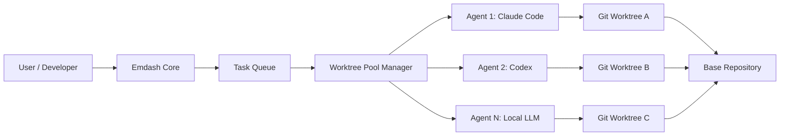

## 서론

최신 딥러닝 기반의 코딩 에이전트(Coding Agent)들이软件开发 생산성을 획기적으로 높여주고 있지만, 실제 엔지니어링 환경에서 이들을 도입할 때 흔히 발생하는 "병목 현상"에 직면해 본 적이 있으신가요? 단일 터미널 창에서 하나의 에이전트가 코드를 생성하고, 테스트하고, 수정하는 과정을 지켜보는 것은 마치 단일 코어 CPU로 병렬 처리 작업을 수행하는 것과 같습니다. 특히 대규모 레포지토리에서 여러 기능을 동시에 개발하거나, 여러 LLM(Claude, GPT, Gemini 등)의 성능을 비교해야 할 때, 컨텍스트 스위칭(Context Switching)과 환경 설정에 드는 비용은 생각보다 큽니다.

Emdash는 이러한 "Agentic Workflow"의 비효율성을 해결하기 위해 고안된 **Agentic Development Environment(ADE)**입니다. 단순히 AI 코드 자동 완성 도구를 넘어, 여러 코딩 에이전트를 고립된 환경에서 병렬로 실행하여 개발 루프 전체를 오케스트레이션하는 시스템입니다. 이 글에서는 Emdash가 어떻게 Git worktree와 네이티브 CLI 통합을 통해 에이전트 실행의 격리성(Isolation)과 병렬성(Parallelism)을 확보하는지, 그리고 작업 시작 시간(Startup Time)을 1초 미만으로 줄이는 기술적 고찰에 대해 심도 있게 다루고자 합니다.

## 본론

### 1. Agentic Development Environment의 아키텍처

기존의 AI 통합 개발 환경(IDE)이 주로 단일 스레드 방식의 인터랙션에 집중했다면, Emdash는 다중 에이전트가 동시에 작업할 수 있는 "운영 체제"와 같은 역할을 합니다. 핵심은 **격리(Isolation)**와 **오케스트레이션(Orchestration)**입니다.

Emdash는 각 에이전트 작업(Task)마다 독립적인 `Git worktree`를 생성합니다. 이는 메인 레포지토리를 복사하지 않고도, 동일한 파일 시스템 공간 내에서 독립된 브랜치처럼 작동하는 격리된 작업 공간을 제공합니다. 즉, 에이전트 A가 `feature/auth` 브랜치에서 작업하는 동안, 에이전트 B는 `feature/payment` 브랜치에서 완전히 독립적으로 파일을 수정하고 테스트할 수 있습니다. 이러한 설계는 "Side-by-side" 개발을 가능하게 하여, 에이전트 간의 파일 충돌이나 컨텍스트 오염을 원천적으로 차단합니다.

다음은 Emdash의 시스템 아키텍처를 간소화하여 나타낸 다이어그램입니다.



### 2. Worktree Pooling과 냉시작(Cold Start) 최적화

LLM 기반 에이전트를 사용할 때 가장 큰 답답함 중 하나는 작업을 시작하기 위해 환경을 설정하는 시간입니다. 일반적으로 `git worktree add` 명령어를 실행하고 가상 환경을 로드하는 데만 몇 초에서 수십 초가 소요될 수 있습니다. Emdash는 이 문제를 해결하기 위해 **Worktree Pooling** 기술을 도입했습니다.

이 시스템은 백그라운드에서 사용 가능한 워크트리들을 미리 생성해두고 유지합니다. 사용자가 새로운 작업을 요청하면, 시스템은 즉시 풀(Pool)에서 대기 중인 워크트리를 할당(claim)하고 쉘을 직접 스폰(Spawn)합니다. 이 과정에서 별도의 쉘 환경 로딩(Shell Environment Loading) 과정을 건너뛰기 때문에, 작업 시작 지연 시간(Latency)을 약 500ms~1000ms 수준으로 획기적으로 단축했습니다. 이는 실시간 협업 도구로서 Emdash의 사용성을 결정짓는 핵심 최적화 기술입니다.

### 3. Provider-Agnostic 및 Native CLI 통합 전략

많은 AI 도구들이 특정 LLM 공급자(Provider)의 API에 종속되는 반면, Emdash는 **Provider-Agnostic(공급자 독립적)** 설계를 채택했습니다. Emdash는 Claude Code, OpenAI Codex, Google Gemini, Droid 등 21가지 이상의 코딩 에이전트 CLI를 통합 관리합니다.

여기서 중요한 기술적 철학은 "Native CLI Wrapper"입니다. Emdash는 에이전트의 기능을 제한하는 자체 래퍼(Wrapper)를 만드는 대신, 각 공급자가 제공하는 네이티브 CLI를 직접 실행합니다. 이 접근 방식의 장점은 두 가지입니다. 1.  **기능 지연(Future-proofing) 없음**: 공급자가 새로운 기능(예: Plan Mode, RAG 등)을 CLI에 추가하면, Emdash는 즉시 해당 기능을 사용할 수 있습니다. 2.  **충실도(Fidelity)**: 공급자가 의도한 대로 에이전트가 동작하므로 호환성 이슈가 최소화됩니다.

아래는 다양한 코딩 에이전트를 병렬로 실행하여 결과를 비교하는 가상의 설정 예시입니다.

| 특성 | 기존 IDE 플러그인 방식 | Emdash (ADE) 방식 | | :--- | :--- | :--- | | **실행 환경** | 로컬 IDE 내 제한된 컨텍스트 | 격리된 Git Worktree (완전한 파일 접근) | | **병렬 처리** | 불가능 (단일 세션) | 가능 (다중 에이전트 동시 실행) | | **LLM 호환성** | 특정 공급자 종속 (예: Copilot) | 21+ Native CLI 지원 (Agnostic) | | **시작 속도** | 느림 (Indexing, Context Loading) | 매우 빠름 (Worktree Pooling <1s) | | **원격 지원** | 제한적 | 원격 SSH 지원 (Code where data is) |

### 4. 실무 적용: Emdash를 이용한 병렬 개발 워크플로우

Emdash를 실제 MLOps 파이프라인이나 소프트웨어 개발에 적용할 때의 워크플로우는 다음과 같습니다. 이 과정에서 Emdash는 단순한 코드 생성기를 넘어, 개발자의 "DevOps 엔지니어" 역할을 수행합니다.

1.  **Task 정의**: Linear, GitHub, Jira의 이슈를 Emdash에 입력합니다. 2.  **Agent Allocation**: 해당 작업에 적합하거나, 비교를 원하는 여러 에이전트(Claude, Codex 등)를 선택하여 할당합니다. 3.  **Parallel Execution**: 각 에이전트는 고립된 워크트리에서 코드를 작성하고, 테스트 스크립트를 실행합니다. 4.  **Orchestration & Review**: Emdash는 각 에이전트가 생성한 Diff를 수집하고, CI/CD 파이프라인을 트리거하여 빌드 및 테스트 결과를 확인합니다. 5.  **Merge**: 검증이 완료된 변경 사항을 메인 레포지토리에 PR(Pull Request) 형태로 생성하고 병합합니다.

이러한 흐름을 코드로 표현하자면, 개발자는 Emdash의 CLI를 통해 다음과 같이 작업을 명령할 수 있습니다. (아래 코드는 개념적 예시입니다.)

```python
import subprocess

def run_agent_task(task_description, agent_type, branch_name):
    """
    Emdash 환경에서 특정 에이전트를 사용하여 작업을 수행하는 함수
    """
    # 1. Worktree 풀에서 할당 및 브랜치 설정 (자동화됨)
    worktree_path = f"/tmp/emdash_worktrees/{branch_name}"
    
    # 2. 에이전트 CLI 실행 (Native 호출)
    # 예: Claude Code CLI 사용
    if agent_type == "claude":
        cmd = [
            "claude",
            "--prompt", task_description,
            "--workspace", worktree_path,
            "--diff"  # 변경 사항을 Diff 형태로 출력
        ]
    # 예: OpenAI Codex CLI 사용
    elif agent_type == "codex":
        cmd = [
            "codex",
            "edit", 
            "--instructions", task_description,
            "--dir", worktree_path
        ]
    
    # 3. 비동기 실행으로 병렬 처리 시뮬레이션
    process = subprocess.Popen(cmd, stdout=subprocess.PIPE, stderr=subprocess.PIPE)
    return process

# 시나리오: 두 가지 다른 에이전트에게 동일한 버그 수정 요청
task = "Fix the memory leak in the DataLoader class when num_workers=0"

# 병렬 실행
p1 = run_agent_task(task, "claude", "fix/claude-attempt")
p2 = run_agent_task(task, "codex", "fix/codex-attempt")

# 결과 대기 및 수집 (Emdash가 이를 UI에서 시각화)
p1.communicate()
p2.communicate()

print("Tasks completed. Review diffs in Emdash UI.")
```

이 코드는 Emdash가 내부적으로 어떻게 다양한 CLI를 다루는지 보여주는 추상화된 예시입니다. 실제 사용자는 GUI를 통해 복잡한 서브프로세스 관리 없이 단순히 "이 작업을 Claude와 Codex에게 각각 시켜라"라고 명령하기만 하면 됩니다.

## 결론

Emdash는 단순한 AI 코드 생성 도구의 차원을 넘어, **Agentic Development Environment(ADE)**라는 새로운 패러다임을 제시합니다. Git worktree를 활용한 완벽한 격리 환경과 Worktree Pooling을 통한 초고속 시작 시간, 그리고 다양한 Native CLI에 대한 Provider-Agnostic한 접근 방식은 현대적인 소프트웨어 개업 워크플로우에 AI를 깊숙이 통합하는 데 필요한 인프라를 제공합니다.

특히 MLOps 관점에서 볼 때, 모델의 성능 비교(Benchmarking)나 A/B 테스트를 코드 레벨에서 병렬로 수행할 수 있는 환경은 연구자와 개발자 모두에게 강력한 무기가 됩니다. 앞으로의 AI 개발 도구는 단일 모델의 지능을 높이는 것뿐만 아니라, Emdash처럼 다중 에이전트를 효율적으로 조율하고 관리하는 시스템의 성능이 경쟁력을 좌우할 것입니다.

Emdash는 현재 오픈소스(MIT License)로 배포되고 있으며, macOS, Linux, Windows를 지원합니다. AI 에이전트를 활용한 실질적인 생산성 향상을 고민하고 있는 엔지니어라면, 직접 다운로드하여 "병렬 개발"의 미래를 경험해 보시기를 권장합니다.

### 참고자료

- **Emdash GitHub Repository**: https://github.com/generalaction/emdash

- **Show HN: Emdash – Open-source agentic development environment**: https://news.ycombinator.com/item?id=47140322

- **Git Worktree Documentation**: https://git-scm.com/docs/git-worktree

- **Claude Code CLI**: https://docs.anthropic.com/en/docs/build-with-claude/claude-for-developers
