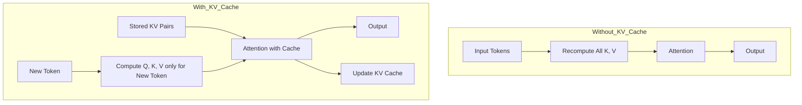
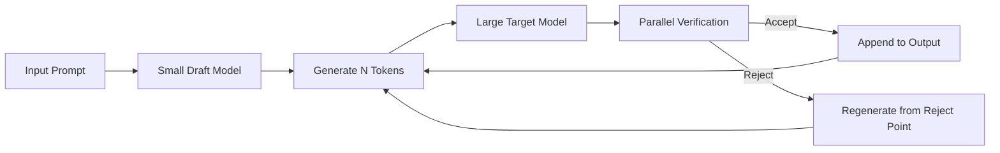

## 서론

대규모 언어 모델(LLM)을 실제 서비스에 통합하려 할 때 가장 먼저 부딪히는 벽은 바로 '추론 속도(Latency)'입니다. 사용자는 채팅창에 메시지를 입력하고 나서 AI가 답변을 완성할 때까지의 시간을 견디기 힘들어 합니다. GPU가 최신 사양임에도 불구하고 토큰이 하나씩 툭툭 튀어 나오는 것처럼 느리게 생성된다면, 그 서비스의 사용자 경험(UX)은 처참하게 무너지게 됩니다.

왜 이런 현상이 발생할까요? 이는 Transformer 아키텍처의 기본적인 **자기 회귀(Autoregressive)** 특성 때문입니다. 모델은 다음 토큰을 생성하기 위해 이전의 모든 토큰을 참조해야 하며, 시퀀스 길이가 길어질수록 계산량이 기하급수적으로 늘어납니다. 게다가 단순히 연산 속도만이 문제가 아닙니다. 메모리 대역폭(Memory Bandwidth)의 병목 현상과 불필요한 중복 연산이 막대한 자원을 낭비하게 만듭니다.

따라서 오늘날의 MLOps 엔지니어와 연구자들은 단순히 더 강력한 하드웨어를 도입하는 것을 넘어, 소프트웨어적인 차원의 최적화 기법을 필수적으로 사용합니다. 이 글에서는 LLM 추론 속도를 획기적으로 높이는 가장 대표적이면서도 강력한 두 가지 트릭, **KV Cache**와 **Speculative Decoding(추측적 디코딩)**의 원리와 실제 구현 방법을 심도 있게 다룹니다.

## 본론

### 1. 불필요한 연산 제거: KV Cache (Key-Value Cache)

LLM의 디코딩 과정을 분석해보면 놀라운 사실을 발견할 수 있습니다. 새로운 토큰을 생성할 때마다 이전에 이미 계산했던 Key와 Value 행렬을 다시 계산한다는 점입니다. Transformer의 Attention 메커니즘은 Query, Key, Value 세 가지 벡터를 사용하는데, 시점 $t$에서의 새로운 토큰 $x_t$를 처리할 때, $t$ 이전의 모든 토큰들에 대한 $K$와 $V$는 변하지 않습니다. 이를 매번 재계산하는 것은 엄청난 낭비입니다.

KV Cache는 이전 토큰들의 $K$와 $V$를 캐싱(Caching)하여 새로운 토큰이 들어올 때마다 이를 재사용함으로써 중복 연산을 제거합니다. 이를 통해 계산 복잡도를 $O(n^2)$에서 $O(n)$ 수준으로 획기적으로 낮출 수 있습니다. 특히 디코딩 단계(Generation Phase)에서는 하나의 토큰만 처리하면 되므로, 캐시된 데이터와 현재 토큰의 Query 간의 Attention Score만 계산하면 됩니다.

#### KV Cache 작동 원리

다음 다이어그램은 KV Cache를 사용했을 때와 사용하지 않았을 때의 데이터 흐름을 비교한 것입니다.



이 접근 방식은 특히 긴 문맥(Long Context)을 다룰 때 그 효과가 극대화됩니다. 다만, 캐시를 저장하기 위해 GPU 메모리(HBM) 사용량이 증가한다는 트레이드오프가 존재합니다. 이를 최적화하기 위해 PagedAttention(vLLM)과 같은 기술이 등장하기도 했습니다.

| 비교 항목 | Standard Attention | KV Cache 사용 |
| :--- | :--- | :--- |
| **연산 복잡도** | $O(n^2)$ | $O(n)$ |
| **메모리 사용량** | 낮음 (캐시 없음) | 높음 (과거 K,V 저장) |
| **디코딩 속도** | 느림 (매번 중복 계산) | 빠름 (증분 계산만 수행) |
| **주요 용도** | 훈련(Training) 단계 | 추론(Inference) 단계 |

### 2. 병렬성 극대화: Speculative Decoding (추측적 디코딩)

KV Cache가 연산의 효율성을 높였다면, Speculative Decoding은 모델이 '생각하는 시간' 자체를 줄이는 기법입니다. 기본적으로 LLM은 토큰을 하나씩 순차적으로 생성합니다(Autoregressive). 하지만 이 방식은 GPU의 병렬 처리 능력을 100% 활용하지 못하게 만듭니다.

Speculative Decoding은 작고 빠른 모델(Draft Model)을 사용하여 미리 여러 토큰을 예측(Draft)하고, 큰 모델(Target Model)이 이를 한 번에 검증(Verify)하는 방식입니다. 만약 큰 모델이 예측을 받아들인다면, 우리는 단 한 번의 Forward Pass로 여러 토큰을 생성한 셈이 됩니다. 만약 거부된다면, 그 위치부터 다시 예측을 진행합니다.

이 기법의 핵심은 큰 모델이 작은 모델보다 정확할 확률이 높다는 가정하에, 작은 모델이 예측한 토큰들이 큰 모델의 분포와 충분히 일치할 것이라는 점에 있습니다.

#### Speculative Decoding 프로세스



#### 코드 예시: Speculative Decoding 구현체

다음은 PyTorch를 사용하여 Speculative Decoding의 검증 과정을 단순화하여 구현한 예시입니다.

```python
import torch

def verify_draft(target_model, draft_model, prompt, draft_tokens, max_speculations=4):
    """
    Target Model이 Draft Model의 예측을 검증하는 과정
    """
    # 1. Target Model과 Draft Model의 초기 Context 처리
    with torch.no_grad():
        target_outputs = target_model(prompt)
        draft_outputs = draft_model(prompt)
    
    # 가장 최근 Hidden State나 Logit을 가져옴 (단순화를 위해 Logits 가정)
    target_logits = target_outputs.logits[:, -1, :]
    
    accepted_tokens = []
    
    for i in range(max_speculations):
        if i >= len(draft_tokens):
            break
            
        draft_token = draft_tokens[i]
        
        # 2. Target Model이 해당 Draft Token을 생성할 확률 계산
        # 실제 구현에서는 Tree Mask 등을 사용하여 병렬 처리하지만 여기서는 순차적 설명
        prob_draft = torch.softmax(target_logits, dim=-1)[0, draft_token].item()
        
        # 3. 샘플링을 통한 검증 (간략화)
        # 실제 알고리즘은 확률적 수용(Stochastic Acceptance)을 사용함
        if prob_draft > 0.5: # 예시를 위한 임계치
            accepted_tokens.append(draft_token)
            # 다음 토큰을 위한 Target Model 업데이트 (실제로는 forward propagtion 필요)
            # 여기서는 concept 설명을 위해 생략
        else:
            break
            
    return accepted_tokens

# 사용 예시
# draft_prediction = [100, 200, 300] # 작은 모델이 예측한 토큰들
# accepted = verify_draft(llama_70b, llama_7b, input_ids, draft_prediction)
```

이 코드는 논리적 흐름을 보여주는 의사 코드(Pseudocode)입니다. 실제로 vLLM 같은 라이브러리에서는 **Tree Attention**이나 **Masking** 기술을 사용하여 여러 개의 Draft 토큰을 단일 행렬 연산으로 동시에 검증하여 GPU 효율을 극대화합니다.

### 실무 적용 가이드

이러한 최적화 기법을 실제 서비스에 적용하기 위한 단계별 가이드는 다음과 같습니다.

1.  **프로파일링(Profiling)**: 현재 병목이 메모리 대역폭인지, 연산량(Compute bound)인지 파악합니다. 보통 디코딩 단계는 메모리 대역폭에 민감합니다.
2.  **KV Cache 적용**: HuggingFace Transformers 등의 최신 라이브러리는 이미 `use_cache=True`가 기본값입니다. 이를 비활성화하지 않았는지 확인합니다.
3.  **Batch Size 튜닝**: KV Cache 사용 시 메모리 사용량이 급증합니다. 배치 크기와 시퀀스 길이 사이의 균형을 맞춰야 OOM(Out of Memory)을 방지할 수 있습니다.
4.  **Speculative Decoding 도입**:     *   현재 서비스 중인 모델(예: Llama-3-70B)과 호환되는 작은 모델(예: Llama-3-8B 또는 Quantized 버전)을 준비합니다.     *   Draft Model의 정확도가 너무 낮으면 검증을 자주 실패하여 효율이 떨어질 수 있으므로, 동일 계열의 작은 모델을 사용하는 것이 좋습니다.
5.  **프레임워크 활용**: vLLM, TGI(Text Generation Inference), TensorRT-LLM 등은 이러한 최적화가 내장되어 있습니다. 로우 레벨(PyTorch Native)로 구현하기보다는 검증된 서빙 프레임워크를 통해 간접적으로 활용하는 것을 권장합니다.

## 결론

LLM 추론 최적화는 단순한 성능 향상을 넘어 서비스의 생존과 직결된 문제입니다. **KV Cache**는 이미 계산된 정보를 저장하여 메모리 접근 비용과 연산 시간을 획기적으로 줄여주는 가장 기초적이고 강력한 무기입니다. 또한 **Speculative Decoding**은 작은 모델의 '예측력'과 큰 모델의 '정확성'을 결합하여 GPU의 병렬 처리 능력을 극한으로 끌어올리는 고도화된 기법입니다.

연구자와 엔지니어 입장에서 이러한 최적화 기법들의 내부 작동 원리를 이해하는 것은 단순히 라이브러리를 호출하는 것을 넘어, 모델 서빙 아키텍처를 설계하고 비용을 절감하며 사용자 경험을 혁신하는 데 필수적입니다. 특히 최근 연구들은 이러한 기법들을 양자화(Quantization)와 결합하거나(例如 AWQ, GPTQ), 더 정교한 캐시 관리 전략(PagedAttention)을 통해 효율을 더욱 높이고 있습니다.

추론 속도 최적화의 여정은 여기서 끝나지 않습니다. 모델이 거대해질수록, 그리고 우리가 요구하는 응답 속도가 빨라질수록 더 효율적인 알고리즘과 하드웨어 가속기의 결합이 요구될 것입니다. 하지만 원칙은 변하지 않습니다. "불필요한 것은 계산하지 말고, 병렬화할 수 있는 것은 묶어서 처리하라"는 것입니다.

### 참고자료

- [Fast LLM Inference - Sean Goedecke](https://www.seangoedecke.com/fast-llm-inference/)

- [vLLM: Easy, Fast, and Cheap LLM Serving with PagedAttention](https://arxiv.org/abs/2309.06180)

- [Speculative Decoding: For Fast LLM Inference](https://arxiv.org/abs/2211.17192)

- [Kwon et al., Efficient Memory Management for Large Language Model Serving with PagedAttention, SOSP '23](https://dl.acm.org/doi/10.1145/3600006.3613165)
