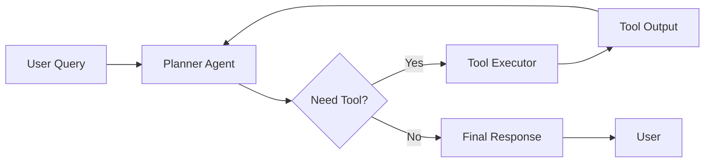

## 서론: "작동하는 것 같은" 코드에서 "작동하는" 시스템으로

LLM(Large Language Model)을 활용한 개발 초기 단계에서 우리는 종종 "Vibe Coding"이라는 불안한 영역에 머물렀습니다. 복잡한 로직을 자연어 프롬프트 몇 줄로 퉁치고, 모델이 생성한 코드를 그대로 붙여넣은 뒤, "작동하는 것 같으면" 그걸로 끝나는 방식이죠. 하지만 실제 프로덕션 환경에서 이런 방식은 재앙으로 이어질 수 있습니다. 모델이 미세한 문맥 변화에 따라 전혀 다른 API를 호출하거나, 존재하지 않는 라이브러리를 참조(Hallucination)하여 전체 시스템을 마비시키기도 합니다.

여기서 핵심은 LLM을 단순한 '텍스트 생성기'가 아닌, 환경과 상호작용하며 목표를 달성하는 '지능적 에이전트(Agent)'로 격상시키는 것입니다. 최근 발표된 GLM-5는 단순한 언어 이해 능력을 넘어, 구조화된 계획 수립(Planning)과 도구 사용(Tool Use) 능력을 비약적으로 향상시켰습니다. 이제 우리는 "이 프롬프트가 잘 쓰였나?"라고 걱정하는 대신, "모델이 스스로 문제를 해결할 수 있는 구조적 루프를 설계했나?"를 고민해야 합니다. 이것이 바로 Vibe Coding에서 **Agentic Engineering**으로의 패러다임 전환입니다.

## 본론: Agentic Engineering의 설계와 구현

### 1. 왜 Agentic Engineering인가? (기술적 배경)

기존의 LLM 활용 방식은 컨텍스트 윈도우(Context Window) 내에서의 일회성 추론에 의존했습니다. 하지만 복잡한 작업, 예를 들어 웹 검색 후 데이터를 정리하고 보고서를 작성한 뒤 이메일로 발송하는 작업은 단일 프롬프트로 해결하기 어렵습니다. 최근 연구인 "ReAct: Synergizing Reasoning and Acting in Language Models" 등에서 제시된 바와 같이, 추론(Reasoning)과 행동(Acting)을 반복하는 순환 구조가 필수적입니다.

GLM-5는 이러한 Agentic 패러다임에 최적화되어 있습니다. 특히 함수 호출(Function Calling) 성능의 정교함과 긴 맥락 처리 능력 덕분에, 에이전트가 이전 행동의 결과를 기억(Memory)하고 다음 단계를 계획(Plan)하는 데 있어 탁월한 성능을 보입니다. 엔지니어의 역할은 모델이 "무엇을 할지"를 알려주는 것이 아니라, "어떤 도구를 사용할 수 있는지"와 "목표 상태가 무엇인지"를 정의하는 시스템 아키텍처를 설계하는 것으로 변화했습니다.

### 2. 에이전트 시스템의 아키텍처

Agentic Engineering의 핵심은 모델을 중심으로 한 제어 흐름(Control Flow)입니다. 사용자의 요청을 받으면, 에이전트는 현재 상태를 분석하고 필요한 도구를 선택한 뒤 실행합니다. 실행 결과를 다시 모델에게 피드백(Feedback) 하여 최종 답변을 생성하는 과정을 거칩니다.

이 과정을 시각화하면 다음과 같습니다.



이 다이어그램에서 볼 수 있듯이, 에이전트는 단순히 A에서 B로 가는 직선적인 로직이 아닙니다. '계획(Planner)' 단계에서 도구가 필요하다고 판단되면 실행을 거치고, 그 결과를 바탕으로 다시 계획을 수정하는 순환 구조(Loop)를 갖습니다. 이것이 Vibe Coding과 결정적으로 갈리는 지점입니다. 불확실성이 높은 작업은 도구 실행을 통해 검증(Verification) 과정을 거치기 때문입니다.

### 3. 구현: Python으로 GLM-5 기반 에이전트 구축하기

이제 실제 코드를 통해 GLM-5를 활용한 간단한 Tool-Use 에이전트를 구축해 보겠습니다. 이 예제는 OpenAI 호환 API 형식을 사용한다고 가정하지만, GLM-5의 강력한 함수 호출 파싱 능력을 활용하는 핵심 로직은 동일합니다.

```python
import json
from typing import Callable, Dict, Any

# 가상의 GLM-5 클라이언트 (실제로는 각 SDK를 사용합니다)
class GLM5Client:
    def chat_completion(self, messages, tools=None):
        # 모델 추론 로직 시뮬레이션
        # tools가 있으면 모델은 함수를 호출하거나 텍스트를 응답
        pass 

# 에이전트가 사용할 도구 정의
def get_current_weather(location: str, unit: str = "celsius") -> str:
    """특정 위치의 날씨를 조회합니다."""
    # 실제 API 호출 대신 Mock 데이터 반환
    return f"{location}의 현재 날씨는 25도, 맑음입니다."

def calculator(expression: str) -> float:
    """수학 계산을 수행합니다."""
    try:
        return eval(expression)
    except Exception as e:
        return str(e)

# 도구 등록
available_tools: Dict[str, Callable] = {
    "get_current_weather": get_current_weather,
    "calculator": calculator
}

tools_schema = [
    {
        "type": "function",
        "function": {
            "name": "get_current_weather",
            "description": "Get the current weather in a given location",
            "parameters": {
                "type": "object",
                "properties": {
                    "location": {"type": "string", "description": "The city and state, e.g. San Francisco, CA"},
                    "unit": {"type": "string", "enum": ["celsius", "fahrenheit"]}
                },
                "required": ["location"]
            }
        }
    },
    {
        "type": "function",
        "function": {
            "name": "calculator",
            "description": "Evaluates a mathematical expression",
            "parameters": {
                "type": "object",
                "properties": {
                    "expression": {"type": "string", "description": "Math expression, e.g. '2 + 2'"}
                },
                "required": ["expression"]
            }
        }
    }
]


```

```python
def run_agent_loop(user_query: str):
    client = GLM5Client()
    messages = [{"role": "user", "content": user_query}]
    
    print(f"User: {user_query}")
    
    while True:
        # 1. 모델 추론 (Tool Use 포함)
        response = client.chat_completion(messages, tools=tools_schema)
        message = response.choices[0].message
        
        # 2. 도구 호출 요청 확인
        tool_calls = message.tool_calls
        
        if tool_calls:
            # 3. 도구 실행 루프
            for tool_call in tool_calls:
                func_name = tool_call.function.name
                func_args = json.loads(tool_call.function.arguments)
                
                print(f"Agent: Executing {func_name}({func_args})")
                
                # 도구 실행
                if func_name in available_tools:
                    result = available_tools[func_name](**func_args)
                    
                    # 4. 실행 결과를 모델에 다시 피드백
                    messages.append({
                        "role": "tool",
                        "tool_call_id": tool_call.id,
                        "name": func_name,
                        "content": str(result)
                    })
        else:
            # 5. 최종 응답 도착
            print(f"Agent: {message.content}")
            break

# 실행 예시
run_agent_loop("서울의 날씨를 알려주고, 15도 화씨로 변환해 줘.")
```

이 코드는 Agentic Engineering의 정수를 보여줍니다. 모델이 직접 계산을 하려고 시도하지 않고, 정의된 `calculator` 도구를 호출하여 신뢰할 수 있는 결과를 얻습니다. 또한 날씨 정보를 가져온 뒤, 그 결과를 맥락(Context)에 포함하여 후속 계산을 수행하는 멀티-턴(Multi-turn) 대화 능력을 확인할 수 있습니다.

### 4. 접근 방식 비교: Vibe Coding vs. Agentic Engineering

이 전환이 엔지니어링 관점에서 어떤 차이를 만들어내는지 정리해 보면 다음과 같습니다.

| 비교 항목 | Vibe Coding (프롬프트 중심) | Agentic Engineering (구조 중심) |
| :--- | :--- | :--- |
| **핵심 접근** | 모델의 지능에 전적으로 의존, 프롬프트 튜닝 | 모델을 라우터/플래너로 활용, 구조적 루프 설계 |
| **신뢰성(Reliability)** | 낮음. 동일 입력에도 출력이 달라질 수 있음 | 높음. 도구 사용 및 검증 과정을 통해 결과 안정화 |
| **디버깅** | 어려움. 왜 실패했는지 추적 불가능한 경우가 많음 | 용이함. 로그를 통해 어떤 툴이 언제 호출되었는지 추적 가능 |
| **상태 관리** | 프롬프트 내에 암묵적으로 포함 (Context Limitation) | 명시적인 메모리(DB, Vector Store) 및 상태 머신 활용 |
| **복잡한 작업 수행** | 성능 급격히 저하 (Multi-hop reasoning failure) | Plan-and-Solve 접근법으로 복잡한 작업 단계별 해결 |
| **확장성** | 프롬프트 길이 제약으로 인한 한계 | 모듈식 도구(Tools) 추가로 기능 무한 확장 가능 |

### 5. 실무 적용 가이드: 자율적인 에이전트 만들기

GLM-5를 활용하여 실제 비즈니스 로직에 적용 가능한 에이전트를 만들 때 고려해야 할 5단계 가이드입니다.

1.  **목표 명세화 (Goal Specification)**: 에이전트가 달성해야 할 최종 목표를 명확히 정의합니다. (예: "뉴스를 요약한다" X / "관련 뉴스 3개를 검색하고 긍정/부정을 분류하여 JSON으로 저장한다" O)
2.  **도구 분석 및 정의 (Tool Definition)**: 에이전트가 사용할 수 있는 API, 함수, 데이터베이스 커넥션을 정의합니다. 각 도구의 입력과 출력 스키마(Schema)는 반드시 엄격하게 정의해야 모델의 오류를 줄일 수 있습니다.
3.  **프롬프트 엔지니어링 (System Prompt)**: 시스템 프롬프트에 에이전트의 페르소나와 제약 조건을 설정합니다. "너는 유용한 어시스턴트야"보다는 "너는 도구 사용 능력을 갖춘 계획 전문가야. 사용 가능한 도구가 없다면 반드시 '도구 부족'을 요청해"와 같이 구체적으로 작성합니다.
4.  **루프 및 모니터링 (Loop & Monitoring)**: 에이전트가 무한 루프에 빠지지 않도록 최대 반복 횟수(Step limits)를 설정하고, 각 단계의 중간 결과를 로깅 시스템에 저장합니다. 이는 나중에 A/B 테스트나 성능 튜닝에 필수적입니다.
5.  **안전 장치 (Safety Guards)**: 에이전트가 시스템에 위험한 명령(예: `DELETE FROM table`)을 내리지 못하도록 도구 실행 전 레이어에서 검증하거나, 허용된 파라미터 범위를 제한합니다.

## 결론: LLM 애플리케이션의 성숙

GLM-5와 같은 고성능 모델의 등장은 AI 개발의 장을 새롭게 열고 있습니다. 이제 우리는 모델이 "대화를 잘하는지" 테스트하는 시대를 지나, 모델이 "문제를 해결하는지" 검증하는 시대로 접어들었습니다. Agentic Engineering은 이러한 전환을 위한 필수적인 방법론입니다.

Vibe Coding은 프로토타이핑 단계에서 여전히 유용합니다. 하지만 안정적이고 확장 가능한 시스템을 구축하기 위해서는 "느낌"이 아닌 "구조"에 집중해야 합니다. GLM-5의 강력한 계획 및 도구 사용 능력을 활용하여, 개발자들은 불확실성을 최소화하고 LLM이 가진 잠재력을 최대한 끌어낼 수 있는 견고한 지능형 시스템을 구축할 수 있습니다. 앞으로의 AI 개발은 단순히 더 큰 모델을 찾는 것이 아니라, 이 모델을 어떻게 제어하고 구조화할 것인가(Architecture > Model)에 대한 경쟁이 될 것입니다.

### 참고자료

- [GLM-5 Technical Report](https://z.ai/blog/glm-5) (Original Source)

- ReAct: Synergizing Reasoning and Acting in Language Models ( Yao et al., 2022 )

- LangChain Documentation: Agents and Tools
