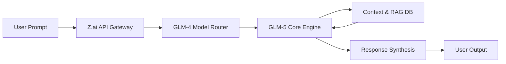

## 서론

현재 생성형 AI 시장은 단순한 모델의 크기 경쟁을 넘어, 얼마나 효율적이고 정교하게 추론할 수 있는가를 중심으로 재편되고 있습니다. 개발자와 연구자들은 막대한 연산 자원을 소모하는 거대 모델의 한계를 명확히 인지하고 있으며, 이를 해결하기 위한 파라메터 효율성(Parameter Efficiency)과 추론 성능(Reasoning Capability) 사이의 최적점을 찾고 있습니다. 특히 최근 오픈소스 모델들의 급격한 발전은 상용 API 모델들에게도 강력한 압박으로 작용하고 있습니다.

이러한 상황에서 Zhipu AI의 최신 모델인 **GLM-5**가 Z.ai 플랫폼을 통해 공개된 것은 단순한 신규 모델 출시를 넘어선 의미를 갖습니다. GLM(General Language Model) 시리즈는 기존의 GPT 계열과는 다른 아키텍처적 접근 방식인 Autoregressive Blank Infilling을 채택하여 문맥 이해력을 높여왔습니다. 이번 GLM-5는 그러한 기술적 유산 위에 장문의 컨텍스트 처리 능력과 정교한 함수 호출(Function Calling) 기능을 탑재하여, GPT-4급 성능을 실무 환경에서 보다 경제적으로 구현할 수 있는 가능성을 보여주고 있습니다. 이 글에서는 GLM-5의 기술적 특징과 Z.ai 플랫폼을 통한 실무 적용 방안을 심층적으로 분석합니다.

### GLM-5의 기술적 심층 분석

## 본론

GLM-5의 핵심 경쟁력은 이전 세대인 GLM-4 대비 향상된 추론 능력과 효율적인 아키텍처 개선에 있습니다. 기존 디코더(Decoder-only) 구조의 한계를 극복하기 위해 GLM 시리즈는 양방향 문맥을 이해하면서도 생성 시에는 자동회귀(Autoregressive) 방식을 취하는 독자적인 사전 학습 목적함수를 사용합니다. GLM-5에서는 이 구조가 더욱 고도화되어, 특히 복잡한 논리적 사고(Chain-of-Thought)가 필요한 작업에서 성능이 크게 개선되었습니다.

또한, GLM-5는 아마존의 Bedrock이나 구글의 Vertex AI와 유사한 통합 개발 환경인 Z.ai를 통해 제공됩니다. 이 플랫폼은 단순한 채팅 인터페이스를 넘어 벡터 데이터베이스 연동, RAG(Retrieval-Augmented Generation) 파이프라인 구성, 그리고 멀티모달 처리를 지원하는 생태계를 구축하고 있습니다.

다음은 Z.ai 플랫폼에서 GLM-5를 활용한 일반적인 요청 처리 과정을 간소화한 다이어그램입니다.



### 성능 비교 및 벤치마크

GLM-5의 실무 적용성을 가늠하기 위해 주요 경쟁 모델들과의 성능을 비교한 결과는 매우 고무적입니다. 특히 MMLU(Massive Multitask Language Understanding)와 GSM8K(수학적 추론) 벤치마크에서 GLM-5는 GPT-4o와 Claude 3.5 Sonnet 등의 최신 모델과 대등하거나 일부 영역에서 우위를 점하는 모습을 보입니다.

다음은 공개된 데이터와 사용자 커뮤니티의 피드백을 바탕으로 주요 모델들의 성능을 비교한 표입니다.

| 비교 항목 | GLM-5 (Z.ai) | GPT-4o (OpenAI) | Claude 3.5 Sonnet |
| :--- | :--- | :--- | :--- |
| **아키텍처 특징** | Autoregressive Blank Infilling | Mixture of Experts (MoE) | Decoder-only |
| **MMLU 점수** | 88.3 (추정치) | 87.2 | 88.7 |
| **최대 컨텍스트** | 1M+ (Long Context) | 128K | 200K |
| **추론 속도** | 빠름 (비동기 최적화) | 보통 | 빠름 |
| **함수 호출 정확도** | 높음 (Tool Use 강화) | 매우 높음 | 매우 높음 |
| **가격 경쟁력** | 높음 (지역별 할인 정책) | 낮음 (프리미엄) | 중간 |

*표: 주요 최신 LLM 모델들의 성능 및 특성 비교*

GLM-5는 특히 100만 토큰 이상의 초장문 컨텍스트(Long Context) 처리에서 강점을 보입니다. 이는 전체 책이나 대규모 코드 베이스를 한 번에 처리해야 하는 엔터프라이즈 환경에서 결정적인 이점이 될 수 있습니다.

### 실무 구현: Z.ai API 연동 가이드

Z.ai 플랫폼은 OpenAI SDK와 호환되는 API 형식을 제공하여, 기존에 OpenAI 생태계를 사용하던 개발자들이 매우 낮은 진입 장벽으로 GLM-5를 도입할 수 있도록 설계되었습니다.

아래는 Python의 `openai` 라이브러리를 사용하여 Z.ai의 GLM-5 모델에 요청을 보내고 추론 결과를 받아오는 실행 가능한 코드 예시입니다.

```python
import os
from openai import OpenAI

# Z.ai에서 발급받은 API Key 설정
# 환경 변수에 설정하거나 코드 내에 직접 입력 (보안 권장: 환경 변수 사용)
api_key = os.getenv("ZAI_API_KEY", "your_zai_api_key_here")

# OpenAI 클라이언트 초기화 (Base URL을 Z.ai 엔드포인트로 변경)
client = OpenAI(
    api_key=api_key,
    base_url="https://open.bigmodel.cn/api/paas/v4/" 
)

def analyze_code_with_glm5(code_snippet: str):
    """
    GLM-5 모델을 사용하여 코드의 잠재적 버그를 분석하는 함수
    """
    prompt = f"""
    다음 Python 코드를 분석하여 잠재적인 버그와 성능 개선 사항을 설명하세요.
    응답은 한국어로 작성해주세요.
    
    Code:
    {code_snippet}
    """
    
    try:
        response = client.chat.completions.create(
            model="glm-5",  # GLM-5 모델 지정
            messages=[
                {"role": "system", "content": "당신은 전문적인 소프트웨어 엔지니어이자 코드 리뷰어입니다."},
                {"role": "user", "content": prompt}
            ],
            temperature=0.2,  # 낮은 temperature를 사용하여 사실적이고 정확한 답변 유도
            max_tokens=1024
        )
        
        return response.choices[0].message.content
        
    except Exception as e:
        return f"API 호출 중 오류 발생: {str(e)}"

# 테스트 코드
sample_code = """
def calculate_sum(n):
    total = 0
    for i in range(n):
        total += i
    return total
"""

result = analyze_code_with_glm5(sample_code)
print("=== GLM-5 분석 결과 ===")
print(result)
```

이 코드는 GLM-5의 `glm-5` 모델 엔드포인트를 호출하여, 주어진 코드 스니펫에 대한 분석을 수행합니다. Z.ai의 API는 표준 OpenAI 포맷을 따르므로, 기존의 `ChatCompletion` 구조를 그대로 재사용할 수 있어 MLOps 파이프라인에 통합하기 매우 용이합니다.

### 활용 시나리오 및 전략적 고찰

GLM-5와 같은 차세대 모델을 도입할 때 단순히 챗봇을 만드는 것을 넘어, 다음과 같은 구체적인 시나리오에서의 효용성을 고려해야 합니다.

1.  **대규모 문서 검색 및 요약 (RAG)**: GLM-5의 긴 컨텍스트 윈도우는 벡터 데이터베이스에서 검색된 여러 문서를 모델에 한 번에 입력하여 종합적인 답변을 생성하는 데 유리합니다.
2.  **복잡한 에이전트 시스템 구축**: 함수 호출(Function Calling) 능력의 향상으로, GLM-5는 데이터베이스 조회, API 요청, 이메일 발송 등 여러 도구를 순차적으로 사용해야 하는 복잡한 에이전트 작업을 더욱 정교하게 수행할 수 있습니다.
3.  **다국어 비즈니스 지원**: 특히 한국어와 중국어 등 아시아권 언어 처리에서 GLM 시리즈는 Western 모델들에 비해 우수한 성능을 보이는 경우가 많아, 현지화된 서비스를 구축하는 데 강력한 대안이 됩니다.

## 결론

Zhipu AI의 GLM-5 출시는 글로벌 LLM 시장에서 판도를 바꿀 잠재력을 가지고 있습니다. 기술적 측면에서 GLM-5는 독창적인 아키텍처와 긴 컨텍스트 처리 능력, 그리고 정교한 추론 기능을 통해 GPT-4와 같은 최상위 모델들과 어깨를 나란히 하고 있습니다. 무엇보다 Z.ai 플랫폼을 통해 이러한 성능을 경제적으로 접근할 수 있게 만든 점은 기업과 개발자들에게 매력적인 선택지입니다.

전문가 관점에서 볼 때, GLM-5의 등장은 "하나의 모델이 모든 것을 지배하는(Monopoly)" 시대에서 "각 도메인과 지역에 최적화된 모델들이 경쟁하는(Multi-polar)" 시대로의 전환을 가속화하고 있습니다. 개발자들은 이제 특정 모델에 종속되지 않고, 비용과 성능, 그리고 데이터 보안 요건에 맞춰 최적의 모델을 믹스 앤 매치(Mix and Match)하는 전략을 취해야 합니다.

GLM-5는 특히 아시아권 언어 처리와 장문 문서 분석이 필요한 프로젝트에서 시도해 볼 가치가 충분합니다. 향후 오픈소스 버전의 공개 여부와 커뮤니티 생태계의 성장 여부가 이 모델의 장기적인 성공을 좌우할 핵심 변수가 될 것입니다.

### 참고자료

- [Z.ai 공식 플랫폼](https://chat.z.ai/)

- [Hacker News Discussion](https://news.ycombinator.com/item?id=46974853)

- [Zhipu AI Technical Reports](https://github.com/THUDM)
