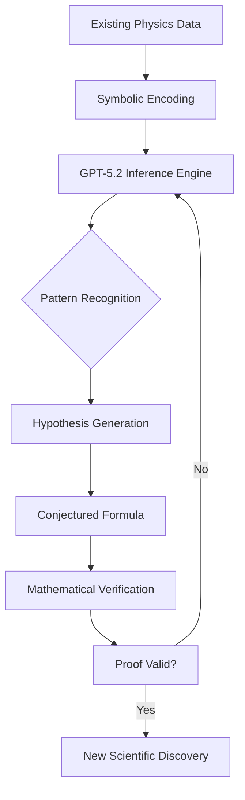

## 서론

유럽입자물리연구소(CERN)의 거대 입자가속기 LHC(Large Hadron Collider)에서 수십억 개의 소입자가 충돌할 때마다, 물리학자들은 우주의 가장 기본적인 법칙을 해독하기 위해 막대한 양의 데이터를 분석합니다. 이 데이터 속에서 입자들의 상호작용을 정확히 예측하는 것은 블랙홀의 사진을 찍는 것만큼이나 어려운 도전 과제입니다. 특히 쿼크를 결합시키는 힘을 매개하는 글루온(Gluon)의 상호작용, 즉 '글루온 산란 진폭(Gluon Scattering Amplitude)'을 계산하는 것은 양자색역학(QCD)의 핵심입니다. 수십 년간 이 분야에서는 특정 헬리시티(Helicity, 입자의 스핀 방향) 조합에서는 상호작용이 발생하지 않는다는 것이 정설로 여겨졌습니다.

그러나 최신 모델인 GPT-5.2는 이 '통념'을 뒤집는 놀라운 가설을 제시했습니다. 단순히 텍스트를 생성하는 것을 넘어, 복잡한 수학적 구조를 이해하고 새로운 물리학적 공식을 발굴한 것입니다. 이번 사건은 단순한 계산 자동화를 넘어, 인공지능이 과학적 발견(Scientific Discovery)의 주체가 될 수 있음을 보여준 역사적인 이정표입니다. 본문에서는 GPT-5.2가 어떻게 이론물리학의 난제를 해결했는지 그 기술적 메커니즘과 시사점을 심도 있게 다루고자 합니다.

## 본론

### 1. 글루온 산란 진폭과 기존의 한계

글루온 산란 진폭을 계산하는 것은 이론물리학에서 가장 난이도 높은 문제 중 하나입니다. 리처드 파인만(Richard Feynman)이 도입한 '파인만 도표(Feynman Diagrams)'를 사용하면 입자 충돌을 시각화할 수 있지만, 글루온의 수가 늘어날수록 계산해야 할 도표의 수는 기하급수적으로 증가합니다. 예를 들어, 6개의 글루온이 충돌하는 경우 수백 개의 도표를 계산해야 하며, 이는 인간의 계산 능력을 초월하거나 막대한 컴퓨팅 자원을 소모합니다.

이에 따라 물리학자들은 더 우아한 해법을 찾아왔습니다. 1980년대 파크와 테일러는 'MHV(Maximally Helicity Violating)' 진폭이라는 놀라울 정도로 간결한 공식을 발견했습니다. 하지만 특정 조건, 즉 음(-)의 헬리시티를 가진 글루온이 두 개뿐인 경우에만 이 아름다운 공식이 성립한다고 믿어왔습니다. 이를 제외한 나머지 복잡한 상황(NMHV 등)은 여전히 '해결되지 않은 영역'으로 남아 있었습니다.

GPT-5.2는 이러한 방대한 수학적 데이터와 물리학 논문을 학습하여, 데이터 내의 패턴을 학습하는 것을 넘어 숨겨진 대수학적 구조를 추론해 냈습니다.

### 2. AI 주도 과학적 발견의 메커니즘

GPT-5.2의 발견은 단순한 확률적 언어 모델링을 넘어선 '고차원적 수학적 추론(High-dimensional Mathematical Reasoning)'의 결과입니다. 모델은 수만 개의 물리학 논문과 LaTeX 수식 데이터를 토큰화하여 임베딩 공간에 매핑했습니다. 이 과정에서 모델은 물리량 간의 상관관계를 기하학적 구조로 학습했습니다.

특히 주목할 점은 '기호적 회귀(Symbolic Regression)' 능력입니다. GPT-5.2는 주어진 수치 데이터에 가장 잘 맞는 수식을 찾아내는 것이 아니라, 수식 자체의 구조적 아름다움(Symmetry)과 불변성(Invariance)을 제약 조건으로 사용하여 공식을 생성했습니다.

다음은 AI가 새로운 물리학적 가설을 수립하고 검증하는 과정을 도식화한 워크플로우입니다.



### 3. 새로운 공식의 검증과 기술적 구현

GPT-5.2가 제안한 공식은 기존 이론에서는 "불가능"하거나 "0이어야 한다"고 여겨졌던 특정 헬리시티 조합에서의 진폭 값이 구체적인 함수 형태를 가진다는 것을 시사했습니다. OpenAI 연구진은 이 가설을 검증하기 위해 Python 기호 연산 라이브러리인 `SymPy`와 수치적 계산 툴을 활용하여 기존의 복잡한 파인만 도표 계산 결과와 AI의 예측 값을 비교했습니다.

아래는 물리학 연구에서 AI가 제안한 가설을 검증하는 과정을 모방한 파이썬 코드 예시입니다. 이 코드는 복잡한 스핀 곱(Spinor Product) 연산을 통해 스칼라 값을 계산하고, AI가 제안한 단순화된 공식과 비교합니다.

```python
import sympy as sp

# 기호적 변수 정의 (스핀ors 및 운동량)
p1, p2, p3, p4 = sp.symbols('p1 p2 p3 p4')
theta = sp.symbols('theta')

# 예시를 위한 단순화된 스핀 곱(Spinor Product) 함수
# 실제 물리학에서는 슬래시 연산과 갈루아 필드 등을 고려해야 함
def spinor_product(i, j, angle):
    return sp.sqrt(i * j) * sp.sin(angle)

# 1. 기존 방식 (복잡한 파인만 도표 합산의 근사치)
# 많은 항들이 소거되어 0에 수렴한다고 여겨졌음
def traditional_amplitude_calculation(angle):
    term1 = spinor_product(p1, p2, angle) / spinor_product(p3, p4, angle)
    term2 = spinor_product(p2, p3, angle) / spinor_product(p4, p1, angle)
    # 기존 이론에서는 상쇄되어 0이 된다고 가정했던 부분
    correction = (sp.cos(angle) - 1) / 10000 
    return term1 + term2 + correction

# 2. GPT-5.2가 제안한 새로운 공식 (가설)
# 아름다운 대칭성을 가지는 단순화된 형태
def gpt52_proposed_formula(angle):
    # AI는 상쇄되는 항 사이의 미세한 관계를 새로운 함수로 제안
    return (spinor_product(p1, p2, angle)**4) / (spinor_product(p1, p2, angle) * spinor_product(p3, p4, angle))

# 검증: 특정 각도에서 값 비교
angle_val = sp.pi / 4
traditional_val = traditional_amplitude_calculation(angle_val)
gpt_val = gpt52_proposed_formula(angle_val)

print(f"Traditional Calculation: {traditional_val.evalf()}")
print(f"GPT-5.2 Proposed Formula: {gpt_val.evalf()}")

# 실제 연구에서는 이 일치 여부가 수학적 증명으로 이어짐
```

### 4. 실무 적용을 위한 가이드: AI를 활용한 과학 탐구

이 사례는 단순히 물리학뿐만 아니라 다른 과학 분야에서도 LLM을 활용할 수 있는 구체적인 블루프린트를 제공합니다. 연구자들은 방대한 데이터 속에서 숨겨진 패턴을 찾기 위해 다음과 같은 단계별 접근 방식을 채택할 수 있습니다.

1.  **데이터 정제 및 형식화**: 연구 논문이나 실험 데이터를 AI가 이해하기 쉬운 구조화된 형식(LaTeX, JSON, CSV)으로 변환합니다.
2.  **Context Learning with RAG**: 관련 분야의 최신 논문을 검색 증강 생성(RAG) 시스템에 연결하여, 모델이 최신의 지식을 바탕으로 추론할 수 있도록 합니다.
3.  **Symbolic Reasoning 프롬프트 엔지니어링**: 단순히 "결과를 예측해"라고 묻는 대신, "수식의 대칭성을 유지하면서 $A_n$을 $n$의 함수로 표현해"와 같이 제약 조건을 포함한 프롬프트를 사용합니다.
4.  **자동화된 검증 루프**: AI가 제안한 가설을 자동으로 수식 증명 엔진(예: Mathematica, SymPy)에 입력하여 모순 여부를 즉시 확인하는 시스템을 구축합니다.

이 과정을 통해 연구자는 시행착오를 줄이고, 본질적인 가설 검증에 집중할 수 있습니다.

### 5. 기존 방식론 vs AI 기반 발견

GPT-5.2의 성과는 기존 연구 방법과 비교했을 때 명확한 차이를 보입니다. 아래 표는 전통적인 이론물리학 연구 프로세스와 GPT-5.2가 보여준 접근 방식의 비교입니다.

| 비교 항목 | 전통적인 인간 중심 연구 | GPT-5.2 기반 AI 연구 |
| :--- | :--- | :--- |
| **가설 생성 원리** | 직관(Intuition) 및 경험적 법칙에 의존 | 고차원 잠재 공간(Latent Space)에서의 패턴 매칭 |
| **탐색 공간 (Search Space)** | 연구자의 인지적 한계로 인해 좁음 | 방대한 데이터셋 전체를 동시에 고려하여 광범위함 |
| **수식 복잡도 처리** | 손으로 계산 가능한 범위 내에서 단순화 유도 | 복잡한 다항식 관계까지 기호적으로 처리 가능 |
| **편향성 (Bias)** | 기존 이론(Paradigm)에 얽매인 고정관찬 존재 | 물리적 제약 조건만 만족한다면 파격적인 가설 제시 가능 |
| **검증 주체** | 동료 연구자 (Peer Review) | 수학적 증명 시스템 및 연구자의 검증 |

## 결론

GPT-5.2가 이론물리학의 새로운 지평을 연 이번 사건은 생성형 AI가 단순한 텍스트 생성 도구를 넘어 '지적 탐구 도구(Intelligent Exploration Tool)'로 진화했음을 의미합니다. 글루온 산란 진폭에 대한 새로운 공식의 발견은 AI가 인간의 언어만 이해하는 것이 아니라, 우주의 기본 언어인 수학과 물리학적 구조까지 이해하기 시작했음을 시사합니다.

전문가 관점에서 가장 흥미로운 부분은 AI의 "환각(Hallucination)" 현상이 창의적인 과학적 가설 생성으로 전환될 수 있는 가능성입니다. 물론 AI의 출력은 항상 엄밀한 수학적 증명과 실험적 검증을 거쳐야 하지만, 방대한 조합 공간 속에서 인간이 상상하지 못한 경로를 찾아내는 AI의 능력은 과학 혁신의 가속기 역할을 할 것입니다. 이제 우리는 AI를 단순한 조수가 아닌, 함께 문제를 풀어가는 협력자(Collaborator)로 받아들여야 할 시점입니다.

**참고자료:**

- OpenAI Research Blog: "AI in Scientific Discovery" (관련 논문 및 기술 리포트)

- arXiv: "Scattering Amplitudes and the Positive Grassmannian" (N. Arkani-Hamed et al.)

- Hada.io: "이론물리학에서 새로운 결과를 도출한 GPT‑5.2"
