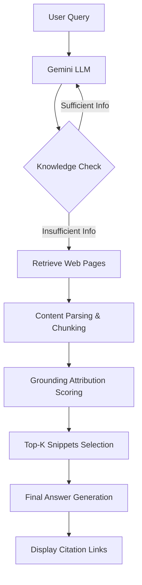

## 서론

검색 엔진 최적화(SEO)의 패러다임이 '링크'에서 '언급(Citation)'으로 전환되고 있습니다. 최근 구글이 AI 검색 결과(Google AI Overviews)에서 웹페이지의 내용을 발췌하여 답변의 근거(Grounding)로 제시하는 방식을 도입하면서, 단순히 상위 랭크에 노출되는 것을 넘어 AI 모델이 **나의 콘텐츠를 신뢰할 수 있는 정보원으로 선택하게 만드는 것**이 새로운 과제로 떠올랐습니다.

많은 콘텐츠 제작자와 SEO 전문가들이 궁금해하는 질문은 하나입니다. "수만 개의 웹페이지 중에서 왜 AI는 하필 이 문장을 뽑아서 답변의 근거로 삼았을까?" 이는 단순한 키워드 매칭의 문제가 아닙니다. 최신 연구에 따르면, 이는 구글의 거대 언어 모델인 Gemini가 가진 'Grounding' 메커니즘, 즉 모델의 환각(Hallucination)을 방지하고 팩트에 기반하여 답변을 생성하도록 제약하는 과정과 깊은 관련이 있습니다.

본 분석은 SEO 전문가 Dan Petrovic가 Google Gemini API의 원시 데이터를 역추적하여 실증적으로 밝혀낸 'Grounding Snippet 선정 알고리즘'의 기술적 원리를 파고듭니다. AI가 콘텐츠를 읽고, 이해하고, 선택하는 메커니즘을 이해하는 것은 생성형 AI 시대의 검색 트래픽을 선점하기 위한 필수 조건입니다.

## 본론

### Gemini와 Grounding: 기술적 배경

구글 AI 검색의 핵심은 거대 언어 모델(LLM)의 창의력과 검색 엔진의 팩트성을 결합하는 'RAG(Retrieval-Augmented Generation)' 아키텍처에 있습니다. Gemini 모델이 사용자의 질문을 처리할 때, 모델 자체의 내장된 지식만으로 답변하는 것이 아니라, 외부 검색 결과(웹페이지)를 실시간으로 참조하여 답변을 생성합니다. 이때 중요한 역할을 하는 것이 바로 **Grounding(근거 제공)**입니다.

Grounding은 LLM이 생성한 텍스트가 검색된 문서의 특정 부분(Snippet)에 실제로 기반하고 있음을 보장하는 메커니즘입니다. Dan Petrovic의 연구는 Gemini API가 반환하는 원시 JSON 데이터를 분석하여, 모델이 웹페이지 내의 수많은 문장 중 어떤 텍스트 청크(Chunk)를 'Grounding Support'로 선정했는지를 시각화했습니다.

분석 결과, AI는 단순히 키워드가 많이 포함된 문장을 선택하는 것이 아니라, **의미적 밀도(Semantic Density)**가 높고 **문맥적으로 독립적**인 문장을 선호하는 것으로 드러났습니다. 즉, AI가 답변을 구성할 때 "이 정보는 출처가 명확하므로 인용해도 안전하다"고 판단하는 문장을 뽑아내는 과정이라 볼 수 있습니다.

### Grounding 메커니즘의 데이터 흐름

AI가 검색 결과에서 답변을 생성하고 근거를 추출하는 과정은 아래와 같이 단순화할 수 있습니다. 사용자의 질문부터 최종적인 인용 생성까지의 파이프라인을 살펴보겠습니다.



이 과정에서 가장 중요한 단계는 `F`와 `G`입니다. Gemini는 웹페이지 전체를 하나의 문서로 보지 않고, 여러 개의 텍스트 청크(Chunk)로 분할한 뒤, 각 청크가 질문과 얼마나 관련성이 높은지(Semantic Relevance)와 그 내용이 사실적으로 얼마나 신뢰할 수 있는지(Factual Confidence)를 계산하여 점수를 매깁니다. 점수가 가장 높은 상위 K개의 청크가 최종적으로 'Grounding Snippet'이 되어 AI 답변 하단에 표시되는 것입니다.

### 데이터 분석: 어떤 콘텐츠가 선택되는가?

API 원시 데이터 분석을 통해 도출된 Grounding Snippet 선정의 주요 패턴은 다음과 같습니다.

1.  **정보의 응집성 (Information Density)**     AI는 배경 설명이나 접속사가 길게 늘어진 문장보다, 핵심 명사와 동사가 명확한 문장을 선호합니다. 예를 들어, "에너지 효율이란 매우 중요한데, 특히 오늘날과 같은 환경에서는..." 같은 서론보다는 "2023년 기준 리튬 이온 배터리의 에너지 효율은 90%입니다."와 같이 팩트가 직관적으로 드러나는 문장을 선택합니다.

2.  **엔티티 명확성 (Entity Clarity)**     문장 내에서 대명사(그것, 이것 등)의 사용을 최소화하고 고유명사나 구체적인 주어를 사용하는 문장의 Grounding 점수가 더 높게 나타납니다. 모델이 문맥을 추론해야 하는 문장보다, 독립적으로 해석 가능한 문장이 인용하기 더 안전하기 때문입니다.

3.  **구조적 형식 (Structural Format)**     본문 텍스트 중에서도 `<ul>`, `<ol>`, `<table>` 태그로 감싸진 구조화된 데이터, 혹은 목록 형식의 문장은 매우 높은 확률로 Snippet으로 추출됩니다. 이는 LLM이 트레이닝 과정에서 구조화된 데이터를 학습한 경향이 강하기 때문입니다.

다음은 실제 개발자가 Gemini API를 활용하여 특정 웹페이지가 어떤 Snippet으로 추출될 가능성이 높은지 테스트할 수 있는 파이썬 시뮬레이션 코드입니다.

```python
import json

# 시뮬레이션을 위한 가상의 Gemini API Grounding 응답 구조
# 실제 API 응답에는 'groundingAttribution' 등의 필드가 포함됩니다
mock_gemini_response = {
    "candidates": [
        {
            "content": {
                "parts": [
                    {
                        "text": "리튬 이온 배터리의 수명은 일반적으로 500~1000회 충전 사이클입니다."
                    }
                ]
            },
            "groundingAttribution": [
                {
                    "source_id": "web_page_1",
                    "confidence_score": 0.95,
                    "snippet": "2024년 기준 리튬 이온 배터리의 평균 수명은 500에서 1000회 사이의 충전 사이클을 유지합니다."
                },
                {
                    "source_id": "web_page_2",
                    "confidence_score": 0.82,
                    "snippet": "충전 효율을 높이기 위해서는 온도 관리가 중요합니다."
                }
            ]
        }
    ]
}

def analyze_grounding_data(response):
    print("=== AI Grounding Snippet 분석 ===")
    candidates = response.get('candidates', [])
    
    for cand in candidates:
        attributions = cand.get('groundingAttribution', [])
        print(f"생성된 답변: {cand['content']['parts'][0]['text']}
")
        print(f"{'근거 출처 (Grounding Source)':<30} | {'신뢰도 점수':<10} | {'추출된 스니펫 (Snippet)':<50}")
        print("-" * 100)
        
        for attr in sorted(attributions, key=lambda x: x['confidence_score'], reverse=True):
            source = attr['source_id']
            score = attr['confidence_score']
            snippet = attr['snippet']
            
            # 시각적 강조 (신뢰도 0.9 이상)
            marker = "[HIGH]" if score > 0.9 else "[LOW] "
            print(f"{marker} {source:<28} | {score:<10} | {snippet:<50}")

# 실행
analyze_grounding_data(mock_gemini_response)
```

이 코드는 AI가 답변을 생성하기 위해 참조한 웹페이지의 특정 텍스트 조각(Snippet)과 해당 정보에 대한 모델의 신뢰도(Confidence Score)를 출력합니다. 실제 SEO 분석에서는 이와 유사한 방식으로 API를 호출하여 자사 콘텐츠가 어떤 Snippet으로 추출되었는지 모니터링할 수 있습니다.

### 기존 SEO vs AI Grounding 최적화 비교

생성형 AI 시대에 맞춰 콘텐츠 전략을 어떻게 수정해야 할까요? 아래 표는 전통적인 SEO와 AI Grounding 최적화의 차이점을 명확히 보여줍니다.

| 비교 항목 | 기존 SEO (Blue Links) | AI Grounding 최적화 (AI Overviews) |
| :--- | :--- | :--- |
| **핵심 목표** | 검색 결과 상위 노출 (Top 10) | 답변 생성을 위한 '근거'로 선정 |
| **주요 랭킹 요인** | 백링크, 도메인 권위, 키워드 빈도 | 문장의 의미적 명확성, 팩트 신뢰도, 구조화 |
| **타겟 키워드** | 짧은 키워드 (Short-tail) | 구체적인 질의 (Conversational Query) |
| **콘텐츠 형식** | 제목(H1), 메타 디스크립션 중심 | 본문 내의 정의(Definition), 목록(List), 데이터 테이블 |
| **성과 지표** | CTR (클릭률), 이탈률 | Citation Count (인용 횟수), Zero-Click 노출 |

### 실무 적용 가이드: Grounding-friendly 콘텐츠 작성법

연구 결과를 바탕으로 AI 모델이 콘텐츠를 근거로 선택할 확률을 높이는 단계별 가이드를 제안합니다.

1.  **Step 1: Q&A 형식의 문장 구조 배치**     사용자가 검색할 법한 질문을 본문에 헤딩이나 문단으로 포함시키고, 그 바로 다음 문장에 간결한 답변을 배치하세요. AI는 질문-답변 쌍(QA Pair)을 인용하기 가장 좋은 구조로 인식합니다.

2.  **Step 2: "무엇(What)"과 "얼마나(How much)" 명시하기**     정의를 설명할 때 "A는 B이다"와 같은 명제 구조를 사용하고, 수치나 데이터가 있다면 반드시 구체적인 수치와 단위를 함께 명시하세요. AI는 수치 데이터가 포함된 문장을 매우 신뢰하며 인용 경향이 높습니다.

3.  **Step 3: 불필요한 수식어 제거 (Sentence Pruning)**     문장 앞부분에 "최근 많은 사람들이...", "아시다시피..."와 같이 주관적이거나 문맥에 의존적인 수식어를 제거하세요. 문장의 주어부가 명확할수록 Grounding 스코어는 상승합니다.

4.  **Step 4: 구조화된 데이터 활용**     긴 설명보다는 핵심 요점을 `<ul>` (불렛 리스트) 형태로 정리하세요. 리스트 형태의 텍스트는 AI가 답변을 생성할 때 포맷을 그대로 차용하기 때문에 인용 확률이 비약적으로 높아집니다.

## 결론

Google AI 검색의 도입은 SEO의 '검색'에서 '탐색(Discovery)'으로의 변화를 의미합니다. Dan Petrovic의 실증 분석이 밝혀낸 바와 같이, AI는 우리가 생각하는 것보다 훨씬 더 논리적이고 엄격한 기준(의미적 밀도, 팩트 명확성)을 통해 콘텐츠를 평가합니다.

이제 우리는 단순히 검색 로봇을 위한 글을 쓰는 것이 아니라, **거대 언어 모델이 신뢰할 수 있는 참고서**를 집필해야 합니다. 기술적인 깊이에서 볼 때, 이는 텍스트 생성의 최전선에 있는 Transformer 모델의 어텐션 메커니즘과 패턴 인식 능력을 역이용하는 전략입니다. 명확하고, 밀도 높으며, 구조화된 정보를 제공하는 것이 바로 AI 시대 검색 트래픽을 독점하는 핵심 열쇠가 될 것입니다.

### 참고자료

- [Dejan SEO: Google AI Snippet Analysis](https://news.hada.io/topic?id=26991)

- Google DeepMind: Gemini Technical Report

- arXiv: "Retrieval-Augmented Generation for Large Language Models: A Survey"
