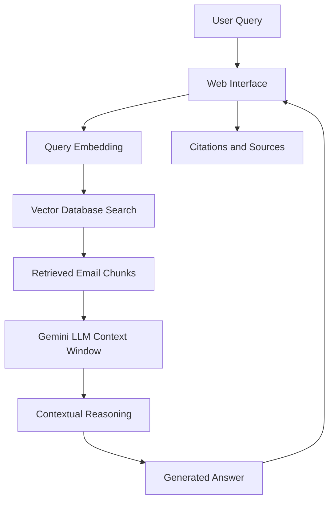

## 서론

수천, 수만 건의 이메일과 문서가 뒤섞인 방대한 데이터베이스 앞에서 분석가가 겪는 가장 큰 고통은 무엇일까요? 바로 '바늘과 건초더미' 문제입니다. 전통적인 키워드 검색(CTRL+F)은 특정 인물이나 날짜를 찾는 데에는 탁월하지만, "누가 누구에게 가장 빈번하게 금전적 거래를 언급했는가?"와 같은 맥락을 파악해야 하는 복합적인 질의에는 무력합니다. 최근 화제가 된 'Jemini'는 구글의 최신 LLM인 'Gemini'를 활용하여 제프리 엡스틴 관련 이메일 데이터를 탐색하는 인터랙티브 웹 인터페이스로, 이러한 비정형 데이터 분석의 난제를 기술적으로 해결한 사례입니다.

단순히 흥미로운 시각화 도구를 넘어, Jemini는 방대한 텍스트 코퍼스(Corpus)를 LLM이 이해하고 추론할 수 있는 형태로 변환하여, 사용자가 마치 해당 계정에 로그인한 것처럼 데이터를 조회할 수 있게 합니다. 이는 법률 디스커버리(eDiscovery), 기업 내부 감사, 저널리즘 조사 등 데이터 민감도가 높고 분석 난이도가 복잡한 분야에서 LLM이 어떻게 활용될 수 있는지를 보여주는 중요한 Motivation을 제공합니다.

## 본론

### 기술적 배경 및 원리: RAG와 시맨틱 서치

Jemini의 핵심은 최신 LLM의 강력한 추론 능력과 대규모 언어 모델의 긴 컨텍스트 창(Context Window)을 결합한 것입니다. 하지만 수십만 건의 이메일을 단순히 프롬프트에 넣는 것은 불가능하며 비효율적입니다. 여기서 사용되는 핵심 패턴은 **RAG(Retrieval-Augmented Generation)**입니다.

RAG는 사용자의 질문을 벡터 공간에서 의미적으로 유사한 데이터 청크(Chunk)로 변환하여 검색(Retrieve)하고, 이를 LLM의 프롬프트에 포함시켜 답변을 생성(Generation)하는 방식입니다. Jemini는 이 과정을 통해 사용자가 자연어로 질문하면, 관련 이메일의 내용을 즉시 검색하여 '마치 그 사람이 쓴 것처럼' 요약하거나 답변을 생성합니다.

다음은 Jemini와 유사한 시스템의 추상적인 아키텍처를 나타낸 다이어그램입니다.



### 구현 가이드: Python과 Gemini API를 활용한 시맨틱 이메일 서치

실제로 Jemini와 유사한 기능을 구현하려면 어떻게 해야 할까요? 여기서는 Python과 구글의 `langchain-google-genai` 라이브러리를 사용하여 간단한 프로토타입 코드를 작성해 보겠습니다. 이 코드는 이메일 데이터를 벡터화하고, 사용자의 질문에 따라 관련 이메일을 검색하여 답변을 생성하는 과정을 보여줍니다.

```python
import os
from typing import List
from langchain_google_genai import ChatGoogleGenerativeAI, GoogleGenerativeAIEmbeddings
from langchain_community.vectorstores import FAISS
from langchain_community.document_loaders import TextLoader
from langchain.text_splitter import RecursiveCharacterTextSplitter

# 1. 환경 설정 (Google API Key 필요)
os.environ["GOOGLE_API_KEY"] = "YOUR_GOOGLE_API_KEY"

# 2. 데이터 로드 및 전처리 (가상의 이메일 데이터)
# 실제 시나리오에서는 이메일 파일(.eml, .mbox)을 파싱하여 텍스트로 변환
loader = TextLoader("epstein_emails_data.txt") 
documents = loader.load()

# 3. 텍스트 청킹 (Text Chunking)
# LLM의 컨텍스트 윈도우 효율성을 위해 텍스트를 적절한 크기로 나눔
text_splitter = RecursiveCharacterTextSplitter(chunk_size=1000, chunk_overlap=100)
texts = text_splitter.split_documents(documents)

# 4. 임베딩 및 벡터 데이터베이스 생성
embeddings = GoogleGenerativeAIEmbeddings(model="models/embedding-001")
db = FAISS.from_documents(texts, embeddings)

# 5. LLM 모델 초기화 (Gemini Pro)
llm = ChatGoogleGenerativeAI(model="gemini-pro", temperature=0.3)

def search_emails(query: str) -> str:
    # 6. 관련 문서 검색 (Retrieval)
    # 유사도 점수가 높은 상위 4개의 문서 청크를 가져옴
    docs = db.similarity_search(query, k=4)
    context_text = "

".join([doc.page_content for doc in docs])

    # 7. 프롬프트 구성 및 답변 생성 (Generation)
    prompt = f"""
    You are an assistant analyzing the email dataset of a specific individual.
    Based on the following email excerpts, answer the user's question.
    If the answer is not in the context, say that you don't know.
    
    Context:
    {context_text}
    
    Question: {query}
    Answer:
    """
    
    response = llm.invoke(prompt)
    return response.content

# 실행 예시
if __name__ == "__main__":
    user_question = "Who discussed the island plan most frequently in June?"
    answer = search_emails(user_question)
    print(f"Q: {user_question}
A: {answer}")
```

### 기존 검색 방식 vs LLM 기반 탐색 (Jemini) 비교

Jemini와 같은 LLM 기반 접근 방식이 기존의 정규 표현식(Regex)이나 키워드 검색 엔진과 어떻게 다른지 명확히 이해할 필요가 있습니다. 아래 표는 두 방식의 기술적 차이를 비교한 것입니다.

| 비교 항목 | 기존 키워드 검색 (Keyword Search) | LLM 기반 시맨틱 서치 (Jemini/Gemini) |
| :--- | :--- | :--- |
| **검색 원리** | 사전적 일치 (Lexical Match) | 의미적 유사도 (Semantic Similarity) |
| **질의 방식** | 특정 단어, 연산자(AND, OR, NOT) 필수 | 자연어 질문 가능 |
| **맥락 이해** | 없음 (단어 자체만 검색) | 있음 (문맥, 뉘앙스, 의도 파악) |
| **요약 능력** | 없음 (사용자가 직접 읽어야 함) | 있음 (여러 문서를 종합하여 답변 생성) |
| **활용 사례** | 특정 이메일 찾기, 필터링 | '누가 가장 비판적인 태도를 취했나?' 등의 분석 |

### 실무 적용을 위한 Step-by-Step 가이드

조사 연구원이나 데이터 분석가가 Jemini와 유사한 내부 시스템을 구축하기 위해 따라야 할 단계별 절차는 다음과 같습니다.

1.  **데이터 수집 및 정제 (Ingestion)**     *   원본 데이터(.pst, .mbox 등)를 파싱하여 텍스트만 추출합니다.     *   메타데이터(발신자, 수신자, 날짜, 제목)는 별도 필드로 저장하여 검색의 정확도를 높입니다.
2.  **청킹 전략 수립 (Chunking Strategy)**     *   이메일은 대개 대화 형식이므로, 스레드(Thread) 단위로 나누거나 특정 토큰 수(예: 1000~2000 토큰)로 나눕니다.     *   너무 긴 청크는 검색 정확도를 떨어뜨리고, 너무 짧은 청크는 맥락을 상실할 수 있습니다.
3.  **벡터화 및 인덱싱 (Embedding & Indexing)**     *   Gemini의 `text-embedding-004`와 같은 최신 임베딩 모델을 사용하여 텍스트를 벡터로 변환합니다.     *   FAISS, ChromaDB, Pinecone 등의 벡터 데이터베이스에 저장하여 빠른 유사도 검색을 가능하게 합니다.
4.  **프롬프트 엔지니어링 (Prompt Engineering)**     *   "당신은 엡스틴의 비서이다"와 같은 페르소나를 부여하여 데이터의 해석 방향을 유도합니다.     *   "할루시네이션(Hallucination)"을 방지하기 위해 "제공된 컨텍스트 내에서만 대답하라"는 제약 조건을 포함시킵니다.
5.  **평가 및 검증 (Evaluation)**     *   골든 데이터셋(정답이 있는 질의セット)을 준비하여 검색 결과의 정확도(Recall)와 답변의 정확성(Faithfulness)을 측정합니다.

## 결론

Jemini는 단순히 특정 사건의 데이터를 시각화한 도구를 넘어, 비정형 텍스트 데이터를 어떻게 LLM과 결합하여 직관적인 지식 탐색 시스템으로 발전시킬 수 있는지를 보여주는 훌륭한 사례입니다. 키워드 중심의 검색에서 의미 중심의 대형 언어 모델 검색으로의 전환은 데이터 분석 패러다임의 근본적인 변화를 시사합니다.

전문가 관점에서 볼 때, 이러한 기술의 가장 큰 가치는 '시간의 절약'과 '숨겨진 연결 고리의 발견'에 있습니다. 인간 분석가가 수일간 걸릴 작업을 LLM이 수 초 내에 수행하며, 단순히 문서를 찾아주는 것을 넘어 문서 간의 관계를 추론할 수 있게 되었기 때문입니다. 다만, 방대한 데이터를 다루는 만큼 개인정보 보호(PII) 마스킹 처리와 LLM의 할루시네이션 방지를 위한 검증 프로세스(grounding)는 필수적인 선행 조건입니다.

앞으로는 법률, 금융, 학술 연구 등 방대한 문헌을 다루는 모든 분야에서 Jemini와 같은 'LLM 기반 인터랙티브 데이터 인터페이스'가 표준이 될 것입니다.

**참고자료**:

- Google DeepMind, "Gemini: A Family of Highly Capable Multimodal Models", arXiv, 2023.

- LangChain Documentation, "Retrieval Augmented Generation (RAG)".

- FAISS: A Library for Efficient Similarity Search and Clustering of Dense Vectors.
