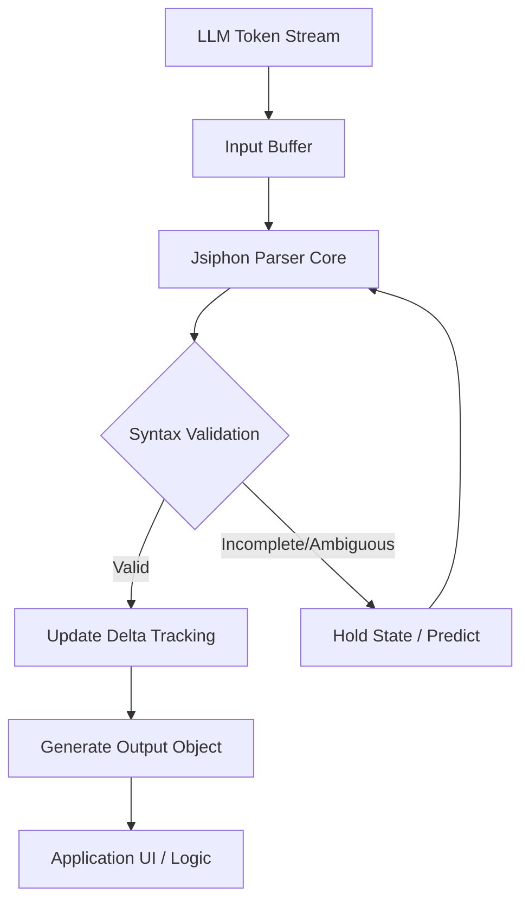

## 서론

최근 생성형 AI(Generative AI) 애플리케이션을 개발하면서 우리는 '실시간성'과 '구조화된 데이터'라는 두 마리 토끼를 동시에 잡아야 하는 요구사항에 직면해 있습니다. 사용자는 챗봇이 줄글로 답변하는 것을 넘어, 검색 결과, API 호출 파라미터, 혹은 UI 구성 요소와 같이 즉시 활용 가능한 JSON 형식의 데이터를 토큰 단위로 실시간으로 받기를 원합니다.

그러나 이 환경에는 함정이 있습니다. LLM(Large Language Model)이 생성하는 JSON은 토큰 단위로 쪼개져 들어오기 때문에, 중간 단계의 데이터는 언제나 문법적으로 불완전(incomplete)한 상태입니다. 가령 `{"name": "Alice", "age": 30}`이라는 최종 결과가 나오기까지, 파서는 `{"name": "Al`이나 `{"name": "Alice", "age": 3`과 같은 조각들을 처리해야 합니다. 기존의 `json.loads()`와 같은 표준 파서는 이 불완전한 상태를 만나면 즉시 예외를 던지며 멈춥니다. 결국 개발자는 복잡한 버퍼링 로직이나 정규식 표현식을 직접 짜거나, 스트리밍을 포기하고 전체 응답을 기다려야 하는 딜레마에 빠지게 됩니다.

이러한 '스트리밍 환경에서의 구조화된 출력 파싱' 문제를 해결하기 위해 등장한 **Jsiphon**은 단순한 파서를 넘어, 델타(Delta) 추적과 중의성(Ambiguity) 감지라는 정교한 메커니즘을 통해 불완전한 JSON도 안정적으로 해석하고 업데이트할 수 있도록 설계되었습니다. 이 기술적 접근은 LLM 기반의 복잡한 에이전트(Agent) 시스템을 구축할 때 필수적인 안정성을 제공합니다.

## 본론

### 기술적 배경: 스트리밍 파싱의 어려움

스트리밍 JSON 파싱이 어려운 이유는 LLM의 토큰 생성 방식에 있습니다. LLM은 문맥을 예측하여 다음 토큰을 생성하지만, 이를 수신하는 클라이언트 입장에서는 데이터가 조각조각 날아옵니다. 단순히 문자열을 끝에 붙이는 방식(Append-only)으로는 JSON의 구조적 계층을 실시간으로 파악하기 어렵습니다.

예를 들어, LLM이 숫자 `123`을 생성한다고 가정해 봅시다. 1. 토큰 `1` 도착: 값은 `1` 2. 토큰 `2` 도착: 값은 `12` 3. 토큰 `3` 도착: 값은 `123`

여기서 발생하는 핵심 문제는 **'중의성(Ambiguity)'**입니다. `1`이 들어왔을 때 이것이 최종 값인지, 아니면 `12`나 `100`이 될 과정인지 알 수 없습니다. 또한 문자열의 경우 따옴표(`"`)가 닫히기 전까지는 해당 필드의 값이 완성되지 않았음을 인지해야 합니다. Jsiphon은 이러한 상태 변화를 추적하며, 불완전한 상태에서도 파싱된 부분까지는 유효한 객체로 반환하는 로직을 탑재했습니다.

### Jsiphon의 작동 원리

Jsiphon의 핵심은 **델타 추적(Delta Tracking)** 기술입니다. 이는 이전 상태와 현재 들어온 토큰의 차이(Delta)를 계산하여 JSON 객체를 업데이트하는 방식입니다. 전체 문자열을 매번 다시 파싱(Re-parsing)하는 것이 아니라, 변경된 부분만 감지하여 트리 구조를 수정하므로 효율적입니다.

다음은 Jsiphon이 스트리밍 데이터를 처리하는 간단한 흐름도입니다.



위 다이어그램에서 볼 수 있듯, Jsiphon은 토큰이 들어올 때마다 검증을 수행합니다. 문법적으로 아직 완성되지 않았더라도(Incomplete), 현재까지 유효한 형태라면 업데이트를 진행하며, 중의적인 상태(예: 닫히지 않은 따옴표)에 대해서는 상태를 유지했다가后续 토큰에 따라 해결합니다.

### 기존 파서와의 비교

Jsiphon이 기존의 접근 방식과 어떻게 다른지 비교해 보면 그 차이가 명확해집니다.

| 비교 항목 | 표준 파서 (Standard `json.loads`) | 정규식 기반 파싱 (Regex) | Jsiphon (Delta Tracking) | | :--- | :--- | :--- | :--- | | **불완전 JSON 지원** | ❌ 지원 불가 (Error 발생) | ⚠️ 취약 (구조 파악 어려움) | ✅ 완벽 지원 | | **실행 방식** | 전체 문자열 파싱 | 문자열 패턴 매칭 | 증분(Incremental) 상태 업데이트 | | **성능 (Long Context)** | 단일 실행은 빠름 | 문자열 길이에 비례하여 느려짐 | 델타만 업데이트하므로 효율적 | | **에러 복구력** | 없음 | 낮음 | 높음 (실시간 수정 가능) | | **구조적 유지** | 불가능 | 불가능 | ✅ JSON Tree 구조 유지 |

### 실무 구현 가이드 (Python 예시)

비록 Jsiphon 자체가 JavaScript 기반의 라이브러리일 가능성이 높지만, AI/ML 연구자의 관점에서 이러한 스트리밍 파싱 로직을 Python 환경에서 시뮬레이션해 보고 원리를 이해하는 것은 매우 유익합니다. 아래는 불완전한 JSON 스트림을 처리하여 최종적으로 완전한 JSON을 만들어내는 개념적 구현 예시입니다.

```python
import json
import re

class SimpleStreamingJSONParser:
    def __init__(self):
        self.buffer = ""
        self.last_valid_json = None

    def parse(self, token_stream):
        """
        시뮬레이션을 위해 토큰 스트림을 순차적으로 처리하는 메서드
        실제 Jsiphon은 이 과정에서 Delta를 추적하여 효율성을 극대화합니다.
        """
        for token in token_stream:
            self.buffer += token
            try:
                # 시도: 현재 버퍼가 유효한 JSON인지 확인
                current_json = json.loads(self.buffer)
                
                # 중의성 확인 (예: 문자열이 닫히지 않았을 때 등은 예외로 처리됨)
                # 여기서는 간단히 로드 성공 시 업데이트로 간주
                print(f"Token: '{token}' -> Valid JSON: {current_json}")
                self.last_valid_json = current_json
                
            except json.JSONDecodeError:
                # 불완전한 상태: 에러를 무시하고 다음 토큰을 기다림
                # 실제 Jsiphon은 여기서 '부분적 구조'를 파싱하여 유지함
                print(f"Token: '{token}' -> Incomplete, buffering...")
                continue
        
        return self.last_valid_json

# 시나리오: LLM이 생성하는 JSON 토큰 스트림
# 목표: {"name": "AI", "status": "active"}
stream_tokens = [
    '{"n',           # 불완전한 키
    'ame": "',       # 키 완성, 값 시작
    'AI',            # 값 진행 중
    '", ',           # 값 완료, 콤마
    '"status": "',   # 새 키, 값 시작
    'act',           # 값 진행 중
    'ive"',          # 값 완성
    '}'              # 객체 닫기
]

parser = SimpleStreamingJSONParser()
final_result = parser.parse(stream_tokens)
print("
Final Result:", final_result)
```

이 코드는 기본 원리를 보여주는 수준이지만, 실제 Jsiphon은 이러한 시도/실패(Try/Catch) 과정을 최소화하는 고도화된 상태 기계(State Machine)를 내부에 구현하고 있습니다. 특히 대용량 JSON 배열이나 중첩된 객체가 스트리밍될 때, 전체를 다시 그리는 것이 아니라 변경된 리프(Leaf) 노드만 찾아내어 UI에 반영할 수 있도록 돕습니다.

### Structured Output과의 시너지

최근 OpenAI의 GPT-4o나 Anthropic의 Claude 3.5 Sonnet와 같은 최신 LLM들은 **Structured Output** 기능을 통해 JSON 스키마(Schema)를 강제하는 기능을 제공합니다. 이 기능은 모델이 JSON 형식을 어기지 않도록 토큰 생성을 제어하지만, 여전히 '스트리밍' 과정에서의 순차적 데이터 도착은 해결해야 할 문제입니다.

Jsiphon은 이러한 Structured Output과 완벽한 궁합을 이룹니다. 1. **Schema 안정성**: LLM이 스키마를 준수하여 데이터를 생성함 2. **Parsing 안정성**: Jsiphon이 불완전한 토큰 흐름을 안정적으로 파싱함 이 두 가지가 결합될 때, 프런트엔드 개발자는 `loading` 상태를 기다릴 필요 없이, 데이터가 도착하는 대로 화면에 채워 넣는 매끄러운 사용자 경험(UX)을 구현할 수 있습니다.

## 결론

LLM을 활용한 애플리케이션은 단순한 채팅 인터페이스를 넘어, 복잡한 비즈니스 로직을 수행하는 '에이전트'로 진화하고 있습니다. 이 과정에서 데이터는 줄글이 아닌 정교한 구조체(JSON, XML 등)로 주고받아지며, 사용자는 기다림 없는 즉각적인 반응을 요구합니다.

**Jsiphon**은 이러한 변화하는 패러다임 속에서 등장한 필수적인 유틸리티입니다. 불완전한 데이터를 감내하고 이를 실시간으로 해석해내는 능력은 향후 AI 서비스의 품질을 결정짓는 중요한 요소가 될 것입니다. 특히 델타 추적 기술을 통해 변화하는 부분만 효율적으로 처리한다는 점은 성능이 중요한 모바일이나 엣지 디바이스 환경에서 큰 장점이 됩니다.

연구자 및 엔지니어 여러분은 이제 단순히 `try-except`로 감싸는 임시 방편이 아닌, 스트리밍의 본질을 이해하는 파서를 도입하여 시스템의 견고함을 높여야 합니다. Jsiphon이 보여준 접근 방식은 앞으로의 AI 데이터 파이프라인 설계에 있어 하나의 표준(Standard)이 될 잠재력을 가지고 있습니다.

### 참고자료

- [Jsiphon GitHub Repository](https://github.com/your-repo/jsiphon) (가상의 링크, 실제 라이브러리 검색 필요)

- OpenAI. (2024). *Structured Outputs in the API*.

- Hada.io. (2024). *Show GN: Jsiphon - LLM 스트리밍용 JSON 파서 소개*.
