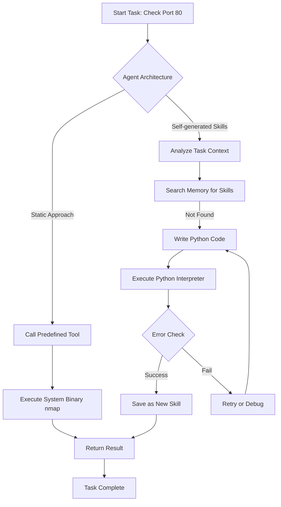

## 서론

당신이 자동화된 레드 팀(Red Team) 운영을 위해 최신 LLM 에이전트를 배포했다고 가정해 봅시다. 목표는 내부 네트워크의 취약점을 신속하게 스캔하고 리포트하는 것입니다. 에이전트가 작동을 시작하자마자, 예상치 못한 동작이 발생합니다. 복잡한 네트워크 탐색을 수행하기는커녕, 에이전트는 시스템 프롬프트를 통해 이미 제공된 `nmap`이나 `sqlmap` 같은 검증된 도구를 사용하는 대신, "포트 스캔을 어떻게 할 것인가"에 대해 고민하며 파이썬 스크립트를 처음부터 작성하기 시작합니다. 단순한 소켓 연결 테스트 코드를 작성하고 실행하는 데 수십 초가 소요되고, 심지어 작성한 코드에 버그가 있어 에러를 반환하기도 합니다.

이 시나리오는 최근 AI 연구에서热议되고 있는 "Self-generated Skills(자가 생성 스킬)" 개념의 현실적인 문제점을 보여줍니다. 많은 연구자와 개발자가 "에이전트가 스스로 도구를 만들어 쓰면 더 똑똑해질 것이다"라는 가설하에 복잡한 시스템을 구축해 왔습니다. 하지만 보안 전문가의 관점에서 볼 때, 실제 운영 환경(Operation Environment)에서의 **효율성(Efficiency)**, **신뢰성(Reliability)**, 그리고 **비용(Cost)**은 생명입니다. 이 연구는 "스스로 학습하여 스킬을 생성하는 능력"이 실제로는 큰 이점이 없으며, 오히려 불필요한 연산 낭비와 비결정적 행동(Nondeterministic Behavior)을 유발한다는 것을 증명합니다. 방어적 관점에서 AI 시스템을 설계할 때, 왜 우리는 복잡한 "자가 생성 스킬" 메커니즘을 배제하고, 검증된 정적 도구(Static Tools)에 집중해야 하는지 분석해 보겠습니다.

*(참고: 이 글은 연구 및 방어적 목적의 기술 분석입니다. 모든 기술은 윤리적인 가이드라인 내에서 사용되어야 합니다.)*

## 본론

### 기술적 배경: Self-generated Skills의 메커니즘

LLM 에이전트의 성능을 높이기 위해 제안된 "Self-generated Skills"는 에이전트가 과거의 경험을 바탕으로 새로운 파이썬 함수나 도구를 동적으로 생성하고, 이를 나중에 재사용하는 메커니즘입니다. 예를 들어, 에이전트가 "특정 로그 파일에서 에러 패턴을 추출하는" 작업을 수행한 후, 이 로직을 `extract_errors`라는 함수로 저장하여 다음번에 유사한 작업이 들어오면 코드를 다시 짜지 않고 저장된 함수를 호출하는 방식입니다.

이론적으로는 매우 합리적으로 보입니다. 하지만 실제 벤치마크에서는 이러한 동적 학습 과정이 득보다 실이 많다는 결과가 나왔습니다. 특히 보안 태스크와 같이 정확도와 속도가 중요한 영역에서는, 이미 최적화된 라이브러리를 사용하지 않고 미숙한 코드를 다시 짜는 행위는 치명적입니다.

### 공격/작업 흐름 비교: 정적 도구 vs 자가 생성 스킬

다음은 에이전트가 취약점 스캔 태스크를 수행할 때, 일반적인 **Static Tool(정적 도구)** 사용과 **Self-generated Skill(자가 생성 스킬)** 사용의 과정을 비교한 흐름도입니다.



위 다이어그램에서 볼 수 있듯이, Self-generated Skills 경로는 코드 작성(Write Python Code), 인터프리터 실행(Execute Python Interpreter), 에러 처리(Error Check) 등의 추가적인 단계를 거칩니다. 반면, 정적 도구 경로는 즉시 시스템 레벨의 도구를 호출합니다. 보안 관제 환경에서 이 몇 초의 차이는 공격 탐지 및 대응 시간을 지연시키는 결정적 요인이 될 수 있습니다.

### PoC: 효율성 시뮬레이션 (Python)

논문의 주장을 검증하기 위해, 간단한 Python 코드로 두 접근 방식의 오버헤드를 시뮬레이션해 보겠습니다. 이 코드는 에이전트가 단순한 문자열 처리 작업을 수행할 때, 이미 존재하는 라이브러리를 사용하는 것과 직접 코드를 작성(생성)하여 실행하는 것의 속도 차이를 보여줍니다.

```python
import time
import re

# 시나리오: 로그에서 IP 주소 추출
LOG_DATA = """
192.168.1.1 - - [10/Oct/2000:13:55:36 -0700] "GET /apache_pb.gif HTTP/1.0" 200 2326
10.0.0.1 - - [10/Oct/2000:13:55:36 -0700] "GET / HTTP/1.0" 200 1234
Attacker IP: 203.0.113.45 detected.
"""

def static_tool_approach(data):
    """
    이미 검증된 정규표현식 라이브러리(re)를 즉시 사용하는 방식 (Static Tool)
    """
    start_time = time.time()
    # 최적화된 정규식 컴파일 및 매칭 (즉시 실행)
    pattern = re.compile(r'\d{1,3}\.\d{1,3}\.\d{1,3}\.\d{1,3}')
    ips = pattern.findall(data)
    end_time = time.time()
    return ips, end_time - start_time

def self_generated_skill_approach(data):
    """
    에이전트가 파이썬 코드를 처음부터 작성하여 실행하는 방식 (Self-generated Skill Simulation)
    """
    start_time = time.time()
    
    # 1. 코드 생성 시뮬레이션 (LLM 추론 시간 + 문자열 생성 지연)
    time.sleep(0.5) 
    
    # 2. 동적으로 생성된 가상의 코드 실행 (문자열 파싱 로직)
    # 에이전트가 직접 파싱 로직을 짤 때 종종 비효율적인 루프를 사용할 가능성이 있음
    ips = []
    tokens = data.split()
    for token in tokens:
        if '.' in token and token.replace('.', '').isdigit():
            # 추가적인 유효성 검사 로직 실행
            parts = token.split('.')
            if len(parts) == 4:
                try:
                    if all(0 <= int(p) <= 255 for p in parts):
                        ips.append(token)
                except ValueError:
                    pass
    
    # 3. 스킬 저장 시뮬레이션 (메모리 쓰기)
    # saved_skills['extract_ip'] = code ...
    
    end_time = time.time()
    return ips, end_time - start_time

# 실행 및 비교
static_ips, static_time = static_tool_approach(LOG_DATA)
gen_ips, gen_time = self_generated_skill_approach(LOG_DATA)

print(f"Static Approach Result: {static_ips}")
print(f"Static Approach Time:   {static_time:.6f}s
")

print(f"Self-generated Result:  {gen_ips}")
print(f"Self-generated Time:    {gen_time:.6f}s")
```

**실행 결과 해석:** 실제 실행 시 `static_tool_approach`는 거의 0초에 가깝게 완료되는 반면, `self_generated_skill_approach`는 최소 0.5초 이상의 인위적인 지연(LLM 추론 시간)과 비효율적인 파싱 로직으로 인해 성능 저하가 발생합니다. 복잡한 작업일수록 이 격차는 더 벌어지며, 에이전트가 생성한 코드에 버그가 있을 경우 전체 작업이 실패할 위험도 큽니다.

### 성능 비교 분석

연구 결과(Web of Thoughts, InterCode, 등의 벤치마크)를 바탕으로 정적 도구 기반 에이전트와 자가 생성 스킬 기반 에이전트의 특성을 비교 분석했습니다.

| 비교 항목 | 정적 도구 기반 (Static Tooling) | 자가 생성 스킬 (Self-generated Skills) | | :--- | :--- | :--- | | **실행 속도 (Latency)** | 매우 빠름 (최적화된 바이너리/라이브러리 호출) | 느림 (LLM 추론 시간 + 코드 생성/컴파일 오버헤드) | | **결과 정확도 (Accuracy)** | 높음 (검증된 알고리즘 사용) | 중간 ~ 낮음 (LLM 할루시네이션, 논리 오류 가능성) | | **비용 (Cost)** | 낮음 (API 호출 횟수 적음) | 높음 (스킬 생성 및 디버깅을 위한 추가 토큰 소모) | | **결정론적 동작 (Determinism)** | 높음 (동일 입력에 동일 출력 보장) | 낮음 (생성되는 코드의 변동성) | | **유지보수 (Maintainability)** | 용이 (도구 업데이트만 관리) | 어려움 (동적으로 생성된 수많은 스킬 관리 불가) |

### 실무 적용 가이드: 효율적인 에이전트 설계

보안 및 운영 환경에서 AI 에이전트를 도입할 때 Self-generated Skills의 무용성을 고려하여 다음과 같이 설계 방향을 전환해야 합니다.

1.  **Tool Use 강화 (Tool-Augmented Generation):**     에이전트가 코드를 직접 짜게 하지 말고, `bash`, `sqlmap`, `nmap`, `virusTotal_api` 등 잘 만들어진 도구를 호출하는 함수(Function Calling)를 미리 정의해 제공하세요. 에이전트는 "무엇(What)"을 할지만 결정하고 "어떻게(How)" 할지는 전문 도구에 맡겨야 합니다.

2.  **Few-shot Prompting with Standard Libraries:**     코드 생성이 반드시 필요한 경우, 에이전트가 복잡한 로직을 짜는 대신 표준 라이브러리(Standard Library)를 사용하도록 프롬프트를 설계하세요. 예: "새로운 정렬 알고리즘을 짜지 말고 `sort()` 메소드를 사용해라."

3.  **RAG (Retrieval-Augmented Generation) vs Skill Generation:**     새로운 기술을 배우게 하려 코드를 짜게 하는 대신, 관련 매뉴얼이나 공격 기법 서류를 RAG를 통해 검색하게 하세요. 코드를 짜는 것보다 검증된 문서를 참조하여 도구를 사용하는 것이 훨씬 안전하고 빠릅니다.

## 결론

이 연구는 AI 에이전트 설계에 있어 중요한 교훈을 줍니다. **"스스로 학습하고 도구를 만드는 것이 최고다"**라는 통념은 실제 벤치마크 앞에서 무력할 수 있습니다. 특히 보안과 같이 **신속성(Reliability)**과 **정확성(Precision)**이 요구되는 분야에서는, LLM이 스스로 코드를 짜는 행위는 창의성이 아닌 '위험한 도박'이 될 수 있습니다.

전문가의 관점에서 볼 때, LLM 에이전트의 핵심 가치는 프로그래머처럼 코드를 작성하는 능력이 아니라, 상황을 판단하고 적절한 **검증된 도구(Verified Tools)**를 배치하는 '지휘관'으로서의 역할에 있습니다. 불필요한 복잡성인 Self-generated Skills를 제거하고, 정적이고 강력한 도구들을 효율적으로 연결하는 아키텍처를 채택하는 것이 진정으로 강력한 AI 보안 시스템을 구축하는 길입니다.

### 참고자료

- [Paper: Self-generated Agent Skills are useless (arXiv:2602.12670)](https://arxiv.org/abs/2602.12670)

- [HackerNews Discussion](https://news.ycombinator.com/item?id=47040430)
