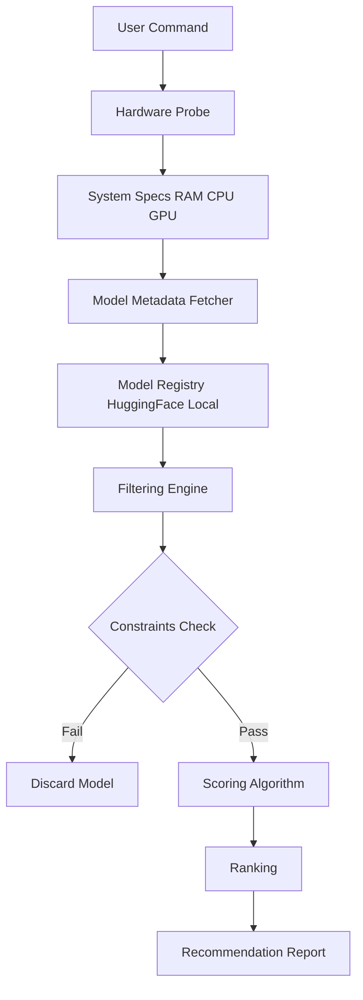

## 서론

최근 몇 달 사이 로컬 환경에서 거대 언어 모델(LLM)을 구축하려는 시도가 급증하고 있습니다. 클라우드 API 비용 절감과 데이터 프라이버시 보호라는 두 마리 토끼를 잡기 위해, 많은 엔지니어와 연구자들이 자신의 워크스테이션에 고성능 모델을 올리려 합니다. 그러나 현실은 냉혹합니다. Hugging Face의 모델 허브에서 70B 파라미터 모델을 다운로드하고 나서야 "Out of Memory(OOM)" 에러와 마주하며 8GB VRAM의 노트북으로는 감당할 수 없다는 사실을 깨닫게 되는 경우가 비일비재합니다.

이러한 시행착오는 단순히 시간 낭비가 아닙니다. 잘못된 모델 선택은 디스크 공간을 낭비하게 하고, 추론(Inference) 속도를 극도로 저하시켜 실무 활용 가능성을 훼손합니다. 바로 이 지점에서 **하드웨어 사양 기반의 자동 최적화 도구**가 필요한 이유가 명확해집니다. 이 도구는 수백 가지의 모델과 양자화(Quantization) 옵션 가운데, 사용자의 현재 RAM, CPU, GPU 리소스를 기반으로 실제로 구동 가능한 최적의 조합을 수학적으로 계산하여 제시합니다. 본고에서는 이러한 LLM 오토-최적화 도구의 기술적 원리와 아키텍처, 그리고 실제 구현 방안을 심층적으로 분석합니다.

## 본론

### 하드웨어 인식 및 모델 최적화의 원리

LLM 오토-최적화 도구의 핵심은 **제약 만족 문제(Constraint Satisfaction Problem)**를 해결하는 과정입니다. 시스템은 우선 사용자의 하드웨어 제약 조건(Constraints)을 정의합니다. 이에는 GPU의 VRAM 용량, 시스템 RAM의 여유 공간, CPU의 아키텍처(AVX2, AVX-512 지원 여부 등)가 포함됩니다.

이후 모델의 요구 사항과 매핑합니다. 모델의 파라미터 수와 양자화 비트(4-bit, 8-bit 등)에 따라 필요한 메모리 양을 계산하는 것입니다. 예를 들어, FP16(16비트 부동소수점)으로 저장된 7B 모델은 약 14GB의 VRAM을 필요로 하지만, GPTQ나 AWQ 같은 4-bit 양자화 기법을 적용하면 약 4~5GB 수준으로 줄어듭니다. 여기에 KV Cache(Key-Value Cache)와 컨텍스트 윈도우 길이에 따른 오버헤드를 합산하여 최종 메모리 요구량을 도출합니다.

이 도구는 단순히 메모리가 맞는지 확인하는 것을 넘어, **다목적 함수(Multi-objective function)**를 통해 모델을 점수화합니다. $$ Score(M) = w_1 \cdot Quality(M) + w_2 \cdot Speed(HW, M) + w_3 \cdot ContextWindow(M) $$ 여기서 $Quality$는 일반적으로 벤치마크 점수(예: MMLU)를 의미하며, $Speed$는 하드웨어 사양과 모델 크기에 비례해 역산됩니다. 도구는 이 점수가 가장 높으면서도 $Hardware_{avail} \ge Memory_{req}$ 조건을 만족하는 모델 $M$을 추천합니다.

### 시스템 아키텍처 및 작동 프로세스

이 최적화 도구의 내부 작동 흐름은 크게 하드웨어 스캔, 모델 메타데이터 수집, 필터링 및 랭킹의 3단계로 나뉩니다. 사용자가 터미널에 명령어를 입력하면, 백그라운드 프로세스가 즉시 시스템 프로파일링을 시작합니다.

아래 다이어그램은 사용자가 명령어를 입력부터 최적 모델을 추천받기까지의 전체 데이터 흐름을 간소화하여 나타낸 것입니다.



1.  **Hardware Probe**: `psutil`이나 `pynvml`(NVIDIA GPU) 라이브러리를 사용하여 현재 가용 리소스를 정확히 측정합니다. 2.  **Model Metadata Fetcher**: Hugging Face Hub API를 호출하거나 로컬 캐시된 데이터베이스를 조회하여 최신 모델들의 정보(파라미터 수, 양자화 포맷, 다운로드 수 등)를 가져옵니다. 3.  **Filtering Engine & Scoring**: 메모리 부족으로 실행 불가능한 모델을 제외하고, 실행 가능한 모델들에 대해 품질과 속도 지수를 계산하여 정렬합니다.

### 구현 예시: PyTorch를 활용한 VRAM 추론 로직

실제로 이러한 도구가 내부적으로 어떻게 메모리 적합성을 판단하는지 간단한 Python 코드로 살펴보겠습니다. 이 스크립트는 사용자의 GPU VRAM을 확인하고 특정 모델이 양자화되었을 때 메모리에 들어갈 수 있는지 판단하는 로직의 일부입니다.

```python
import torch

def check_vram_availability(model_params_in_billions, quantization_bits=4, safety_buffer=1.0):
    """
    모델 크기와 양자화 비트에 따른 예상 VRAM 사용량을 계산하고,
    현재 GPU의 가용 메모리와 비교하여 실행 가능성을 판단합니다.
    
    Args:
        model_params_in_billions (float): 모델 파라미터 수 (단위: Billion, 예: 7, 13)
        quantization_bits (int): 양자화 비트 (4, 8, 16)
        safety_buffer (float): KV Cache 및 Activation 오버헤드를 위한 여유 공간 (GB)
    """
    
    if not torch.cuda.is_available():
        return False, "CUDA GPU not available"

    # 1. 현재 GPU의 총 VRAM 및 사용 중인 메모리 확인
    device = torch.cuda.current_device()
    total_vram = torch.cuda.get_device_properties(device).total_memory / (1024**3) # GB
    allocated_vram = torch.cuda.memory_allocated(device) / (1024**3) # GB
    free_vram = total_vram - allocated_vram
    
    # 2. 모델 크기 계산 (대략적 공식: Params * Bits / 8)
    # 예: 7B 모델, 4-bit 양자화 -> 7 * 4 / 8 = 3.5 GB
    model_size_gb = (model_params_in_billions * quantization_bits) / 8
    
    required_memory = model_size_gb + safety_buffer
    
    # 3. 판별 로직
    if required_memory <= free_vram:
        return True, (f"Estimated Model Size: {model_size_gb:.2f}GB | "
                      f"Required: {required_memory:.2f}GB | "
                      f"Available: {free_vram:.2f}GB [FIT]")
    else:
        return False, (f"Estimated Model Size: {model_size_gb:.2f}GB | "
                       f"Required: {required_memory:.2f}GB | "
                       f"Available: {free_vram:.2f}GB [OOM RISK]")

# 실행 예시
# 7B 파라미터 모델을 4-bit로 양자화하여 실행하려는 경우
can_run, message = check_vram_availability(model_params_in_billions=7, quantization_bits=4)
print(f"System Check: {can_run}")
print(f"Detail: {message}")
```

이 코드는 단순화된 예시이지만, 실제 오토-최적화 도구는 여기에 더해 추론 시 배치 크기(Batch Size)나 시퀀스 길이(Sequence Length)에 따른 KV Cache 증가분을 동적으로 계산하여 정밀도를 높입니다.

### 기존 방식과 자동 최적화 도구의 비교

수동으로 모델을 찾는 기존의 방식과 이번에 소개하는 자동 최적화 툴을 비교하면, 효율성과 안정성 측면에서 현저한 차이가 있습니다.

| 비교 항목 | 기존 수동 검색 (Manual Search) | 자동 최적화 도구 (Auto-Optimization) | | :--- | :--- | :--- | | **탐색 시간** | 매우 느림 (문서 읽기, 계산, 시행착오 포함) | 매우 빠름 (초 단위 스캔 및 계산) | | **하드웨어 분석** | 불확실 (사용자의 주관적 판단 의존) | 정밀 (시스템 콜을 통한 실제 리소스 측정) | | **양자화 고려** | 복잡 (다양한 포맷 GGUF, GPTQ 등 직접 비교) | 자동 (각 포맷별 메모리 요구량 자동 계산) | | **OOM 발생 가능성** | 높음 (실제 로딩 전까지 알 수 없음) | 낮음 (실행 전 미리 시뮬레이션으로 방지) | | **적합성 평가** | 단순히 "가장 큰 모델" 선호 경향 | 품질, 속도, 컨텍스트 윈도우 종합 점수화 |

### 실무 적용을 위한 가이드

이 도구를 실제 MLOps 파이프라인에 통합하기 위해서는 다음과 같은 단계를 따르는 것을 권장합니다.

1.  **환경 사전 점검**: 도구 실행 전 드라이버(NVIDIA/CUDA) 및 기본 라이브러리(torch, transformers)가 정상적으로 설치되어 있는지 확인합니다. 2.  **스캔 및 추천 실행**: 터미널에서 `llm-optimize --scan`과 같은 명령어를 실행합니다. 도구는 현재 하드웨어에 맞는 상위 3개의 모델을 제시합니다. 3.  **벤치마크 검증**: 추천받은 모델 중 하나를 선택해 실제로 벤치마크 스크립트를 돌려봅니다. 이때 생성된 속도(metrics/s)와 최대 컨텍스트 길이를 기록합니다. 4.  **서빙 설정**: 결정된 모델을 `Docker` 컨테이너화하거나 `vLLM` 같은 추론 엔진과 연결하여 서비스를 배포합니다.

특히 Edge AI 디바이스나 사내 보안 규정으로 인해 인터넷이 차단된 폐쇄망(Air-gapped environment) 환경에서는, 이 도구를 통해 **사전에 다운로드 받은 모델 리스트 중 어떤 것이 가장 효율적인지** 판단하는 데 있어 결정적인 역할을 합니다.

## 결론

하드웨어 사양에 기반한 LLM 자동 최적화 도구는 로컬 AI 생태계에서 겪는 가장 큰 진입 장벽인 '리소스 불일치' 문제를 해결하는 실용적인 솔루션입니다. 단순히 모델을 추천하는 것을 넘어, 시스템의 CPU, RAM, GPU 제약 조건을 종합적으로 분석하고 수학적인 모델링을 통해 최적의 성능을 이끌어내는 MLOps의 핵심 기능으로 자리 잡고 있습니다.

전문가 관점에서 볼 때, 향후 이러한 도구들은 단순한 '필터링'을 넘어 추론 중 동적으로 하드웨어 리소스를 모니터링하여 배치 크기를 조절하거나, 요청이 적은 시간대에는 더 큰 모델을 사용하는 등의 **Dynamic Scaling(동적 확장)** 기능과 결합될 것입니다. 연구자와 엔지니어는 이러한 도구를 활용하여 하드웨어 업그레이드라는 막대한 비용 없이도, 현재 환경에서 구현 가능한 최대한의 성능을 끌어낼 수 있습니다.

#### 참고자료

- [Hada.io - 시스템 RAM·CPU·GPU에 맞게 LLM 모델을 자동 최적화하는 터미널 도구](https://news.hada.io/topic?id=27143)

- Llama.cpp: https://github.com/ggerganov/llama.cpp

- vLLM: High-Throughput and Memory-Efficient Inference Engine
