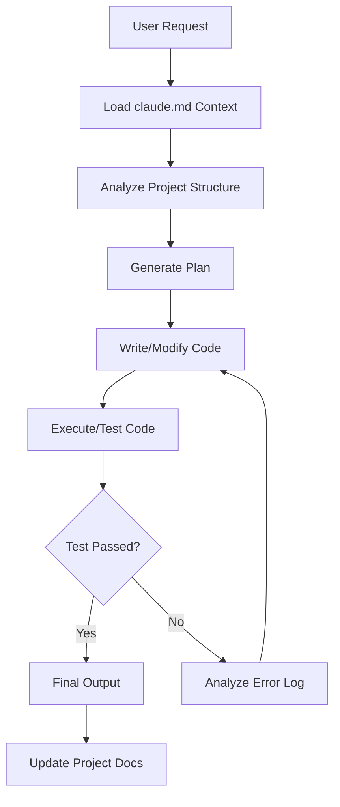

## 서론

최근 LLM(Large Language Model)을 활용한 개발 보조 도구가 급격히 발전했지만, 실무 현장에서는 여전히 "반반한 결과"에 머무르는 경우가 많습니다. AI가 작성한 코드가 겉보기에는 그럴싸해 보이지만, 실제로 실행해 보면 라이브러리 의존성이 꼬이거나, 기존 프로젝트의 아키텍처를 무시한 채 엉뚱한 구현을 해내는 경험을 한 번쯤은 해보셨을 것입니다.

AI 연구의 거장 Andrej Karpathy 또한 이 문제를 지적하며, LLM의 코딩 능력 부족보다는 **"컨텍스트(Context)를 어떻게 전달하고 워크플로우를 제어하느냐"**가 핵심임을 강조한 바 있습니다. 바로 이 지점에서 GitHub 하루 만에 400개 이상의 스타를 기록하며 센세이션을 일으킨 `claude.md`라는 단 65줄짜리 텍스트 파일이 등장했습니다.

이 파일은 단순한 주석 모음이 아닙니다. 이는 LLM에게 "엔지니어처럼 사고하고 행동하라"고 지시하는 고도로 정제된 시스템 프롬프트(System Prompt)이자, 프로젝트의 맥락을 AI에게 주입하는 가장 효율적인 인터페이스 설계입니다. 본고에서는 이 `claude.md`가 어떤 원리로 AI의 코딩 성능을 극대화하는지, 그리고 우리가 이를 통해 어떻게 'AI 네이티브'한 개발 환경을 구축할 수 있는지 기술적으로 심층 분석해 보겠습니다.

## 본론

### 기술적 배경: LLM 코딩의 "맥락 부재" 문제와 해결 원리

LLM이 코드를 생성할 때 겪는 가장 큰 어려움은 **"맥락 윈도우(Context Window) 내에서의 정보 관리 부재"**와 **"반복적인 피드백 루프의 부재"**입니다. 일반적인 채팅창에 "로그인 기능을 만들어줘"라고 요청하면, LLM은 전체 프로젝트의 구조를 파악하지 못한 채 가장 확률이 높은 코드 조각을 생성하려 합니다.

`claude.md`의 핵심 메커니즘은 **"Agentic Workflow(에이전트적 워크플로우)"**를 텍스트 형태로 강제하는 데 있습니다. 이 파일은 AI에게 단순히 코드를 작성하는 것이 아니라, **1) 파일 구조 파악 → 2) 계획 수립 → 3) 코드 생성 → 4) 실행 및 테스트 → 5) 오류 수정(Reflection)**의 순환 과정을 밟도록 명시적으로 지시합니다. 이는 인간의 시니어 엔지니어가 문제를 해결하는 방식과 유사하며, 최신 연구인 "Reflexion(Shinn et al., 2023)"이나 "Self-Refine(Madaan et al., 2023)"에서 제안하는 메커니즘을 실무 프롬프트에 적용한 사례라고 볼 수 있습니다.

이러한 접근 방식은 LLM이 생성한 코드의 품질을 높일 뿐만 아니라, 모델이 Halucination(환각)에 빠졌을 때 이를 스스로 校正(Correction)할 수 있는 기회를 제공합니다.

### 아키텍처 다이어그램: claude.md 기반 코딩 에이전트의 흐름

`claude.md`가 적용된 환경에서 LLM은 단순한 텍스트 생성기가 아니라, 하나의 독립적인 코딩 에이전트로 작동합니다. 아래 다이어그램은 이 파일이 LLM의 추론 흐름을 어떻게 제어하는지 시각화한 것입니다.



이 다이어그램에서 볼 수 있듯이, `claude.md`는 단순한 시작점이 아니라 전체 프로세스의 제어 논리(Controller) 역할을 수행합니다. 특히 오류 발생 시(G), 즉시 수정(E)으로 되돌아가는 루프back을 강제함으로써, 사용자가 개입하지 않아도 AI가 스스로 디버깅을 시도하도록 유도합니다.

### 프롬프트 구조 분석 및 비교

기존의 질의응답 방식과 `claude.md` 스타일의 구조적 프롬프팅은 결과물의 품질에 있어 현저한 차이를 보입니다. 다음은 두 방식의 특징을 비교한 표입니다.

| 비교 항목 | 기존 채팅 방식 (Zero-shot) | claude.md 구조화 방식 (Agentic) |
| :--- | :--- | :--- |
| **맥락 인지** | 프로젝트 전체를 파악하지 못하고 요청만 처리 | 프로젝트 규칙, 아키텍처, 파일 트리를 사전에 인지 |
| **코드 일관성** | 요청마다 스타일이 변경될 수 있음 | 전역 코딩 컨벤션 강제로 일관성 유지 |
| **오류 처리** | 오류 시 사용자가 다시 질문해야 함 | Self-Debugging 루프를 통해 자율 수정 시도 |
| **툴 사용** | 텍스트 출력에 그침 | 터미널 명령, 파일 편집 등 도구 사용을 명시적으로 지시 |

`claude.md` 파일 내부를 들여다보면, 크게 **Role(역할), Constraints(제약 조건), Tool Use(툴 사용법), Workflow(워크플로우)** 네 가지 섹션으로 구성되어 있음을 알 수 있습니다.

### 실무 적용 가이드: 나만의 Coding Agent 만들기

이제 이 원리를 바탕으로 실제 Python 환경에서 `claude.md` 스타일의 시스템 프롬프트를 구현하는 방법을 단계별로 알아보겠습니다. 여기서는 Anthropic의 Claude API를 예로 들지만, OpenAI의 GPT-4 등에도 동일하게 적용 가능합니다.

#### 1단계: 시스템 프롬프트 정의 (Python)

먼저, LLM에게 행동 강령을 심어주는 시스템 프롬프트를 구성합니다. 아래 코드는 `claude.md`의 핵심 로직을 추상화한 것입니다.

```python
def get_system_prompt(project_context):
    return f"""
    # Role
    You are an expert software engineer and 10x AI coding agent.
    Your goal is to solve the user's request by reading, writing, and testing code within this project.

    # Project Context
    {project_context}

    # Core Principles
    1. **Understanding**: Before coding, always analyze the existing codebase structure using `list_files` and `read_file` tools.
    2. **Planning**: Outline a step-by-step plan before writing any code.
    3. **Execution**: Write code in small, testable chunks.
    4. **Verification**: Always run tests or scripts to verify your changes.
    5. **Correction**: If an error occurs, read the logs, hypothesize the fix, and apply it. Do not ask the user for help immediately.

    # Constraints
    - Do not make assumptions about libraries that are not installed. Check `requirements.txt`.
    - Follow the existing code style and formatting.
    - If you need to edit a file, show the exact diff using the `edit_file` tool format.
    """

# 프로젝트별 맥락 예시
project_specs = """
- Tech Stack: Python 3.9, FastAPI, SQLAlchemy
- DB: PostgreSQL
- Project Root: /app/src
- Coding Style: Black, PEP8
"""
```

#### 2단계: 에이전트 루프 구현하기

이제 실제로 사용자의 요청을 처리하고, LLM이 스스로 코드를 실행하고 수정하는 루프를 구현해야 합니다. 이는 간단하게 `while` 루프와 모델 응답 파싱을 통해 구현할 수 있습니다.

```python
import anthropic
import os

client = anthropic.Anthropic(api_key=os.environ.get("ANTHROPIC_API_KEY"))

def run_coding_agent(user_message, max_iterations=5):
    conversation_history = []
    system_msg = get_system_prompt(project_specs)
    
    # 초기 메시지 설정
    conversation_history.append({"role": "user", "content": user_message})
    
    for i in range(max_iterations):
        # 모델 호출
        response = client.messages.create(
            model="claude-3-5-sonnet-20240620",
            max_tokens=4096,
            system=system_msg,
            messages=conversation_history
        )
        
        assistant_text = response.content[0].text
        print(f"--- Iteration {i+1} ---")
        print(assistant_text)
        
        # 응답을 대화 기록에 추가
        conversation_history.append({"role": "assistant", "content": assistant_text})
        
        # 실제 환경에서는 여기서 응답을 파싱하여(Parsing)
        # 1. 파일을 쓰거나(File Writing)
        # 2. 터미널 명령을 실행하고(Command Execution)
        # 3. 그 결과(로그)를 다시 LLM에게 피드백해야 합니다.
        
        # 시뮬레이션: 3번째 시도 후 성공했다고 가정 종료
        if "Task completed successfully" in assistant_text or i == max_iterations - 1:
            break
            
        # 시뮬레이션: 실행 결과(에러 또는 성공 로그)를 사용자 입장에서 전달
        simulated_output = "Running tests...
[ERROR] tests/test_api.py:42: AssertionError"
        conversation_history.append({"role": "user", "content": f"Tool Execution Result:
{simulated_output}"})

# 실행 예시
run_coding_agent("Add a new endpoint /health that returns JSON status 200.")
```

이 코드는 매우 단순화된 예시이지만, 실제 `claude.md`가 사용되는 환경(예: Claude Code CLI 또는 VS Code Extension)에서는 이 루프가 훨씬 정교하게 돌아갑니다. 텍스트 편집기와 터미널 사이에서 LLM이 중개자 역할을 수행하며, 단순 텍스트 생성을 넘어 실제 시스템의 상태(State)를 변화시키는 작업을 수행합니다.

### Step-by-Step 적용 전략

실제 프로젝트에서 이를 활용하기 위한 구체적인 단계는 다음과 같습니다.

1.  **프로젝트 루트에 정의서 작성**: `claude.md` 또는 `.ai/rules.md` 파일을 프로젝트 최상단에 생성합니다.
2.  **아키텍처 문서화**: 프로젝트의 의존성, 폴더 구조, 코딩 컨벤션을 상세히 적습니다. LLM은 이를 "장기 기억(Long-term Memory)"으로 활용합니다.
3.  **도구 사용 제약 설정**: AI가 어떤 명령어를 사용할 수 있는지(예: `git commit`, `pytest`, `docker build`) 미리 명시하여 안전한 실행 환경을 구축합니다.
4.  **피드백 루프 자동화**: 가능하다면 LangChain 또는 AutoGPT와 같은 프레임워크를 사용하여, LLM이 생성한 코드를 자동으로 실행하고 그 출력을 다시 LLM에게 입력하는 파이프라인을 구축합니다.

## 결론

65줄의 텍스트 파일 `claude.md`가 불러온 파장은 단순한 유행을 넘어, **"프롬프트 엔지니어링의 본질은 맥락 설계(Context Design)에 있다"**는 사실을 다시금 상기시켜 줍니다. Karpathy가 언급했듯, 모델의 파라미터 수가 늘어나는 것만큼이나 중요한 것은 그 모델을 어떻게 제어하고 프로젝트와 통합하느냐 하는 인터페이스의 문제입니다.

앞으로의 AI 개발 도구는 단순히 코드를 자동 완성해주는 수준을 넘어, 개발자의 의도를 파악하고 프로젝트 전체를 이해한 뒤 스스로 문제를 해결하는 **"코파일럿(Copilot)"에서 "오토 파일럿(Autopilot)"**으로 진화할 것입니다. `claude.md`는 그 변화의 과도기적 지점에서, 우리가 텍스트 하나로 AI의 지능을 어떻게 조정(Orchestrate)할 수 있는지 보여주는 훌륭한 사례입니다.

연구자이자 엔지니어로서 우리는 이제 모델 자체의 성능에만 집중할 것이 아니라, 모델에게 얼마나 효율적인 컨텍스트를 제공할 수 있는지, 그리고 어떤 시스템 프롬프트가 복잡한 소프트웨어 엔지니어링 태스크를 가장 잘 해결할 수 있는지에 대해 고민해야 합니다. 오늘 바로 귀하의 프로젝트 루트에 `ai-instructions.md` 파일 하나를 생성해 보는 것부터 시작해보는 것은 어떨까요?

### 참고자료

- [Andrej Karpathy's State of GPT](https://www.youtube.com/watch?v=bZQun8Y4L2A)

- [Anthropic Claude Documentation](https://docs.anthropic.com/)

- [Reflexion: Language Agents with Verbal Reinforcement Learning (Shinn et al., 2023)](https://arxiv.org/abs/2303.11366)

- [Self-Refine: Large Language Models Can Self-Correct (Madaan et al., 2023)](https://arxiv.org/abs/2303.05124)
