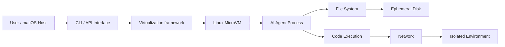

## 서론

최근 LLM(Large Language Model)을 활용한 자율 에이전트(Autonomous Agent) 기술이 급격히 발전하면서, 로컬 환경에서 모델을 직접 운영하려는 시도가 늘어나고 있습니다. 하지만 고성능의 로컬 LLM을 배포하는 것만으로는 충분하지 않습니다. 에이전트가 스스로 계획을 세우고 코드를 작성하며 이를 실행하는 'Agentic Workflow' 과정에서, 가장 큰 병목이자 보안 위협은 바로 **격리되지 않은 실행 환경**입니다.

개발자가 로컬 머신에서 에이전트를 실행할 때 가장 두려워하는 시나리오는 다음과 같습니다. 에이전트가 "시스템을 최적화한다"는 명령을 수행하려다, 실수로 호스트 머신의 중요한 설정 파일을 덮어쓰거나, 악성 코드가 포함된 의존성 패키지를 설치하는 상황을 상상해 보십시오. Docker 같은 컨테이너 기술이 있지만, macOS 환경에서는 리눅스 네이티브 기능을 완벽하게 지원하지 않거나 호스트 OS와의 격리 수준이 설계 목적에 비해 부족할 수 있습니다. 또한, 에이전트의 행동은 예측 불가능하므로, 상태가 유지(Stateful)되는 환경보다는 매번 깨끗하게 초기화되는 환경이 훨씬 안전합니다.

이러한 문제를 해결하기 위해 macOS의 네이티브 하이퍼바이저인 **Virtualization.framework**를 기반으로 하는 경량 Linux MicroVM 환경이 주목받고 있습니다. 이는 단순한 가상머신이 아니라, AI 에이전트의 코드 실행을 위해 특화된 **Ephemeral(일회성) 샌드박스**입니다. 세션이 종료되면 모든 변경 사항이 즉시 초기화되므로, 개발자는 안전하게 에이전트의 행동을 테스트하고 디버깅할 수 있습니다. 이 글에서는 이 MicroVM 기술의 작동 원리와 실제 구현 방법, 그리고 AI 연구 현장에서의 활용법에 대해 심도 있게 다루겠습니다.

## 본론

### 기술적 배경 및 원리: macOS Virtualization.framework와 MicroVM

기존의 가상화 솔루션인 VMware, Parallels, 또는 VirtualBox는 하드웨어 에뮬레이션을 포함한 무거운 레이어를 가지고 있습니다. 반면, macOS Big Sur 이상에서 제공되는 **Virtualization.framework**는 Apple Silicon(M1/M2/M3) 칩의 하드웨어 가상화 기능을 직접 활용하여 극도로 가볍고 빠른 가상머신을 생성할 수 있게 해줍니다. 이는 AWS Firecracker와 같은 MicroVM 개념과 맞닿아 있으며, 커널 부팅 시간이 수초 단위로 최적화되어 있습니다.

AI 에이전트의 실행 환경으로서 MicroVM이 갖는 핵심적인 강점은 **보안 경계(Security Boundary)**의 명확성입니다. 에이전트는 호스트(macOS)의 파일 시스템에 직접 접근할 수 없으며, VM 내부의 리눅스 환경에만 갇히게 됩니다. 또한, 네트워크 격리가 가능하여 외부로의 불필요한 연결을 차단하거나 VPN 터널링을 통해 제어된 환경에서만 통신하도록 설정할 수 있습니다.

특히 **Ephemeral 특성**은 에이전트 학습 및 테스트에 있어 필수적입니다. 에이전트가 파일 시스템을 오염시키거나 시스템 설정을 망가뜨려도, VM을 재시작하면 순식간에 초기 상태(Initial State)로 롤백됩니다. 이는 "Stateless Execution" 모델을 구현하여, 반복 가능한 실험(Reproducible Experiments)을 보장합니다.

#### 아키텍처 다이어그램

다음은 macOS 호스트에서 AI 에이전트가 MicroVM 내부에서 격리되어 실행되는 흐름을 간단화한 다이어그램입니다.

이 아키텍처에서 핵심은 `Virtualization.framework`가 하이퍼바이저 역할을 수행하며, 호스트의 리소스(CPU, RAM)를 직접 할당한다는 점입니다. `Ephemeral Disk`는 램디스크(RAM Disk) 혹은 Copy-on-Write 방식의 스냅샷을 사용하여, VM이 종료되는 순간 데이터를 즉시 폐기합니다.

### 비교 분석: MicroVM vs. Docker vs. Native

로컬 AI 개발 환경을 구축할 때, MicroVM 접근법이 기존 Docker나 Native 실행과 비교하여 갖는 위치를 명확히 할 필요가 있습니다.

| 비교 항목 | Native Execution | Docker (macOS) | Linux MicroVM |
| :--- | :--- | :--- | :--- |
| **격리 레벨** | 없음 (직접 접근) | 프로세스 수준 (Linux VM 위의 컨테이너) | 하이퍼바이저 수준 (완전한 OS 격리) |
| **부팅 속도** | N/A | 빠름 (컨테이너 시작) | 매우 빠름 (초경량 커널) |
| **보안성** | 취약 (호스트 시스템 노출) | 중간 (호스트-VM 간 공유 가능성 있음) | 높음 (하드웨어 격리) |
| **상태 관리** | 지속성 | 지속성 (Volume 사용 시) | **Ephemeral (기본 일회성)** |
| **주요 용도** | 일반 개발 | 웹 서비스, 패키징 | **보안이 중요한 코드 실행, 샌드박싱** |

Docker는 macOS에서 실제로는 Linux VM 위에서 구동되지만, 사용자 경험은 호스트와 밀접하게 연결되어 있습니다. 반면, MicroVM은 완벽한 별도 컴퓨터를 다루는 것과 같습니다. 따라서 에이전트가 `rm -rf /`와 같은 파괴적인 명령을 내리더라도, 호스트의 macOS는 전혀 영향을 받지 않습니다.

### 실무 적용 가이드: 에이전트 격리 설계

macOS에서 에이전트를 격리하려면 Apple Virtualization.framework로 게스트 VM을 구성하고, 게스트에 전달할 명령·파일과 호스트에 노출할 네트워크·스토리지 권한을 명시적으로 제한해야 합니다. Python에서 제어하려면 실제로 지원되는 바인딩이나 호스트 측 래퍼를 먼저 선택하고 해당 인터페이스를 확인해야 합니다. 존재가 확인되지 않은 `microvmctl` 설치·실행 명령은 사용할 수 없습니다.

### Step-by-step 구현 전략

실제 프로젝트에 이를 적용하기 위한 단계별 가이드입니다.

1.  **OS 이미지 준비**: Ubuntu Server나 Alpine Linux의 최소 설치 이미지를 준비합니다. 최대한 크기가 작은 것이 좋습니다. 이 이미지를 읽기 전용(Read-only) 마운트하여 기본 상태를 보존합니다.
2.  **VZ(Video Toolbox) 설정**: Swift를 사용하여 `VZVirtualMachineConfiguration`을 정의합니다. CPU, 메모리, 그리고 `VZVirtioBlockDeviceStorageAttachment`를 이용해 임시 스토리지를 연결합니다.
3.  **Ephemeral 스토리지 구성**: 쓰기 가능한 계층으로 사용할 임시 파일이나 메모리 디스크를 VM에 연결합니다. 이 디스크는 VM이 종료될 때 호스트에 의해 즉시 삭제됩니다.
4.  **에이전트 인터페이스 개발**: VM 내부에 SSH 서버를 두거나, `VZSerialPortAttachment`를 통해 표준 입출력(stdin/stdout)을 연결하여 호스트의 파이썬 스크립트와 통신합니다. Serial Port가 가장 오버헤드가 적어 에이전트 통신에 적합합니다.
5.  **네트워크 격리**: 기본적으로 네트워크를 끄거나, `VZBridgedNetworkDeviceAttachment`를 통해 제어된 내부 네트워크만 제공합니다. 이를 통해 에이전트가 인터넷의 악성 코드를 다운로드하는 것을 방지할 수 있습니다.

이러한 구성은 특히 **LLLM Code Interpreter** 기능을 구현할 때 매우 유용합니다. 복잡한 라이브러리 의존성이 필요한 데이터 분석 코드를 사용자의 호스트 컴퓨터를 오염시키지 않고 안전하게 실행할 수 있기 때문입니다.

## 결론

macOS의 Virtualization.framework를 활용한 Linux MicroVM 샌드박스는 로컬 AI 에이전트 개발에 있어 강력한 보안 토대를 제공합니다. 도커와 같은 기존 컨테이너 기술이 개발 편의성에 초점을 맞췄다면, MicroVM 접근법은 **격리(Isolation)와 무결성(Integrity)**에 집중합니다.

특히 에이전트가 수행하는 작업이 예측 불가능하고 잠재적으로 위험할 수 있는 'Agentic AI' 시대에는, 실행 환경을 **기본적으로 신뢰하지 않고(Untrusted)** 매번 폐기 가능한(Disposable) 상태로 유지하는 것이 매우 중요합니다. 이 방식은 연구자들이 파이썬 패키지 설치나 시스템 설정 변경과 같은 부수적인 걱정 없이, 에이전트의 추론 능력과 계획 수립 능력 자체에만 집중할 수 있게 해줍니다.

향후에는 이러한 MicroVM 기술이 단순한 샌드박스를 넘어, 에이전트가 필요할 때마다 온디맨드로 수평 확장(Scaling)되는 분산 컴퓨팅 리소스의 기본 단위가 될 것입니다. 로컬 머신에서 시작된 안전한 실험이 곧 클라우드 환경에서의 안전한 서비스로 이어질 것입니다.

### 참고자료

- [Apple Developer Documentation - Virtualization](https://developer.apple.com/documentation/virtualization)

- [Firecracker: Secure and Fast MicroVMs for Serverless Computing](https://aws.amazon.com/blogs/aws/firecracker-lightweight-virtualization-for-serverless-computing/)

- [OpenAI Evals: Evaluating LLM Safety](https://github.com/openai/evals)
