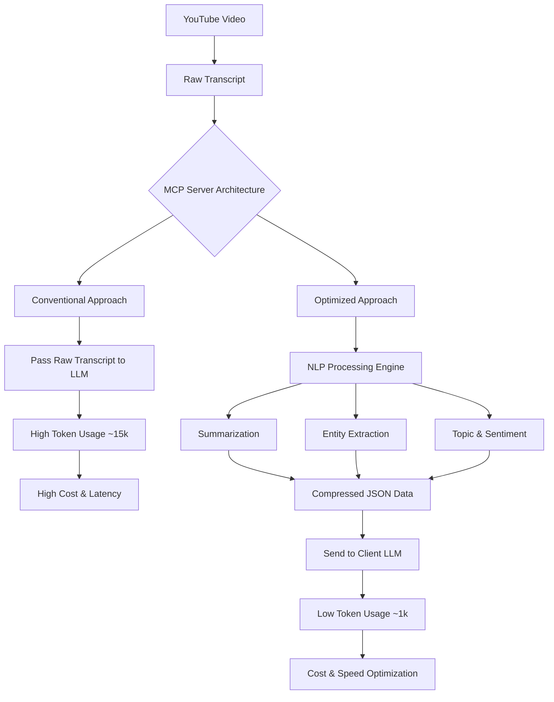

## 서론

최근 LLM(Large Language Model)을 활용한 에이전트 시스템이 급부상하면서, 모델이 외부 세계와 상호작용하는 표준 규약인 MCP(Model Context Protocol)에 대한 관심이 뜨겁습니다. 연구자나 엔지니어가 특정 YouTube 기술 강의를 분석하기 위해 LLM 에이전트를 활용한다고 가정해 봅시다. 에이전트는 해당 영상의 자막을 가져와 내용을 요약하거나 핵심 인사이트를 추출해야 합니다.

여기서 치명적인 병목 현상이 발생합니다. 기존의 대다수 MCP 서버는 YouTube 원본 자막 텍스트를 가공 없이 그대로 LLM 프롬프트(Context Window)에 주입합니다. 20분 분량의 일반적인 기술 강의 자막은 약 15,000 토큰에 달합니다. 이를 처리하기 위해서는 고클래스 GPU가 필요한 대규모 모델(GPT-4o, Claude 3.5 Sonnet 등)을 호출해야 하며, 이는 곧 막대한 추론 비용(Inference Cost)과 지연 시간(Latency)으로 직결됩니다.

우리는 LLM이 모든 텍스트를 '읽게' 만드는 것이 아니라, '필요한 정보만 전달받게' 만드는 구조적 최적화가 필요합니다. 단순히 파이프라인을 연결하는 것을 넘어, **서버 사이드(Server-side)에서 지능적으로 데이터를 전처리하여 토큰 경제(Token Economy)를 실현하는 것**이야말로 엔터프라이즈급 MLOps의 핵심 과제입니다.

## 본론

### 기술적 원리와 아키텍처: 서버 사이드 인텔리전스

MCP YouTube Intelligence의 핵심 설계 철학은 **"Computation at the Edge, Insight at the Source"**입니다. 기존 방식이 LLM에게 '연산(처리)'과 '추론'을 모두 맡겼다면, 본 아키텍처는 무거운 '연산'을 MCP 서버 내부의 가벼운 NLP 모델이나 전처리 로직으로 분리합니다.

이 서버는 클라이언트(사용자의 LLM)의 요청을 받으면 YouTube 영상의 자막을 추출한 즉시, 다음과 같은 4가지 지능적 분석을 수행합니다.
1.  **요약(Summarization)**: 원문의 맥락을 유지하며 핵심 내용을 압축합니다.
2.  **엔티티 추출(NER)**: 중요 인물, 기술 용어, 기관명 등을 식별합니다.
3.  **토픽 모델링(Topic Modeling)**: 영상이 다루는 주제를 분류합니다.
4.  **감성 분석(Sentiment Analysis)**: 화자의 태도나 내용의 성향(긍정/부정/중립)을 파악합니다.

이 과정을 거치면 15,000토큰에 달하는 데이터가 500~1,000토큰 수준의 구조화된 인사이트로 압축되어 클라이언트에게 전달됩니다. 결과적으로 LLM은 방대한 텍스트를 훑지 않아도 이미 정제된 정보를 바탕으로 고차원적인 추론만 수행하면 됩니다.

### 시스템 아키텍처 다이어그램

아래 다이어그램은 기존의 비효율적인 파이프라인과 최적화된 MCP 서버의 데이터 처리 흐름을 시각적으로 비교한 것입니다.



### 성능 비교 분석

서버 사이드 전처리가 가져오는 이득은 단순한 체감 속도를 넘어, 시스템 전체의 처리 용량(Throughput)에 영향을 미칩니다. 다음은 20분 분량의 기술 영상을 분석할 때의 가상의 성능 비교표입니다.

| 비교 항목 | 기존 MCP 서버 (Raw Transcript) | MCP YouTube Intelligence (Optimized) |
| :--- | :--- | :--- |
| **입력 토큰 수 (Input Tokens)** | 약 15,000 토큰 | 약 800 토큰 (압축률 95%) |
| **LLM 추론 비용 (Cost)** | 높음 (High Tier Model 필수) | 낮음 (Lite Model 사용 가능) |
| **응답 지연 시간 (Latency)** | 10초 ~ 20초 이상 (TTS) | 1초 ~ 3초 이내 |
| **Context Window 사용량** | 80% ~ 90% 점유 | 5% ~ 10% 점유 |
| **데이터 구조** | 비정형 텍스트 (Unstructured) | 구조화된 JSON (Structured) |

### 구현 가이드: Python을 이용한 서버 사이드 로직

실제 구현 시, 우리는 `mcp` python SDK와 `youtube-transcript-api`를 활용하여 서버를 구축할 수 있습니다. 핵심은 텍스트를 그대로 반환하는 `call_tool` 함수가 아닌, 내부에서 분석 로직을 거친 결과를 반환하도록 수정하는 것입니다.

다음은 서버 사이드에서 자막을 가져와 요약하는 간단한 예시 코드입니다. 실제 환경에서는 요약을 위해 `DistilBERT`나 경량화된 `LLaMA 3-8B` 등을 로컬에서 실행하거나 별도의 API를 호출할 수 있습니다.

```python
from mcp.server import Server
from mcp.types import Tool, TextContent
import youtube_transcript_api
import json

# MCP 서버 인스턴스 생성
app = Server("youtube-intelligence-server")

@app.tool(
    name="analyze_video_intelligence",
    description="Extracts and summarizes key insights from a YouTube video transcript efficiently."
)
async def analyze_video(url: str) -> list[TextContent]:
    try:
        # 1. YouTube 자막 추출
        video_id = url.split("v=")[-1]
        transcript_list = youtube_transcript_api.get_transcript(video_id)
        
        # 텍스트 재구성 (실제로는 타임스탬프 등을 활용한 정제가 필요)
        full_text = " ".join([t['text'] for t in transcript_list])
        
        # 2. 서버 사이드 인텔리전스 (여기서 전처리 수행)
        # 실제 프로덕션에서는 요약 모델 호출 또는 텍스트 랭킹 알고리즘 사용
        # 예시: 간단한 길이 제한에 의한 트렁케이션 및 헤드라인 추출 (Simulation)
        summary_text = full_text[:1000] + "..." 
        
        analysis_result = {
            "video_id": video_id,
            "summary": summary_text,
            "key_topics": ["AI", "Optimization", "MCP"], # 가상의 추출 결과
            "sentiment": "Positive"
        }
        
        # 3. 클라이언트에게 압축된 JSON 데이터만 전달
        return [TextContent(
            type="text",
            text=json.dumps(analysis_result, ensure_ascii=False)
        )]
        
    except Exception as e:
        return [TextContent(
            type="text", 
            text=f"Error processing video: {str(e)}"
        )]

# 서버 실행 (필요 시)
if __name__ == "__main__":
    app.run(transport="stdio")
```

이 코드는 클라이언트에게 수천 줄의 자막 텍스트 대신, `summary`와 `key_topics`가 포함된 깔끔한 JSON 객체를 전달합니다. 클라이언트 LLM은 이 JSON을 받아 "이 영상의 핵심 토픽을 바탕으로 블로그 포스팅을 작성해줘"와 같은 후속 작업을 수행할 때, 추가로 컨텍스트를 로드할 필요가 없어집니다.

### Step-by-Step 적용 전략

이러한 최적화 기술을 실무 MLOps 파이프라인에 적용하기 위한 단계는 다음과 같습니다.

1.  **데이터 수집 및 전처리 파이프라인 구축**: YouTube Data API v3를 사용하여 메타데이터를 수집하고, `youtube-transcript-api` 등을 통해 자막을 확보합니다. 이때 다국어 자막 처리 및 타임스탬프 동기화 로직을 포함해야 합니다.
2.  **전용 분석 모델 선정**: 서버 사이드에서 돌릴 분석 모델을 선정합니다. GPT-4와 같은 고가 모델 대신, 요약 작업에는 `BART`나 `LED`(Longformer Encoder-Decoder), 엔티티 추출에는 `BERT` 기반 NER 모델 등을 양자화(Quantization)하여 배포하는 것이 비용 효율적입니다.
3.  **MCP 툴 정의 및 배포**: MCP 서버의 `tools` 리스트에 `analyze_video`와 같은 함수를 정의합니다. 이때 출력 스키마(Output Schema)를 명확히 하여 클라이언트가 JSON을 파싱하기 쉽도록 만듭니다.
4.  **모니터링 및 피드백 루프**: 실제 서비스 중 토큰 절약률과 추론 시간을 모니터링합니다. 요약의 품질이 떨어져 클라이언트가 재요청(Re-generation)을 유발하는 경우, 전처리 파라미터를 튜닝해야 합니다.

## 결론

MCP YouTube Intelligence 사례는 단순한 비용 절감을 넘어 **"컨텍스트 엔지니어링(Context Engineering)"**의 중요성을 보여줍니다. LLM 애플리케이션의 성능은 모델의 파라미터 수만으로 결정되는 것이 아니라, 모델에게 어떤 품질의 데이터를 얼마나 효율적으로 먹이느냐에 달려 있습니다.

서버 사이드에서 무거운 리프팅(Heavy Lifting)을 수행하여 정보의 밀도를 높이는 패턴은 RAG(Retrieval-Augmented Generation)나 Agent 워크플로우 설계 전반에 적용될 수 있는 핵심 패러다임입니다. 이는 우리가 더 작은 모델로 더 강력한 성능을 낼 수 있게 하는, 즉 **"Small Model, Big Data -> Small Model, Smart Data"**로의 진화를 의미합니다.

앞으로의 LLM 서비스 개발에서는 단순히 API를 연결하는 것을 넘어, 이처럼 데이터의 흐름을 제어하고 최적화하는 MLOps적 역량이 연구자와 개발자 모두에게 필수적인 경쟁력이 될 것입니다.

### 참고자료

- **MCP (Model Context Protocol)**: [https://modelcontextprotocol.io/](https://modelcontextprotocol.io/)

- **YouTube Transcript API**: [https://github.com/jdepoix/youtube-transcript-api](https://github.com/jdepoix/youtube-transcript-api)

- **Original Article (Hada.io)**: [Show GN: MCP YouTube Intelligence](https://news.hada.io/topic?id=26779)

- **Longformer Encoder-Decoder (LED)**: arXiv:2012.14944 (Efficient long-document summarization)
