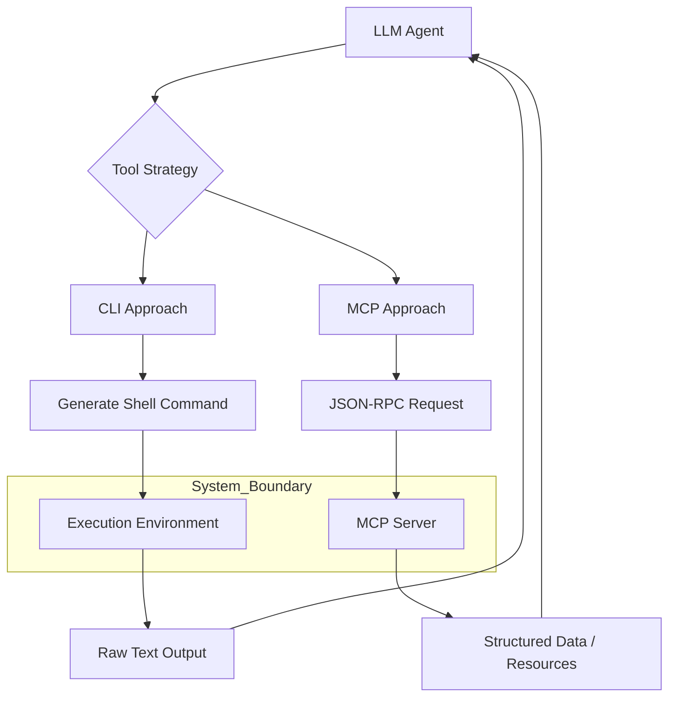

## 서론

최근 MLOps 파이프라인을 구축하던 한 팀은 흥미로운 난관에 봉착했습니다. LLM 에이전트가 CI/CD 파이프라인을 제어하고, 로그를 분석하며, Docker 컨테이너를 관리하는 '오토메이션 매니저'를 개발 중이었기 때문입니다. 개발初期에는 간단한 Python 스크립트로 `subprocess` 모듈을 통해 쉘 명령어를 실행하고 결과를 텍스트로 반환하는 방식을 사용했습니다. 하지만 에이전트가 수행해야 할 작업이 복잡해지면서, "어떤 플래그를 사용해야 하는지", "비밀번호를 어떻게 안전하게 전달할지", 그리고 "명령어 실행 결과를 어떻게 구조화하여 LLM에게 전달할지"라는 문제가 발생했습니다.

이는 단순한 스크립팅 문제를 넘어, **LLM이 시스템 자원과 상호작용하는 인터페이스의 표준화**라는 근본적인 질문으로 이어집니다. 여기서 등장하는 두 가지 주요 접근 방식이 바로 전통적인 **CLI(Command Line Interface)** 래핑과 앤트로픽(Anthropic)이 주도하는 **MCP(Model Context Protocol)**입니다. 이 글에서는 단순한 도구 선택의 차원을 넘어, 에이전트의 안전성, 확장성, 그리고 유지보수성을 결정짓는 이 두 아키텍처의 기술적 메커니즘을 심층적으로 비교 분석합니다.

## 본론

### 1. 기술적 배경과 메커니즘 비교

CLI 기반 접근은 LLM이 자연어를 생성하면, 이를 시스템의 쉘(Shell) 명령어로 변환하여 실행하는 가장 직관적인 방식입니다. 이는 `Toolformer`나 `Gorilla`와 같은 초기 연구에서 LLM이 API를 학습하는 방식과 유사합니다. LLM은 함수 호출(Function Calling)을 통해 `execute_command("ls -l")`과 같은 명령을 내리고, 시스템은 텍스트 결과를 반환합니다. 이 방식의 장점은 무엇보다 범용성입니다. 이미 존재하는 모든 CLI 도구(git, kubectl, docker 등)를 즉시 사용할 수 있습니다.

반면, MCP는 에이전트와 도구 사이의 통신을 위한 **표준화된 프로토콜(Protocol)**입니다. MCP는 JSON-RPC 2.0을 기반으로 하며, 에이전트(클라이언트)가 도구(서버)의 기능을 동적으로 발견(Discovery)하고 사용할 수 있게 합니다. MCP는 단순히 명령어를 실행하는 것을 넘어, 리소스(Resources, 파일 등), 프롬프트(Prompts), 툴(Tools)을 구조화된 방식으로 노출합니다. 이는 OpenAPI가 웹 서비스의 상호작용을 표준화했던 것과 유사한 변화를 LLM 에이전트 생태계에 가져오고 있습니다.

### 2. 아키텍처 다이어그램

두 방식의 데이터 흐름과 추상화 계층을 시각적으로 비교하면 다음과 같습니다. CLI 방식은 LLM이 직접 명령어를 구성해야 하는 부담이 있는 반면, MCP는 구조화된 인터페이스를 통해 상호작용합니다.



### 3. 상세 비교: CLI vs MCP

실무적으로 어떤 방식을 선택해야 할지 결정하기 위해 핵심 지표들을 비교해 보겠습니다.

| 비교 항목 | CLI (Command Line Interface) | MCP (Model Context Protocol) |
| :--- | :--- | :--- |
| **추상화 계층** | 낮음 (Low-level) | 높음 (High-level) |
| **표준화** | 도구별로 상이 (비표준) | JSON-RPC 기반 표준 프로토콜 |
| **안전성** | 낮음 (Shell Injection 위험) | 높음 (구조화된 타입 검증 가능) |
| **컨텍스트 공유** | 어려움 (파일 파싱 필요) | 용이 (Resource URI 기반 공유) |
| **개발 속도 (초기)** | 빠름 (기존 명령어 사용) | 느림 (서버 구현 필요) |
| **유지보수성** | 낮음 (명령어 변경 시 프롬프트 수정) | 높음 (Schema 버전 관리) |

### 4. 코드 예시를 통한 구현 차이

Python 코드를 통해 CLI를 래핑하는 방식과 MCP 서버를 구현하는 방식의 차이를 살펴보겠습니다.

**CLI 래핑 방식 (위험성 내포)** 이 방식은 LLM이 올바른 명령어를 생성한다고 가정하며, 보안 취약점(명령어 인젝션)이 존재할 수 있습니다.

```python
import subprocess

def execute_cli_tool(command: str) -> str:
    """
    LLM이 생성한 명령어 문자열을 셀에서 실행합니다.
    주의: LLM의 Hallucination으로 인해 rm -rf 같은 위험한 명령어가 실행될 수 있습니다.
    """
    try:
        result = subprocess.run(
            command, 
            shell=True, 
            check=True, 
            capture_output=True, 
            text=True
        )
        return result.stdout
    except subprocess.CalledProcessError as e:
        return f"Error: {e.stderr}"

# 예시 호출
# output = execute_cli_tool("ls -l /workspace")
```

**MCP 서버 구현 방식 (구조화됨)** MCP SDK를 사용하면 입력 타입을 강제하고, 결과를 구조화된 형태로 반환할 수 있습니다.

```python
from mcp.server.fastmcp import FastMCP
from typing import Any

# MCP 서버 인스턴스 생성
mcp = FastMCP("LogAnalysisServer")

@mcp.tool()
def analyze_logs(level: str, limit: int = 10) -> list[dict[str, Any]]:
    """
    로그 파일을 분석하여 특정 레벨의 로그를 반환합니다.
    
    Args:
        level: 로그 레벨 (INFO, ERROR, WARN)
        limit: 반환할 최대 로그 수
    """
    # 실제 로그 파싱 로직 (예시)
    logs = [
        {"timestamp": "2026-02-28", "level": "INFO", "msg": "System started"},
        {"timestamp": "2026-02-28", "level": "ERROR", "msg": "Connection failed"},
    ]
    
    filtered = [log for log in logs if log["level"] == level]
    return filtered[:limit]

# 표준 입출력을 통해 JSON-RPC 통신 수행
if __name__ == "__main__":
    mcp.run()
```

위 MCP 예시를 보면 `analyze_logs` 함수는 인자의 타입과 역할이 명확하게 정의되어 있습니다. LLM은 이 Schema를 참조하여 함수 호출을 생성하므로, CLI 방식에 비해 훨씬 강건한(Robust) 상호작용이 가능합니다.

### 5. 실무 적용을 위한 Step-by-Step 가이드

프로젝트의 요구사항에 따라 적절한 전략을 수립하는 단계별 가이드입니다.

**Step 1: 워크로드 분류** 단순한 시스템 관리 작업(파일 삭제, 프로세스 재시작)인가, 아니면 복잡한 데이터 파이프라인 연동인가를 파악합니다.

- **단순 작업:** CLI로도 충분하며, `sudo` 권한 제어 등을 통해 보안을 관리합니다.

- **복잡한 작업:** 데이터베이스 조회, 대용량 파일 처리 등 구조화된 입출력이 필요한 경우 MCP를 고려합니다.

**Step 2: 에코시스템 및 호환성 고려** 사용하는 LLM 클라이언트(예: Claude Desktop, Cursor, Cline)가 MCP를 네이티브하게 지원하는지 확인합니다. 현재 MCP는 에이전트 생태계에서 빠르게 표준으로 자리 잡고 있으므로, 장기적인 호환성을 위해서는 MCP 유리합니다.

**Step 3: 보안 샌드박싱 설계** CLI는 호스트 머신에 직접적인 접근 권한을 가지므로 Docker 컨테이너 내부에서 실행하는 등의 샌드박싱이 필수입니다. MCP는 서버가 별도 프로세스로 실행되므로, 네트워크 레벨에서의 접근 제어나 별도의 권한 부여가 용이합니다.

**Step 4: 구현 및 테스트** CLI 방식에서는 LLM이 생성하는 명령어를 검증하는 **Guardrail** 메커니즘을 추가해야 합니다. MCP 방식에서는 스키마(Schema)가 잘 정의되었는지, 그리고 JSON 직렬화 비용이 성능에 영향을 주는지 프로파일링해야 합니다.

## 결론

MCP와 CLI의 선택은 기술적 우위의 문제가 아니라, **"표준화된 비용"과 "원시적 유연성" 사이의 트레이드오프**를 결정하는 문제입니다. CLI는 약속의 땅과도 같아서 제약이 적어 빠르게 프로토타이핑하기에는 최적이지만, 대규모 시스템에서는 그 자유로움이 곧 관리의 악몽이 될 수 있습니다. 반면, MCP는 초기 설정 비용이 들지만, 에이전트가 도구를 이해하고 사용하는 방식을 구조화함으로써 안정성과 재사용성을 보장합니다.

전문가로서의 인사이트를 덧붙이자면, 향후 LLM 에이전트 시장은 **"프로토콜 전쟁"의 시대**로 접어들 것입니다. 현재는 MCP가 강세를 보이지만, OpenAPI나 기타 표준이 경쟁할 수 있습니다. 중요한 것은 특정 도구에 종속되지 않고, **도구의 기능을 설명하는 메타데이터(Description/Schema)**를 얼마나 잘 정의하느냐입니다. 결론적으로, 단순한 스크립트 자동화에는 CLI를, 복잡한 에이전트 간 협업이나 프로덕션 급 MLOps 파이프라인에는 MCP를 도입하는 하이브리드 전략이 가장 합리적입니다.

### 참고자료

- [Anthropic Model Context Protocol (MCP) Specification](https://modelcontextprotocol.io/)

- [Toolformer: Language Models Can Teach Themselves to Use Tools](https://arxiv.org/abs/2302.04761)

- [Gorilla: Large Language Model Connected with Massive APIs](https://arxiv.org/abs/2305.15334)

- [Hacker News Discussion: When does MCP make sense vs CLI?](https://news.ycombinator.com/item?id=47208398)
