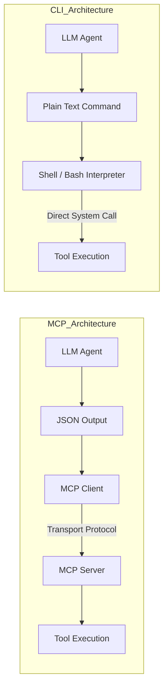

## 서론

최근 수많은 AI 엔지니어들이 LLM(Large Language Model) 에이전트를 구축하면서 겪는 가장 큰 좌절 중 하나는 복잡한 프로토콜 구현에 있습니다. 우리는 LLM이 특정 도구를 사용하게 하기 위해 OpenAPI 스펙을 작성하고, 이를 JSON 스키마로 변환하며, 별도의 서버를 띄우는 과정을 반복해 왔습니다. Anthropic이 제안한 MCP(Model Context Protocol)는 이러한 도구 간의 상호 운용성을 표준화하겠다는 야심 찬 목표로 시작되었지만, 실무 현장에서는 예상치 못한 복잡성을 야기하고 있습니다.

이러한 상황 속에서 "MCP는 죽었다. CLI 만세"라는 논쟁이 제기되었습니다. 이는 단순한 반발이 아니라, LLM의 능력이 진화함에 따라 우리의 접근 방식도 근본적으로 달라져야 한다는 기술적 신호입니다. 현대의 최신 LLM들은 훈련 데이터에 포함된 방대한 코드와 문서를 통해 이미 명령줄 인터페이스(CLI) 사용법을 익혔습니다. 과연 우리는 별도의 무거운 프로토콜 계층을 만들어 LLM과 도구 사이를 가로막아야 할까요, 아니면 LLM이 가장 친숙하게 여기는 CLI라는 언어로 직접 대화하게 해야 할까요? 이 글에서는 불필요한 추상화를 제거하고 CLI를 통해 LLM 에이전트의 성능을 극대화하는 실용적인 전략을 살펴봅니다.

## 본론

### MCP의 딜레마와 CLI의 효율성

MCP를 포함한 기존의 함수 호출(Function Calling) 접근 방식은 기본적으로 "구조화된 계약(Contract)"을 전제로 합니다. LLM은 JSON 형식의 인자를 생성해야 하고, 시스템은 이를 검증한 후 실행합니다. 이 과정에서 발생하는 토큰 오버헤드와 파싱 비용은 무시할 수 없습니다. 반면, CLI 접근 방식은 텍스트 스트림을 기반으로 합니다. LLM에게 있어 `ls -la`나 `grep "error" log.txt` 같은 명령어는 자연어와 유사한 또 다른 언어일 뿐, 복잡한 API 사양이 필요 없습니다.

이는 "시맨틱 갭(Semantic Gap)"의 관점에서 설명할 수 있습니다. LLM의 학습 코퍼스(Corpus)에는 GitHub의 수많은 리포지토리와 터미널 세션이 포함되어 있습니다. 즉, 모델은 MCP의 JSON-RPC 메시지 포맷보다 Bash 스크립트 문법에 훨씬 강력한 사전 지식(Prior Knowledge)을 가지고 있습니다.

### 아키텍처 비교: MCP vs CLI

두 접근 방식의 차이를 시스템 아키텍처 관점에서 비교해 보면, CLI 방식이 훨씬 간결한 데이터 경로를 가짐을 알 수 있습니다.



위 다이어그램에서 볼 수 있듯이, MCP 아키텍처는 클라이언트와 서버 간의 트랜스포트 계층을 필요로 하며, JSON 직렬화/역직렬화 과정이 필수적입니다. 반면, CLI 아키텍처는 텍스트 명령을 쉘(Shell) interpreter로 전달하여 즉시 실행함으로써 지연 시도(Latency)를 획기적으로 줄이고 실패 가능한 구성 요소를 제거합니다.

### 기술적 구현: Python을 활용한 CLI 브릿지

실제로 LLM이 CLI 명령어를 생성하고 이를 실행하여 결과를 다시 LLM에게 피드백하는 과정은 생각보다 간단합니다. 별도의 MCP 서버 구현 없이 Python의 `subprocess` 모듈만으로도 강력한 에이전트를 구축할 수 있습니다.

다음은 LLM이 생성한 텍스트 명령을 안전하게 실행하고 그 결과를 캡처하는 간단한 래퍼(Wrapper) 예제입니다.

```python
import subprocess
import json

def execute_cli_command(command: str) -> dict:
    """
    LLM이 생성한 CLI 명령어를 실행하고 결과를 반환합니다.
    보안을 위해 허용된 명령어 목록(allowlist)을 사용하는 것을 권장합니다.
    """
    try:
        # 안전장치: 기본적으로 shell=True는 보안 위험이 있으므로
        # 실제 운영환경에서는 shlex.split을 사용하거나 엄격한 검증이 필요합니다.
        # 여기서는 예시를 위해 shell=True를 사용하여 파이프라인 지원을 보여줍니다.
        result = subprocess.run(
            command,
            shell=True,
            capture_output=True,
            text=True,
            timeout=30
        )
        
        return {
            "status": "success",
            "stdout": result.stdout,
            "stderr": result.stderr,
            "return_code": result.returncode
        }
    except subprocess.TimeoutExpired:
        return {
            "status": "error",
            "message": "Command execution timed out"
        }
    except Exception as e:
        return {
            "status": "error",
            "message": str(e)
        }

# 시뮬레이션: LLM이 추론한 명령어
llm_generated_command = "ls -la | grep '.py'"

# 실행
response = execute_cli_command(llm_generated_command)
print(json.dumps(response, indent=2, ensure_ascii=False))
```

이 코드의 핵심은 LLM이 단순히 "파일 목록을 줘"라고 요청하는 것이 아니라, 구체적인 `ls` 명령어를 생성하도록 유도(Prompting)하는 것입니다. 최신 모델들은 파일 시스템을 탐색하거나 로그를 분석할 때 이러한 CLI 명령어를 매우 정확하게 생성해 냅니다.

### 성능 비교 및 실무 가이드

MCP 기반 접근과 CLI 기반 접근의 주요 차이점은 다음 표와 같이 요약할 수 있습니다.

| 비교 항목 | MCP (Model Context Protocol) | CLI (Command Line Interface) |
| :--- | :--- | :--- |
| **설정 복잡도** | 높음 (클라이언트/서버, JSON Schema 정의 필요) | 낮음 (기존 CLI 도구 활용, 문서화만 필요) |
| **디버깅 난이도** | 높음 (프로토콜 레벨 로깅, 직렬화 오류 추적 필요) | 낮음 (터미널에서 직접 명령어 테스트 가능) |
| **토큰 효율성** | 낮음 (스키마 정의 및 JSON 포맷팅에 많은 토큰 소모) | 높음 (명령어 자체가 매우 간결함) |
| **모델 호환성** | 제한적 (MCP를 지원하도록 파인튜닝되거나 학습된 모델) | 범용적 (대부분의 최신 LLM은 코드/CLI에 능숙함) |
| **확장성** | 높음 (다양한 클라이언트와 서버 간 통합) | 중간 (OS 및 환경 종속적이지만 Unix 계열에서 강력함) |

#### Step-by-Step CLI 에이전트 구축 가이드

1.  **환경 분석 및 문서화**: 에이전트가 사용해야 할 CLI 도구(예: `git`, `docker`, `awk`, `grep`)를 선정하고, 이들의 사용법과 예시를 시스템 프롬프트(System Prompt)에 포함합니다.
2.  **피드백 루프 설계**: `실행 -> 결과 관찰 -> 재계획(Re-planning)`의 루프를 설계합니다. CLI 명령어가 실패하면 stderr를 그대로 LLM에게 전달하여 스스로 수정하게 하십시오.
3.  **보안 샌드박싱**: CLI 접근의 가장 큰 단점은 보안입니다. 반드시 Docker 컨테이너 내부에서 실행하거나, RBAC(Role-Based Access Control)가 적용된 제한된 쉘 환경을 제공해야 합니다.
4.  **메모리 관리**: 긴 출력 결과(예: 긴 로그 파일)는 컨텍스트 윈도우(Context Window)를 모두 소진할 수 있습니다. 출력을 스트리밍하거나, 요약(summarization) 단계를 거쳐 LLM에 전달하는 전략이 필요합니다.

## 결론

LLM 에이전트 개발의 패러다임은 "프로토콜 중심"에서 "도구 중심"으로 이동하고 있습니다. MCP(Model Context Protocol)와 같은 표준화된 시도는 특정 생태계 내에서 의미가 있겠지만, 일반적인 개발 및 자동화 작업에서는 과도한 엔지니어링 오버헤드를 유발할 수 있습니다. 결국 가장 좋은 통합 방식은 LLM이 이미 학습한 방식, 즉 텍스트를 입력 받고 텍스트를 출력하는 CLI의 철학을 따르는 것입니다.

전문가 인사이트로서, 프로젝트 초기에는 복잡한 MCP 서버 대신 문서화 잘 된 CLI 스크립트와 Python 래퍼를 활용한 간단한 도구 사용(Tool Use)부터 시작할 것을 권장합니다. 불필요한 추상화 계층은 디버깅을 어렵게 만들고 시스템의 지연 시간을 증가시킵니다. LLM에게 명령줄의 권한을 위임하고, 개발자는 비즈니스 로직과 프롬프트 엔지니어링에 집중하십시오.

**참고자료:**

- [MCP는 죽었다. CLI 만세 (Hada.io)](https://news.hada.io/topic?id=27129)

- Anthropic, *Model Context Protocol Specification*

- OpenAI, *Function Calling and Code Interpreter*
