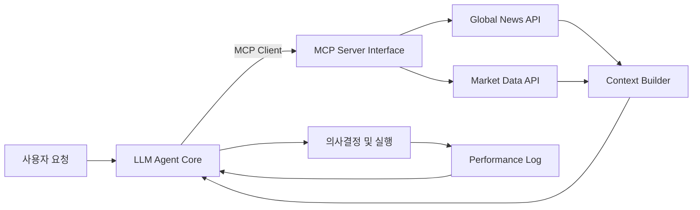

## 서론

글로벌 금융 시장은 24시간 멈추지 않고 쉴 새 없이 정보를 쏟아냅니다. 뉴욕 증시가 장을 마감하면 도쿄가 열리고, 런던의 경제 지표가 발표되는 순간 서울과 코인 시장의 변동성이 급격히 커집니다. 최근 32개국의 뉴스와 주요 국가(미국, 일본, 영국, 한국)의 시장 데이터, 그리고 코인/선물 시장의 일일 스냅샷을 MCP(Model Context Protocol)를 통해 실시간으로 수집하는 시스템을 구축했다는 소식은 매우 흥미롭습니다. 하지만 이런 거대한 데이터 파이프라인 위에서 "AI에게 얼마나 많은 권한을 줄 것인가"는 개발자가 직면한 가장 어려운 철학적이자 기술적인 난제입니다.

단순히 "사과 가격을 알려줘"라는 요청에 함수를 호출하는 것과, "오늘 경제 상황을 봤을 때 비트코인을 살까 말까?"라는 고차원적인 의사결정을 AI에게 맡기는 것은 차원이 다른 문제입니다. 전자는 명확한 입력과 출력이 있는 **기능 구현(Function Calling)**의 영역이고, 후자는 데이터를 해석하고 도구를 선택하며 행동 계획을 세우는 **자율성(Autonomy)**의 영역입니다. OpenClaw와 같은 자율형 에이전트 환경에서, 우리는 과연 엄격한 통제권을 쥐고 경직된 시스템을 만들 것인가, 아니면 AI에게 판단의 자유를 주어 높은 수익을 노릴 것인가 선택의 기로에 서 있습니다. 본문에서는 이 두 가지 접근 방식의 기술적 차이를 분석하고, 금융 데이터 분석 시스템에 최적화된 설계 전략을 제안합니다.

## 본론: MCP 에이전트 아키텍처의 설계 딜레마

### 1. MCP(Model Context Protocol)와 에이전트의 결합

MCP는 LLM(대규모 언어 모델)과 외부 데이터 소스 또는 도구 간의 표준 인터페이스를 제공하는 프로토콜로, 최근 클라우드 네이티브 환경에서 주목받고 있습니다. 금융 분야에서 MCP의 가장 큰 장점은 복잡한 API 호출을 추상화하여 LLM이 데이터 소스를 "마치 자신의 기억력처럼" 접근할 수 있게 한다는 점입니다.

하지만 데이터를 제공하는 것(Provisioning)과 그 데이터를 바탕으로 행동하는 것(Action)은 별개의 문제입니다. "기능 구현" 중심의 설계는 사전에 정의된 스키마(Contract)에 따라 LLM이 도구를 호출하도록 강제합니다. 반면, "자율성" 중심의 설계(예: OpenClaw 스타일)는 LLM에게 현재 상태(Context)를 파악하고, 필요한 도구를 선택하며, 심지어 자신만의 코드를 작성하여 문제를 해결할 수 있는 권한을 부여합니다.

다음은 MCP를 통해 데이터를 수집하고, 이를 바탕으로 투자 결정을 내리는 에이전트의 간단한 아키텍처 흐름입니다.



이 아키텍처에서 핵심은 `LLM Agent Core`가 단순히 `News API`를 호출하는 기계에 머무를 것인지, 아니면 `Context Builder`가 모은 정보를 종합하여 `Performance Log`까지 반영하며 스스로 전략을 수정하는 주체가 될 것인지 결정하는 부분입니다.

### 2. 기능 구현 vs 자율성(Autonomy): 기술적 비교

투자 시스템을 설계할 때 두 접근 방식은 명확한 트레이드오프(Trade-off) 관계에 있습니다. 아래 표는 각 접근 방식의 특징을 비교 분석한 것입니다.

| 비교 항목 | 기능 구현 중심 (Function Calling) | 자율성 중심 (Autonomy / OpenClaw) | | :--- | :--- | :--- | | **결정론적 특성** | 높음 (동일 입력 시 동일 출력) | 낮음 (추론 과정에서 확률적 변동 가능) | | **복잡한 문제 해결** | 제한적 (개발자가 정의한 로직 내) | 뛰어남 (Chain-of-Thought, ReAct 활용) | | **에러 핸들링** | 용이 (예외 처리 사전 정의 가능) | 어려움 (Hallucination, Tool misuse 위험) | | **Latency** | 낮음 (단일 함수 호출) | 높음 (다단계 추론 및 Tool 실행 필요) | | **적합 시나리오** | 단일 데이터 조회, 리포트 생성 | 복합 퀀트 전략 수립, 비정상 상황 대응 |

기능 구현 방식은 리스크 관리 측면에서 안전합니다. 예를 들어, "현재 삼성전자 주가를 알려줘"라는 요청에는 get_stock_price 함수만 호출하면 되므로 오류가 적습니다. 하지만 "미국 연준(Fed)의 금리 인상 기조가 한국 코스피에 미칠 영향을 분석하고 헷지 포지션을 제안해"와 같은 요청에는 데이터 수집, 분석, 가설 수립, 검증 등이 필요하므로 자율성이 필수적입니다.

### 3. 자율성을 위한 기술적 구현: ReAct와 Tool Use

자율적인 에이전트를 구현하기 위해서는 단순한 프롬프트 엔지니어링을 넘어 구조적인 추론 루프(Reasoning Loop)가 필요합니다. 최근 연구에서 널리 사용되는 **ReAct (Reasoning + Acting)** 패턴을 파이썬으로 구현한 예시는 다음과 같습니다.

이 코드는 LangChain 또는 경량 커스텀 프레임워크를 가정하여 작성되었으며, LLM이 스스로 "생각(Thought)"하고 "행동(Action)"하며 "관찰(Observation)"하는 과정을 반복합니다.

```python
import time
from typing import TypedDict

class AgentState(TypedDict):
    query: str
    thoughts: list[str]
    tool_results: list[dict]
    final_answer: str

def fetch_market_data(country: str):
    # MCP 서버를 통해 시장 데이터를 가져오는 mock 함수
    return f"{country} 시장 데이터: 지수 5% 상승, 거래량 급증"

def fetch_sentiment_news(topic: str):
    # MCP 서버를 통해 뉴스 감성 분석 결과를 가져오는 mock 함수
    return f"'{topic}' 관련 뉴스: 긍정적 센티먼트 80%"

def autonomous_agent_loop(query: str):
    state = AgentState(
        query=query,
        thoughts=[],
        tool_results=[],
        final_answer=""
    )
    
    max_iterations = 5
    
    print(f"🚀 에이전트 시작: {query}
")
    
    for i in range(max_iterations):
        # 1. Thought 단계: 현재 상태를 바탕으로 다음 행동을 추론
        # 실제 환경에서는 여기에 LLM API 호출 및 프롬프트 주입
        thought = f"단계 {i+1}: 사용자의 요청('{query}')을 해결하기 위해 관련 정보를 수집해야 한다."
        state['thoughts'].append(thought)
        print(f"💭 생각: {thought}")
        
        # 2. Action 단계: 적절한 MCP 툴 선택 및 실행 (간단한 조건문으로 시뮬레이션)
        if i == 0:
            action_result = fetch_sentiment_news("Fed Interest Rate")
            tool_name = "NewsSentimentTool"
        else:
            action_result = fetch_market_data("USA")
            tool_name = "MarketDataTool"
            
        state['tool_results'].append({"tool": tool_name, "result": action_result})
        print(f"🔧 행동: {tool_name} 호출")
        print(f"👁️ 관찰: {action_result}
")
        
        # 3. 종료 조건 확인 (충분한 정보가 모였다고 판단)
        if i == 1:
            final_answer = "뉴스와 시장 데이터 분석 결과, 현재 긍정적인 시장 흐름이 확인되었습니다. 매수 추천."
            state['final_answer'] = final_answer
            print(f"🏁 최종 답변: {final_answer}")
            break
            
    return state

# 실행
autonomous_agent_loop("미국 금리 인상이 시장에 미칠 영향은?")
```

이 코드는 매우 단순화되었지만, 실제 자율형 에이전트의 핵심 메커니즘을 보여줍니다. `thought` 단계에서 LLM은 이전 `tool_results`를 포함한 컨텍스트를 토큰화하여, 다음에 어떤 도구(뉴스인지, 주가인지)를 사용할지 스스로 결정합니다.

### 4. 실무적 적용 가이드: 하이브리드 전략의 필요성

투자 시스템의 목표가 수익의 극대화라면, 전통적인 "기능 구현" 방식만으로는 부족합니다. 시장은 Non-stationary(비정상성) 환경이므로 과거의 패턴이 미래에 보장되지 않기 때문입니다. 반면, 완전한 "자율성"은 펀드 매니저가 허용할 수 없는 리스크를 감수해야 합니다.

따라서 **가드레일(Guardrail)이 설치된 자율성(Hybrid Autonomy)** 전략을 추천합니다.

1.  **Guardrails 설정**: 허용된 MCP 툴 리스트(Whitelist)를 엄격히 관리하고, 단일 실행 예산(Token Budget)을 설정합니다. 2.  **Human-in-the-loop (HITL)**: 자율성이 높은 결정(예: 매수/매도 체결) 직전에 반드시 사람의 승인을 받는 검증 계층을 둡니다. 3.  **Multi-Agent System**: 하나의 에이전트가 모든 것을 처리하게 하지 말고, 뉴스를 분석하는 '분석가 에이전트', 데이터를 처리하는 '퀀트 에이전트', 최종 의사결정을 내리는 '메니저 에이전트'로 역할을 분담합니다.

이러한 하이브리드 접근 방식은 OpenClaw와 같은 오픈소스 에이전트 프레임워크를 기반으로 구현할 때 가장 효과적입니다. MCP는 에이전트들 간의 데이터 교환을 표준화하여 이러한 복잡한 상호작용을 가능하게 합니다.

## 결론

LLM 에이전트 개발에 있어 "기능 구현"과 "자율성"은 양자택일의 문제가 아닌, 시스템의 신뢰성과 성능을 조율하는 연속선상의 개념입니다. 금융 시장이라는 불확실성이 지배하는 환경에서는 단순한 함수 호출을 넘어선 AI의 유연한 판단력, 즉 자율성이 필수불가결합니다. 그러나 이 자율성은 통제되지 않은 방종이 아니어야 하며, MCP와 같은 표준화된 프로토콜 위에서 견고한 가드레일과 감시 체계가 뒷받침될 때 진정한 가치를 발휘합니다.

전문가 관점에서 제언하자면, 초기 개발 단계에서는 특정 기능(Function Calling)에 집중하여 데이터의 정합성을 확보하고, 시스템이 안정화되면 점진적으로 ReAct와 같은 추론 기반의 자율성을 확장해 나가는 단계적 접근(Stepwise refinement)이 가장 합리적입니다. 이는 단순히 더 똑똑한 AI를 만드는 것을 넘어, 신뢰할 수 있는 투자 파트너를 구축하는 길이 될 것입니다.

### 참고자료

- [ReAct: Synergizing Reasoning and Acting in Language Models (Shunyu Yao et al., 2022)](https://arxiv.org/abs/2210.03629)

- [Toolformer: Language Models Can Teach Themselves to Use Tools (Timo Schick et al., 2023)](https://arxiv.org/abs/2302.04761)

- [Model Context Protocol (MCP) Specification](https://modelcontextprotocol.io/)
