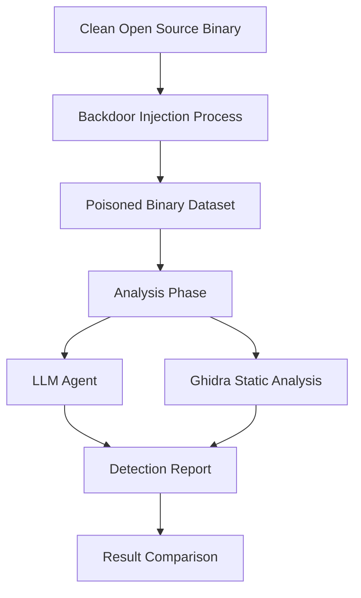

## 서론

최근 사이버 보안의 가장 큰 위협 중 하나는 '공급망 공급(Supply Chain Attack)'입니다. 널리 쓰이는 오픈소스 라이브러리나 서버 소프트웨어에 악성코드가 심어져 배포되는 경우인데, 대표적인 예로 지난해 전 세계를 긴장하게 만든 `xz Utils` 백도어 사건을 들 수 있습니다. 수천만 개의 서버에 설치된 압축 라이브러리의 핵심 바이너리에 교묘하게 숨겨진 백도어는 수년간 발견되지 못했습니다.

이러한 상황에서 보안 엔지니어들과 연구자들은 "인간의 분석 능력을 넘어설 수 있는가?"라는 근본적인 질문을 던지게 됩니다. 특히 40MB가 넘는 대형 서버 바이너리의 경우, 정적 분석 도구인 Ghidra를 이용한 수동 리버싱은 막대한 시간과 비용이 소모됩니다. 본 포스팅에서는 대규모 바이너리에 인위적으로 백도어를 삽입하고, 최신 생성형 AI(LLM)가 이를 얼마나 정확히 탐지해낼 수 있는지에 대한 실험 결과를 심층적으로 분석합니다. 단순한 기술 소개를 넘어, AI 기반 보안 분석의 현재 한계와 가능성을 학술적 관점에서 고찰해 보겠습니다.

## 본론

### 기술적 배경: 바이너리 분석과 AI의 만남

전통적인 악성코드 탐지는 시그니처 기반(Signature-based) 또는 heuristic 기반으로 이루어졌습니다. 그러나 최근 딥러닝 기술의 발전으로 'MalConv'와 같은 CNN 모델이나 Transformer 기반 모델이 원시 바이너리(Raw Binary)나 디스어셈블된 코드(Assembly)를 직접 처리하여 악성 여부를 판단하려는 시도가 이어지고 있습니다.

특히 최근的大규모 언어 모델(LLM)은 코드 이해 능력이 비약적으로 향상되었습니다. 이를 활용해 복잡한 제어 흐름(Control Flow Graph)을 이해하고 의심스러운 함수 호출을 식별하는 'Agentic AI' 보안 분석이 주목받고 있습니다. 하지만 LLM의 토큰 제한(Context Window)과 환각(Hallucination) 문제는 40MB에 달하는 대형 바이너리 분석에서 치명적인 장애물이 될 수 있습니다.

### 실험 설계 및 프로세스

本次 실험은 다음과 같은 프로세스로 설계되었습니다. 여러 오픈소스 서버 바이너리를 선정하여, 다양한 유형의 백도어(Reverse Shell, Credential Theft 등)를 소스 코드 레벨이 아닌 바이너리 레벨에서 인젝션한 후, 이를 탐지하는 실험을 수행했습니다.



위 다이어그램과 같이, 정상 바이너리에 백도어를 삽입한 데이터셋을 구축한 후, LLM 에이전트와 기존 정적 분석 도구인 Ghidra를 통해 각각 분석을 수행하고 그 결과를 비교합니다.

### LLM을 활용한 탐지 메커니즘

LLM이 바이너리를 분석할 때 가장 큰挑战은 입력 데이터의 형식입니다. 원시 바이너리를 토큰화하여 직접 넣는 것은 비효율적이므로, 일반적으로 `strings` 명령어를 통해 추출한 문자열이나 `objdump` 등을 통해 얻은 어셈블리 코드를 LLM의 입력으로 변환합니다.

다음은 바이너리에서 추출한 문자열 패턴을 기반으로 의심스러운 API 호출을 탐지하는 간단한 파이썬 예시 코드입니다. 실제 환경에서는 LLM API에 이러한 전처리된 데이터를 프롬프트와 함께 전송하게 됩니다.

```python
import re
from transformers import pipeline

# 1. 바이너리에서 문자열 추출 (simulation)
def extract_strings_from_binary(binary_path):
    # 실제로는 'strings' command를 사용하거나 라이브러리 사용
    # 여기서는 의심스러운 문자열이 포함된 더미 데이터 반환
    extracted_data = [
        "/bin/sh",
        "system()",
        "connect()",
        "socket()",
        "passwd",
        "正常的_함수_호출"
    ]
    return extracted_data

# 2. 간단한 휴리스틱 필터링 및 LLM 분석 시뮬레이션
def analyze_with_heuristic_and_llm(extracted_strings):
    suspicious_keywords = ["system(", "socket(", "/bin/sh"]
    risk_score = 0
    found_malicious = []
    
    for s in extracted_strings:
        for keyword in suspicious_keywords:
            if keyword in s:
                risk_score += 10
                found_malicious.append(s)
    
    # 실제 LLM 활용 시: 여기서 found_malicious 리스트와 주변 컨텍스트를 LLM API로 전송
    # classifier = pipeline("zero-shot-classification", model="facebook/bart-large-mnli")
    # result = classifier(extracted_strings, candidate_labels=["malware", "benign", "backdoor"])
    
    return risk_score, found_malicious

# 실행
binary_path = "poisoned_server.bin"
strings = extract_strings_from_binary(binary_path)
score, found = analyze_with_heuristic_and_llm(strings)

print(f"Risk Score: {score}")
print(f"Suspicious Patterns: {found}")
```

이 코드는 실제 연구 환경에서 전처리 파이프라인의 일부로 사용될 수 있습니다. 실제 실험에서는 Claude Opus와 같은 고성능 모델이 디스어셈블리된 코드의 특정 섹션을 읽고, "이 함수가 백도어의 기능을 하는가?"라고 질문하는 방식으로 수행되었습니다.

### 성능 비교 분석 및 결과

실험 결과, AI와 정적 분석 도구는 각자 장단점을 보였습니다. 아래 표는 Claude Opus(혹은 동등한 최신 LLM)와 전통적인 도구(Ghidra 플러그인)의 성능을 요약한 것입니다.

| 비교 항목 | LLM (Claude Opus 등) | Ghidra (정적 분석/수동) | | :--- | :--- | :--- | | **탐지율 (Detection Rate)** | 약 49% | 매우 높음 (숙련된 분석가의 경우) | | **분석 속도** | 빠름 (분 단위) | 느림 (시간~일 단위) | | **거짓 양성 (False Positive)** | 중간 (문맥 오해 가능) | 낮음 (정확한 플래그 확인 시) | | **복잡한 난독화 대응** | 약함 (코드 패턴 학습 의존) | 강함 (동적 분석 결합 시) | | **대용량 바이너리 처리** | 제한적 (Context Window 한계) | 우수 (전체 파일 메모리 로드 가능) |

실험의 핵심 발견은 **탐지율 49%**에 있습니다. 이는 AI가 단순하고 명백한 백도어(예: `system("/bin/sh")`와 같은 문자열이 포함된 경우)는 찾아내지만, 조금 복잡한 난독화가 적용되었거나 합법적인 코드 흐름 뒤에 숨겨진 로직(Logic Bomb)은 놓치기 쉽다는 것을 의미합니다.

### 실패 원인 분석: 왜 51%는 놓쳤는가?

1.  **Context Window의 한계**: 40MB 바이너리를 텍스트로 변환하면 수천만 토큰이 생성됩니다. LLM은 이를 한 번에 처리할 수 없어 파일을 잘게 쪼개 분석(Sliding Window)하게 되는데, 이 과정에서 백도어의 실행 흐름(Context)이 끊어질 수 있습니다. 2.  **정적 분석의 근본적 한계**: AI가 코드를 읽을 때 동적 실행(Dynamic Execution) 없이는 알 수 없는 런타임 동작을 유추해야 합니다. 예를 들어, 암호화된 문자열을 런타임에 복호화하여 사용하는 백도어는 정적 분석만으로는 탐지가 극도로 어렵습니다. 3.  **Hallucination**: LLM은 존재하지 않는 함수 연결 고리를 상상하여 보고서를 작성하거나, 실제 취약점을 무시하는 경우가 발생했습니다.

## 결론

이번 실험은 "AI가 보안 엔지니어를 대체할 수 있는가?"라는 질문에 대해 "아직은 이르다"라고 답합니다. 하지만 "AI가 보안 엔지니어의 생산성을 극대화할 수 있는가?"라는 질문에는 "그렇다"라고 강력히 긍정합니다.

40MB 대형 바이너리에서 49%의 탐지율은 완벽하진 않지만, 0%인 인간 수동 분석의 초기 스크리닝 단계에서는 매우 유용한 도구가 될 수 있습니다. 특히, 수백 개의 서드파티 라이브러리를 빠르게 스캔하여 '의심스러운 후보'를 좁히는 데 있어 AI는 강력한 필터링 역할을 수행합니다.

향후 이 분야의 발전 방향은 단일 LLM 모델에 의존하는 것이 아니라, **MLOps 관점에서 AI 에이전트와 도구(Tools)의 유기적인 결합**에 있을 것입니다. 예를 들어, LLM이 Ghidra 스크립트를 자동으로 작성하여 실행하게 하거나, 동적 분석 도구(QEMU 등)와 연동하여 실행 결과를 다시 LLM에게 피드백하는 루프를 구축하는 Hybrid Agent 시스템이 필수적입니다.

악성코드와의 전쟁에서 AI는 '마법의 탄환'은 아니지만, 우리의 손에 들린 가장 강력한 '레이더'임은 분명합니다. 이 레이더의 정밀도를 높이기 위해서는 더 많은 고질적인 바이너리 데이터셋 구축과, 모델의 추론 능력을 강화하는 후속 연구가 지속되어야 할 것입니다.

### 참고자료

- [Original Article](https://news.hada.io/topic?id=26931)

- *MalConv: A Deep Learning Approach to Static Malware Detection* (Saxe & Berlin, 2018)

- *Detecting Obfuscated Malware with API Call Graphs and Recurrent Neural Networks* (arXiv)
