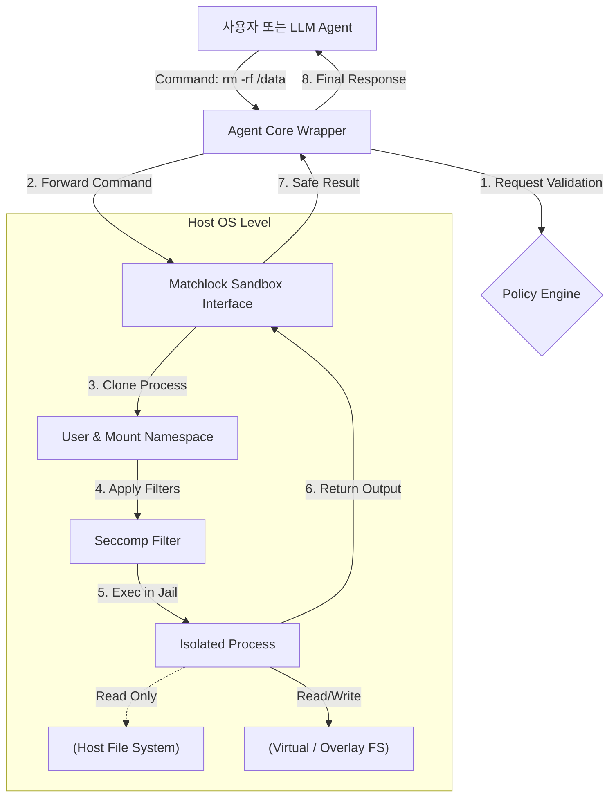

## 서론

최근 생성형 AI의 패러다임은 단순한 텍스트 생성을 넘어, 자율적으로 환경과 상호작용하는 **AI 에이전트(AI Agent)**로 빠르게 이동하고 있습니다. 이러한 에이전트는 웹 검색, 파일 시스템 관리, 코드 실행 등 복잡한 작업을 수행하기 위해 리눅스 터미널 명령어를 직접 호출하는 도구(Tool)를 통합하는 것이 일반적입니다. 그러나 이러한 능력은 칼날의 양날과 같습니다. 프롬프트 주입(Prompt Injection)이나 에이전트의 환각(Hallucination)으로 인해 `rm -rf /`와 같은 파괴적인 명령이나 민감한 데이터를 유출하는 스크립트가 실행될 경우, 호스트 시스템 전체가 위협받게 됩니다.

기존의 보안 솔루션인 도커(Docker)와 같은 컨테이너 기술은 너무 무겁거나, 단순한 화이트리스트 필터링은 우회하기 너무 쉽다는 한계가 있었습니다. **Matchlock**은 이러한 딜레마를 해결하기 위해 고안된 경량화된 리눅스 샌드박스 솔루션입니다. 에이전트의 워크로드를 격리하여 잠재적인 악의적 행동이나 시스템 오염을 방지하면서도, 에이전트가 요구하는 자율성을 훼손하지 않는 안전한 실행 환경을 구축하는 것이 Matchlock의 핵심 목표입니다. 본고에서는 Matchlock의 기술적 아키텍처와 그것이 어떻게 AI 보안의 새로운 표준을 제시하는지 심층적으로 분석합니다.

## 본론

### Matchlock의 기술적 원리: Linux Namespace와 Seccomp

Matchlock의 핵심은 Linux 커널 차원에서 제공하는 프리미티브(Primitive)들을 조합하여 에이전트를 위한 완벽한 격리 공간을 만드는 것입니다. 가상 머신(VM) 수준의 격리를 목표로 하는 것이 아니라, 프로세스 수준에서 빠르고 가볍게 실행 환경을 분리하는 것에 중점을 둡니다.

주요 메커니즘은 다음과 같습니다:
1.  **User Namespace**: 호스트의 root 사용자와 샌드박스 내부의 root 사용자를 분리하여, 샌드박스 내부에서 root 권한으로 명령을 실행하더라도 호스트 시스템에는 영향을 주지 않도록 합니다.
2.  **Mount Namespace**: 독립적인 파일 시스템 트리를 제공합니다. 호스트의 중요한 시스템 파일(`/etc`, `/home` 등)을 마운트에서 제외하고, 필요한 파일들만 읽기 전용(Read-only) 혹은 가상의 파일 시스템으로 제공합니다.
3.  **Network Namespace**: 기본적으로 네트워크 인터페이스를 격리하여 외부로의 직접적인 접속을 차단합니다.
4.  **Seccomp (Secure Computing Mode)**: 시스템 콜(System Call)을 필터링하여, `execve`, `fork` 이외의 잠재적으로 위험한 시스템 콜 호출을 차단합니다.

### 아키텍처 다이어그램

다음은 Matchlock이 AI 에이전트의 명령을 실행하는 과정과 보안 메커니즘을 시각화한 것입니다.



이 다이어그램에서 **Matchlock Sandbox Interface**와 **Policy Engine**이 강조된 파란색 노드입니다. 이는 보안을 적용하는 핵심 컴포넌트임을 의미합니다. 에이전트가 위험한 명령을 내리더라도, `Namespace` 격리와 `Seccomp` 필터링을 통해 호스트 시스템(Host OS Level)의 실제 자원에는 접근할 수 없게 됩니다.

### Python 구현 예시

Matchlock은 Python 라이브러리로 쉽게 래핑하여 사용할 수 있습니다. 아래 코드는 에이전트가 실행하려는 셸 명령을 Matchlock 샌드박스 내에서 안전하게 실행하는 간단한 래퍼 클래스의 예시입니다.

```python
import subprocess
import shutil

class MatchlockSandbox:
    def __init__(self):
        # 실제 Matchlock 구현에서는 리눅스 namespace 설정 라이브러리를 사용합니다.
        # 여기서는 개념적 구현을 위해 unshare 명령어를 활용하는 예시를 보여줍니다.
        self.unshare_bin = shutil.which("unshare")
        if not self.unshare_bin:
            raise RuntimeError("unshare command not found. Linux environment required.")

    def execute(self, command: str) -> dict:
        """
        에이전트의 명령을 격리된 샌드박스 환경에서 실행합니다.
        """
        # 보안: 기본적으로 네트워크 격리(-n), 마운트 격리(-m), PID 격리(-p), 프로세스 간 통신 격리(-ipc)
        # 추가로 root 권한 매핑을 위한 --map-root-user 옵션 등이 사용될 수 있습니다.
        unshare_args = [
            self.unshare_bin,
            "-m",  # Mount namespace
            "-n",  # Network namespace (네트워크 차단)
            "--fork",  # Fork the command
            "--mount-proc",  # Mount /proc
            "sh", "-c", command
        ]

        try:
            result = subprocess.run(
                unshare_args,
                capture_output=True,
                text=True,
                timeout=10  # 실행 시간 제한 (DoS 방지)
            )
            return {
                "status": "success",
                "stdout": result.stdout,
                "stderr": result.stderr,
                "exit_code": result.returncode
            }
        except subprocess.TimeoutExpired:
            return {
                "status": "error",
                "message": "Command execution timed out."
            }
        except Exception as e:
            return {
                "status": "error",
                "message": str(e)
            }

# 사용 예시: AI Agent가 명령을 생성
agent_command = "echo 'Agent is working' > /tmp/agent_output.txt && cat /tmp/agent_output.txt"
sandbox = MatchlockSandbox()

print(f"Executing: {agent_command}")
response = sandbox.execute(agent_command)
print("Result:", response)
```

이 코드는 `unshare` 시스템 도구를 활용하여 네임스페이스를 분리하고 명령을 실행합니다. 실제 운영 환경에서는 Matchlock 라이브러리가 이러한 로직을 더욱 견고하고 투명하게 처리하여, 개발자가 복잡한 리눅스 보안 설정을 몰라도 에이전트를 보호할 수 있게 합니다.

### 격리 기법 비교

Matchlock과 같은 샌드박스 접근법이 기존 방식과 어떻게 다른지 비교해 보는 것은 중요합니다.

| 특성 | Raw Shell Execution | Docker Container | Matchlock (User NS) |
| :--- | :--- | :--- | :--- |
| **격리 수준** | 없음 (호스트와 동일) | OS 레벨 가상화 | 프로세스/네임스페이스 레벨 |
| **설정 복잡도** | 낮음 (매우 위험) | 중간 (이미지 관리 필요) | 낮음 (라이브러리 호출) |
| **오버헤드** | 없음 | 높음 (커널 오버헤드, 이미지 로딩) | **낮음** (프로세스 포킹) |
| **보안성** | 취약 | 양호하지만 탈출 가능성 존재 | **양호** (Least Privilege) |
| **주요 용도** | 로컬 스크립트 | 마이크로서비스, 배포 | **AI 에이전트, 임시 작업** |

Docker는 강력하지만, AI 에이전트가 매번 새로운 작업을 수행할 때마다 컨테이너를 생성하고 삭제하는 것은 리소스 소모가 큽니다. Matchlock은 경량 프로세스 격리를 통해 에이전트의 빠른 반복 실행(Iterative Execution) 패턴에 최적화되어 있습니다.

### 실무 적용 가이드: 에이전트에 Matchlock 통합하기

기존의 LangChain이나 AutoGPT와 같은 프레임워크에 Matchlock을 적용하는 절차는 다음과 같습니다.

**Step 1: 환경 설정** Matchlock은 Linux 환경에서 커널 기능을 직접 사용하므로, 호스트 시스템은 Linux여야 합니다. (WSL2 환경에서도 작동 테스트가 필요합니다.)

**Step 2: 정책(Policy) 정의** 에이전트에게 허용할 명령어 집합을 정의합니다. 예를 들어, `python`, `ls`, `cat`은 허용하고 `sudo`, `ssh`, `iptables`는 명시적으로 차단하는 정책 파일을 작성합니다. Matchlock은 이 정책을 Seccomp 필터로 변환합니다.

**Step 3: 도구(Tool) 래핑** 에이전트 프레임워크에서 제공하는 `Shell` 도구를 Matchlock 래퍼로 교체합니다.

```python
# LangChain 예시
from langchain.tools import ShellTool
# 기존 ShellTool을 Matchlock이 적용된 커스텀 툴로 대체
secure_shell = SecureMatchlockTool()
agent = initialize_agent(tools=[secure_shell], llm=llm, ...)
```

**Step 4: 로그 및 모니터링** 샌드박스 내부에서 발생한 에러나 차단된 명령어에 대한 로그를 기록합니다. 이는 에이전트의 행동 패턴을 분석하고, 프롬프트 주입 공격 시도가 있었는지 사후 분석( Forensics)하는 데 중요한 데이터가 됩니다.

## 결론

AI 에이전트의 자율성은 비즈니스 자동화의 핵심 동력이지만, 통제되지 않은 자율성은 재앙을 초래할 수 있습니다. **Matchlock**은 이러한 딜레마를 "프로세스 격리"라는 가장 확실한 컴퓨터 과학적 원리로 해결합니다. 무거운 가상화 없이도 리눅스의 네임스페이스와 시스템 콜 필터링을 적절히 조합하여, 에이전트가 호스트 시스템에 해를 끼치지 못하도록 물리적(커널 레벨)으로 차단합니다.

전문가 관점에서 볼 때, 향후 AI 에이전트가 상용 단계로 진입하기 위해서는 보안 샌드박싱은 선택이 아닌 필수 요소가 될 것입니다. Matchlock과 같은 경량 보안 프레임워크의 등장은 개발자들이 "안전하게 실패(Safe to fail)"할 수 있는 환경을 제공하며, 이는 결국 더욱 대담하고 유능한 AI 시스템의 개발을 가속화할 것입니다.

**참고자료:**

- [Matchlock GitHub Repository](https://github.com/jingkaihe/matchlock)

- Linux namespaces documentation (man 7 namespaces)

- Seccomp (Secure Computing Mode) Kernel Documentation
