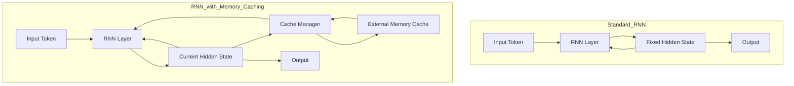

## 서론

최근 대규모 언어 모델(LLM)을 활용한 서비스들이 급증하면서, 모델이 처리할 수 있는 텍스트의 길이, 즉 '컨텍스트 윈도우(Context Window)'의 크기는 중요한 경쟁력 지표가 되었습니다. 하지만 긴 컨텍스트를 처리하는 데에는 기술적 딜레마가 존재합니다. 현재 가장 널리 사용되는 Transformer 아키텍처는 '셀프 어텐션(Self-Attention)' 메커니즘 덕분에 과거의 모든 정보를 완벽하게 기억할 수 있지만, 시퀀스 길이($L$)가 증가함에 따라 연산량과 메모리 사용량이 이차적으로($O(L^2)$) 늘어나는 치명적인 단점을 가지고 있습니다.

반면, RNN(Recurrent Neural Network)이나 최근 각광받는 Mamba와 같은 State Space Models(SSMs)은 시퀀스 길이에 상관없이 일정한 메모리를 사용하는 선형 복잡도($O(L)$)를 가집니다. 이는 효율성의 면에서 매우 매력적이지만, 고정된 크기의 은닉 상태(Hidden State)만을 사용하기 때문에 과거의 정보를 압축하여 저장해야 합니다. 이로 인해 "첫 문단에서 주인공의 이름이 무엇이었는지?"와 같은 회상(Recall) 중심의 작업에서는 Transformer보다 성능이 떨어지는 것이 일반적인 현실입니다.

이러한 효율성과 성능 사이의 간극을 해소하기 위해 최근 arXiv에 게재된 논문 **"Memory Caching: RNNs with Growing Memory"**는 매우 실질적인 해결책을 제시합니다. 연구진은 RNN의 은닉 상태를 특정 시점마다 저장해두는 **Memory Caching(MC)** 기법을 제안하여, RNN의 계산 효율성을 유지하면서도 메모리 용량을 동적으로 확장하여 장문막 이해 능력을 Transformer 수준으로 끌어올릴 수 있음을 입증했습니다.

## 본론

### Memory Caching(MC)의 기술적 원리

기존 RNN의 근본적인 한계는 정보가 지나가는 순간 은닉 상태로 압축되고, 이 압축된 상태만이 다음 스텝으로 전달된다는 점입니다. 시간이 지날수록 세부 정보는 손실되고, 의미적인 요약만 남게 됩니다. Memory Caching은 이 과정에서 RNN의 순환 과정을 주기적으로 스냅샷(Snapshot) 찍어 별도의 캐시(Cache) 저장소에 보관하는 아이디어에서 출발합니다.

모델이 추론을 수행할 때, 현재의 은닉 상태뿐만 아니라 캐시에 저장된 과거의 상태들을 참조하여 필요한 정보를 검색(Retrieve)하거나 결합(Aggregate)합니다. 이는 마치 컴퓨터 시스템의 CPU 캐시 메모리가 느린 메인 메모리(RAM)의 접근 속도를 보완하는 것과 유사한 원리입니다. 연구진은 이 메커니즘을 통해 RNN이 사실상 Transformer처럼 과거의 모든 토큰에 접근할 수 있는 능력을 갖추면서도, 실제 연산은 필요한 순간에만 수행하여 효율성을 확보할 수 있다고 주장합니다.

다음은 기존 RNN과 Memory Caching이 적용된 RNN의 데이터 흐름을 비교한 다이어그램입니다.



### 주요 변형 기법 및 구조

논문에서 제안하는 Memory Caching은 단순한 저장을 넘어 어떻게 캐시를 활용할지에 대한 네 가지 주요 변형 기법을 제안합니다.

1.  **Dense MC**: 모든 과거의 캐시를 현재 상태와 결합하여 사용합니다. 가장 정확하지만 계산 비용이 높습니다.
2.  **Sparse MC**: 가장 관련성이 높은 상위 K개의 캐시만 선택적으로 사용합니다. 효율성과 성능의 균형을 맞춥니다.
3.  **Gated MC**: 게이트(Gate) 메커니즘을 도입하여 각 캐시가 현재 출력에 얼마나 영향을 미칠지 동적으로 조절합니다.
4.  **Linear Attention MC**: 캐시 간의 관계를 선형 어텐션 방식으로 계산하여 연산량을 최적화합니다.

이러한 기법들은 은닉 상태를 1차원 벡터로 다루는 **Linear RNN**뿐만 아니라, 여러 층의 상태를 관리하는 **Deep RNN** 구조에서도 모두 적용 가능합니다. 특히 Sparse MC와 Gated MC를 결합할 경우, Transformer에 근접하는 성능을 RNN의 속도로 달성할 수 있습니다.

### 모델별 특성 비교

Memory Caching 기술이 적용된 모델이 기존 모델들과 어떤 차별점을 가지는지 아래 표로 정리해 보았습니다.

| 비교 항목 | Transformer (Attention) | 기존 RNN (Vanilla/Mamba) | RNN + Memory Caching |
| :--- | :--- | :--- | :--- |
| **시간 복잡도** | $O(L^2)$ (이차적) | $O(L)$ (선형) | $O(L)$ ~ $O(L^2)$ (유동적) |
| **메모리 사용량** | 컨텍스트 길이에 비례하여 증가 | 고정된 크기 사용 | 캐시 크기에 따라 유동적 증가 |
| **장기 기억 능력** | 완벽 (모든 토큰 접근 가능) | 제한적 (압축으로 인한 손실) | 우수 (캐시를 통한 회상 가능) |
| **추론 속도** | 느림 (긴 시퀀스일수록) | 매우 빠름 | 빠름 (캐시 슬라이딩) |
| **주요 용도** | 높은 정확도가 필요한 작업 | 실시간 처리, 엣지 디바이스 | 긴 컨텍스트 처리가 필요한 효율적 서비스 |

### 구현 가이드: PyTorch를 활용한 Simple Memory Caching

이론적으로 Memory Caching을 이해했다면, 실제로 어떻게 구현될 수 있는지 간단한 PyTorch 예제를 통해 살펴보겠습니다. 아래 코드는 기존 RNN 셀에 간단한 캐싱 레이어를 추가한 예시입니다.

```python
import torch
import torch.nn as nn

class CachedRNNCell(nn.Module):
    def __init__(self, input_size, hidden_size, cache_size):
        super(CachedRNNCell, self).__init__()
        self.input_size = input_size
        self.hidden_size = hidden_size
        self.cache_size = cache_size # 저장할 캐시의 최대 개수
        
        # 기본 RNN 셀 (예: GRU)
        self.rnn_cell = nn.GRUCell(input_size, hidden_size)
        
        # 캐시와 현재 상태를 결합하기 위한 가중치
        self.cache_combine = nn.Linear(hidden_size * 2, hidden_size)

    def forward(self, x, state, cache):
        """
        x: 현재 입력 (Batch, Input_Size)
        state: 이전 은닉 상태 (Batch, Hidden_Size)
        cache: 과거 은닉 상태들의 리스트 [(Batch, Hidden_Size), ...]
        """
        # 1. 기존 RNN 연산 수행
        new_state = self.rnn_cell(x, state)
        
        # 2. 캐시 업데이트 (FIFO 방식 예시)
        # 실제 구현에서는 더 정교한 전략(예: stride, attention-based selection) 사용
        cache.append(new_state.detach().clone()) # 그래디언트 전달 차단 및 저장
        if len(cache) > self.cache_size:
            cache.pop(0)

        # 3. 캐시 집계 (Aggregation)
        # 여기서는 단순 평균을 사용하지만, Attention을 적용할 수도 있음
        if len(cache) > 0:
            stacked_cache = torch.stack(cache, dim=0) # (Cache_Len, Batch, Hidden)
            # 캐시의 평균값 계산 (또는 Attention Score 가중합)
            aggregated_cache = torch.mean(stacked_cache, dim=0)
            
            # 4. 현재 상태와 캐시 정보 결합
            combined = torch.cat([new_state, aggregated_cache], dim=-1)
            final_state = self.cache_combine(combined)
        else:
            final_state = new_state

        return final_state, cache

# 사용 예시
batch_size = 2
input_size = 10
hidden_size = 16
cache_size = 5

model = CachedRNNCell(input_size, hidden_size, cache_size)
state = torch.zeros(batch_size, hidden_size)
cache = [] # 빈 캐시로 초기화

# 3 스텝 진행
inputs = [torch.randn(batch_size, input_size) for _ in range(3)]


```

```python
for i, inp in enumerate(inputs):
    state, cache = model(inp, state, cache)
    print(f"Step {i+1}: State Shape {state.shape}, Cache Length {len(cache)}")
```

위 코드는 MC의 가장 기본적인 형태인 "최근 N개의 상태를 평균 내어 결합"하는 방식을 구현한 것입니다. 실제 논문에서는 캐시를 저장하는 간격(Stride)을 조절하거나, 현재 입력과 유사한 캐시만 가져오는 Sparse Mechanism 등을 적용하여 성능을 극대화합니다.

### 실무 적용을 위한 Step-by-Step 전략

Memory Caching을 실제 MLOps 파이프라인이나 서비스에 적용하기 위해서는 다음과 같은 단계적인 접근이 필요합니다.

1.  **요구사항 분석 및 타겟 선정**     *   모든 작업에 MC를 적용할 필요는 없습니다. 'Needle-in-a-Haystack'과 같이 긴 텍스트 내의 특정 정보를 찾아내야 하는 **Recall-Intensive Task**에 우선 적용을 검토해야 합니다.

2.  **캐시 전략 수립 (Trade-off 결정)**     *   **Sparse vs Dense**: 서버의 메모리 여유가 넉넉하다면 Dense하게 캐싱하여 정확도를 높이고, 엣지 디바이스와 같이 리소스가 제한적이라면 Sparse 캐싱(상위 K개만 사용) 전략을 취해야 합니다.     *   **Stride 설정**: 매 토큰마다 캐시를 저장하면 메모리가 빨리 찹니다. 일정한 간격(예: 10 토큰마다)으로 캐시를 저장하는 Stride 기법을 적용하여 효율성을 높이세요.

3.  **KV-Cache 대신 MC 활용 (서빙 최적화)**     *   Transformer는 추론 시 과거의 모든 토큰에 대한 Key-Value(KV) 캐시를 저장해야 하므로 메모리 폭발 문제가 발생합니다. MC 기반 RNN을 사용하면, 메모리 사용량을 훨씬 낮게 유지하면서도 긴 컨텍스트를 처리할 수 있어 **초장문(Long-Context) 대화 서비스**의 비용 절감에 큰 기여를 할 수 있습니다.

4.  **성능 모니터링**     *   캐시 적중률(Cache Hit Rate)이나 캐시 검색 시 소요되는 추가 시간(Latency)을 모니터링해야 합니다. 캐시를 관리하는 오버헤드가 RNN의 장점인 속도를 저해하지 않는지 확인하는 것이 중요합니다.

## 결론

Memory Caching(MC) 기법은 효율적인 RNN의 구조를 유지하면서도, Transformer와 같이 과거의 정보를 폭넓게 활용할 수 있는 "지능형 확장 장치" 역할을 합니다. 이는 마치 짧은 기억력 밖에 없는 사람에게 노트를 주어 중요한 사항을 적어두게 하는 것과 같습니다. 연구 결과는 MC를 적용한 RNN이 언어 모델링과 장문막 이해 작업에서 기존 최신 RNN 모델들을 뛰어넘고, Transformer와의 성능 격차를 획기적으로 줄였음을 보여줍니다.

전문가적인 관점에서 볼 때, MC의 가장 큰 의의는 **"아키텍처의 교체 없이 메모리 관리 전략만으로 성능을 획기적으로 끌어올렸다"**는 점입니다. 이는 향후 LLM의 추론 비용 문제를 해결하는 하나의 중요한 축이 될 것입니다. 특히 온디바이스 AI나 실시간 스트리밍 처리와 같이 메모리와 연산 파워가 제한적인 환경에서, 긴 컨텍스트 처리가 필수적인 애플리케이션을 구현할 때 MC 기반의 RNN 아키텍처는 Transformer보다 더 실용적인 솔루션이 될 것입니다.

이 연구는 모델의 크기나 파라미터 수를 늘리는 것(Scaling Law)뿐만 아니라, 모델이 정보를 어떻게 저장하고 접근하는지에 대한 알고리즘적 최적화가 여전히 엄청난 성능 향상을 가져올 수 있음을 시사합니다.

**참고자료:**

- Paper: [Memory Caching: RNNs with Growing Memory](http://arxiv.org/abs/2602.24281v1)

- Related: "Transformers are RNNs: Fast Autoregressive Transformers with Linear Attention"
