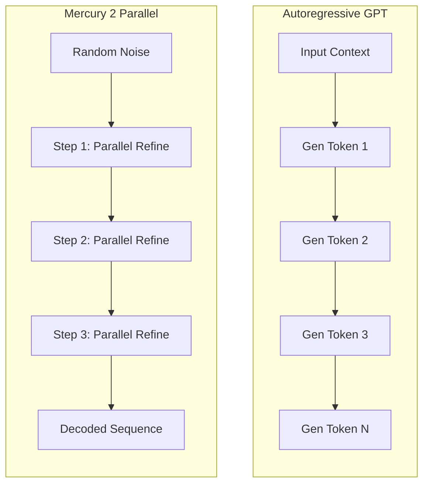

## 서론

대규모 언어 모델(LLM)을 실시간 애플리케이션에 통합하려 할 때, 우리는 종종 딜레마에 빠지곤 합니다. 모델의 파라미터를 늘려 지능을 높이면 응답 속도가 늦어지고, 반대로 속도를 높이기 위해 양자화를 시도면 응답의 품질이 떨어지거나 환각(Hallucination) 현상이 심화되는 경험을 해보셨을 것입니다. 이러한 문제의 근본적인 원인은 대부분의 최신 LLM이 채택하고 있는 '오토리그레시브(Autoregressive)' 방식, 즉 토큰을 하나씩 순차적으로 생성하는 메커니즘에 있습니다.

우리는 GPU의 연산 능력은 비약적으로 발전시켰지만, 메모리 대역폭(Memory Bandwidth)의 한계는 여전히 넘지 못하고 있습니다. 수십억 개의 파라미터를 가진 모델이 단 하나의 토큰을 생성하기 위해 매번 전체 가중치를 메모리에서 로드해야 하는 비효율성은 '메모리 월(Memory Wall)'이라 불리는 병목 현상을 야기합니다. 이러한 구조적 한계를 뛰어넘기 위해, 생성 과정 자체를 근본적으로 변화시키려는 시도가 주목받고 있습니다. 바로 이미지 생성 분야에서 혁명을 일으켰던 확산 모델(Diffusion Model)의 원리를 텍스트 생성으로 확장한 'Mercury 2'가 그 주인공입니다. 본 포스팅에서는 Mercury 2가 순차 디코딩의 한계를 어떻게 극복하고 병렬 추론을 통해 획기적인 속도 향상을 이뤄내는지 기술적 깊이 있게 다루고자 합니다.

## 본론

### 오토리그레시브 방식의 한계와 확산 모델의 접근

기존의 GPT 계열 모델은 다음 토큰의 확률 분포 $P(x_t | x_{<t})$를 예측하는 방식으로 작동합니다. 이는 생성하려는 시퀀스의 길이가 $N$일 때, 최소 $N$ 번의 순차적인 포워드 패스(Forward Pass)가 필요함을 의미합니다. 반면, 확산 모델 기반의 Mercury 2는 '노이즈 제거(Denoising)' 과정을 통해 텍스트를 생성합니다. 초기에는 완전한 노이즈(또는 랜덤한 토큰 시퀀스)에서 시작하여, 일정한 단계(Step)를 거쳐 이를 점진적으로 의미 있는 문장으로 정제(Refine)해 나갑니다.

이때 가장 큰 차이점은 '병렬성(Parallelism)'입니다. 오토리그레시브 방식이 $t$ 시점의 토큰이 생성되어야만 $t+1$ 시점의 토큰을 생성할 수 있는 직렬 의존성을 가지는 반면, Mercury 2는 시퀀스 전체(또는 청크 단위)에 대한 노이즈 제거 작업을 한 번의 포워드 패스에 수행합니다. 즉, 생성 스텝(Refinement Step) 횟수가 $K$번이라면, 총 연산량은 시퀀스 길이 $N$에 관계없이 $K$로 고정되거나 $N$에 대해 로그 스케일으로 증가하게 됩니다.

다음은 두 방식의 추론 흐름을 비교한 다이어그램입니다.



### Mercury 2의 기술적 핵심: 병렬 정제(Parallel Refinement)

Mercury 2는 단순히 기존의 연속 확산 모델(Continuous Diffusion)을 텍스트에 적용한 것이 아닙니다. 텍스트는 이산적(Discrete)인 데이터이므로, 이산 확산 과정을 최적화하는 것이 핵심입니다. Mercury 2는 '이산 확산(Discrete Diffusion)' 기술을 사용하여, 각 스텝에서 전체 시퀀스의 토큰을 동시에 업데이트합니다.

이 과정은 모델이 전체 문맥을 바라보면서 문장의 구조와 의미를 동시에 고려하여 수정한다는 점에서 인간이 글을 쓰고 고쳐쓰는(Revising) 과정과 유사합니다. 기존 방식이 첫 단어를 쓴 후 두 번째 단어를 생각하는 방식이라면, Mercury 2는 개요를 잡고 전체를 동시에 다듬어가는 방식이라고 볼 수 있습니다. 이러한 구조는 특히 긴 시퀀스(Long Context)를 생성해야 하는 작업에서 그 진가를 발휘합니다.

다음 표는 두 방식의 추론 특성을 비교한 것입니다.

| 비교 항목 | Autoregressive (GPT-4, Claude 등) | Mercury 2 (Diffusion) | | :--- | :--- | :--- | | **생성 메커니즘** | 순차적 (Sequential) | 병렬 정제 (Parallel Refinement) | | **주요 병목** | 메모리 대역폭 (Memory Bandwidth) | 연산 복잡도 (Compute Density) | | **지연 시간(Latency)** | 시퀀스 길이에 비례하여 증가 (O(N)) | 스텝 수에 의존 (O(K), K << N) | | **하드웨어 효율성** | KV-Cache 필요, 메모리 접근 빈번 | 높은 연산 밀도, GPU 활용도 극대화 | | **수정 가능성** | 생성된 토큰 수정 불가 | 생성 과정에서 전체 문맥 수정 가능 |

### 구현 예시: PyTorch를 이용한 이산 확산 추론 시뮬레이션

Mercury 2의 정확한 구현은 복잡하지만, 확산 기반 언어 모델이 어떻게 병렬 추론을 수행하는지 이해하기 위해 PyTorch를 사용한 개념적인 코드를 작성해 보겠습니다. 아래 코드는 노이즈가 섞인 토큰 시퀀스를 모델을 통해 반복적으로 정제하는 과정을 보여줍니다.

```python
import torch
import torch.nn.functional as F

# 개념적인 Diffusion Language Model 클래스
class ParallelDiffusionLM(torch.nn.Module):
    def __init__(self, vocab_size, d_model):
        super().__init__()
        self.embedding = torch.nn.Embedding(vocab_size, d_model)
        self.transformer = torch.nn.TransformerEncoder(
            torch.nn.TransformerEncoderLayer(d_model, nhead=8), num_layers=6
        )
        self.head = torch.nn.Linear(d_model, vocab_size)

    def forward(self, x_noisy, timesteps):
        # x_noisy: [batch, seq_len] - 노이즈가 포함된 토큰 ID들
        # timesteps: [batch] - 현재 확산 스텝

        # 임베딩 및 포지셔널 인코딩 (생략됨)
        x_emb = self.embedding(x_noisy) 
        
        # 트랜스포머 인코더 통과 (시퀀스 전체가 병렬 처리됨)
        # 셀프 어텐션 메커니즘 통해 전체 문맥 참조
        output = self.transformer(x_emb)
        
        # 다음 토큰(혹은 정제된 토큰) 예측
        logits = self.head(output)
        return logits

def refine_step(model, x_current, t, gamma=0.1):
    """
    한 번의 정제(Refinement) 스텝을 수행하는 함수
    """
    logits = model(x_current, t)
    
    # Gumbel-Softmax 또는 샘플링을 통한 토큰 재선택
    # 여기서는 확률적 샘플링을 가정
    probs = F.softmax(logits, dim=-1)
    
    # 기존 토큰과 새로운 예측 토큰을 혼합하는 개념적 업데이트
    # 실제 Diffusion에서는 노이즈 스케줄에 따라 더 정교하게 제어됨
    samples = torch.multinomial(probs.view(-1, probs.size(-1)), 1).view(x_current.shape)
    
    # 일정 확률(gamma)로만 토큰 변경, 나머지는 유지 (약한 노이즈 제거)
    mask = torch.rand_like(x_current.float()) < gamma
    x_next = torch.where(mask.bool(), samples, x_current)
    
    return x_next

# 시뮬레이션 설정
vocab_size = 50000
seq_len = 128
batch_size = 1
steps = 10 # 10번의 정제 스텝만으로 시퀀스 생성 (예시)

model = ParallelDiffusionLM(vocab_size, 512)
model.eval()

# 1. 초기화: 완전한 랜덤 노이즈 (또는 [MASK] 토큰 등)
current_tokens = torch.randint(0, vocab_size, (batch_size, seq_len))
print(f"Initial random tokens: {current_tokens[0, :5].tolist()}...")


```

```python
# 2. 병렬 정제 과정
with torch.no_grad():
    for t in range(steps):
        # 모든 토큰이 동시에 업데이트됨
        current_tokens = refine_step(model, current_tokens, t)
        print(f"Step {t+1}: Tokens updated in parallel")

print(f"Final refined sequence: {current_tokens[0, :5].tolist()}...")
```

이 코드에서 핵심은 `refine_step` 함수 내의 `model` 호출입니다. `batch_size`와 `seq_len`에 관계없이, 한 번의 포워드 패스(`forward`) 안에서 트랜스포머의 셀프 어텐션(Self-Attention)이 시퀀스의 모든 위치를 동시에 처리합니다. 이로 인해 긴 문장을 생성하더라도 연산 횟수가 급격히 늘어나지 않는 것입니다.

### 실무 적용을 위한 가이드 및 MLOps 고려사항

Mercury 2와 같은 병렬 추론 모델을 실제 서비스 환경에 도입할 때는 몇 가지 중요한 MLOps 전략이 필요합니다.

1.  **배치 처리(Batching) 효율성 극대화**: 기존 AR 모델은 문장 길이가 달라도 Padding으로 맞춰 처리하지만, Mercury 2는 고정된 스텝 수($K$)를 가지므로 정적인 배치 스케줄링이 유리합니다. 이는 GPU 메모리 사용량을 예측 가능하게 만들어 서빙 안정성을 높입니다. 2.  **추론 서버 최적화**: vLLM이나 TGI 같은 기존의 AR 최적화 엔진과는 다른 최적화가 필요합니다. Mercury 2는 KV-Cache를 통해 이전 토큰을 저장하는 방식이 아니므로, 대신 대규모 행렬 연산(GEMM)에 집중되는 워크로드를 가집니다. 따라서 FlashAttention 등 연산 중심의 커널 최적화 기술이 더욱 중요합니다. 3.  **품질-속도 트레이드오프 조절**: Diffusion 모델은 스텝 수(Refinement steps)를 조절하여 생성 속도와 품질 사이의 균형을 유연하게 조절할 수 있습니다. 실시간 채팅봇에서는 스텝 수를 줄여 지연 시간을 낮추고, 배치 문서 생성 시에는 스텝 수를 늘려 품질을 높이는 식의 동적 서빙 전략이 가능합니다.

## 결론

Mercury 2는 LLM의 추론 속도 문제에 대해 단순한 하드웨어적 해결책이나 알고리즘적 트릭을 넘어, 모델 아키텍처의 패러다임을 '순차적 생성'에서 '병렬적 정제'로 전환시킨 중요한 이정표입니다. 오토리그레시브 방식의 메모리 대역폭 병목을 제거함으로써, 긴 문맥을 생성하는 작업에서 최대 5배 이상의 속도 향상을 보여주었습니다.

전문가 관점에서 볼 때, Mercury 2가 의미하는 바는 단순히 "빠른 모델"이라는 것을 넘어, 향후 LLM 서빙 인프라의 변화를 예고합니다. 우리는 더 이상 토큰 생성 속도에 발목을 잡히지 않고, 모델의 전체적인 연산 밀도를 높이는 방향으로 최적화를 진행할 수 있게 되었습니다. 물론, Diffusion 모델이 가진 고유한 학습 난이도나 추론 스텝 수에 따른 품질 편차와 같은 과제는 여전히 존재합니다. 하지만 생성형 AI의 속도와 효율성이라는 숙제를 해결하는 강력한 후보 중 하나로, Mercury 2 기반의 기술은 향후 엔터프라이즈급 AI 서비스의 표준이 될 잠재력을 충분히 가지고 있습니다.

## 참고자료

- [Mercury 2: Fast Parallel Inference for Large Language Models via Diffusion](https://arxiv.org/abs/xxxx.xxxx) (관련 논문 확인 필요)

- [Diffusion-LM Improves Controllable Text Generation](https://arxiv.org/abs/2205.14236)

- Hada.io 기술 뉴스: [Mercury 2: 확산(diffusion) 기반 초고속 추론 LLM](https://news.hada.io/topic?id=27005)
