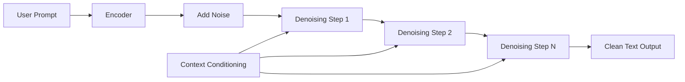

## 서론

대규모 언어 모델(LLM)을 실무에 적용하면서 가장 흔하게 겪는 좌절감은 무엇일까요? 바로 '지연 시간(Latency)'입니다. 사용자가 복잡한 질문을 던졌을 때, 화면에 토큰이 하나씩 차근차근 출력되는 모습은 마치 과거의 56k 모뎀 시절을 연상시키기도 합니다. 최신 하드웨어인 GPU H100을 활용함에도 불구하고, 트랜스포머(Transformer) 구조의 근본적인 한계인 '자기회귀(Auto-regressive)' 방식 때문에 생성해야 할 토큰 수가 늘어날수록 응답 시간은 선형적으로 증가합니다. 실시간 협업 툴, 초고속 트레이딩 시스템, 혹은 음성 비서와 같이 '즉각적인 반응'이 필수적인 도메인에서는 이러한 딜레이가 치명적인 병목 현상으로 작용합니다.

이러한 문제의 해결책으로 등장한 것이 Inception Labs의 **Mercury 2**입니다. 기존의 LLM이 "다음 단어를 맞추는" 순차적 접근 방식을 취했다면, Mercury 2는 이미지 생성 모델(Stable Diffusion 등)에서 검증된 '디퓨전(Diffusion)' 확률 모델을 언어 생성에 도입했습니다. 언어를 노이즈가 섞인 상태에서 점진적으로 복원하는 '디노이징(Denoising)' 과정으로 재해석함으로써, 시퀀스 생성의 병렬화를 극대화한 것이죠. 이 글에서는 Mercury 2가 어떻게 기존 추론 속도의 한계를 넘어섰는지, 그 기술적 메커니즘과 실질적인 차이점을 심도 있게 분석해 보겠습니다.

## 본론

### 1. Auto-regressive vs. Diffusion: 생성 패러다임의 전환

기존의 GPT 계열 모델은 $P(x_t | x_{<t})$ 조건부 확률을 기반으로 이전 토큰들이 주어졌을 때 다음 토큰을 예측합니다. 이는 $t$번째 토큰을 생성하기 위해 $t-1$번째까지의 연산이 완료되어야 한다는 강력한 의존성(Dependency)을 만듭니다. 반면, 디퓨전 모델은 데이터 $x_0$에 점진적으로 가우시안 노이즈를 더해 완전한 노이즈 $x_T$로 만드는 Forward 과정과, 노이즈에서 원본 데이터를 복원하는 Reverse(디노이징) 과정을 학습합니다.

Mercury 2는 언어 임베딩 벡터 공간에서 이 디노이징 과정을 수행합니다. 핵심은 추론 시점(Inference time)에 모든 토큰 위치를 '동시에' 예측할 수 있다는 점입니다. 전체 시퀀스에 대한 잠재적 표현(Latent Representation)을 노이즈 상태에서 시작하여, $N$번의 반복(Refinement Step)을 거쳐 전체 문장을 한꺼번에 깨끗하게 만들어냅니다.

### 2. 아키텍처 및 추론 메커니즘

Mercury 2의 아키텍처는 기본적으로 트랜스포머를 백본으로 사용하지만, 그 목적 함수(Objective Function)와 추론 루프가 완전히 다릅니다. 다음은 Mercury 2의 추론 과정을 간소화한 다이어그램입니다.



위 다이어그램에서 볼 수 있듯이, 디노이징 스텝(Denosing Step 1~N) 내부에서는 시퀀스의 모든 포지션이 병렬로 처리됩니다. 사용자의 프롬프트(Context Conditioning)는 각 스텝마다 Cross-Attention 또는 Adaptive Layer Normalization 등을 통해 모델에 주입되어, 생성 방향을 제어합니다.

### 3. 기술적 상세: Continuous Diffusion for Text

텍스트는 이산적(Discrete) 데이터이기 때문에, 이미지 생성의 디퓨전처럼 연속적인 가우시안 노이즈를 더하는 것은 직관적이지 않습니다. Mercury 2는 이 문제를 해결하기 위해 다음과 같은 전략을 취합니다.

1.  **Logit Space Diffusion**: 원핫 인코딩(One-hot encoding)이나 토큰 ID가 아닌, 모델의 최종 Logit 출력에 노이즈를 주입하는 방식입니다. 혹은 임베딩 레이어의 연속적인 벡터값에 직접 노이즈를 추가하는 Embedding Space Diffusion을 사용할 수 있습니다.
2.  **Refinement Steps**: 생성 과정은 사전 정의된 스텝 수(예: 10~50회) 동안 반복됩니다. AR 모델이 토큰 수만큼의 스텝이 필요하다면, 디퓨전 모델은 상대적으로 적은 횟수의 전역적인 업데이트로 문장을 완성합니다.

다음은 PyTorch 스타일의 의사코드(Pseudo-code)로, AR 모델과 Diffusion 모델의 추론 루프 차이를 비교한 것입니다.

```python
import torch

def auto_regressive_generate(model, prompt_ids, max_length):
    """기존 GPT 방식의 생성 루프"""
    current_ids = prompt_ids
    for _ in range(max_length):
        # 현재까지의 시퀀스를 입력으로 다음 토큰 예측
        logits = model(current_ids)
        next_token = torch.argmax(logits[:, -1, :], dim=-1, keepdim=True)
        
        # 생성된 토큰을 시퀀스에 붙임 (Sequential)
        current_ids = torch.cat([current_ids, next_token], dim=1)
        
        if next_token.item() == EOS_TOKEN_ID:
            break
    return current_ids

def diffusion_generate(model, prompt_embedding, num_steps):
    """Mercury 2 방식의 디퓨전 생성 루프"""
    # 1. 초기 노이즈 생성 (Target 길이만큼)
    batch_size, target_len, dim = prompt_embedding.shape[0], 100, prompt_embedding.shape[-1]
    noise = torch.randn(batch_size, target_len - prompt_embedding.shape[1], dim)
    
    # 프롬프트와 노이즈를 결합하여 초기 상태 생성
    # (실제로는 padding mask 등을 활용해 프롬프트 부분 보존)
    current_latent = torch.cat([prompt_embedding, noise], dim=1)
    
    # 2. 디노이징 루프 (Parallel)
    for t in reversed(range(num_steps)):
        # t 스텝에 대한 타임 임베딩
        t_emb = get_time_embedding(t)
        
        # 모델이 노이즈를 예측 (전체 시퀀스에 대해 한 번에 연산)
        predicted_noise = model(current_latent, t_emb, context=prompt_embedding)
        
        # 스케줄러(Scheduler)를 통해 노이즈 제거
        current_latent = scheduler.step(predicted_noise, t, current_latent)
        
    return current_latent # 최종적으로 디코딩되어 텍스트로 변환됨
```

위 코드에서 `auto_regressive_generate`는 `for` 루프 내부에서 매번 모델을 호출하지만, `diffusion_generate`는 `for` 루프가 디노이징 스텝(예: 20회)을 의미하며, 모델 호출 한 번이 전체 시퀀스를 처리합니다. 결과적으로 긴 문장을 생성할수록 병렬화의 이득이 극대화됩니다.

### 4. 성능 비교 및 실무적 영향

기존 AR 모델과 Mercury 2와 같은 Diffusion LLM을 비교했을 때, 특히 긴 Context와 긴 답변을 생성해야 하는 시나리오에서 큰 차이가 납니다.

| 비교 항목 | Auto-regressive LLM (GPT-4o, Claude 3.5 등) | Mercury 2 (Diffusion LLM) |
| :--- | :--- | :--- |
| **추론 패턴** | Sequential (Token-by-Token) | Iterative Refinement (Parallel) |
| **Latency 특성** | 생성 길이에 비례하여 선형적 증가 | 생성 길이와 무관하게 상수적(Constant)에 가까움 |
| **Throughput** | 긴 시퀀스 생성 시 낮음 | 높음 (전체 배치를 한 번에 처리) |
| **품질(Reasoning)** | 높은 수준의 CoT(Chain-of-Thought) 구현 가능 | 전체 문맥을 동시에 고려하여 논리적 일관성 우수 |
| **주요 사용 Case** | 일반적인 챗봇, 코드 생성 | 실시간 시스템, 초고속 요약, 동시 다발적 생성 |

### 5. Step-by-Step: Mercury 2 도입 가이드

만약 여러분의 서비스에 Mercury 2나 유사한 Diffusion LLM을 도입하고자 한다면 다음의 단계를 고려해야 합니다.

1.  **워크로드 분석 (Workload Analysis)**:     *   생성해야 하는 텍스트의 평균 길이가 500토큰 이상인가요?     *   사용자가 첫 번째 토큰(Time to First Token, TTFT)보다는 전체 완성 시간(Total Generation Time)에 민감한가요? 만약 그렇다면 Diffusion 모델이 적합합니다.
2.  **서빙 최적화 (Serving Optimization)**:     *   디퓨전 모델은 각 스텝에서 전체 시퀀스에 대한 KV Cache를 갱신하거나, 아니면 아예 KV Cache 방식이 다를 수 있습니다. Inception Labs의 추론 엔진이 제공하는 베스트 프랙티스를 따르되, GPU 메모리 사용량이 급격히 증가할 수 있으니 배치 사이즈(Batch Size) 조절에 유의해야 합니다.
3.  **스케줄러 튜닝 (Scheduler Tuning)**:     *   디퓨전의 품질과 속도는 '스케줄러(Scheduler)'가 결정합니다. 더 적은 스텝(예: 10단계)으로 빠르게 생성할 것인지, 더 많은 스텝(예: 50단계)을 거쳐 정교한 답변을 얻을 것인지 서비스 SLA에 맞춰 조절하세요.
4.  **프롬프트 엔지니어링**:     *   AR 모델은 "Think step by step"이라는 프롬프트가 추론 과정을 길게 늘려 성능을 높이는 데 도움을 줍니다. 하지만 Diffusion 모델은 이미 전체적인 맥락을 파악하므로, 너무 긴 프롬프트보다는 핵심적인 제약 조건(Constraints)을 명시하는 것이 더 효과적일 수 있습니다.

## 결론

Mercury 2는 딥러닝 역사상 이미지 분야에서 시작된 디퓨전 모델의 혁신을 자연어 처리(NLP) 영역으로 성공적으로 확장한 사례입니다. 자기회귀(AR) 모델이 가진 구조적인 속도 한계를 '병렬 디노이징'이라는 기발한 아이디어로 돌파한 것이죠.

전문가 관점에서 Mercury 2의 의미는 단순한 "속도 향상" 그 이상입니다. 이는 추론(Reasoning) 과정 자체를 단순히 확률적 체이닝이 아닌, 전체적인 해 공간(Global Solution Space)을 정제해 나가는 최적화 문제로 재정의했음을 시사합니다. 향후 LLM의 진화 방향은 더 이상 단순히 파라미터 수를 늘리는 것이 아니라, 이처럼 추론 효율성을 극대화하는 아키텍처의 혁신에 달려 있을 것입니다.

Mercury 2와 같은 기술이 대중화된다면, 우리는 곧 "AI가 생각하는 시간"을 거의 느끼지 못하는, 진정한 실시간 지능형 에이전트 시대를 맞이하게 될 것입니다. 연구자이자 엔지니어로서, 이러한 패러다임 시프트가 우리의 시스템 설계와 사용자 경험을 어떻게 바꿔놓을지 면밀히 지켜보고 실험해 볼 때입니다.

**참고자료**:

- Inception Labs Blog: Introducing Mercury 2

- "Diffusion-LM Improves Controllable Text Generation" (Stanford AI Lab, 2022) - 이론적 기반이 되는 논문

- "Sequence Generation via Iterative Refinement" (arXiv)
