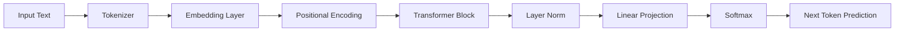

## 서론

최근生成형 AI(Generative AI)의 발전은 놀라울 정도입니다. ChatGPT나 Claude와 같은 거대 언어모델(LLM)은 자연어를 이해하고, 코드를 작성하며, 창의적인 글을 쓰는 데 인간을 뛰어넘는 능력을 보여주고 있습니다. 그러나 수십억 개의 파라미터와 수천 장의 GPU가 투입된 이 거대한 시스템의 내부를 들여다보려고 하면, 복잡한 MLOps 파이프라인과 최적화 기술 뒤에 가려진 "블랙박스"처럼 느껴지곤 합니다. "결과는 좋은데, 도대체 원리가 무엇인가?"라는 근원적인 질문에 직면할 때, 방대한 코드 베이스는 오히려 이해를 방해하는 요소가 됩니다.

진정한 기술적 통찰은 복잡함 속에 있는 단순한 핵심 원리를 꿰뚫어 볼 때 생겨납니다. 이러한 니즈에서 등장한 것이 바로 **MicroGPT**입니다. 이는 수십만 줄의 코드로 이루어진 현대적인 LLM 프레임워크가 아닌, GPT(Generative Pre-trained Transformer) 아키텍처의 가장 순수한 핵심만을 추출하여 단 200줄의 순수 Python 코드로 구현한 최소 구현체입니다. 왜 이렇게 작은 모델을 공부해야 할까요? 거대 모델의 성능을 높이는 하이퍼파라미터 튜닝이나 프롬프트 엔지니어링도 중요하지만, 모델이 "다음 단어를 예측"하기 위해 내부적으로 어떤 행렬 연산을 수행하는지, 그리고 Attention 메커니즘이 어떻게 문맥을 파악하는지 이해하는 것이 연구자와 엔지니어에게는 필수적이기 때문입니다. 이 글에서는 MicroGPT를 통해 거대 LLM의 축소판을 분석하고, Transformer의 핵심 동작 원리를 코드 수준에서 파헤쳐보겠습니다.

## 본론

### Transformer의 핵심: 순차적 예측과 어텐션

MicroGPT는 기본적으로 GPT 아키텍처를 따르며, 이는 디코더(Decoder) 전용 Transformer 구조입니다. 이 구조의 핵심 목표는 **확률적 언어 모델링(Probabilistic Language Modeling)**입니다. 주어진 텍스트 시퀀스 $x = (x_1, x_2, ..., x_t)$가 있을 때, 다음 토큰 $x_{t+1}$이 나올 확률 $P(x_{t+1} | x_1, ..., x_t)$을 최대화하는 방향으로 학습합니다.

이 과정에서 가장 중요한 메커니즘은 **Self-Attention**입니다. 기존의 RNN(Recurrent Neural Network)이 순차적으로 데이터를 처리하여 장기 의존성(Long-term dependency)을 잃어버리는 문제를 해결하기 위해, Transformer는 입력 시퀀스 전체를 한 번에 받아들여 토큰 간의 관계(가중치)를 계산합니다. MicroGPT는 32,000개의 인간 이름 데이터셋을 학습하여, "A"라는 글자 뒤에 "l", "i", "c", "e"와 같은 글자가 올 확률을 계산합니다.

#### MicroGPT 데이터 흐름도

다음은 MicroGPT가 입력 텍스트를 받아 다음 토큰을 생성하기까지의 전체적인 과정을 간소화한 다이어그램입니다.



1.  **Tokenizer**: 입력 텍스트를 정수(Integer) ID로 변환합니다. MicroGPT는 문자 수준(Character-level) 토크나이저를 주로 사용하여 복잡한 BPE(Byte Pair Encoding) 없이도 원리 파악에 집중하게 합니다. 2.  **Embedding & Positional Encoding**: 정수 ID를 고차원 벡터로 매핑하고, 순서 정보를 더해줍니다. 3.  **Transformer Block**: 핵심 연산이 수행되는 곳으로, Causal Self-Attention(Masked Self-Attention)과 Feed-Forward Network가 포함됩니다. 4.  **Output Head**: 최종 벡터를 어휘사전(Vocabulary) 크기의 로짓(Logit)으로 변환하고, 소프트맥스(Softmax)를 통해 확률 분포를 얻습니다.

### 코드로 보는 핵심 구조

이제 PyTorch를 사용하여 MicroGPT의 핵심인 **Causal Self-Attention** 메커니즘과 간단한 블록 구조를 구현해 보겠습니다. 이 코드는 Andrew Karpathy의 `nanoGPT` 및 MicroGPT 구현체의 핵심을 추약한 것입니다.

```python
import torch
import torch.nn as nn
from torch.nn import functional as F

class CausalSelfAttention(nn.Module):
    def __init__(self, config):
        super().__init__()
        # Key, Query, Value projections (Linear projections)
        # embedding dimension 에서 n_head 개수만큼 나누어 head dimension 계산
        self.c_attn = nn.Linear(config.n_embd, 3 * config.n_embd)
        # output projection
        self.c_proj = nn.Linear(config.n_embd, config.n_embd)
        self.n_head = config.n_head
        self.n_embd = config.n_embd
        # regularization
        self.attn_dropout = nn.Dropout(config.dropout)
        self.resid_dropout = nn.Dropout(config.dropout)
        
        # causal mask to ensure that attention is only applied to the left in the input sequence
        # 미리 triangular mask 생성 (autoregressive 성질 보장)
        self.register_buffer("bias", torch.tril(torch.ones(config.block_size, config.block_size))
                                     .view(1, 1, config.block_size, config.block_size))

    def forward(self, x):
        B, T, C = x.size() # batch size, sequence length, embedding dimensionality (n_embd)
        
        # Q, K, V 계산
        q, k, v  = self.c_attn(x).split(self.n_embd, dim=2)
        
        # multi-head 처리를 위해 (B, T, C) -> (B, nh, T, hs) 로 reshape
        k = k.view(B, T, self.n_head, C // self.n_head).transpose(1, 2) # (B, nh, T, hs)
        q = q.view(B, T, self.n_head, C // self.n_head).transpose(1, 2) # (B, nh, T, hs)
        v = v.view(B, T, self.n_head, C // self.n_head).transpose(1, 2) # (B, nh, T, hs)

        # Attention score 계산: (Q * K^T) / sqrt(scale)
        att = (q @ k.transpose(-2, -1)) * (1.0 / k.size(-1)**0.5)
        
        # Causal Mask 적용 (미래의 토큰을 보지 못하게 마스킹)
        att = att.masked_fill(self.bias[:,:,:T,:T] == 0, float('-inf'))
        att = F.softmax(att, dim=-1)
        att = self.
```

```python
attn_dropout(att)
        
        # Weighted sum of values
        y = att @ v # (B, nh, T, T) x (B, nh, T, hs) -> (B, nh, T, hs)
        
        # multi-head 결과를 다시 합치기
        y = y.transpose(1, 2).contiguous().view(B, T, C)
        
        # output projection
        y = self.resid_dropout(self.c_proj(y))
        return y

class TransformerBlock(nn.Module):
    def __init__(self, config):
        super().__init__()
        self.ln_1 = nn.LayerNorm(config.n_embd)
        self.attn = CausalSelfAttention(config)
        self.ln_2 = nn.LayerNorm(config.n_embd)
        self.mlp = nn.Sequential(
            nn.Linear(config.n_embd, 4 * config.n_embd),
            nn.GELU(),
            nn.Linear(4 * config.n_embd, config.n_embd),
            nn.Dropout(config.dropout),
        )

    def forward(self, x):
        # Pre-Norm 구조 (Residual Connection 포함)
        x = x + self.attn(self.ln_1(x))
        x = x + self.mlp(self.ln_2(x))
        return x
```

이 코드에서 가장 중요한 부분은 `masked_fill`을 사용하여 Causal Mask를 적용하는 것입니다. 이것이 GPT가 "미래를 염치하지 않고(cheating)" 오직 과거의 문맥만을 바탕으로 다음 단어를 생성하게 만드는 비결입니다. 또한 `LayerNorm`과 `Residual Connection(x + ...)`은 딥러닝 모델의 학습 안정성을 위해 필수적인 Pre-Norm 구조를 구현합니다.

### MicroGPT vs. 상용 LLM 비교

MicroGPT는 교육용 목적이 강하지만, 실제 상용 LLM과 구조적으로 어떤 차이가 있는지 이해하는 것이 중요합니다. 스케일(Scale)의 차이일 뿐, 근본적인 수학적 원리는 동일합니다.

| 비교 항목 | MicroGPT (Minimal) | Production LLM (e.g., GPT-4, Llama 3) | | :--- | :--- | :--- | | **파라미터 수** | ~10K ~ 100K (수만 개) | ~7B ~ 1T+ (수십~수천억 개) | | **토크나이저** | Character-level (단순) | BPE/Byte-level (고효율) | | **아키텍처** | 단일 블록 또는 소수의 블록 | 수십~수백 개의 트랜스포머 블록 | | **정규화 위치** | Pre-Norm (기본) | Pre-Norm (Deep 네트워크 필수) | | **주요 용도** | 알고리즘 학습 및 디버깅 | 복잡한 추론, 멀티턴 대화 | | **학습 데이터** | names.txt (32k names) | 테라바이트 규모의 텍스트/코드 | | **위치 인코딩** | 학습 가능한 절대 위치 인코딩 | RoPE (Rotary Positional Embedding) 등 |

### Step-by-Step 학습 및 추론 가이드

MicroGPT를 실제로 구동하여 새로운 이름을 생성하는 과정을 단계별로 정리하면 다음과 같습니다.

1.  **데이터 전처리 (Data Preprocessing)**     *   `names.txt` 파일을 읽어 전체 텍스트를 하나의 긴 문자열로 만듭니다.     *   문자열 내의 고유한 문자들을 모두 모아 어휘 사전(Vocab)을 구축합니다 (예: ` `, a, b, c...).     *   `char_to_idx`와 `idx_to_char` 매핑 테이블을 생성합니다.

2.  **배치 생성 (Batch Generation)**     *   데이터셋에서 무작위로 시작점을 잡아 `block_size`(예: 8개의 문자)만큼의 시퀀스 $x$를 추출합니다.     *   타겟 $y$는 $x$를 한 칸 왼쪽으로 시프트한 것입니다. (예: $x$="emily", $y$="mily ")     *   이를 모델에 입력하여 다음 문자를 예측하도록 학습합니다.

3.  **모델 학습 (Model Training)**     *   손실 함수(Loss)로는 `CrossEntropyLoss`를 사용합니다.     *   Optimizer는 AdamW를 주로 사용하며, 학습률(Learning Rate)은 약 $3 \times 10^{-4}$ 정도로 설정합니다.     *   수천 에포크(Epoch) 반복 시 Loss가 점차 감소하며, 모델은 이름의 철자 패턴을 학습하게 됩니다.

4.  **텍스트 생성 (Text Generation)**     *   학습된 모델에 시작 토큰(예: ` `, 새로운 이름의 시작을 의미)을 입력합니다.     *   모델이 출력한 확률 분포에서 샘플링(Sampling)하여 다음 토큰을 선택합니다.     *   선택된 토큰을 다시 입력에 포함시키는 Autoregressive 과정을 `max_new_tokens` 수만큼 반복하거나, 종료 토큰이 나올 때까지 반복합니다.

```python
# 간단한 생성 루프 예시
def generate(model, idx, max_new_tokens, block_size):
    # idx는 (B, T) 형태의 인덱스 배열
    for _ in range(max_new_tokens):
        # 예측 시 현재 시퀀스의 길이가 block_size를 넘지 않도록 자름
        idx_cond = idx if idx.size(1) <= block_size else idx[:, -block_size:]
        # 예측 수행
        logits = model(idx_cond)
        # 마지막 시간 스텝의 로짓만 가져옴
        logits = logits[:, -1, :] 
        # 소프트맥스를 통한 확률 분포 얻기
        probs = F.softmax(logits, dim=-1)
        # 다음 토큰 샘플링 (top-k sampling 등 적용 가능)
        idx_next = torch.multinomial(probs, num_samples=1)
        # 생성된 토큰을 시퀀스에 붙이기
        idx = torch.cat((idx, idx_next), dim=1)
    return idx
```

## 결론

MicroGPT를 살펴보면서 복잡해 보이는 LLM의 기저에 흐르는 단순하고 아름다운 원리를 확인했습니다. 수천억 개의 파라미터와 방대한 데이터는 성능을 높이기 위한 "스케일(Scale)"의 차이일 뿐, 그 안에서 작동하는 것은 **"다음 토큰의 확률 분포를 찾기 위해 토큰 간의 관계(Attention)를 계산한다"**는 Transformer의 기본 철학입니다.

AI/ML 연구자에게 있어 MicroGPT와 같은 최소 구현체를 분석하는 것은 단순한 코딩 연습을 넘어섭니다. 이는 Vanishing Gradient 문제가 왜 발생하는지, Positional Encoding이 왜 필요한지, Attention Head의 수가 성능에 미치는 영향 등을 직접 실험해볼 수 있는 "생물학적 모델"과도 같습니다. 거대 모델을 파인 튜닝하거나 서빙하는 것도 중요하지만, 이 작은 200줄의 코드가 주는 통찰을 바탕으로 최신 논문(GPT-4, Llama 3 등)의 아키텍처 변형(예: GQA - Grouped Query Attention, SwiGLU 활성화 함수 등)을 이해한다면, 연구와 개발의 속도는 훨씬 빨라질 것입니다.

**참고자료:**

- [Attention Is All You Need (Vaswani et al., 2017)](https://arxiv.org/abs/1706.03762)

- [Andrej Karpathy's nanoGPT GitHub Repository](https://github.com/karpathy/nanogpt)

- [MicroGPT Interactive Explanation (Hada.io)](https://news.hada.io/topic?id=27141)
