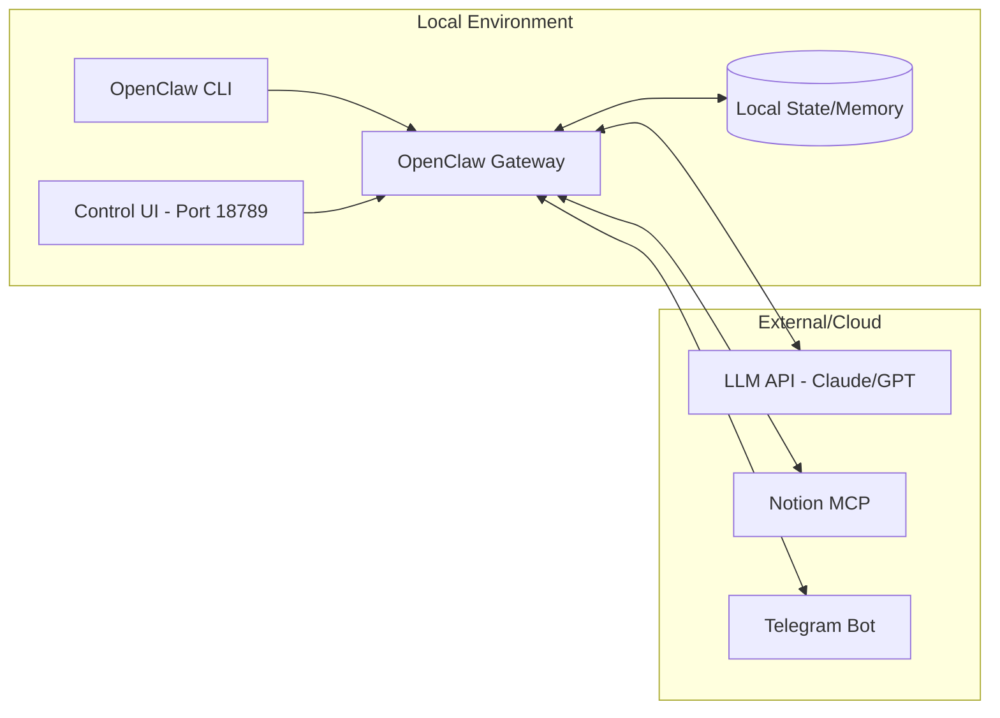

## 서론: 왜 로컬 AI 에이전트인가?

매일 아침 컴퓨터를 켜면 가장 먼저 하는 일이 무엇인가요? 슬랙 메신저 확인, 이메일 정리, JIRA 티켓 확인, Notion에서 어제 회의록 검색... 이 모든 단순 반복 작업이 여러분의 소중한 시간을 갉아먹고 있습니다. 클라우드 기반 AI 도구들을 시도해 보셨을 겁니다. ChatGPT, Claude AI, 심지어 자체 구축한 봇까지. 하지만 매번 API 호출 비용이 걱정되고, 데이터가 외부 서버로 나가는 것에 불안함을 느끼곤 했습니다.

**OpenClaw**는 이러한 딜레마를 해결하는 로컬 환경 기반의 자율 AI 에이전트 플랫폼입니다(이전 명칭: MoltBot, ClawdBot). 단순한 채팅 봇이 아닌, Notion, Telegram, Discord 등 다양한 채널과 통합되어 복잡한 워크플로우를 자동화하는 **로컬 AI 운영체제**입니다. 본 가이드는 공식 문서(docs.openclaw.ai)를 기반으로 실전 경험을 더한 최신 설치 및 운영 매뉴얼입니다.

## 본론

### 1. 사전 요구사항 (Prerequisites)

OpenClaw는 최신 JavaScript 기능을 적극 활용하므로 **Node.js 22 이상**을 강력히 권장합니다.

| 항목 | 최소 사양 | 권장 사양 | 비고 |
| :--- | :--- | :--- | :--- |
| **OS** | macOS, Linux, WSL2 | macOS (Apple Silicon), Ubuntu 22.04+ | Windows는 WSL2 필수 |
| **Node.js** | v20.x | v22.x (LTS) | 이전 버전 호환성 낮음 |
| **RAM** | 4GB | 8GB 이상 | 로컬 LLM 사용 시 16GB+ |
| **Disk** | 10GB | 50GB | Docker 및 로그 저장 공간 |

### 2. 설치 방법 (Installation)

사용 환경에 따라 세 가지 설치 방법 중 하나를 선택하세요.

#### 방법 A: 자동 설치 스크립트 (가장 빠름) ⭐

macOS 및 Linux 사용자를 위한 원클릭 설치 방식입니다.

```bash
# 공식 설치 스크립트 실행
curl -fsSL https://openclaw.ai/install.sh | bash

# 설치 확인
openclaw --version
```

#### 방법 B: NPM 패키지 매니저 (수동 관리)

Node.js 환경을 직접 제어하고 싶을 때 사용합니다. Node.js 22가 먼저 설치되어 있어야 합니다.

```bash
# 1. Node.js 22 설치 (NVM 사용 권장)
nvm install 22
nvm use 22

# 2. OpenClaw 전역 설치
# pnpm 사용을 권장하지만 npm도 가능합니다
npm install -g openclaw@latest

# 3. 설치 확인
openclaw --help
```

#### 방법 C: Docker 컨테이너 (격리 환경)

시스템을 깔끔하게 유지하고 싶다면 Docker를 사용하세요.

```bash
# 1. 저장소 복제
git clone https://github.com/openclaw/openclaw.git
cd openclaw

# 2. Docker 셋업 스크립트 실행
# 호스트의 ~/.openclaw 폴더를 컨테이너와 공유합니다
./docker-setup.sh

# 3. (선택) 권한 문제 발생 시
sudo chown -R 1000:1000 ~/.openclaw
```

### 3. 초기 설정 및 온보딩 (Onboarding)

설치 후 `onboard` 명령어를 통해 대화형으로 설정을 진행해야 합니다. 이 과정에서 데몬(백그라운드 서비스) 등록까지 한 번에 처리됩니다.

```bash
# 온보딩 마법사 실행 및 데몬 설치
openclaw onboard --install-daemon
```

#### 3.1 주요 설정 단계

마법사가 실행되면 터미널에서 화살표 키로 선택합니다.

**Model Provider (AI 모델 연결)**
- **Anthropic (권장)**: Claude 3.5 Sonnet 등 사용. API Key 입력
- **OpenAI**: GPT-4o 사용
- **Ollama (로컬)**: 로컬 LLM 사용 시 선택 (URL: `http://localhost:11434`)

**Channels (채널 연동)**
- 사용할 플랫폼 선택 (Telegram, Discord, Slack, Notion 등)
- 선택하지 않아도 나중에 `openclaw config`로 추가 가능

**Authentication (보안)**
- **Admin Password**: 관리자 대시보드 접속용 비밀번호 설정

### 4. 운영 및 모니터링

OpenClaw는 웹 기반의 **Control UI**를 제공합니다.

#### 4.1 대시보드 접속

**URL**: `http://localhost:18789` (기본 포트가 3000에서 18789로 변경됨)

설치 시 설정한 비밀번호로 로그인하여 에이전트 상태, 로그, 연결된 채널을 확인할 수 있습니다.

#### 4.2 주요 명령어 (CLI)

```bash
# 서비스 상태 확인
openclaw status

# 로그 실시간 확인 (문제 해결 시 필수)
openclaw logs -f

# 설정 변경 (채널 추가/삭제 등)
openclaw config

# 서비스 재시작
openclaw restart
```

### 5. 아키텍처 및 네트워크 구성

OpenClaw는 **Gateway**를 중심으로 작동하며, 외부 서비스와 안전하게 통신합니다.



#### 5.1 포트 포워딩 (외부 접속 시)

외부에서 Control UI에 접속하려면 리버스 프록시(Nginx)나 SSH 터널링을 사용해야 합니다.

```bash
# SSH 터널링 예시 (로컬 18789 -> 서버 18789)
ssh -L 18789:localhost:18789 user@your-server-ip
```

### 6. Notion MCP 연동 (심화)

OpenClaw는 Notion을 단순 채널이 아닌 **확장 메모리(Extended Context)**로 활용할 수 있습니다.

**Notion 통합 설정:**

1. **토큰 발급**: Notion Developers에서 내부 통합 토큰 생성
2. **OpenClaw 설정**:
   ```bash
   openclaw config
   # > Channels > Notion 선택 > Token 입력
   ```

**사용 예시:**
```bash
# 에이전트에게 자연어로 지시
"이번 주 회의록 요약해서 노션 '주간보고' 페이지에 저장해줘"
"노션에 있는 지난 분기 보고서에서 핵심 지표 3개 추출해줘"
```

### 7. 트러블슈팅 (FAQ)

| 문제 | 해결 방법 |
| :--- | :--- |
| **openclaw 명령어를 찾을 수 없어요** | `export PATH=$PATH:$(npm config get prefix)/bin` 실행 또는 터미널 재시작 |
| **설치 중 EACCES 오류** | `sudo` 대신 NVM 사용 권장. 또는 `sudo chown -R $USER /usr/local/lib/node_modules` |
| **Docker에서 localhost 연결 실패** | `host.docker.internal` 대신 `--network host` 옵션 사용 또는 Docker Compose 설정 확인 |
| **Daemon이 시작되지 않아요** | `openclaw logs -f`로 로그 확인 후 포트 충돈(18789) 점검 |

## 결론

OpenClaw는 단순한 도구가 아닌, 여러분의 로컬 환경을 **AI 구동 능력을 갖춘 지능형 워크스테이션**으로 탈바꿈시킵니다. 클라우드 API 의존도를 낮추고, 데이터 주권을 지키면서도 강력한 자동화를 구현할 수 있습니다.

이 가이드를 따라 설치를 완료하신 후, 가장 먼저 해 볼 만한 작업을 추천합니다:
1. Notion에 자주 사용하는 템플릿 페이지 생성
2. Telegram 봇과 연동하여 모바일 알림 설정
3. 아침 업무 루틴(뉴스 요약, 일정 확인)을 에이전트에게 위임

**로컬 AI 에이전트의 시대, OpenClaw와 함께 시작해 보세요.**

---

## 참고자료

- [OpenClaw 공식 문서](https://docs.openclaw.ai)
- [OpenClaw GitHub Repository](https://github.com/openclaw/openclaw)
- [Notion API 가이드](https://developers.notion.com/)
