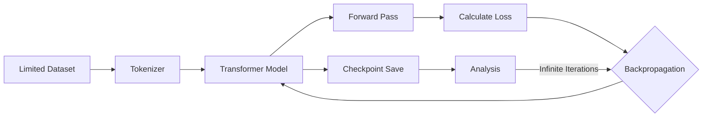

## 서론

최근 LLM(Large Language Model) 분야에서는 "스케일링 랙(Scaling Law)"이 지배적인 통념으로 자리 잡았습니다. 모델의 성능을 높이기 위해서는 더 많은 파라미터, 더 방대한 데이터, 그리고 엄청난 컴퓨팅 자원이 필수적이라는 믿음입니다. 그러나 실제 연구 환경이나 특수한 도메인에서는 이 공식이 언제나 통하지 않습니다. 만약 수천 개의 GPU 클러스터를 보유하고 있지만 학습할 데이터는 고작 몇 줄의 텍스트뿐이라면 어떤 일이 벌어질까요?

이러한 역설적인 상황을 탐구하는 것이 바로 'Slowrun' 실험의 핵심입니다. Andrej Karpathy가 개발한 교육용 프레임워크인 NanoGPT를 사용하여, 데이터는 최소화하고 컴퓨팅 파워는 극한까지 끌어올렸을 때 Transformer 모델이 어떤 학습 역학(learning dynamics)을 보이는지 관찰하는 것입니다. 이 실험은 거대 모델의 블랙박스를 들여다보고, 모델이 언어를 '이해'하는 것이 아니라 단순히 '암기(memorization)'하는 경계에 도달하는 과정을 미시적으로 분석할 수 있는绝佳의 기회를 제공합니다.

## 본론

### 1. 적은 데이터와 무한 Compute의 만남

Deep Learning의 일반적인 목표는 훈련 데이터(Training Set)에서 학습한 패턴을 본 적 없는 테스트 데이터(Test Set)에 일반화(Generalization)하는 것입니다. 하지만 데이터셋이 매우 작을 때, 모델은 일반화 대신 훈련 데이터를 완벽하게 암기하는 '과적합(Overfitting)' 현상을 보입니다.

NanoGPT Slowrun 실험은 Transformer 아키텍처가 데이터를 얼마나 효율적으로 암기할 수 있는지, 그리고 그 과정에서 학습 곡선(Loss Curve)이 어떻게 거동하는지 확인합니다. 통상적으로 데이터가 부족하면 학습을 조기 종료(Early Stopping)하는 것이 정석이지만, 여기서는 의도적으로 학습을 멈추지 않고 모델의 용량(Capacity)이 한계에 다를 때까지 밀어붙입니다.

### 2. 실험 아키텍처 및 학습 흐름

이 실험의 핵심은 Transformer 구조를 유지하면서, 입력 데이터의 양을 극도로 제한하는 것입니다. 아래 다이어그램은 NanoGPT를 활용한 Slowrun 실험의 전체적인 데이터 흐름과 학습 과정을 간소화하여 나타낸 것입니다.



위의 과정은 무한 루프에 가깝게 반복됩니다. 일반적인 학습에서는 `E(Loss)`가 일정 수준 이하로 떨어지면 학습을 멈추지만, Slowrun에서는 Loss가 0에 수렴하거나 더 이상 감소하지 않는 포화 상태(Saturation)에 도달할 때까지 계속됩니다. 이를 통해 우리는 모델이 개별 토큰(Token) 간의 확률적 관계를 어떻게 고정해 나가는지 관찰할 수 있습니다.

### 3. NanoGPT를 활용한 구현 예시

실제로 NanoGPT를 사용하여 작은 데이터셋(예: shakespeare_char 데이터셋 중 일부만 사용)에 대해 과적합을 유도하는 코드는 다음과 같습니다. 여기서는 학습 반복 횟수(`max_iters`)를 비현적으로 높게 설정하여 Compute를 무한히 투입하는 시나리오를 시뮬레이션합니다.

```python
import torch
from model import GPTConfig, GPT

# 1. 매우 작은 데이터셋 로드 (가정: text 변수에 소량의 텍스트만 존재)
# 일반적으로는数十만 개의 토큰이 필요하지만, 여기서는 수백 개만 사용합니다.
text = "First Citizen: Before we proceed any further, hear me speak."
chars = sorted(list(set(text)))
vocab_size = len(chars)
stoi = {ch:i for i,ch in enumerate(chars)}
itos = {i:ch for i,ch in enumerate(chars)}
data = torch.tensor([stoi[c] for c in text], dtype=torch.long)

# 2. 모델 설정 (NanoGPT Config)
# 데이터는 작지만 모델의 표현력을 유지하기 위해 임베딩 차원과 레이어를 유지함
config = GPTConfig(
    block_size = 256,    # 컨텍스트 길이
    vocab_size = vocab_size,
    n_layer = 6,
    n_head = 6,
    n_embd = 384,
    dropout = 0.0,       # 과적합 실험이므로 드롭아웃 제거
)
model = GPT(config)

# 3. 학습 루프 (Slowrun Simulation)
optimizer = torch.optim.AdamW(model.parameters(), lr=3e-4, weight_decay=0.1)
max_iters = 50000  # 데이터 양에 비해 터무니없이 많은 반복

for iter in range(max_iters):
    # 전체 데이터를 하나의 배치로 사용 (Batch Size = Full Dataset)
    x = data[:-1]
    y = data[1:]
    
    # Forward Pass
    logits, loss = model(x, y)
    
    # Backward Pass
    optimizer.zero_grad(set_to_none=True)
    loss.backward()
    optimizer.step()
    
    if iter % 1000 == 0:
        print(f"iter {iter}: loss {loss.item():.4f}")
```

이 코드를 실행하면 초기에는 급격히 Loss가 떨어지다가, 특정 지점부터는 0.0 또는 그에 근접한 수준에서 수렴합니다. 이때 모델은 텍스트를 생성하는 능력을 넘어, 입력된 텍스트를 완벽히 암기한 상태가 됩니다.

### 4. 학습 단계별 분석: 일반화 vs 암기

Slowrun 실험의 Loss 곡선은 크게 세 가지 단계로 나뉩니다.

| 단계 | 손실(Loss) 특성 | 모델의 상태 | 설명 |
| :--- | :--- | :--- | :--- |
| **Phase 1: 급격한 학습** | 빠르게 감소 | 패턴 학습 중 | 문법적 구조와 자주 등장하는 쌍(bigram/trigram)을 빠르게 습득함. |
| **Phase 2: 완만한 감소** | 천천히 감소 | 미세 조정(Fine-tuning) | 드문 문맥과 구체적인 단어 순서를 맞추기 위해 가중치를 조정함. |
| **Phase 3: 포화(Saturation)** | 0에 수렴 또는 진동 | 완전 암기(Overfitting) | 훈련 데이터의 노이즈까지 포함하여 완벽하게 재현함. 일반화 능력 소실. |

데이터가 적은 상황에서 무한한 Compute를 투입하면 모델은 Phase 3에 도달해 머무릅니다. 흥미로운 점은 Transformer의 어텐션 메커니즘이 단순히 "다음 단어가 무엇인가"를 넘어, "이 텍스트의 n번째 위치에 정확히 어떤 단어가 있어야 하는가"를 위치 인코딩(Positional Encoding)과 결합하여 암기한다는 사실입니다.

### 5. 기술적 인사이트: 암기 능력의 한계

이 실험을 통해 알 수 있는 중요한 기술적 통찰은 모델의 파라미터 수(Parameter Count)와 암기 가능한 데이터 양 사이의 관계입니다. 논문 *Understanding Deep Learning Requires Rethinking Generalization* 등에서 언급되었듯, 딥러닝 모델은 이론적으로는 랜덤 라벨조차 암기할 수 있는 용량을 가지고 있습니다.

하지만 NanoGPT Slowrun은 실제 언어 데이터에서 이 암기 과정이 어떻게 진행되는지 보여줍니다.
1.  **구조적 의존성**: 모델은 먼저 문장의 구조를 학습합니다.
2.  **구체적 사실(Factual) 암기**: 이어지는 단어가 결정되면 구체적인 단어를 외웁니다.
3.  **일반화 상실**: 일단 데이터를 완벽히 암기하면, 훈련 데이터와 조금만 다른 입력이 주어져도 엉뚱한 결과(Hallucination)를 내놓기 시작합니다.

## 결론

NanoGPT Slowrun 실험은 "데이터가 쌀 때 컴퓨팅 파워로 때워도 될까?"라는 질문에 명쾌한 "아니오"라고 답합니다. 무한한 Compute를 투입하여 작은 데이터셋을 학습시키면, 모델은 Loss를 0으로 만드는 데는 성공하지만, 그 결과물은 '언어 모델'이 아니라 '데이터 저장소'에 가까워집니다.

이 실험이 주는 중요한 교훈은 LLM의 성능은 데이터의 다양성과 양에 지배적이라는 점을 다시 확인시켜 줍니다. 아키텍처의 효율성이나 학습 알고리즘의 최적화도 중요하지만, 결국 모델이 사고(Reasoning)하기 위해서는 충분한 '경험(데이터)'이 필수적입니다. 연구자로서 우리는 더 큰 모델을 만드는 것뿐만 아니라, 모델이 데이터에서 어떤 패턴을 추출하는지, 그리고 과적합이 언제 시작되는지를 면밀히 모니터링하는 MLOps 프로세스를 갖추는 것이 중요합니다.

## 참고자료

- [nanoGPT GitHub Repository](https://github.com/karpathy/nanogpt): Andrej Karpathy의 가장 간단한 Transformer 구현

- [Understanding Deep Learning Requires Rethinking Generalization](https://arxiv.org/abs/1611.03530): 과적합과 일반화에 대한 기초 논문

- [Attention Is All You Need](https://arxiv.org/abs/1706.03762): Transformer 원본 논문
