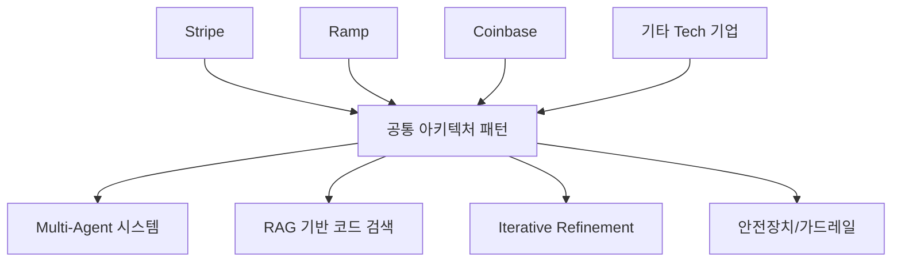
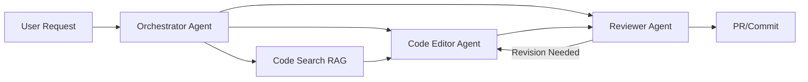
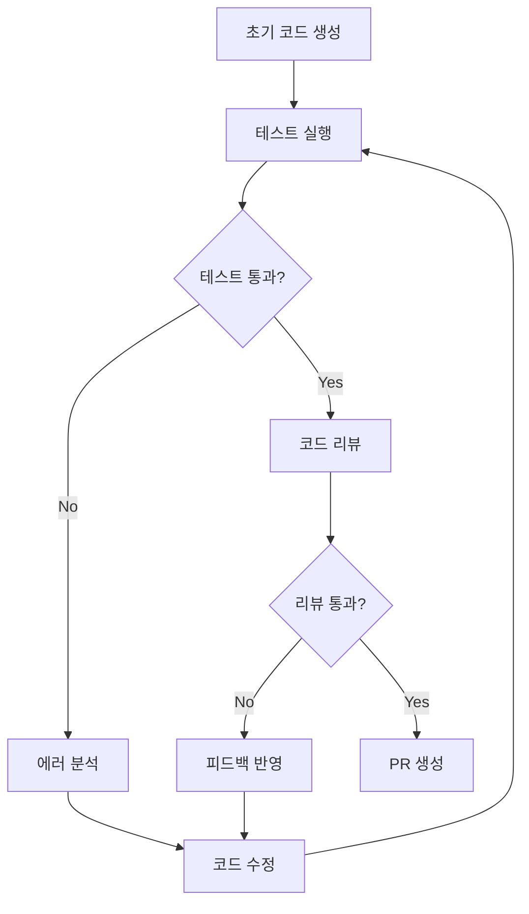

## 서론

"이 버그 좀 잡아줄래?"라고 물었더니, 에이전트가 레포지토리 전체를 스캔하고, 관련 이슈를 찾아내고, 코드를 수정한 뒤 PR까지 올린다. 더 놀라운 건 이것이 GitHub Copilot이나 Cursor 같은 범용 도구가 아니라, **우리 회사 코드베이스에 특화된 사내 에이전트**라는 점이다.

2024년 들어 Stripe, Ramp, Coinbase 등 실리콘밸리 주요 엔지니어링 조직들이 독립적으로 사내 코딩 에이전트를 구축해왔다. 이들이 서로의 구현을 참고하지 않고도 **거의 동일한 아키텍처 패턴으로 수렴**했다는 사실은 시사하는 바가 크다. 이는 곧 "사내 코딩 에이전트를 위한 모범 사례(best practice)"가 이미 형성되었음을 의미한다.

Open SWE는 바로 이 검증된 패턴을 오픈소스로 구현한 프레임워크다. LangChain 생태계 위에 구축되어 있어 커스터마이징이 용이하며, 기업들은 자체 코드베이스와 워크플로우에 맞는 SWE 에이전트를 신속히 배포할 수 있다.

## 왜 사내 코딩 에이전트인가?

### 범용 코딩 어시스턴트의 한계

GitHub Copilot이나 ChatGPT 같은 범용 도구는 훌륭하지만, **기업 내부 코드베이스에는 치명적인 약점**이 있다:

| 한계점 | 범용 도구 | 사내 에이전트 | | :--- | :--- | :--- | | 사내 문맥 이해 | ❌ (학습 데이터에 없음) | ✅ (RAG로 실시간 검색) | | 내부 API/라이브러리 | ❌ (할루시네이션 위험) | ✅ (코드베이스 인덱싱) | | CI/CD 파이프라인 연동 | ❌ (수동 복사/붙여넣기) | ✅ (자동화된 워크플로우) | | 보안/컴플라이언스 | ⚠️ (코드 유출 위험) | ✅ (온프레미스 배포 가능) | | 커스텀 리뷰 규칙 | ❌ | ✅ (팀별 설정 가능) |

### 수렴 진화 (Convergent Evolution) 현상

생물학에서 서로 다른 환경에 있던 종이 유사한 적응을 발달시키는 현상을 '수렴 진화'라 한다. 흥미롭게도 SWE 에이전트 분야에서도 동일한 현상이 관찰되었다.



이러한 수렴은 우연이 아니다. 소프트웨어 엔지니어링 작업의 본질적 특성과 LLM의 능력/한계가 결합했을 때, **최적의 해법이 자연스럽게 도출**된 것이다.

## Open SWE 아키텍처 심층 분석

### 핵심 컴포넌트

Open SWE는 크게 네 가지 컴포넌트로 구성된다:



**1. Orchestrator Agent**: 전체 워크플로우를 조율하는 마에스트로. 사용자 요청을 파싱하고, 필요한 서브태스크로 분해하며, 다른 에이전트들을 적절히 호출한다.

**2. Code Search RAG**: 사내 코드베이스를 인덱싱하고, 의미론적 검색을 통해 관련 코드 스니펫을 검색한다. 단순 키워드 매칭이 아닌 **임베딩 기반 유사도 검색**을 수행한다.

**3. Code Editor Agent**: 실제 코드 수정을 담당한다. 파일 읽기, 수정, 생성 등의 도구(tools)를 사용하며, 단순 문자열 치환이 아닌 AST(Abustact Syntax Tree) 수준의 이해를 바탕으로 작동한다.

**4. Reviewer Agent**: 수정된 코드를 검토하고, 테스트를 실행하며, 피드백을 제공한다. 자체 수정(self-correction) 루프의 핵심이다.

### ReAct 패턴과 도구 사용

Open SWE는 **ReAct (Reasoning + Acting)** 패턴을 기반으로 한다. 이는 LLM이 단순히 텍스트를 생성하는 것이 아니라, "생각-행동-관찰"의 순환 과정을 통해 문제를 해결하게 한다.

```python
from langchain.agents import AgentExecutor, create_react_agent
from langchain_core.prompts import PromptTemplate
from langchain_openai import ChatOpenAI

# Open SWE 스타일의 ReAct 에이전트 예시
class OpenSWEAgent:
    def __init__(self, model_name="gpt-4-turbo"):
        self.llm = ChatOpenAI(model=model_name, temperature=0)
        self.tools = self._init_tools()
        self.agent = self._create_agent()
    
    def _init_tools(self):
        """사내 코드베이스에 특화된 도구들 정의"""
        return [
            # 코드 검색 도구
            Tool(
                name="search_code",
                func=self._search_codebase,
                description="사내 코드베이스에서 의미론적 검색을 수행합니다. "
                           "입력: 자연어 쿼리, 출력: 관련 코드 스니펫 목록"
            ),
            # 파일 읽기 도구
            Tool(
                name="read_file",
                func=self._read_file,
                description="지정된 경로의 파일 내용을 읽습니다."
            ),
            # 파일 수정 도구
            Tool(
                name="edit_file",
                func=self._edit_file,
                description="파일의 특정 부분을 수정합니다. "
                           "입력: 파일 경로, old_str, new_str"
            ),
            # 테스트 실행 도구
            Tool(
                name="run_tests",
                func=self._run_tests,
                description="수정된 코드에 대한 테스트를 실행합니다."
            ),
            # Git 작업 도구
            Tool(
                name="git_operations",
                func=self._git_ops,
                description="브랜치 생성, 커밋, PR 생성 등 Git 작업을 수행합니다."
            )
        ]
    
    def _create_agent(self):
        react_prompt = PromptTemplate.from_template(
            """당신은 사내 코드베이스에 특화된 소프트웨어 엔지니어링 어시스턴트입니다.

사용 가능한 도구:
{tools}

도구 사용법:
Question: 사용자의 질문
Thought: 무엇을 해야 할지 생각
Action: 사용할 도구 이름
Action Input: 도구에 전달할 입력
Observation: 도구 실행 결과
... (이 과정을 반복)
Thought: 최종 답변을 낼 준비가 됨
Final Answer: 사용자에게 전달할 최종 답변


```

```python
Question: {input}
Thought: {agent_scratchpad}"""
        )
        
        agent = create_react_agent(self.llm, self.tools, react_prompt)
        return AgentExecutor(agent=agent, tools=self.tools, verbose=True)
    
    def solve(self, task: str):
        """주어진 태스크 해결"""
        return self.agent.invoke({"input": task})

# 사용 예시
agent = OpenSWEAgent()
result = agent.solve(
    "UserService 클래스의 authenticate 메서드에서 발생하는 "
    "로그인 실패 시도 횟수 제한 버그를 수정해줘"
)
```

### RAG 기반 코드 검색 구현

사내 코드베이스 검색은 Open SWE의 핵심 기능이다. 단순한 벡터 유사도만으로는 부족하며, **코드의 구조적 특성**을 반영해야 한다.

```python
from langchain_community.vectorstores import Chroma
from langchain_openai import OpenAIEmbeddings
from langchain.text_splitter import RecursiveCharacterTextSplitter
import tree_sitter_python as tspython
from tree_sitter import Language, Parser

class CodeAwareRAG:
    """코드 구조를 이해하는 RAG 시스템"""
    
    def __init__(self, persist_directory="./code_index"):
        self.embeddings = OpenAIEmbeddings()
        self.vectorstore = Chroma(
            embedding_function=self.embeddings,
            persist_directory=persist_directory
        )
        self.parser = Parser(Language(tspython.language()))
        
    def index_codebase(self, codebase_path: str):
        """코드베이스 인덱싱 - 함수/클래스 단위로 청킹"""
        documents = []
        
        for py_file in Path(codebase_path).rglob("*.py"):
            code = py_file.read_text()
            # AST 기반 청킹
            chunks = self._chunk_by_semantic_units(code, str(py_file))
            documents.extend(chunks)
        
        # 메타데이터와 함께 벡터스토어에 저장
        self.vectorstore.add_documents(documents)
    
    def _chunk_by_semantic_units(self, code: str, filepath: str):
        """AST를 활용한 의미 단위 청킹"""
        tree = self.parser.parse(bytes(code, "utf8"))
        chunks = []
        
        for node in tree.root_node.children:
            if node.type in ['function_definition', 'class_definition']:
                chunk_text = code[node.start_byte:node.end_byte]
                chunks.append(Document(
                    page_content=chunk_text,
                    metadata={
                        "filepath": filepath,
                        "type": node.type,
                        "name": self._extract_name(node, code),
                        "start_line": node.start_point[0],
                        "end_line": node.
```

```python
end_point[0]
                    }
                ))
        return chunks
    
    def search(self, query: str, k: int = 5, filter_metadata: dict = None):
        """하이브리드 검색 (벡터 + 키워드 + 메타데이터 필터)"""
        # 1. 벡터 유사도 검색
        results = self.vectorstore.similarity_search(
            query, k=k*2, filter=filter_metadata
        )
        
        # 2. 키워드 매칭 점수 추가 (BM25 스타일)
        scored_results = []
        for doc in results:
            score = self._compute_hybrid_score(query, doc)
            scored_results.append((doc, score))
        
        # 3. 점수 기준 정렬 후 상위 k개 반환
        scored_results.sort(key=lambda x: x[1], reverse=True)
        return [doc for doc, _ in scored_results[:k]]
    
    def _compute_hybrid_score(self, query: str, doc: Document):
        """벡터 유사도 + 키워드 매칭 하이브리드 점수"""
        # 구현 생략 - 실제로는 BM25 등 활용
        pass
```

### Iterative Refinement 루프

실제 소프트웨어 엔지니어링은 한 번에 완성되지 않는다. Open SWE는 **테스트-수정-재검토**의 반복 루프를 통해 코드 품질을 높인다.



이러한 반복적 개선 과정은 **Self-Refine** 논문(Madaan et al., 2023)과 **Reflexion** 논문(Shinn et al., 2023)의 아이디어를 실제 엔지니어링 워크플로우에 적용한 것이다.

```python
class IterativeRefinement:
    """반복적 코드 개선 시스템"""
    
    def __init__(self, max_iterations=5):
        self.max_iterations = max_iterations
        self.editor = CodeEditorAgent()
        self.reviewer = ReviewerAgent()
        self.tester = TestRunner()
    
    def refine_code(self, initial_code: str, task_description: str):
        code = initial_code
        iteration = 0
        
        while iteration < self.max_iterations:
            # 1. 테스트 실행
            test_result = self.tester.run(code)
            
            if test_result.passed:
                # 2. 코드 리뷰
                review = self.reviewer.review(code, task_description)
                
                if review.approved:
                    return code  # 성공!
                
                # 리뷰 피드백으로 수정
                code = self.editor.apply_feedback(code, review.feedback)
            else:
                # 테스트 실패로 수정
                code = self.editor.fix_tests(code, test_result.failures)
            
            iteration += 1
        
        raise MaxIterationsExceeded(
            f"최대 {self.max_iterations}회 반복 후에도 완료되지 않음"
        )
```

## Step-by-Step: Open SWE 배포 가이드

### 1단계: 환경 설정

```bash
# 저장소 클론
git clone https://github.com/langchain-ai/open-swe.git
cd open-swe

# 의존성 설치
pip install -r requirements.txt

# 환경 변수 설정
export OPENAI_API_KEY="your-key"
export GITHUB_TOKEN="your-github-token"
export CODEBASE_PATH="/path/to/your/repo"
```

### 2단계: 코드베이스 인덱싱

```python
# scripts/index_codebase.py
from open_swe.rag import CodeIndexer

indexer = CodeIndexer(
    codebase_path=os.environ["CODEBASE_PATH"],
    embedding_model="text-embedding-3-small",
    chunk_size=1000,
    chunk_overlap=200
)

# 인덱싱 실행 (최초 1회)
indexer.build_index(persist_directory="./index")

# 증분 업데이트 (CI/CD에서 주기적 실행)
indexer.update_index()
```

### 3단계: 에이전트 설정 커스터마이징

```yaml
# config/agent_config.yaml
agent:
  model: "gpt-4-turbo"
  temperature: 0
  max_iterations: 10
  
tools:
  code_search:
    enabled: true
    top_k: 5
  file_operations:
    enabled: true
    allowed_extensions: [".py", ".js", ".ts", ".go"]
  git:
    enabled: true
    auto_pr: true
    default_branch_prefix: "swe-agent/"
    
safety:
  require_approval: true  # 파일 수정 전 승인 필요
  allowed_paths:
    - "src/"
    - "lib/"
  blocked_paths:
    - "secrets/"
    - ".env"
  max_file_size_mb: 5
  
review:
  style_guide: "./style_guide.md"
  custom_rules:
    - "모든 public 메서드는 docstring 필수"
    - "타입 힌트 사용 필수"
```

### 4단계: 배포 및 통합

```python
# server.py - FastAPI 기반 서빙
from fastapi import FastAPI, BackgroundTasks
from open_swe import OpenSWEAgent
import asyncio

app = FastAPI(title="Open SWE API")
agent = OpenSWEAgent.from_config("./config/agent_config.yaml")

@app.post("/api/solve")
async def solve_task(task: TaskRequest, background_tasks: BackgroundTasks):
    """비동기 태스크 처리"""
    job_id = generate_job_id()
    background_tasks.add_task(process_task, job_id, task)
    return {"job_id": job_id, "status": "processing"}

@app.get("/api/jobs/{job_id}")
async def get_job_status(job_id: str):
    """작업 상태 조회"""
    return await get_status(job_id)

# Slack/GitHub Webhook 통합
@app.post("/webhook/github")
async def github_webhook(payload: GitHubPayload):
    if payload.action == "opened" and payload.issue:
        # 이슈가 열리면 자동으로 에이전트가 분석
        analysis = await agent.analyze_issue(payload.issue)
        return {"analysis": analysis}

# Slack Bot 통합 예시
@app.post("/slack/commands")
async def slack_command(command: SlackCommand):
    if command.text.startswith("!fix"):
        task = command.text[4:].strip()
        result = await agent.solve(task)
        return {"text": f"✅ 완료!
{result.summary}"}
```

## 성능 최적화 및 모범 사례

### 토큰 효율성 개선

사내 코드베이스는 종대 수백만 라인에 달한다. 모든 코드를 컨텍스트에 넣는 것은 불가능하므로 **스마트한 컨텍스트 관리**가 필수다.

| 전략 | 설명 | 토큰 절감율 | | :--- | :--- | :--- | | 계층적 요약 | 파일 → 디렉토리 → 모듈 단계별 요약 | 60-70% | | 동적 로딩 | 필요할 때만 코드 로드 | 40-50% | | 캐싱 | 자주 참조되는 코드 캐싱 | 30-40% | | 슬라이딩 윈도우 | 최근 수정 이력 기반 컨텍스트 | 20-30% |

### 프롬프트 엔지니어링 팁

```python
# 효과적인 시스템 프롬프트 구조
SYSTEM_PROMPT = """
## 역할
당신은 {company_name}의 코드베이스에 정통한 시니어 소프트웨어 엔지니어입니다.

## 코드 스타일 가이드
{style_guide}

## 주의사항
1. 사내 내부 API만 사용 (외부 라이브러리 제한적 사용)
2. 모든 변경사항은 테스트 커버리지 유지
3. 보안 민감 정보는 절대 수정하지 않음

## 작업 원칙
- 작은 단위로 변경하고 자주 커밋
- 명확한 커밋 메시지 작성
- Breaking Change는 반드시 사전 협의

## 사용 가능한 도구
{tools_description}
"""
```

## 결론

### 핵심 요약

Open SWE는 단순한 코딩 도구가 아니다. **소프트웨어 엔지니어링 워크플로우 전체를 자동화하는 에이전트 시스템**이다. 핵심 통찰은 다음과 같다:

1. **수렴된 아키텍처**: 여러 선도 기업이 독립적으로 유사한 패턴에 도달했다는 사실은 이것이 검증된 접근법임을 시사한다.

2. **RAG의 결정적 역할**: 사내 코드베이스에 대한 이해도가 에이전트 성능을 좌우한다. 단순 임베딩이 아닌 코드 구조를 이해하는 인덱싱이 필수다.

3. **반복적 개선**: 한 번에 완벽한 코드를 생성하는 것은 불가능하다. 테스트-수정-리뷰의 루프가 품질을 보장한다.

4. **안전장치 필수**: 자율적으로 코드를 수정하는 만큼, 강력한 가드레일과 승인 프로세스가 필수적이다.

### 전문가 인사이트

Open SWE의 등장은 "AI 시대의 소프트웨어 엔지니어링"이 어떤 모습일지 미리 보여준다. LLM이 단순 코드 생성을 넘어 **이슈 분석 → 코드 검색 → 수정 → 테스트 → 배포**의 전체 파이프라인을 자율적으로 수행하는 것이다.

하지만 현재 기술의 한계도 분명하다. 복잡한 아키텍처 결정, 대규모 리팩토링, 팀 간 협업이 필요한 작업은 여전히 인간 엔지니어의 영역이다. Open SWE는 **엔지니어를 대체하는 것이 아니라, 엔지니어의 생산성을 극대화하는 도구**로 접근해야 한다.

특히 한국 기업들의 경우, 보안 규제와 데이터 주권 이슈로 인해 온프레미스 배포가 필수적일 수 있다. 이 경우 GPT-4 대신 Llama 3, Qwen2.5 같은 오픈소스 모델을 활용한 구현도 충분히 가능하다. LangChain의 모델 추상화 덕분에 백엔드 모델 교체는 상대적으로 간단하다.

### 참고 자료

- [Open SWE GitHub Repository](https://github.com/langchain-ai/open-swe)

- [SWE-bench: Can Language Models Resolve Real-World GitHub Issues?](https://arxiv.org/abs/2310.06770)

- [Reflexion: Language Agents with Verbal Reinforcement Learning](https://arxiv.org/abs/2303.11366)

- [Self-Refine: Iterative Refinement with Self-Feedback](https://arxiv.org/abs/2303.17651)

- [LangChain Documentation](https://python.langchain.com/docs/)

- [ReAct: Synergizing Reasoning and Acting in Language Models](https://arxiv.org/abs/2210.03629)
