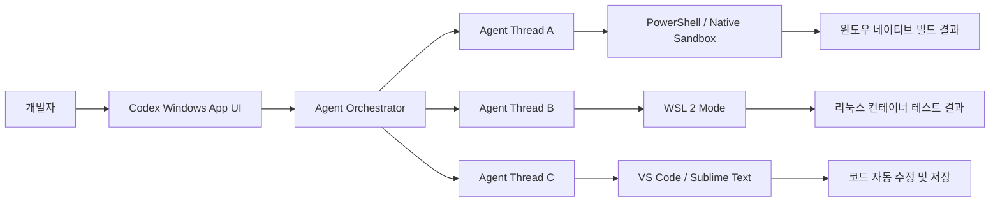

## 서론

현대의 소프트웨어 개발 환경은 단순히 코드를 작성하는 것을 넘어, 복잡한 시스템 간의 상호작용을 관리하는 영역으로 확장되었습니다. 백엔드 API를 수정하면서 동시에 프론트엔드 스크립트를 디버깅하고, 데이터베이스 마이그레이션 스크립트를 작성해야 하는 상황은 드문 일이 아닙니다. 이러한 멀티태스킹 환경에서 개발자가 겪는 가장 큰 고통 중 하나는 '컨텍스트 스위칭(Context Switching)'입니다. 단일 채팅 창을 기반으로 하는 기존의 AI 코딩 어시스턴트는 이러한 병렬 작업 흐름을 지원하기에 구조적 한계가 명확했습니다. 질문을 던지고 답을 기다리는 선형적인 대화 구조는, 여러 파일과 서로 다른 환경을 동시에 건드려야 하는 개발 실무와 맞지 않았습니다.

이러한 문제의식에서 출발한 OpenAI의 새로운 **Codex Windows 앱**은 단순한 채팅봇이 아닌, 개발자의 워크스테이션에 깊숙이 통합되는 'AI 에이전트'로 진화했습니다. 이 앱의 핵심은 윈도우 환경에 최적화되어 있으면서도, 필요시 리눅스 생태계를 자유롭게 넘나들 수 있는 유연성과, 여러 작업을 동시에 처리할 수 있는 병렬성을 부여한 데 있습니다. 이는 AI가 단순히 코드를 생성하는 것을 넘어, 개발 환경 자체를 제어하고 운영하는 단계로 나아가고 있음을 시사합니다.

## 본론

### 1. 병렬 에이전트 아키텍처와 시스템 통합

Codex Windows 앱의 가장 혁신적인 기능은 **병렬 에이전트 스레드(Parallel Agent Threads)**입니다. 기존 LLM(대규모 언어 모델) 기반 툴들이 단일 세션에서의 대화력에 집중했다면, 이 앱은 운영체제 수준에서 여러 독립적인 에이전트를 생성하고 관리할 수 있습니다. 각 에이전트는 독립된 메모리 컨텍스트와 샌드박스 환경을 할당받아, 서로 다른 작업을 간섭 없이 수행합니다.

기술적으로 볼 때, 이 아키텍처는 멀티스레딩 프로그래밍의 개념을 AI 에이전트에 적용한 것과 유사합니다. 사용자는 Agent A에게 "백엔드 API 테스트 코드를 작성하라"고 명령하는 동시에, Agent B에게 "현재 디렉토리의 로그 파일을 분석하라"고 요청할 수 있습니다. 이때 앱 내부의 오케스트레이터(Orchestrator)가 각 요청을 적절한 하위 에이전트에게 분배하고, 결과를 종합하여 사용자에게 제시합니다.

아래 다이어그램은 사용자가 병렬 에이전트를 통해 다양한 환경(Windows Native, WSL)의 작업을 동시에 수행하는 흐름을 간단화하여 도식화한 것입니다.



이러한 구조는 개발자가 특정 작업이 완료될 때까지 대기하는 Idle 시간을 획기적으로 줄여줍니다. 예를 들어, 한 에이전트가 긴 컴파일 작업을 수행하는 동안, 다른 에이전트를 통해 문서 작업이나 코드 리뷰를 진행할 수 있어 워크플로우가 중단되지 않습니다.

### 2. WSL (Windows Subsystem for Linux) 모드 전환과 환경 격리

이 앱은 기본적으로 **PowerShell**과 **Windows Native Sandbox** 환경 위에서 구동됩니다. 이는 윈도우 사용자에게 가장 익숙한 환경이며, .NET 기반 애플리케이션 개발이나 윈도우 시스템 스크립팅에 최적화되어 있습니다. 하지만 최신 AI/ML 개발이나 DevOps 영역은 리눅스 환경에 의존하는 경우가 많습니다.

Codex 앱은 이러한 이중성을 해결하기 위해 **WSL 모드 전환** 기능을 제공합니다. 사용자가 명령어 하나로 WSL 모드를激活하면, 에이전트는 내부적으로 리눅스 커널을 호출하여 bash나 zsh 셸 환경에서 작업을 수행합니다. 이 과정은 개발자에게 투명하게(transparently) 처리되며, 마치 하나의 터미널에서 윈도우와 리눅스 명령어를 섞어 쓰 듯 자연스러운 경험을 제공합니다.

기술적 깊이 있게 살펴보면, 이 기능은 LLM이 생성한 코드의 실행 환경을 동적으로 스왑(Swap)하는 메커니즘을 필요로 합니다. 에이전트는 사용자의 의도(Intent)를 파악하여, 현재 작업이 윈도우 네이티브 API 호출이 필요한지, 아니면 리눅스 툴체인(gcc, python3, docker)이 필요한지 판단해야 합니다. 이는 최신 연구인 **Toolformer**나 **Gorilla** 등에서 언급된 LLM의 툴 사용(Tool Use) 능력을 실제 OS 레벨에서 구현한 사례라고 볼 수 있습니다.

다음은 파이썬을 사용하여 개념적으로 구현해 본, 에이전트가 현재 환경을 감지하고 적절한 셸 명령을 생성하는 로직의 예시입니다.

```python
import subprocess
import platform

class AgentShell:
    def __init__(self):
        self.current_mode = "Windows"  # Default: Windows or WSL
        self.editor_path = "code"      # Default: VS Code

    def detect_environment_requirement(self, command_intent):
        """
        명령어 의도를 분석하여 환경을 전환해야 할지 판단합니다.
        """
        linux_keywords = ['apt', 'make', 'grep', 'bash', 'docker-compose']
        if any(keyword in command_intent for keyword in linux_keywords):
            self.switch_mode("WSL")
            return True
        return False

    def switch_mode(self, mode):
        """
        Windows Native와 WSL 모드 간 전환 로직
        """
        if mode == "WSL" and self.current_mode != "WSL":
            print("Switching context to WSL 2 Environment...")
            self.current_mode = "WSL"
        elif mode == "Windows" and self.current_mode != "Windows":
            print("Switching context to Windows Native Environment...")
            self.current_mode = "Windows"

    def execute(self, command):
        """
        현재 모드에 따라 명령어를 실행합니다.
        """
        self.detect_environment_requirement(command)
        
        if self.current_mode == "WSL":
            # WSL 환경으로 명령 전달 예시
            full_cmd = ["wsl", command]
            print(f"Executing in WSL: {' '.join(full_cmd)}")
            # result = subprocess.run(full_cmd, capture_output=True)
        else:
            # PowerShell 환경으로 명령 전달 예시
            print(f"Executing in PowerShell: {command}")
            # result = subprocess.run(["powershell", "-Command", command], capture_output=True)
            
        return f"Command executed in {self.current_mode} mode"

    def open_editor(self, file_path):
        """
        사용자가 설정한 기본 에디터로 파일을 엽니다.
        """
        cmd = f"{self.editor_path} {file_path}"
        print(f"Launching Editor: {cmd}")
        self.execute(cmd)


```

```python
# 사용 예시
agent = AgentShell()
agent.execute("Get-Service")       # PowerShell 실행
agent.execute("ls -la | grep .py") # WSL 실행
agent.open_editor("main.py")
```

### 3. 개발 워크플로우 최적화: 에디터 통합 및 실무 가이드

실무 개발자에게 에디터는 제2의 몸과 같습니다. Codex 앱은 단순히 결과값을 텍스트로 던져주는 것이 아니라, 사용자가 지정한 에디터(VS Code, Sublime Text 등)와 직접 상호작용합니다. 설정 파일이나 앱 내의 `open` 명령어를 통해 기본 에디터를 지정하면, 에이전트가 생성하거나 수정한 파일을 즉시 해당 에디터에서 열 수 있습니다.

이 기능은 기존의 웹 기반 LLM 인터페이스가 가진 '복사-붙여넣기'의 번거로움을 제거합니다. 예를 들어, 에이전트에게 "현재 프로젝트의 버그를 수정해"라고 요청하면, 에이전트는 파일을 직접 수정하고 VS Code를 실행하여 변경 사항을 보여줍니다.

다음은 Codex Windows 앱을 사용하여 효율적인 병렬 개발 워크플로우를 구축하는 단계별 가이드입니다.

| 단계 | 작업 내용 | 활용 기능 | 기술적 이점 |
| :--- | :--- | :--- | :--- |
| **1단계** | 프로젝트 로드 및 초기화 | PowerShell 통합 | 윈도우 파일 시스템 즉시 접근 및 환경 변수 설정 |
| **2단계** | 병렬 작업 할당 | 멀티 에이전트 스레딩 | 컨텍스트 분리로 인한 응답 속도 향상 및 논리적 혼선 방지 |
| **3단계** | 라이브러리 의존성 해결 | WSL 모드 자동 전환 | Linux native 패키지 매니저(apt, pip) 사용 용이성 확보 |
| **4단계** | 코드 리뷰 및 수정 | `open` 명령어 & 에디터 연동 | 즉각적인 피드백 루프 생성, IDE 내부에서 Diff 확인 가능 |
| **5단계** | 샌드박스 테스트 | Windows Native Sandbox | 호스트 환경 오염 없이 안전한 코드 실행 및 검증 |

### 4. 기존 솔루션과의 비교 분석

이 새로운 앱이 기존의 웹 기반 ChatGPT나 IDE 내장형 확장 프로그램(Copilot 등)과 어떻게 다른지 명확히 이해할 필요가 있습니다. 특히 OS 수준의 접근 권한과 병렬 처리 능력은 이 앱의 핵심 차별점입니다.

| 비교 항목 | 웹 기반 LLM (ChatGPT 등) | IDE 내장형 도구 (GitHub Copilot) | **Codex Windows 앱** |
| :--- | :--- | :--- | :--- |
| **실행 환경** | 브라우저 (Sandboxed) | IDE 내부 프로세스 | OS 네이티브 (PowerShell/WSL) |
| **병렬 처리** | 불가능 (단일 세션) | 제한적 (현재 파일 중심) | **가능 (다중 스레드 에이전트)** |
| **시스템 제어** | 불가 (텍스트 생성만) | 제한적 (파일 편집) | **가능 (터미널 명령, 샌드박스 실행)** |
| **OS 호환성** | OS 무관 | IDE가 설치된 OS에 종속 | **Windows 최적화 + WSL 하이브리드** |
| **확장성** | 플러그인 필요 | IDE API 의존 | **Native Tool 통합 (에디터, 쉘)** |

Codex 앱은 윈도우 네이티브 앱이라는 점을 활용하여 파일 시스템에 대한 접근 권한과 프로세스 제어 권한을 웹 기반 툴보다 훨씬 자유롭게行使할 수 있습니다. 또한, IDE 플러그인 방식이 특정 에디터에 종속되는 반면, 이 앱은 VS Code는 물론 Sublime Text, Notepad++ 등 다양한 에디터와 유연하게 연동될 수 있어 개발자의 도구 선택권을 침해하지 않습니다.

## 결론

OpenAI가 출시한 Codex Windows 앱은 단순한 코드 생성기를 넘어, **개발자의 로컬 워크스테이션을 관리하는 AI 코파일럿(Co-pilot)**의 진정한 구현체에 가깝습니다. 병렬 에이전트 스레드를 통한 멀티태스킹 지원과 PowerShell 및 WSL을 넘나드는 유연한 환경 설정은 현대적인 복잡한 소프트웨어 개발 수명 주기(SDLC)를 획기적으로 단축시킬 잠재력을 가지고 있습니다.

전문가적인 관점에서 볼 때, 이번 릴리스의 핵심 의의는 'AI를 어플리케이션 안에 가두는 것'에서 'AI를 운영체제의 일부처럼 활용하는 것'으로 패러다임이 전환되었다는 점입니다. 에이전트가 직접 터미널을 제어하고 코드를 수정하며 에디터를 띄우는 흐름은 앞으로 우리가 목격하게 될 **Autonomous Coding(자율 코딩)**의 초기 모델이라 할 수 있습니다.

특히 윈도우 생태계는 대규모 엔터프라이즈 환경에서 여전히 강력한 점유율을 가지고 있습니다. 이 환경에서 AI 에이전트가 네이티브하게 동작하면서도 WSL을 통해 리눅스의 개방성을 취한다는 것은 MS 생태계를 사용하는 수많은 개발자들에게 매우 매력적인 제안이 될 것입니다. 앞으로 이러한 에이전트들이 협업(Collaboration) 기능을 갖추어 팀 단위의 코드 베이스를 통합 관리하는 방향으로 발전하기를 기대해 봅니다.

**참고자료 및 링크**

- [OpenAI Codex Windows App 공지사항 (Hada.io)](https://news.hada.io/topic?id=27198)

- [OpenAI Research: Improving Code Generation with Human Feedback](https://arxiv.org/abs/2109.01787)

- [Microsoft Docs: Windows Subsystem for Linux](https://learn.microsoft.com/en-us/windows/wsl/)
