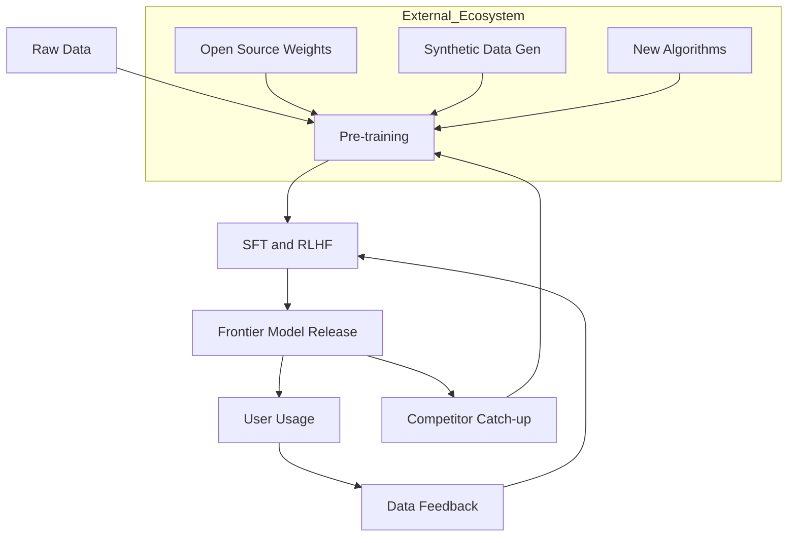

## 서론

2022년 말 ChatGPT가 폭발적인 성장을 이룩한 이후, 많은 전문가가 "AI 스타트업의 생태계는 소셜 네트워크와 같을 것"이라 예측했습니다. 사용자가 데이터를 제공하면 모델은 더 똑똑해지고, 더 똑똑해진 모델은 더 많은 사용자를 끌어들이는 강력한 **데이터 플라이아웃(Data Flywheel)**이 형성될 것이라는 믿음이었습니다. 하지만 2024년 현재, 우리는 이 가설이 현실과 다소 괴리되어 있음을 목격하고 있습니다.

OpenAI는 막대한 사용자 기반을 확보했음에도 불구하고, 페이스북이나 트위터 같은 전통적인 소프트웨어 기업이 누리던 **네트워크 효과(Network Effect)**의 방어막을 제대로 구축하지 못했습니다. GPT-4를 사용하는 내 친구가 많아진다고 해서 나에게 더 큰 가치가 돌아오는 것은 아니기 때문입니다. 더욱이 구글, 앤스로픽, 메타, 미스트랄 등 최소 6개 이상의 주요 연구소가 '프론티어 모델(Frontier Model)'이라 불리는 최신 성능의 LLM을 주기적으로 쏟아내며, 기술적 격차(SOTA)가 수주 단위로 뒤바뀌는 전례 없는 경쟁 상황이 전개되고 있습니다. 단순한 '사용자 수'가 아닌, 기술적 깊이와 생태계 경쟁력의 관점에서 왜 OpenAI가 딜레마에 빠졌는지, 그리고 이것이 향후 AI 산업 구조에 어떤 시사점을 던지는지 분석해 보겠습니다.

## 본론

### 1. 기술적 깊이: 네트워크 효과 부재와 플라이아웃의 한계

LLM 시장에서 네트워크 효과가 약한 이유는 명확합니다. 사용자는 모델의 '추론 능력'을 소비할 뿐, 다른 사용자와의 '연결'을 소비하지 않습니다. 반면, OpenAI가 가진 유일한 강력한 무기인 '데이터 피드백 루프(RLHF)'조차 최근에는 상대적으로 효력이 줄어들고 있습니다. 고품질의 합성 데이터(Synthetic Data) 기술과 강력한 오픈 소스 베이스 모델(예: Llama 3, Mixtral)의 등장으로, 거대 기술 기업이 아닌 연구소들도 자체적인 정렬(Alignment) 기술을 통해 GPT-4급 성능에 근접할 수 있게 되었기 때문입니다.

이러한 현상을 시각적으로 표현하면 다음과 같습니다. 과거에는 '데이터 독점'이 곧 성능이었으나, 현재는 '알고리즘 효율성'과 '추론 최적화'가 승패를 가르는 핵심 변수가 되었습니다.



위 다이어그램에서 볼 수 있듯, 사용자로부터 오는 피드백(F) 외부에도 오픈 소스 가중치(G), 합성 데이터(H), 새로운 알고리즘(I)이 학습 과정(B)으로 직접 유입됩니다. 즉, OpenAI의 독점적인 데이터 파이프라인 외부에서도 모델 성능을 끌어올릴 수 있는 경로가 다양해졌다는 뜻입니다.

### 2. 경쟁 현황: 프론티어 모델의 성능 추격전

현재 LLM 시장은 '단일 지배자(Single Winner)'가 존재하는 시장이 아니라, 과열된 성능 경쟁의 장이 되었습니다. 특히 2024년 하반기에 들어서며 출시된 모델들은 벤치마크 점수에서 서로를 엎치락뒤치락하는 양상을 보입니다. 이는 사용자가 특정 회사의 '생태계'에 Lock-in(잠금)될 필요성을 크게 저하시킵니다.

아래 표는 현재 경쟁 중인 주요 프론티어 모델들의 특징을 비교한 것입니다.

| 비교 항목 | OpenAI (GPT-4o) | Anthropic (Claude 3.5 Sonnet) | Meta (Llama 3.1 405B) | | :--- | :--- | :--- | :--- | | **접근 방식** | 폐쇄형 API (Closed API) | 폐쇄형 API (Closed API) | 오픈 가중치 (Open Weights) | | **주요 강점** | 멀티모달 통합, 속도 | 긴 문맥 이해, 코딩 능력 | 투명성, 커스터마이징 자유도 | | **토큰 당 비용** | 높음 (프리미엄) | 중간 ~ 높음 | 낮음 (자체 호스팅 시) | | **Moat (방어막)** | 사용자 기반, 플랫폼 데이터 | 안전성 및 컨텍스트 윈도우 | 개방형 생태계, 다운로드 수 | | **최신 성능 추세** | 안정적 상위권 | 특정 작업(Generic)에서 SOTA | 오픈소스 중 최고 성능 |

이처럼 성능 차이가 미미해지면서, 개발자와 기업들은 "가장 좋은 모델"이 아닌 "가장 비용 효율적이고 통합하기 쉬운 모델"로 이동하고 있습니다. 이는 OpenAI의 높은 마진율 모델에 직격탄이 되고 있습니다.

### 3. 실무 적용: 모델 경쟁 시대의 대응 전략 (Switching Cost 감소)

MLOps 관점에서 볼 때, 이러한 경쟁 상황은 개발자에게는 기회이지만 아키텍처적으로는 **'벤더 종속성(Vendor Lock-in)'을 피하는 전략**이 필수적이 되었습니다. OpenAI API만을 염두에 두고 코드를 작성하는 것은 이제 리스크로 작용합니다. 아래는 서로 다른 LLM 백엔드(OpenAI, Anthropic, Local Llama)를 동일한 인터페이스로 사용하여 모델을 쉽게 교체(Swap)할 수 있는 Python 코드 예시입니다.

이 코드는 `openai` 라이브러리가 표준화된 API 형태를 제공하며, 다른 제공자들도 이를 표준(de facto)으로 따르고 있음을 보여줍니다.

```python
import os
from openai import OpenAI

# 모델 스위칭을 위한 설정 클래스
class ModelConfig:
    def __init__(self, provider, model_name, api_key=None, base_url=None):
        self.provider = provider
        self.model_name = model_name
        self.client = OpenAI(
            api_key=api_key or os.getenv("OPENAI_API_KEY"),
            base_url=base_url # 로컬 LLM이나 다른 벤더 사용 시 URL 변경
        )

def generate_completion(config: ModelConfig, prompt: str):
    """
    공통 인터페이스를 통해 다양한 모델에 요청을 보냅니다.
    """
    try:
        response = config.client.chat.completions.create(
            model=config.model_name,
            messages=[
                {"role": "system", "content": "You are a helpful AI assistant."},
                {"role": "user", "content": prompt}
            ],
            temperature=0.7
        )
        return response.choices[0].message.content
    except Exception as e:
        return f"Error from {config.provider}: {str(e)}"

# 실행 시나리오: 상황에 따라 모델을 쉽게 교체
if __name__ == "__main__":
    # 1. OpenAI (상용)
    openai_config = ModelConfig("openai", "gpt-4o")
    
    # 2. 로컬 Llama 3.1 (vLLM 등으로 서빙 시)
    # 벤더와 상관없이 OpenAI 클라이언트로 통합 가능
    local_config = ModelConfig(
        provider="local", 
        model_name="llama-3.1-405b-instruct",
        base_url="http://localhost:8000/v1", # 로컬 엔드포인트
        api_key="dummy-key"
    )

    user_prompt = "Explain the concept of 'Mixture of Experts' in simple terms."
    
    print(f"--- Querying {openai_config.model_name} ---")
    print(generate_completion(openai_config, user_prompt))
    
    # 필요시 아래 주석을 해제하여 즉시 모델 변경
    # print(f"--- Querying {local_config.model_name} ---")
    # print(generate_completion(local_config, user_prompt))
```

### 4. Step-by-step 가이드: LLM 서비스 구축 시 고려할 아키텍처

이와 같은 치열한 경쟁 환경에서 안정적인 AI 서비스를 구축하기 위해 다음과 같은 단계별 접근이 권장됩니다.

1.  **평가 지표 설정(Evaluation Metrics Setup)**:     단순히 벤치마크 점수를 보지 말고, 해당 도메인에 특화된 평가셋(Custom Eval Set)을 구축하십시오. 모델이 변경되어도 성능 저하가 없는지 확인하는 기준이 되어야 합니다.

2.  **라우팅 계층 도입(Routing Layer)**:     질문의 난이도나 성격에 따라 모델을 동적으로 선택합니다. 예를 들어, 간단한 요약은 가격이 저렴한 Llama-8B에, 복잡한 코딩 작업은 Claude 3.5 Sonnet에 할당하는 방식입니다. 이는 비용 효율성을 극대화합니다.

3.  **어댑터 레이어 활용(Adapter Pattern)**:     앞서 보여드린 코드 예시처럼, 특정 벤더의 API에 강하게 결합(Coupling)되지 않도록 추상화된 인터페이스를 유지하십시오. 이를 통해 몇 주 간격으로 성능 순위가 바뀌더라도 유연하게 대처할 수 있습니다.

4.  **파인 튜닝(Fine-tuning) 전략 수립**:     범용 모델의 성능 격차가 줄어들수록, 특정 데이터에 파인 튜닝된 소형 모델(SLM)이 거대 모델보다 뛰어난 성능을 보이는 경우가 많습니다. 자사 데이터를 활용한 모델 최적화가 진정한 Moat가 될 수 있습니다.

## 결론

OpenAI가 처한 딜레마는 기술적 우위가 곧 시장 지배력으로 이어지지 않는다는 현대 AI 산업의 역설을 보여줍니다. 초기의 폭발적인 성장세에도 불구하고, 네트워크 효과가 부재한 상태에서 6개 이상의 경쟁자들이 매주 새로운 SOTA 모델을 쏟아내는 상황은 승자독식 구조를 유지하기 매우 어렵게 만듭니다.

이제 핵심 경쟁력은 "누가 가장 큰 모델을 만드느냐"가 아니라 **"누가 특정 작업을 가장 효율적이고 정확하게, 그리고 저렴하게 해결하느냐"**로 이동하고 있습니다. 기업과 개발자는 특정 벤더에 종속되는 것을 경계해야 하며, 유연한 모델 전환(Model Switching)과 평가 프로세스를 아키텍처에 내장해야 합니다. 생성형 AI의 시대는 이제 '플랫폼의 전쟁'에서 '효율성과 최적화의 전쟁'으로 진입하고 있습니다.

## 참고자료

- [Llama 3.1 Model Card](https://github.com/meta-llama/llama-models/tree/main/models/llama3_1) - Meta Research

- [Mixtral 8x7B: Sparse Mixture-of-Experts](https://arxiv.org/abs/2401.04088) - arXiv

- [OpenAI API Documentation](https://platform.openai.com/docs/api-reference)

- [The Bitter Lesson - Rich Sutton](http://www.incompleteideas.net/IncIdeas/BitterLesson.html)
