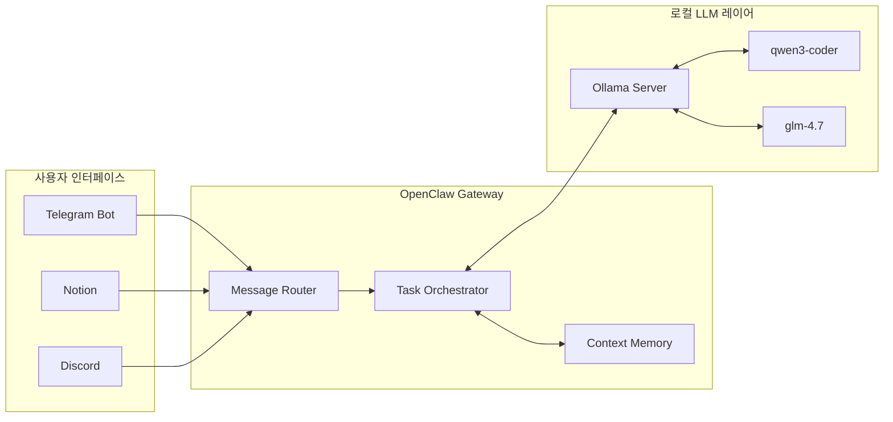
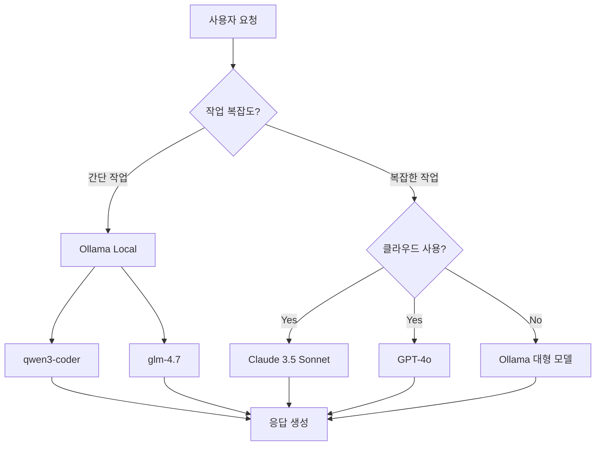

## 서론: 클라우드 API 없이 AI 에이전트를 구축할 수 있다고요?

매달 수십 달러의 API 비용을 지불하면서 ChatGPT, Claude AI 같은 클라우드 AI 서비스를 사용하고 계신가요? 그리고 내 데이터가 외부 서버로 전송되는 것에 대한 불안감도 느끼고 말이죠. 여기에 로컬 LLM(Large Language Model)인 Ollama와 로컬 AI 에이전트 플랫폼인 OpenClaw를 결합하면 **완전 무료, 데이터 프라이버시, 그리고 인터넷 연결 없이도 작동하는 AI 에이전트**를 구축할 수 있습니다.

이 조합의 강력함은 상상 이상입니다. Ollama는 Mac M1/M2/M3에서 GPU 가속 없이도 꽤 쓸만한 성능을 내고 있으며, OpenClaw는 이를 다양한 채널(Notion, Telegram, Discord 등)과 연결해 자동화 워크플로우를 만들어줍니다. 본 가이드에서는 두 프로젝트를 통합하여 **기업급 AI 비서**를 로컬 환경에서 완성하는 방법을 단계별로 설명합니다.

## 본론

### 1. 왜 OpenClaw + Ollama인가?

| 측면 | 클라우드 API만 사용 | OpenClaw + Ollama |
| :--- | :--- | :--- |
| **비용** | 월 $100+ (빈번한 사용 시) | 완전 무료 (일회성 하드웨어 비용만) |
| **데이터 프라이버시** | 데이터가 외부 서버로 전송 | 100% 로컬 처리 |
| **인터넷 의존성** | 항상 연결 필요 | 오프라인 작동 가능 |
| **커스터마이징** | API 제약사항 존재 | 완전한 제어권 |
| **응답 속도** | 네트워크 지연 발생 | 로컬 계산으로 빠른 응답 |
| **컨텍스트 길이** | 유료 플랜에서만 긴 컨텍스트 | 하드웨어만 허용하면 무제한 |

### 2. 아키텍처 개요

OpenClaw와 Ollama 통합의 핵심은 **Gateway-Model 분리**입니다.



### 3. 사전 요구사항

OpenClaw + Ollama 조합을 위한 권장 사양입니다:

| 하드웨어 | 최소 사양 | 권장 사양 |
| :--- | :--- | :--- |
| **CPU** | Apple M1 / Intel i5 8세대 | Apple M2/M3 / AMD Ryzen 7 |
| **RAM** | 16GB | 32GB |
| **Storage** | 50GB 여유 공간 | 100GB+ (SSD 권장) |
| **Network** | 없어도 가능 | 업데이트 시 필요 |

### 4. 설치 절차

#### 4.1 Ollama 설치

```bash
# macOS (Homebrew)
brew install ollama

# Linux
curl -fsSL https://ollama.com/install.sh | sh

# 설치 확인
ollama --version
```

#### 4.2 권장 모델 다운로드

```bash
# 코드 생성용 경량 모델
ollama pull qwen3-coder

# 일반 대话용 중국어/영어 균형 모델
ollama pull glm-4.7

# (선택) 고성능 오픈소스 모델 (32GB RAM 필요)
# ollama pull gpt-oss:20b
```

#### 4.3 OpenClaw 설치 및 Ollama 통합

```bash
# OpenClaw 설치
npm install -g openclaw@latest

# Ollama와 통합하여 자동 설정 & 게이트웨이 시작
ollama launch openclaw
```

이 하나의 명령어로 다음이 자동으로 설정됩니다:
1. OpenClaw가 Ollama를 LLM Provider로 인식
2. Gateway가 백그라운드에서 시작
3. Control UI가 `http://localhost:18789`에서 접속 가능

### 5. 초기 설정 및 온보딩

```bash
# OpenClaw 설정 진입
openclaw config

# 또는 Ollama 설정만 진행
ollama launch openclaw --config
```

#### 5.1 Model Provider 설정

**Ollama 선택 시:**
- **Endpoint URL**: `http://localhost:11434` (기본값)
- **Model**: `qwen3-coder` (기본값, 변경 권장)
- **Context Window**: 64k+ (긴 문서 처리 시 필수)

#### 5.2 채널 연동

사용할 플랫폼을 선택하세요:

| 채널 | 연동 난이도 | 추천 용도 |
| :--- | :--- | :--- |
| **Notion** | ⭐ 매우 쉬움 | 문서 작성, 지식 관리, 회의록 |
| **Telegram** | ⭐ 쉬움 | 모바일 알림, 빠른 질문 답변 |
| **Discord** | ⭐ 보통 | 커뮤니티 봇, 개발자 팀 |
| **Slack** | ⭐ 보통 | 업무 자동화, 리포트 |

### 6. 실전 예시

#### 6.1 Notion + OpenClaw + Ollama 조합

```bash
# 사용자가 Telegram으로 메시지 전송
"노션 '주간 업무 회의' 페이지에 이번 주 회의록 요약해서 저장해줘"

# OpenClaw가 수행하는 작업
1. Notion API에서 해당 페이지 내용 읽기
2. Ollama(qwen3-coder)로 요약 생성
3. Notion에 요약 결과 저장
4. Telegram로 완료 알림 전송
```

#### 6.2 코드 리뷰 자동화

```bash
# GitHub PR이 생성되면
"새로운 PR #123 검토해줘. 보안 취약점, 코드 스타일, 성능 이슈 체크"

# OpenClaw + Ollama가 수행
1. GitHub에서 PR diff 가져오기
2. qwen3-coder로 코드 분석
3. 보안 문제, 리팩토링 제안 생성
4. PR 코멘트로 자동 작성
```

### 7. 성능 최적화

로컬 LLM의 성능을 극대화하는 설정입니다.

| 설정 항목 | 권장 값 | 설명 |
| :--- | :--- | :--- |
| **OLLAMA_NUM_THREAD** | CPU 코어 수 | 병렬 처리 증가 |
| **OLLAMA_LOAD_TIMEOUT** | 5m | 대형 모델 로딩 타임아웃 |
| **OLLAMA_QUEUE_SIZE** | 512 | 요청 큐 크기 |
| **Context Window** | 64k+ | 긴 문서 처리 시 필수 |

```bash
# Ollama 서버 실행 시 환경 변수 설정
export OLLAMA_NUM_THREAD=8
export OLLAMA_LOAD_TIMEOUT=300
ollama serve
```

### 8. 모델별 성능 비교

| 모델 | VRAM | 특징 | 추천 용도 |
| :--- | :--- | :--- | :--- |
| **qwen3-coder** | 8GB | 코드 생성 최적화 | 코드 리뷰, 스크립트 작성 |
| **glm-4.7** | 8GB | 중국어/영어 균형 | 일반 대화, 문서 요약 |
| **gpt-oss:20b** | 16GB | 오픈소스 20B | 복잡한 추론, RAG |
| **gpt-oss:120b** | 32GB | 대형 오픈소스 | 최고 성능 작업 |

> **💡 팁**: 일상적인 작업에는 `qwen3-coder`로 충분합니다. 복잡한 분석이 필요할 때만 더 큰 모델을 사용하세요.

### 9. 트러블슈팅

| 문제 | 해결 방법 |
| :--- | :--- |
| **Ollama 모델 다운로드 실패** | `ollama pull` 재시도. 네트워크 상태 확인 |
| **응답 속도가 너무 느려요** | 더 작은 모델 사용(qwen3-coder) 또는 `OLLAMA_NUM_THREAD` 환경 변수 확인 |
| **컨텍스트 길이 초과 오류** | 더 큰 모델 사용(gpt-oss:20b) 또는 입력 분할 처리 |
| **OpenClaw가 Ollama를 찾지 못해요** | `curl http://localhost:11434/api/tags`로 Ollama 서버 상태 확인 |
| **게이트웨이가 자꾸 재시작되어요** | `openclaw logs -f`로 로그 확인. Ollama 연결 안정성 점검 |

### 10. 클라우드와 하이브리드 운영

완전 로컬만 고집할 필요는 없습니다. 상황에 따라 클라우드 모델과 혼합해서 사용할 수 있습니다.



**하이브리드 전략:**
1. 일반 대화/요약: Ollama (glm-4.7)
2. 코드 생성: Ollama (qwen3-coder)
3. 복잡한 분석: Claude 3.5 Sonnet (클라우드)
4. 오프라인 상황: Ollama 전용

## 결론

OpenClaw + Ollama 조합은 **"돈이 들어가지 않는 AI 자동화"**를 실현하는 최고의 솔루션입니다. 클라우드 API 의존도를 낮추면서도, 기업 수준의 AI 기능을 로컬 환경에서 완성할 수 있습니다.

**시작하기 전 체크리스트:**
- [ ] 16GB 이상 RAM 확보
- [ ] Ollama 설치 및 모델 다운로드
- [ ] OpenClaw 설치 (`npm install -g openclaw`)
- [ ] `ollama launch openclaw` 실행
- [ ] Control UI 접속 확인 (`http://localhost:18789`)
- [ ] 첫 번째 채널 연동 (Notion 또는 Telegram)
- [ ] 테스트 명령어 전송

**로컬 First, 클라우드 Second.** 이제 여러분의 로컬 환경을 AI 강국으로 탈바꿔시켜 보세요.

---

## 참고자료

- [OpenClaw 공식 문서](https://docs.openclaw.ai)
- [Ollama 공식 문서](https://docs.ollama.com)
- [Ollama 모델 라이브러리](https://ollama.com/search)
