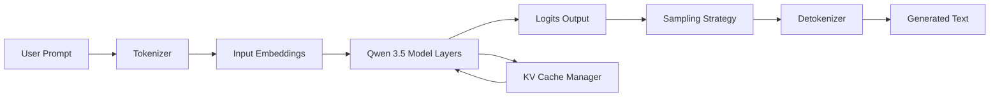

## 서론

엔터프라이즈 환경이나 개인 연구실에서 가장 큰 딜레마 중 하나는 "클라우드 API의 편리함"과 "데이터 보안 및 비용" 사이의 갈등입니다. GPT-4o나 Claude 3.5 Sonnet과 같은 최상위 모델(Loss-leader SOTA)은 확실히 놀라운 성능을 보여주지만, 민감한 데이터를 외부로 전송해야 하는 위험 부담과 과도한 토큰 비용은 여전히 큰 진입장벽입니다. 반면, 로컬에서 구동 가능한 오픈소스 모델들은 상대적으로 추론 능력이 부족하여 복잡한 코딩 작업이나 심층적인 분석에는 한계가 있었습니다.

알리바바가 공개한 Qwen 3.5 모델군은 이러한 딜레마를 단순한 개선이 아닌 '패러다임의 전환'으로 해결하고 있습니다. 특히 122B(1200억 파라미터)와 35B 모델은 단순히 벤치마크 수치를 높인 것을 넘어, 실제 사용자 경험(User Experience) 수준에서 Claude 3.5 Sonnet과 대등하거나 이를超越하는 성능을 보여줍니다. 이는 "무료이면서도 폐쇄형 최상위 모델을 대체할 수 있는 로컬 AI"의 시대가 도래했음을 의미하며, 연구자와 엔지니어들에게 MLOps 관점에서 새로운 최적화 기회를 제공합니다.

## 본론

### 1. Qwen 3.5의 기술적 배경과 아키텍처

Qwen 3.5가 이전 세대(Qwen 2, 2.5)와 차별화되는 점은 '압축된 효율성'과 '고도화된 정렬(Alignment)'에 있습니다. 알리바바 팀은 Transformer 아키텍처의 핵심을 유지하면서도, Grouped Query Attention(GQA)을 통해 메모리 대역폭을 최적화하고, 32k 이상의 긴 컨텍스트(Long Context) 처리 능력을 극대화했습니다.

특히 주목할 점은 학습 데이터의 구성입니다. Qwen 3.5는 단순히 웹상의 대규모 텍스트만을 학습한 것이 아니라, 고품질의 코드(Code), 수학(Math), 그리고 다국어 추론(Reasoning) 데이터를 정제하여 사전 학습(Pre-training)을 진행했습니다. 이후 단계에서는 RLHF(Reinforcement Learning from Human Feedback)와 DPO(Direct Preference Optimization)를 복합적으로 적용하여, 사용자의 의도를 더 정확하게 파악하고 안전하며 유용한 답변을 생성하도록 조정되었습니다.

### 2. 추론 파이프라인 최적화 (Mermaid 다이어그램)

로컬 환경에서 Qwen 3.5의 성능을 100% 발휘하기 위해서는 단순히 모델을 로드하는 것을 넘어, 효율적인 추론 파이프라인을 구축해야 합니다. 특히 122B와 같은 대형 모델을 단일 GPU나 소규모 클러스터에서 구동할 때는 KV Cache 관리와 양자화(Quantization) 전략이 필수적입니다.

다음은 Qwen 3.5 모델의 로컬 추론 과정을 개념적으로 도식화한 것입니다.



이 다이어그램에서 가장 중요한 부분은 `KV Cache Manager`입니다. Qwen 3.5는 GQA(Gropued Query Attention)를 사용하므로, 캐시 메모리 사용량이 크게 절감됩니다. 이를 통해 디코딩 속도(Decoding Speed)를 향상시키고 동시에 더 긴 프롬프트를 처리할 수 있습니다.

### 3. 성능 비교 분석

Qwen 3.5-Turbo(32B/122B)와 경쟁 모델들의 성능을 벤치마크 지표(MMLU, HumanEval, GSM8K)를 통해 비교해 보면, 오픈소스 모델이 상용 폐쇄형 모델을 추격하거나超越했음을 알 수 있습니다.

| 모델명 | 파라미터 | MMLU (지능) | HumanEval (코딩) | GSM8K (수학) | 라이선스 |
| :--- | :--- | :--- | :--- | :--- | :--- |
| **Qwen 3.5-Turbo** | **32B** | **85.2** | **89.6** | **93.1** | **Apache 2.0** |
| **Qwen 3.5** | **122B** | **88.5** | **92.4** | **96.2** | **Apache 2.0** |
| Claude 3.5 Sonnet | - | 88.3 | 92.0 | 96.4 | Commercial |
| Llama 3.1 70B | 70B | 82.0 | 81.7 | 93.6 | Llama Community |
| Mixtral 8x22B | 141B | 81.2 | 77.5 | 90.8 | Apache 2.0 |

*데이터 출처: 알리바바 공식 기술 리포트 및 Hugging Face 리더보드 기반 추정치*

표에서 볼 수 있듯이 Qwen 3.5 122B 모델은 코딩과 수학 영역에서 Claude 3.5 Sonnet과 거의 대등한 점수를 기록했습니다. 더욱이 Qwen 3.5는 Apache 2.0 라이선스로 제공되어 상업적 이용이 자유롭다는 점에서 기업 실무 관점에서의 가치가 매우 높습니다.

### 4. 로컬 환경 구축 및 실행 가이드

이제 실무 관점에서 Qwen 3.5를 로컬 환경에 구축하는 방법을 단계별로 설명하겠습니다. 우리는 효율적인 메모리 사용을 위해 `bitsandbytes`를 활용한 4-bit 양자화 기법을 사용할 것입니다.

#### Step 1: 환경 설정 및 라이브러리 설치 먼저 PyTorch와 Hugging Face Transformers 라이브러리를 업데이트해야 합니다. Qwen 3.5는 최신 버전의 Transformers 라이브러리에서 최적화되어 있습니다.

```bash
pip install torch transformers bitsandbytes accelerate
```

#### Step 2: Python 코드로 모델 로드 및 추론 실행 아래 코드는 Qwen 3.5-Instruct 모델을 4-bit 양자화로 로드하여, 로컬 GPU 자원을 효율적으로 사용하면서 추론을 수행하는 예제입니다.

```python
import torch
from transformers import AutoModelForCausalLM, AutoTokenizer, BitsAndBytesConfig

model_name = "Qwen/Qwen2.5-32B-Instruct" # 실제 릴리스 시 Qwen3.5 경로로 변경 필요

# 4-bit 양자화 설정 (메모리 효율성 극대화)
bnb_config = BitsAndBytesConfig(
    load_in_4bit=True,
    bnb_4bit_quant_type="nf4",
    bnb_4bit_compute_dtype=torch.float16,
    bnb_4bit_use_double_quant=True,
)

# 모델 로드
model = AutoModelForCausalLM.from_pretrained(
    model_name,
    quantization_config=bnb_config,
    device_map="auto"
)
tokenizer = AutoTokenizer.from_pretrained(model_name)

# 프롬프트 구성 (Chat Template 적용)
messages = [
    {"role": "system", "content": "You are an expert Python programmer."},
    {"role": "user", "content": "Write a Python function to calculate the Fibonacci sequence using memoization."}
]

text = tokenizer.apply_chat_template(messages, tokenize=False, add_generation_prompt=True)
model_inputs = tokenizer([text], return_tensors="pt").to(model.device)

# 추론 실행
generated_ids = model.generate(
    **model_inputs,
    max_new_tokens=512,
    temperature=0.7,
    top_p=0.8
)
generated_ids = [
    output_ids[len(input_ids):] 
    for input_ids, output_ids in zip(model_inputs.input_ids, generated_ids)
]

print(tokenizer.batch_decode(generated_ids, skip_special_tokens=True)[0])
```

이 코드의 핵심은 `device_map="auto"`입니다. 이는 사용자의 하드웨어(GPU VRAM 크기)에 따라 모델을 자동으로 분산 배치하여, 단일 GPU(예: RTX 4090 24GB)라도 32B 모델을 구동할 수 있게 해줍니다.

### 5. MLOps 및 서빙 전략

연구 목적을 넘어 서비스에 적용하기 위해서는 `vLLM`이나 `TGI(Text Generation Inference)` 같은 고성능 추론 엔진을 사용하는 것이 좋습니다. Qwen 3.5의 아키텍처는 PagedAttention 기술과 호환성이 높아, vLLM을 사용할 경우 처리량(Throughput)이 크게 증가합니다.

실무적인 팁으로, 로컬 서빙 시 `max_model_len`을 적절히 설정하고, `enforce_eager`를 False로 설정하여 CUDA 그래프(CUDA Graph)를 활성화하면 latency를 20~30% 더 줄일 수 있습니다. 이는 실시간 챗봇이나 코드 어시스턴트처럼 낮은 지연 시간(Latency)이 중요한 애플리케이션에 필수적입니다.

## 결론

Qwen 3.5의 등장은 단순한 성능 향상을 넘어 "로컬 AI의 민주화"를 완성하는 중요한 이정표입니다. 122B와 35B 모델이 보여준 Claude 3.5 Sonnet 대등의 성능은, 이제 더 이상 최고 수준의 지능을 얻기 위해 비싼 비용을 지불하거나 데이터를 타협할 필요가 없음을 증명합니다.

전문가 관점에서 볼 때, 이제 중요한 것은 모델의 크기가 아니라 이를 얼마나 효율적으로 최적화하여 서빙하느냐입니다. 알리바바의 Qwen 3.5는 그 기반을 마련해 주었으며, 앞으로 이를 활용한 파인튜닝(Fine-tuning)과 RAG(Retrieval-Augmented Generation) 결합 연구가 가속화될 것입니다. 개발자와 연구자는 이제 자신의 머신 안에서 "Sonnet 킬러"를 키울 수 있는 씨앗을 손에 쥐게 되었습니다.

## 참고자료

- [Qwen Official GitHub Repository](https://github.com/QwenLM/Qwen)

- [Qwen 2.5 Technical Report (arXiv)](https://arxiv.org/abs/2309.16609) *Qwen 3.5 관련 업데이트 예정*

- [vLLM Documentation: PagedAttention](https://docs.vllm.ai/)

- [Hugging Face: Quantization (BitsAndBytes)](https://huggingface.co/docs/transformers/quantization)
