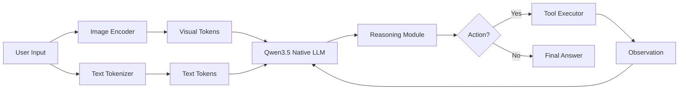

## 서론

최근 생성형 AI를 활용한 에이전트(Agent) 개발의 패러다임이 빠르게 변화하고 있습니다. 과거 언어 모델(LLM)은 주로 텍스트 입력을 처리하여 텍스트를 출력하는 데 그쳤으나, 이제는 이미지, 오디오, 그리고 시스템 명령어를 통합하여 이해하고 행동하는 '멀티모달 에이전트'의 시대로 접어들었습니다. 하지만 여기에는 치명적인 병목 현상이 존재합니다. 기존의 접근 방식은 대부분 텍스트용 LLM에 거대한 비전 인코더(Vision Encoder)를 억지로 연결(Stitching)하는 방식이었죠. 이는 텍스트와 이미지 간의 의미적 격차(Semantic Gap)를 유발하며, 복잡한 추론 과정에서 정보가 손실되거나 왜곡되는 원인이 되었습니다.

예를 들어, 로봇 팔이 '빨간 사과를 집어 올려'라는 명령을 수행할 때, 단순히 객체의 위치를 인식하는 것을 넘어 문맥(Context)과 물리적 법칙을 동시에 고려해야 합니다. Qwen3.5가 제시하는 '네이티브 멀티모달(Native Multimodal)' 접근 방식은 이러한 문제를 해결하기 위한 차세대 솔루션입니다. 외부 모듈의 의존성을 줄이고, 텍스트와 시각 정보를 단일 아키텍처 내에서 근본적으로 통합함으로써, 마치 인간의 오감이 뇌에서 유기적으로 작용하듯 AI가 세상을 인식하고 행동할 수 있는 환경을 제공합니다. 이 글에서는 Qwen3.5의 기술적 혁신과 이를 활용한 실용적인 AI 에이전트 구현 방법을 심층적으로 분석합니다.

## 본론

### 1. 네이티브 멀티모달 아키텍처의 핵심 원리

Qwen3.5의 핵심은 'Native'라는 단어에 압축되어 있습니다. 기존 모델들이 사전 학습된 텍스트 모델 위에 시각 모듈을 덧씌운 후에야(Late Fusion) 멀티모달 학습을 진행했다면, Qwen3.5는 설계 초기부터 텍스트와 시각 토큰을 동등한 수준에서 다루는 것을 목표로 합니다. 이는 Transformer 구조 내부에서 텍스트 시퀀스와 이미지 패치(Patch) 시퀀스가 같은 임베딩 공간을 공유함을 의미합니다.

이러한 접근은 에이전트의 도구 사용(Tool Use) 능력에 있어 획기적인 개선을 가져옵니다. 모델이 외부 API를 호출하거나 계획을 수립할 때, 시각적 정보가 단순한 '참고 자료'가 아니라 추론 과정의 핵심 피쳐로 작동하기 때문입니다. 즉, 모델은 화면을 보고서 "여기 버튼이 있으니 클릭해야지"라고 판단하는 것이 아니라, 시각적 피쳐와 텍스트 프롬프트가 결합된 고차원 표현을 통해 복잡한 의사결정을 내립니다.

### 2. Qwen3.5 멀티모달 에이전트 시스템 구조

Qwen3.5를 활용한 에이전트는 입력된 멀티모달 데이터를 처리하여 추측(Reasoning)을 생성하고, 이를 바탕으로 도구(Tool)를 호출하는 과정을 반복합니다. 아래 다이어그램은 이러한 네이티브 멀티모달 에이전트의 데이터 흐름을 단순화한 것입니다.



이 구조에서 가장 중요한 점은 `Visual Tokens`와 `Text Tokens`가 모델 내부에서 서로 강력한 Attention(주의 기전)을 주고받는다는 것입니다. 모델은 이미지의 세밀한 부분까지 텍스트 질의와 연결하여 해석할 수 있으며, 이는 복잡한 GUI 자동화, 과학적 차트 분석, 실시간 비디오 스트리밍 처리 등 고난도 작업에서 압도적인 성능을 발휘합니다.

### 3. 기존 방식과의 비교 분석

Qwen3.5의 네이티브 접근 방식이 기존의 하이브리드(Hybrid)나 어댑터(Adapter) 기반 모델과 비교하여 어떤 이점을 가지는지 명확히 이해할 필요가 있습니다.

| 비교 항목 | 기존 Adapter 기반 모델 | Qwen3.5 Native Multimodal | | :--- | :--- | :--- | | **아키텍처 통합도** | 낮음 (텍스트 LLM + 외부 비전 인코더 결합) | 높음 (단일 트랜스포머 내부 통합) | | **데이터 처리 방식** | 텍스트와 이미지를 분리 후 임베딩 레벨에서 concatenation | 학습 초기부터 텍스트/이미지를 통합된 시퀀스로 학습 | | **추론 정확도(복잡한 Task)** | 중간 (Modality 간 격차로 인한 정보 손실 발생) | 높음 (Shared representation space) | | **Tool Use 성능** | 텍스트 기반 명령어 위주 | 시각적 피드백을 포함한 동적 계획 수립 가능 | | **연산 효율성** | 상대적으로 낮음 (여러 모듈을 거치는 Overhead) | 높음 (최적화된 단일 모델 Forward pass) |

### 4. 실무 구현 가이드: Qwen3.5 에이전트 코드 예시

Qwen3.5를 활용하여 간단한 이미지 분석 및 도구 사용 에이전트를 구축하는 과정을 살펴보겠습니다. 이 예시는 PyTorch와 Hugging Face Transformers 라이브러리를 사용한다고 가정합니다.

다음 코드는 사용자가 업로드한 이미지를 분석하고, 필요 시 웹 검색 도구를 사용하여 정보를 보강하는 시나리오입니다.

```python
import torch
from transformers import Qwen2VLForConditionalGeneration, AutoProcessor
from qwen_vl_utils import process_vision_info

# 1. 모델 및 프로세서 로드
# Qwen2.5-VL 또는 Qwen3.5 계열 모델을 사용한다고 가정
model = Qwen2VLForConditionalGeneration.from_pretrained(
    "Qwen/Qwen2.5-VL-7B-Instruct", 
    torch_dtype="auto", 
    device_map="auto"
)
processor = AutoProcessor.from_pretrained("Qwen/Qwen2.5-VL-7B-Instruct")

# 2. 멀티모달 메시지 구성
messages = [
    {
        "role": "user",
        "content": [
            {
                "type": "image",
                "image": "https://qianwen-res.oss-cn-beijing.aliyuncs.com/Qwen-VL/assets/demo.jpeg",
            },
            {"type": "text", "text": "Describe this image in detail. If you see a specific landmark, search for its history."},
        ],
    }
]

# 3. 전처리 (텍스트 및 이미지)
text = processor.apply_chat_template(
    messages, tokenize=False, add_generation_prompt=True
)
image_inputs, video_inputs = process_vision_info(messages)
inputs = processor(
    text=[text],
    images=image_inputs,
    videos=video_inputs,
    padding=True,
    return_tensors="pt",
)
inputs = inputs.to("cuda")

# 4. 추론 실행
generated_ids = model.generate(**inputs, max_new_tokens=128)
generated_ids_trimmed = [
    out_ids[len(in_ids) :] for in_ids, out_ids in zip(inputs.input_ids, generated_ids)
]
output_text = processor.batch_decode(
    generated_ids_trimmed, skip_special_tokens=True, clean_up_tokenization_spaces=False
)

print("Agent Output:", output_text)

# 5. (가상의) Tool Use 로직
# 실제 구현에서는 생성된 텍스트를 파싱하여 함수 호출을 수행합니다.
if "search" in output_text[0].lower():
    print("Executing Search Tool...")
    # search_tool(query="landmark history")
```

이 코드는 Qwen 모델이 이미지와 텍스트를 동시에 처리하는 과정을 보여줍니다. 실제 에이전트 시스템에서는 이 출력을 파싱하여 `function_call` 형식으로 변환하고, 해당 도구를 실행한 결과를 다시 프롬프트에 추가하여(ReAct 패턴) 최종 답변을 도출합니다.

### 5. MLOps 및 배포 고려사항

Qwen3.5와 같은 네이티브 멀티모달 모델을 운영 환경에 배치할 때는 몇 가지 MLOps적 측면을 고려해야 합니다.

1.  **양자화(Quantization)와 최적화**: 비전 토큰과 텍스트 토큰이 결합되면 컨텍스트 길이가 급격히 늘어납니다. `bitsandbytes`나 `AutoGPTQ` 등을 활용한 4-bit 양자화는 필수적입니다. 2.  **vLLM Serving**: vLLM과 같은 추론 엔진은 Qwen 모델의 PagedAttention 기능을 지원하므로, 멀티모달 요청이 급증할 때 처리량(Throughput)을 획기적으로 높여줍니다. 3.  **컨텍스트 윈도우 관리**: 고해상도 이미지를 처리할 때 토큰 수가 폭발할 수 있습니다. `min_pixels`와 `max_pixels` 파라미터를 조절하여 입력 이미지의 크기를 동적으로 조절하는 전략이 필요합니다.

## 결론

Qwen3.5가 보여주는 네이티브 멀티모달 아키텍처는 LLM의 진화 방향성을 명확히 시사합니다. 단순히 텍스트를 잘 생성하는 것을 넘어, 시각적 정보를 자신의 사고 과정의 일부로 완벽하게 통합함으로써 비로소 진정한 '에이전트'로서의 기능을 수행할 수 있게 된 것입니다.

연구자 및 엔지니어 관점에서 가장 중요한 인사이트는 **'통합(Integration)'**입니다. 모듈을 늘려 기능을 확장하는 기존 방식에서 벗어나, 모달리티 간의 경계를 허물고 단일 모델 내에서 모든 것을 해결하려는 시도가 곧 성능과 효율성의 열쇠입니다. Qwen3.5는 이러한 목표를 향한 중요한 이정표이며, 앞으로 우리는 텍스트와 이미지가 분리되지 않은 더욱 강력하고 유기적인 AI 시스템을 목격하게 될 것입니다.

이 기술은 로봇 공학, 자율 주행, 지능형 문서 처리(IDP) 등 다양한 산업군에서 즉시 적용 가능하며, 개발자는 이제 텍스트 API와 비전 API를 따로 구축할 필요 없이 Qwen3.5 같은 통합 모델 위에 로직을 구축하는 데 집중하면 됩니다.

### 참고자료

- [Qwen Official Blog: Towards Native Multimodal Agents](https://qwen.ai/blog?id=qwen3.5)

- [Qwen GitHub Repository](https://github.com/QwenLM/Qwen2.5)

- "Qwen2-VL: Enhancing Vision Language Model’s Perception of the World at Any Resolution", arXiv Preprint.
