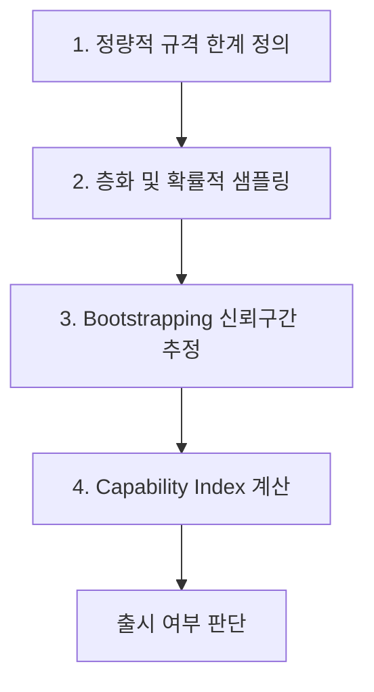

## 서론

AI 제품을 개발하는 엔지니어라면 한 번쯤은 겪어본 악몽 같은 상황이 있습니다. 검증 데이터셋(Validation Set)에서 98%의 정확도를 기록해 기술팀이 안도했지만, 출시 직후 사용자들로부터 "이건 쓸 수가 없다"는 항의가 빗발치는 상황입니다. 왜 이런 일이 발생할까요? 단순히 데이터 분포(Distribution Shift)의 문제만은 아닙니다. 더 근본적인 원리는 우리가 딥러닝 모델을 '확률적(Probabilistic)' 기계로 다루면서도, 여전히 '결정론적(Deterministic)' 소프트웨어의 품질 관리 방식인 '점 추정(Point Estimate)'으로만 평가하고 있기 때문입니다.

"이 모델의 정확도는 90%입니다"라는 말은 통계적으로 매우 불안정합니다. 그 90%가 100개의 샘플 중 90개가 맞았다는 뜻인지, 1억 개의 샘플 중 9,000만 개가 맞았다는 뜻인지, 혹은 분산이 얼마나 되는지 전혀 알 수 없기 때문입니다. 특히 ISO/IEC 25059와 같은 표준에서 AI 품질 모델을 제시하고는 있지만, 실제 산업 현장에서 "얼마나 신뢰할 수 있는지"를 정량적으로 증명해 주는 구체적이고 통계적으로 견고한 방법론은 부재한 상태입니다.

이러한 배경에서 제안된 **SCFC(Statistical Confidence in Functional Correctness)** 방법론은 단순한 성능 수치를 넘어, 비즈니스 요구사항과 모델의 변동성(Variability)을 모두 고려한 통계적 신뢰도를 제공합니다. 이 글에서는 AI 제품의 기능적 정확도를 평가하기 위한 SCFC의 4단계 프로세스와 그 기술적 원리를 심층적으로 분석하고 실제 코드를 통해 구현 방법을 제시합니다.

## 본론

### SCFC 방법론의 기술적 배경 및 원리

SCFC는 제조 공정의 품질 관리에서 널리 사용되는 '공정 능력 지수(Process Capability Index)' 개념을 AI 시스템 평가로 차용했습니다. 전통적인 공정에서 제품의 치수가 규격 내에 들어올 확률을 계산하듯, AI 모델의 성능 지표(예: F1-score, BLEU, Accuracy)가 비즈니스에서 정의한 '최소 허용 기준(Specification Limits)' 내에 안정적으로 위치하는지를 통계적으로 검증하는 것입니다.

이 방법론의 핵심은 평가 지표를 하나의 고정된 숫자가 아닌, '신뢰 구간(Confidence Interval)'을 가지는 분포로 간주하는 것입니다. 모델의 평균 성능이 아무리 높더라도, 분산이 커서 성능이 들쑥날쑥한다면 사용자 경험은 저하될 수 있습니다. SCFC는 이 평균과 분산, 그리고 비즈니스 요구사항을 연결하여 모델이 실제 제품으로서 갖춰야 할 '신뢰도'를 수치화합니다.

### SCFC 평가 프로세스: 4단계 가이드

SCFC 방법론은 크게 4단계로 구성됩니다. 아래 다이어그램은 이 프로세스의 흐름을 간단히 도식화한 것입니다.



#### 1. 정량적 규격 한계 정의 (Defining Quantitative Specification Limits) 가장 먼저 비즈니스 관점에서 모델이 반드시 충족해야 할 최소 성능 기준(Lower Specification Limit, LSL)을 정의해야 합니다. 예를 들어, 의료 분야 질문 응답 봇의 경우 정확도가 90% 이상이어야만 피해가 발생하지 않는다고 가정해 봅시다. 이때 LSL은 0.9가 됩니다. 이 과정는 기술팀이 아닌 도메인 전문가나 스테이크홀더와의 협의를 통해 결정되어야 하며, SCFC의 출발점이 됩니다.

#### 2. 층화 및 확률적 샘플링 (Stratified and Probabilistic Sampling) 단순 랜덤 샘플링은 희귀하지만 치명적인 케이스를 놓칠 수 있습니다. 따라서 데이터를 중요도, 난이도, 빈도 등에 따라 층(Strata)으로 나누고, 각 층에서 비례적으로 샘플을 추출합니다. 이를 통해 평가 데이터셋이 실제 운영 환경의 분포와 입력의 중요도를 반영하도록 보장합니다.

#### 3. Bootstrapping을 통한 신뢰 구간 추정 수집된 샘플에 대해 모델을 평가하여 성능 지표를 얻지만, SCFC에서는 여기서 멈추지 않습니다. **부트스트래핑(Bootstrapping)** 기법을 사용하여 원본 샘플 데이터셋에서 복원 추출(Resampling)을 수행한 뒤, 반복적으로 성능 지표를 계산합니다. 이를 통해 성능 지표의 확률 분포를 추정하고, 예를 들어 95% 신뢰 수준에서의 신뢰 구간(Confidence Interval)을 도출합니다. 이 과정이 핵심입니다. 단순히 "95%다"라고 말하는 대신, "우리는 95%의 확신을 가지고 이 모델의 성능이 93%에서 97% 사이라고 말할 수 있다"는 통계적 근거를 제공하기 때문입니다.

#### 4. Capability Index 계산 마지막으로 앞서 구한 신뢰 구간과 규격 한계(LSL)를 바탕으로 Capability Index(여기서는 $C_{pk}$와 유사한 개념)를 계산합니다. $$ C_{pk} = \frac{Mean - LSL}{3 \times \sigma} $$ 이 지수는 모델 성능의 평균이 규격 한계에서 얼마나 멀리 떨어져 있는지, 그리고 성능이 얼마나 안정적인지($\sigma$)를 종합적으로 보여줍니다. 이 값이 일정 수준(예: 1.33 이상) 이상이어야 통계적으로 신뢰할 수 있는 제품으로 간주됩니다.

### 코드 예시: SCFC 구현 with Python

이제 위에서 설명한 3단계와 4단계(Bootstrapping과 CI 계산)를 Python으로 구현해 보겠습니다.

```python
import numpy as np
from sklearn.metrics import accuracy_score
from typing import List, Callable

def scfc_evaluation(
    model_preds: np.ndarray, 
    ground_truths: np.ndarray, 
    lsl: float, 
    n_bootstraps: int = 10000, 
    confidence_level: float = 0.95
) -> dict:
    """
    SCFC 방법론을 활용한 신뢰 구간 추정 및 Capability Index 계산
    
    Args:
        model_preds: 모델의 예측 값 배열 (0 또는 1)
        ground_truths: 실제 정답 배열 (0 또는 1)
        lsl: Lower Specification Limit (비즈니스 요구 최소 성능, 0~1 사이)
        n_bootstraps: 부트스트래핑 반복 횟수
        confidence_level: 신뢰 수준 (기본값 0.95)
    """
    n_samples = len(ground_truths)
    bootstrapped_scores = []
    
    # 3. Bootstrapping을 통한 성능 분포 생성
    for _ in range(n_bootstraps):
        # 복원 추출 (Resampling with replacement)
        indices = np.random.choice(n_samples, n_samples, replace=True)
        
        bs_preds = model_preds[indices]
        bs_truths = ground_truths[indices]
        
        # 성능 지표 계산 (여기서는 Accuracy)
        score = accuracy_score(bs_truths, bs_preds)
        bootstrapped_scores.append(score)
    
    bootstrapped_scores = np.array(bootstrapped_scores)
    
    # 신뢰 구간 계산
    lower_percentile = (1 - confidence_level) / 2 * 100
    upper_percentile = (confidence_level + (1 - confidence_level) / 2) * 100
    
    ci_lower = np.percentile(bootstrapped_scores, lower_percentile)
    ci_upper = np.percentile(bootstrapped_scores, upper_percentile)
    
    mean_performance = np.mean(bootstrapped_scores)
    std_performance = np.std(bootstrapped_scores)
    
    # 4. Capability Index 계산
    # 표준편차가 0인 경우(실제로 드물지만) 처리
    if std_performance == 0:
        c_pk = float('inf') if mean_performance > lsl else 0
    else:
        c_pk = (mean_performance - lsl) / (3 * std_performance)
    
    return {
        "mean_performance": mean_performance,
        "confidence_interval": (ci_lower, ci_upper),
        "lsl": lsl,
        "c_pk": c_pk,
        "is_capable": c_pk >= 1.0 # 일반적으로 1.0 이상이면 공정 능력이 있다고 봄 (산업별 상이)
    }


```

```python
# 가상의 시나리오 실행
# 실제 정답: 100개 중 10개가 오답(0), 90개가 정답(1)
y_true = np.array([0]*10 + [1]*90)
# 모델 예측: 100개 중 15개를 오답으로 예측 (Acc: 85%), 분산 존재 가정
y_pred = np.array([0]*15 + [1]*85)

# 비즈니스 요구사항: 정확도 최소 80%
LSL = 0.80

result = scfc_evaluation(y_pred, y_true, LSL)

print(f"Mean Performance: {result['mean_performance']:.4f}")
print(f"95% Confidence Interval: [{result['confidence_interval'][0]:.4f}, {result['confidence_interval'][1]:.4f}]")
print(f"LSL (Business Req): {result['lsl']}")
print(f"Capability Index (C_pk): {result['c_pk']:.4f}")
print(f"Is Capable (C_pk >= 1.0): {result['is_capable']}")

if result['is_capable']:
    print("-> 시스템은 통계적으로 신뢰할 수 있는 수준입니다.")
else:
    print("-> 시스템 성능이 불안정하거나 요구사항을 충족하지 못합니다.")
```

### 기존 평가 방식과 SCFC의 비교

아래 표는 기존의 단순 평가 방식이 갖는 한계와 SCFC 방법론이 제공하는 이점을 명확히 보여줍니다.

| 비교 항목 | 기존 AI 평가 (Point Estimate) | SCFC (Statistical Confidence) |
| :--- | :--- | :--- |
| **결과 형태** | 단일 수치 (예: Acc 0.92) | 분포 및 신뢰 구간 (예: 0.91 $\pm$ 0.03) |
| **변동성 고려** | ❌ 고려하지 않음 (평균만 봄) | ✅ 표준편차 및 신뢰 구간 반영 |
| **비즈니스 연결** | ❌ 기술적 지표로만 해석 | ✅ 비즈니스 규격(LSL)과 연계된 Cpk 지표 |
| **위험도 평가** | 어려움 (최악의 시나리오 가늠 불가) | 명확함 (LSL 미달 확률 계산 가능) |
| **데이터 샘플링** | 단순 랜덤 샘플링 | 층화 및 확률적 샘플링 (대표성 확보) |

### 실무 적용을 위한 인사이트

실제 산업 환경 사례 연구에 따르면, 전문가들은 SCFC가 단순한 성능 측정을 넘어 '의사소통의 도구'로서의 가치가 높다고 평가했습니다. 단순히 "모델을 더 개선해야 한다"는 막연한 요청 대신, "현재 신뢰 구간 하한이 LSL에 근접하고 있으니 분산을 줄이는 방향으로 개선하라"는 구체적이고 통계적인 피드백이 가능해지기 때문입니다.

또한, MLOps 파이프라인 내에서 CI/CD 단계에 이 SCFC 검증 과정을 통합하면, 모델의 성능 저하(Drift)뿐만 아니라 성능의 불안정성(Variance Increase)까지도 배포 전에 자동으로 탐지할 수 있어 운영 안정성이 크게 향상됩니다.

## 결론

SCFC(Statistical Confidence in Functional Correctness) 방법론은 AI 시스템의 본질적인 불확실성을 인정하고, 이를 통계적 방법으로 엔지니어링하여 제품 품질을 보증하려는 시도입니다. 단순히 높은 정확도를 달성하는 것을 넘어, 그 정확도가 "얼마나 믿을만한지"를 정량화함으로써 비즈니스 임팩트와 기술적 성과 사이의 간극을 해소합니다.

이 방법론은 특히 핀테크, 헬스케어, 자율주행 등 오류의 허용 한도가 엄격한(Safety-Critical) 도메인에 필수적입니다. 연구자 및 엔지니어들은 이제 Accuracy나 F1-score라는 단순한 숫자 너머에서, 신뢰 구간과 Capability Index를 통해 모델의 '안정성'을 지표화하는 데 주력해야 합니다.

AI의 성숙 단계가 '연구'에서 '상용화(Production)'로 넘어가는 지금, SCFC와 같은 통계적 신뢰 평가는 선택이 아닌 필수적인 품질 프로세스가 될 것입니다.

### 참고자료

- **논문 원문**: Statistical Confidence in Functional Correctness: An Approach for AI Product Functional Correctness Evaluation (arXiv:2602.18357)

- **관련 표준**: ISO/IEC 25059 (Systems and software Quality Requirements and Evaluation - SQuaRE)
